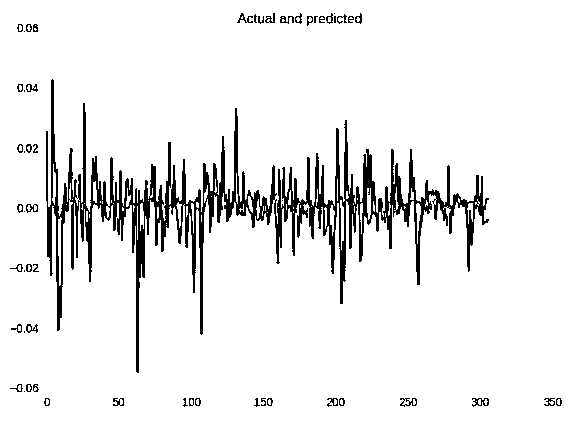

# 神经网络算法交易：波动预测与定制损失函数

> 原文：[`mp.weixin.qq.com/s?__biz=MzAxNTc0Mjg0Mg==&mid=2653285837&idx=1&sn=082db72f0c548908b3129e08b6397302&chksm=802e2fd8b759a6cef11295e69e1be1ce058391c5fe08d4bd8550a014251dcde16c2e68b01bac&scene=27#wechat_redirect`](http://mp.weixin.qq.com/s?__biz=MzAxNTc0Mjg0Mg==&mid=2653285837&idx=1&sn=082db72f0c548908b3129e08b6397302&chksm=802e2fd8b759a6cef11295e69e1be1ce058391c5fe08d4bd8550a014251dcde16c2e68b01bac&scene=27#wechat_redirect)


**编辑部**

微信公众号

**关键字**全网搜索最新排名

**『量化投资』：排名第一**

**『量       化』：排名第一**

**『机器学习』：排名第四**

我们会再接再厉

成为全网**优质的**金融、技术类公众号

**编辑部翻译：mchoi**

**【系列 1】****[用于算法交易的神经网络基于多变量时间序列](http://mp.weixin.qq.com/s?__biz=MzAxNTc0Mjg0Mg==&mid=2653285782&idx=1&sn=5848c4071a6204c2d232204e4770ae68&chksm=802e2f83b759a69531e990bd69d28f746c292183934e20a3fb56f0b039c3a3da8897422ab90c&scene=21#wechat_redirect)**（点击标题阅读）

本次推文中我们会考虑回归预测问题，为它设计和检验一个新的损失函数，将收益转化为一些波动和为了这些问题检验不同的度量标准。代码在文末查看。

**回到收益预测**

首先，让我们记住如何从原来的时间序列上切换到收益上（或者是百分比变动/增减率）。如果我们想要预知这些回报，我们可以将我们所有维度转换为收益（open、high、low、close、volume）——他们将是已经归一化的数据和更恰当的做法——如果我们打算更好地预测收益，要以收益的形式进行投资。

```py
def data2change(data):
    change = pd.DataFrame(data).pct_change()
    change = change.replace([np.inf, -np.inf], np.nan)
    change = change.fillna(0.).values.tolist()
    return change
openp = data_original.ix[:, 'Open'].tolist()
highp = data_original.ix[:, 'High'].tolist()
lowp = data_original.ix[:, 'Low'].tolist()
closep = data_original.ix[:, 'Adj Close'].tolist()
volumep = data_original.ix[:, 'Volume'].tolist()
openp = data2change(openp)
highp = data2change(highp)
lowp = data2change(lowp)
closep = data2change(closep)
volumep = data2change(volumep)
```

让我们按照通常的做法来定义神经网络，并要求它最小化的损失函数，我们将选择这些函数作为新的平均绝对误差（MAE）。特别是考虑到在这种情况下，如果我们预测一个百分比，我们会更容易进行地记录，例如，5%的平均误差。

```py
model = Sequential()
model.add(Convolution1D(input_shape = (WINDOW, EMB_SIZE),nb_filter=16,filter_length=4,border_mode='same'))
model.add(MaxPooling1D(2))
model.add(LeakyReLU())3.model.add(Convolution1D(nb_filter=32,filter_length=4,border_mode='same'))
model.add(MaxPooling1D(2))
model.add(LeakyReLU())
model.add(Flatten())
model.add(Dense(16))
model.add(LeakyReLU())
model.add(Dense(1))
model.add(Activation('linear'))
opt = Nadam(lr=0.002)
reduce_lr = ReduceLROnPlateau(monitor='val_loss',factor=0.9, patience=25, min_lr=0.000001, verbose=1)checkpointer = ModelCheckpoint(filepath="lolkekr.hdf5",verbose=1, save_best_only=True)
model.compile(optimizer=opt,loss='mae')
history = model.fit(X_train, Y_train,nb_epoch = 100,batch_size = 128,verbose=1,validation_data=(X_test, Y_test),callbacks=[reduce_lr, checkpointer],shuffle=True)
```

我们得到了以下的结果：



基于平均绝对误差的神经网络预测

根据不同的度量标准，我们得到了 MAE：0.00013，MAE：0.0082，MAPE:144.4%

让我们来看看更接近 MAE 的错误：


让我们记住我们之前打算预测的是什么——多大和在什么方向会改变。现在我想请你们读一小段关于贝叶斯的方法的内容：

假设股票的未来回报率非常的小，是 0.01（或者 1%）。我们有一个预测未来股票价格的模型，我们的收益与亏损是直接与预测有关的。我们应如何衡量与模型预测相关的损失以及随后的预测？一个平方误差损失在标记上是不可知的，对于 0.1 的预测同样是不利于 0.03 的预测。如果你根据模型的预测进行了下注，那么您将以 0.03 的预测赚取收益，并以-0.01 的预测输掉资金，但我们的损失并没有捕捉到这一点。我们需要更好的亏损，考虑到预测和真实的价值的迹象。

我们现在可以看到，我们目前的损失函数 MAE 不会给我们有关变更方向的信息！ 我们将尽力修复它。

**回到自定义损失函数**

在 Keras 中实现它：

```py
def stock_loss(y_true, y_pred):
    alpha = 100.
    loss = K.switch(K.less(y_true * y_pred, 0),alpha*y_pred**2-K.sign(y_true)*y_pred +K.abs(y_true), \ K.abs(y_true - y_pred))
    return K.mean(loss, axis=-1)
```

在实现 Keras 的“困难”损失函数的时候，要考虑到想“if-else-less-equal”和其它的操作必须通过适当的后端来实现，例如，if-else 语句块在我的*K.switch* 的例子中实现（）。

我们可以看到，如果我们正确地预测方向（信号），那就是同样的平均绝对误差（*K.abs（y_true-y_pred*）），但如果不是，对错误的信号我们会惩罚我们的亏损（a*lpha * y_pred **2-K.sign（y_true）* y_pred +K.abs（y_true）*）参数 a 被需要用来控制惩罚量。为了将这个损失函数应用到我们的模型中，我们需要用它（参数 a）去简单地编译模型。

让我们来检验结果！


基于平均绝对误差的神经网络预测

在度量方面，它稍微好一点：MSE：0.00013，MAE：0.0081 和 MAPE：132％，但在我们眼中这个图像仍然不能满足，该模型不能更好地预测波动的力量。这是一个损失函数的问题，检查以前的文章的结果，它并不是很好，但也要看看预测的“大小”。

*作为一个练习，尝试使用相同的手段——对错误的信号进行惩罚（原文是 penalyzing，但没有这个单词的感觉，我觉得是之前的 penalize 的 ing 形式）损失函数——但运用均方误差（MSE）,因为对于回归问题来说这个损失函数是更健全的。*

**回到波动率**

首先，我们都同意，对于这个金融事物来说，预测市场什么时候将要“跳跃”是非常重要的。有时候，跳的方向是什么这并不重要——例如，在许多年轻的市场，像加密数字货币跳跃几乎总是意味着增长，或者，例如经过大规模但缓慢的增长期的这个跳跃的预测最有可能意味着一些下降，这些下降将给我们一个信号。在某种意义上，我们感兴趣的是预测未来价格的“可变性”。

这个数量的“变可变性”被称为波动率（维基百科）：

> *在金融中，波动率（符号σ）是通过对数回报的标准差来衡量的交易价格序列随时间的变化程度。*

我们将使用在过去 N 天的价格回报标的准偏差，并且将尝试预测第二天的情况。

```py
volatility = []
for i in range(WINDOW, len(data)):
    window = highp[i-WINDOW:i]
    volatility.append(np.std(window))
```

“月度波动率”对 GOOGL 股票如下所示：


让我们检验一下，我们如何预测这个数量！

**波动率预测**

```py
for i in range(0, len(data_original), STEP):
    try:
        o = openp[i:i+WINDOW]
        h = highp[i:i+WINDOW]
        l = lowp[i:i+WINDOW]
        c = closep[i:i+WINDOW]
        v = volumep[i:i+WINDOW]
        volat = volatility[i:i+WINDOW]
        y_i = volatility[i+WINDOW+FORECAST]
        x_i = np.column_stack((volat, o, h, l, c, v))
```

我们将采用与上述相同的神经网络架构，改变损失函数 MSE 并重复预测波动的过程。 结果如下所示：


总体上看起来并不糟糕！ 当然，有些跳跃预计太晚了，不过，捕获依赖关系的能力是很好的！ 在指标方面，MSE 为 2.5426229985e-05，MAE 为 0.0037，MAPE 为 38％。

也想鼓励大家尝试不同的损失函数，例如从下面这个。 例如，让我们尝试使用 MSE 日志：


```py
def mse_log(y_true, y_pred):
    y_pred = K.clip(y_pred, epsilon, 1.0 - epsilon)
    loss = K.square(K.log(y_true) - K.log(y_pred))
    return K.mean(loss, axis=-1)
model.compile(optimizer=opt, loss=mse_log)
```


指标是 MSE 2.52380132336e-05，MAE 0.0037 和 MAPE 37％。不是很多，但已经更好了！ 您可以在存储库中实现的一些其他损失功能。

**代码展示：**


**关注者**

**从****1 到 10000+**

**我们每天都在进步**

