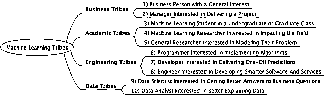
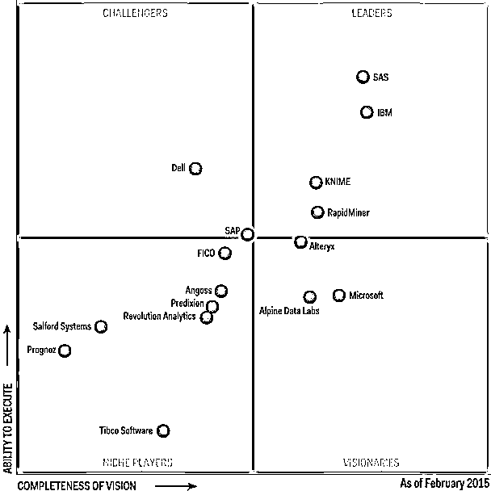
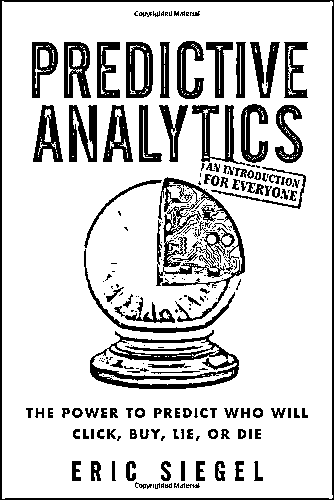
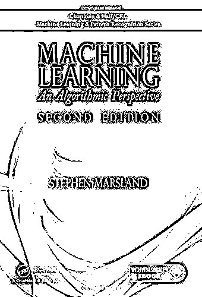
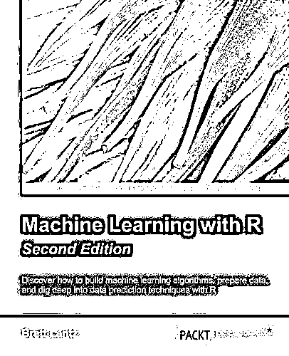

# 别瞎搞！对自己定位不准，看再多机器学习资料也是白搭（附资源)

> 原文：[`mp.weixin.qq.com/s?__biz=MzAxNTc0Mjg0Mg==&mid=2653285823&idx=1&sn=ec236795cb91429a0a0b59c5fc1bb803&chksm=802e2faab759a6bc5989bae3ecb8c039e2e8932230e14511b545635fa6b4c4dde45f4c674a75&scene=27#wechat_redirect`](http://mp.weixin.qq.com/s?__biz=MzAxNTc0Mjg0Mg==&mid=2653285823&idx=1&sn=ec236795cb91429a0a0b59c5fc1bb803&chksm=802e2faab759a6bc5989bae3ecb8c039e2e8932230e14511b545635fa6b4c4dde45f4c674a75&scene=27#wechat_redirect)

**编辑部**

微信公众号

**关键字**全网搜索最新排名

**『量化投资』：排名第一**

**『量       化』：排名第一**

**『机器学习』：排名第四**

我们会再接再厉

成为全网**优质的**金融、技术类公众号

> 找资料也是门学问，别抓着机器学习就一拥而上。

来看个小故事：**机器学习火了**。

做开发的工程师小张，和做对冲基金的经理老王，都希望在自己的领域加入机器学习。

工程师小张，希望能在自己的软件项目中加入机器学习。而经理老王，则希望在量化交易中，更多借助机器学习的强大，来处理交易，从而占据市场先机。

老王有着多年的编程经验，小张则是多年的开发经验。两人分别让周围的朋友推荐一些书籍，买来自学。

不过，这两人很快就读不下去了，连第一章都读不下去。

怎么回事？

难道是因为推荐的书籍不够好吗？

并不是。朋友们推荐的课程和教材都很棒，可是，不适合。

**这是目前一个非常普遍的问题——不匹配**。

这些教材，对于有 4 年数学基础，机器学习在读的研究生来说，特别适用。

但是，但是，对于有十年开发经验和基金经验的小张和老王来说，可就不适用了。他们可不愿意从理论开始整天慢慢学，他们只想把机器学习当作一个工具，快速解决实际问题就行。

你是不是也遇到同样的问题？只想用好机器学习，并不想追求其中的道道。

这篇文章就专门来回答：**不同行业，不同需求的人，到底应该在什么地方去获取有用资料，避免时间浪费**。

以下来自澳大利亚机器学习大师 Jason Brownlee 的博客，希望对你有所启发。

本文，列举了 10 类人群，并将其归到 4 个小组。

无论你是机器学习专业的学生，还是想借机器学习获得商业问题优化方案的数据分析师，还是软件的开发工程师，还是对机器学习感兴趣的商务人士，你都能在这篇文章中，准确找到你所真正需要的资料。

在我们开始今天的干货前，先搞清楚你到底属于哪一类，以对症下药。

以下是人群的分组列表：

*   **商业人群**

*   对机器学习感兴趣的商务人士

*   在项目中应用机器学习的经理人

*   **学术人群**

*   机器学习专业的本科生或研究生

*   机器学习领域的研究人员

*   利用机器学习建模的其他领域的研究人员

*   **工程人群**

*   实现算法的编程人员

*   交付一次性预测信息的开发人员

*   改进软件和服务的工程师

*   **数据人群**

*   希望获得商业问题优化方案的数据科学家

*   希望能更好地解释数据的数据分析师

****

******➤商业人群******

****通常来讲，这类人群希望在商业上有效地使用机器学习，但并不需要掌握其算法或工具的实现细节。在商业领域，机器学习技术已经广泛地用于预测分析。****

*   ******对机器学习感兴趣的商务人士******

****这类人群包括总经理及咨询顾问，对他们而言，机器学习会对以后的项目和策划起到战略指导的作用****

****以下资源对此类人群做战略思考会有帮助：****

> ****1.Gartner’s Magic Quadrant for Advanced Analytics Platforms, 2015****
> 
> ****http://www.gartner.com/technology/reprints.do?id=1-2AHPOU0&ct=150225&st=sb****
> 
> ****2.Gartner’s Machine Learning Drives Digital Business, 2014****
> 
> ****https://www.gartner.com/doc/2820120/machine-learning-drives-digital-business****
> 
> ****3.McKinsey’s An executive’s guide to machine learning, 2015****
> 
> ****http://www.mckinsey.com/industries/high-tech/our-insights/an-executives-guide-to-machine-learning****

****在下一节针对“经理人”的推荐书籍，也适用这个人群。****

********

*   ******项目经理人******

****机器学习对于这类人群负责的项目非常适用。对他们来说，有用的资料是关于各种问题和算法的全面概括，而不需要关注太多细节。****

****可以参考以下书籍：****

> ****1.Predictive Analytics: The Power to Predict Who Will Click, Buy, Lie, or Die****
> 
> ****http://www.amazon.com/dp/1118356853?tag=inspiredalgor-20****
> 
> ****2.Data Science for Business: What you need to know about data mining and data-analytic thinking****
> 
> ****http://www.amazon.com/dp/1449361323?tag=inspiredalgor-20****
> 
> ****3.Data Smart: Using Data Science to Transform Information into Insight****
> 
> **** http://www.amazon.com/dp/111866146X?tag=inspiredalgor-20****

********

******➤学术人群******

****通常来讲，这类人群主要指学生，包括本科生、研究、博士后、研究助理等。****

****学术人群可能会花大量时间研究他们论文中的某个机器学习算法。 在此，我推荐他们看一篇文章“How to Research a Machine Learning Algorithm”，了解关于算法方面的研究。****

> ****How to Research a Machine Learning Algorithm****
> 
> ****http://machinelearningmastery.com/how-to-research-a-machine-learning-algorithm/****

*   ******机器学习专业的本科生或研究生******

****机器学习专业的学生通常会上一些关于技术和算法的课程，因此他们对相关的具体问题会更感兴趣。****

****学生一般比较专注，也有时间深入去钻研。这类人群最好阅读教科书。以下是机器学习领域里最好的教科书：****

> ****Learning from Data****
> 
> ****http://www.amazon.com/dp/B00C7EXC2A?tag=inspiredalgor-20****
> 
> ****Machine Learning: A Probabilistic Perspective****
> 
> ****http://www.amazon.com/dp/0262018020?tag=inspiredalgor-20****
> 
> ****Pattern Recognition and Machine Learning****
> 
> ****http://www.amazon.com/dp/0387310738?tag=inspiredalgor-20****
> 
> ****The Elements of Statistical Learning: Data Mining. Inference. and Prediction****
> 
> ****http://www.amazon.com/dp/B00GSCXVN2?tag=inspiredalgor-20****

*   ******机器学习领域的研究人员******

****机器学习领域的研究人员会深入了解机器学习的某个方面，并努力去扩展该领域。**** 

****研究人员对本专业的研究论文、期刊、组织、网络等很感兴趣。****

****教科书对他们来说，可就不适用了。****

****他们需要参考一些知名度高的期刊和论文集：****

> ****Journal of Machine Learning Research (JMLR)****
> 
> ****http://www.jmlr.org/****
> 
> ****Neural Information Processing Systems (NIPS)****
> 
> ****https://nips.cc/****
> 
> ****Knowledge Discovery and Data Mining (SIGKDD)****
> 
> ****http://www.kdd.org/****
> 
> ****International Conference on Machine Learning (ICML)****
> 
> ****https://en.wikipedia.org/wiki/International_Conference_on_Machine_Learning****

****检验 Quora 上关于“机器学习最好的会议和期刊是什么？”。****

> ****https://www.quora.com/What-are-the-best-conferences-and-journals-about-machine-learning****

****这儿有一个很方便的人工智能排名前 50 位的期刊列表。****

> ****http://www.scimagojr.com/journalrank.php?category=1702****

*   ******利用机器学习建模的其他领域的研究人员******

****其他领域的研究人员可能也会对机器学习感兴趣，但是是把它当作工具。他们更关注用自己的数据建造描述性或预测性的模型。**** 

****例如，客户研究、地质学、或者生物学领域的科学家有他们自己的数据集。他们会用建模的方法来预测未来可能会发生的问题。****

****相比于模型的准确度，他们更关注模型的可解释性。因此，从统计学借鉴过来的简单易懂的方法更易被接受，例如线性回归和逻辑回归。****

****当然，好的系统化过程仍然需要。****

****我会推荐“工程人群”里提到的资源，尤其是“Developer Interested in Delivering One-Off Predictions”。另外可以看一下“数据人群”里“数据科学家”那部分。****

******➤工程人群******

****工程人群基本上是开发人员，他们希望将机器学习用于自己项目的解决方案中。**** 

****对于开发人员，推荐一篇很好的文章“Machine Learning for Programmers”。****

> ****http://machinelearningmastery.com/machine-learning-for-programmers/****

****工程人群可以从答疑网站的机器学习社区中获得很多帮助和支持。 更多的信息，可以参考文章“Machine Learning Communities”。****

> ****http://machinelearningmastery.com/machine-learning-communities/****

*   ******实现算法的编程人员******

****对于编程人员来说，一个很好的掌握机器学习技能的方法是：从零基础开始，利用现有的编程能力实现机器学习的算法。**** 

****这个方法我讲过很多次，也在我的博文“Understand Machine Learning Algorithms By Implementing Them From Scratch”中提供了很棒的小窍门和资源。****

> ****http://machinelearningmastery.com/understand-machine-learning-algorithms-by-implementing-them-from-scratch/****

****在这篇博文中，我还针对这个方法推荐了三本书****

> ****Data Science from Scratch: First Principles with Python****
> 
> ****http://www.amazon.com/dp/149190142X?tag=inspiredalgor-20****
> 
> ****Machine Learning in Action****
> 
> ****http://www.amazon.com/dp/1617290181?tag=inspiredalgor-20****
> 
> ****Machine Learning: An Algorithmic Perspective****
> 
> ****http://www.amazon.com/dp/1466583282?tag=inspiredalgor-20****

********

*   ******交付一次性预测信息的开发人员******

****一个开发人员不一定得是很棒的程序员，而编程也不需要交付一个准确可靠的预测模型。**** 

****一个一次性的预测模型可以在商业环境中提供一套预测信息。在自学、处理实际数据集甚至在机器学习竞赛中，这种模型都算是非常理想的。****

****如果你经历过系统地解决问题的全部过程，并提供出一个独立的模型，你将获益良多。****

> ****Data Mining: Practical Machine Learning Tools and Techniques****
> 
> ****http://www.amazon.com/dp/0123748569?tag=inspiredalgor-20****
> 
> ****Applied Predictive Modeling****
> 
> ****http://www.amazon.com/dp/1461468485?tag=inspiredalgor-20****

****你可以从我的博文“Process for working through Machine Learning Problems”中了解到端对端的解决机器学习问题的系统流程。****

> ****http://machinelearningmastery.com/process-for-working-through-machine-learning-problems/****

*   ******改进软件和服务的工程师******

****一个工程师要想在他们的软件项目中加入机器学习，需要掌握的知识包括算法、端对端解决问题、以及在软件实际运转的情况下如何让算法可靠执行。**** 

****这类人群是从前面的两类人群成长而来的，称他们为机器学习工程师可能更恰当。他们致力于使用高速的算法来提供准确可靠的结果，并在二者中寻求平衡。****

****这类人群也大量使用了机器学习书库和基础架构。****

****在启动中的机器学习书库中，包括如下有用的资源：****

> ****Building Machine Learning Systems with Python****
> 
> ****http://www.amazon.com/dp/B00E7NC9D2?tag=inspiredalgor-20****
> 
> ****Learning scikit-learn: Machine Learning in Python****
> 
> ****http://www.amazon.com/dp/1783281936?tag=inspiredalgor-20****
> 
> ****Practical Data Science with R****
> 
> ****http://www.amazon.com/dp/1617291560?tag=inspiredalgor-20****
> 
> ****Machine Learning with R****
> 
> ****http://www.amazon.com/dp/1784393908?tag=inspiredalgor-20****

********

****另外，还可以参阅文章“Building a Production Machine Learning Infrastructure”。****

> ****http://machinelearningmastery.com/building-a-production-machine-learning-infrastructure/****

******➤数据人群******

****通常来说，这类人群主要跟数据打交道，但可能也需要用到机器学习的知识。**** 

*   ******希望获得商业问题优化方案的数据科学家******

****一名优秀的数据科学家，绝不能停止学习。****

****你必须了解最新的数据流、技巧和算法。这包括你需要用来描述数据和创建预测模型的机器学习技能。****

****从“工程部落”项下列出的更为实用的资源中，以及从“学术部落”项下列出的更为理论化的资源中，数据科学家可以获取自己需要的资源。****

****但是一些以数据科学为主的机器学习资源既有实用性又有理论性，这些资源包括：****

> ****Applied Predictive Modeling****
> 
> ****http://www.amazon.com/dp/1461468485?tag=inspiredalgor-20****
> 
> ****An Introduction to Statistical Learning: with Applications in R****
> 
> ****http://www.amazon.com/dp/1461471370?tag=inspiredalgor-20****
> 
> ****Machine Learning for Hackers****
> 
> ****http://www.amazon.com/dp/1449303714?tag=inspiredalgor-20****

*   ******希望能更好地解释数据的数据分析师******

****数据分析员主要对商业利益背景下的数据解释感兴趣。有时，机器学习算法有助于得出性能更好的模型。这些模型大多为描述模型，但是有时也包括预测模型。**** 

****和“普通研究人员”这个群体一样，这个群体可能在统计学和统计推论上有着良好的基础。另外，由于他们对描述模型最感兴趣，因此掌握线性回归和逻辑回归之类的经典算法可能就足够了。相对于准确性，所得模型的解释能力更好。****

****从统计推论的角度而言，上文提到的资源很很有用。****

******关注者******

******从****1 到 10000+******

******我们每天都在进步******

********