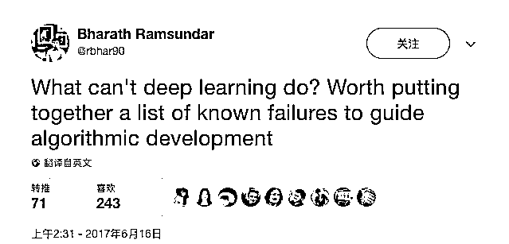

# 深度学习到底有没有缺陷？这里列满了它做不到的事情

> 原文：[`mp.weixin.qq.com/s?__biz=MzAxNTc0Mjg0Mg==&mid=2653285821&idx=1&sn=377f3e0bb354f9bee1a162decb5790ce&chksm=802e2fa8b759a6be28287b8d6fb5cba41123b48b35f264971f6f09d6cc4d412fe39abb7d4194&scene=27#wechat_redirect`](http://mp.weixin.qq.com/s?__biz=MzAxNTc0Mjg0Mg==&mid=2653285821&idx=1&sn=377f3e0bb354f9bee1a162decb5790ce&chksm=802e2fa8b759a6be28287b8d6fb5cba41123b48b35f264971f6f09d6cc4d412fe39abb7d4194&scene=27#wechat_redirect)

**编辑部**

微信公众号

**关键字**全网搜索最新排名

**『量化投资』：排名第一**

**『量       化』：排名第一**

**『机器学习』：排名第四**

我们会再接再厉

成为全网**优质的**金融、技术类公众号

> 本文源自一次讨论深度学习缺陷的推文风暴，斯坦福大学的 Bharath Ramsundar，在用深度学习进行药物研究的过程中发现，深度学习做不到事情其实有很多，比如无法鉴别对抗样本、处理不好高维数据、不能一边训练一边推断……他在 Twitter 上一一列出，并公开听取大家的见解。
> 
> 这还不算是篇正式的文章，但这里的探索和分析，无疑有益于有心的学习者思考。Ramsundar 的导师是斯坦福大学教授 Vijay Pande，硅谷风投 a16z 知名成员。

<inherit style="max-width: 100%; box-sizing: border-box !important; word-wrap: break-word !important;"></inherit>

**1/ **深度学习做不了什么？这值得我们列一个清单，把尝试过的失败总结出来，以更好地指导算法开发。

**2/ **对于输入数据的细微抖动，深度学习就会出现算法失效的情况。想象一下，当颜色互换时，目标识别系统的崩溃程度。

**3/ **基于梯度的学习相当缓慢，算法需要下降很多很多的梯度才能学会模式，用于高维预测则相当艰难。

**4/** 深度学习在处理约束条件方面表现很差。不同于线性规划，深度学习不容易找到能满足约束条件的解决方案。

**5/ **复杂模型的训练很不稳定。神经图灵机和生成式对抗网络训练起来很难，它们过于依赖随机函数的初始化。

**6/ **不像图形模型，深度网络不擅长跟真实世界建立联系，无法提取出因果模型。

**7/ **比如，要考虑关键影响者的监测问题。深度神经网络还不清楚如何来检测参议员投票数据集中的关键影响者。

**8/** 强化学习方法过于挑剔。其性能太过依赖于调参技巧，尽管这一问题是特有的。

**9/ **深度学习无法对未知的实体进行推断。考虑棒球赛的场景：屏幕上的击球手与屏幕外的投球手。

**10/ **目前还不清楚如何用深度神经网络技术来推断不在视频中的投球手的存在。

**11/** 在线训练深度网络是不可能的，文章一开始就提到了训练缓慢的问题，因而动态反应很难实现。

**12/** 一般来说，智能行为的训练只能离线进行。

**13/ **人们经常提及深度网络的可解释性问题。我个人认为该问题远没有人们所想的那样严重。

**14/ **但是，对深度网络进行审查也相当困难。我们如何才能确保偏见、种族主义不被深度学习学会？请参考 word2vec 的种族主义文章。

**15/ **深度神经网络不能简单用来解决逻辑问题。3SAT 求解器是有很强的能力，但很难被部署到深度网络内。

**16/** 深度神经网络在高维特征的处理上很糟糕，这一点不像算法强健的随机森林，它需要重度调参。

**17/ **超参数搜索依旧很难用。从业者需要处理繁重的计算，或者对架构作大量的手工调整。

**18/ **这绝对不是一份详尽的问题列表。上述问题都值得进一步思考与深入研究。

**19/ **其中至关重要的一点是：到底这些难题是深度网络所固有的缺陷？还是属于我们要在工程上去克服的挑战？

**20/ **说实话，这很难回答。其中一些问题可能被很快解决。如部署更多的硬件，就有可能实现自动化超参数搜索。

**21/ **在架构方面，还有一些自动归一化和处理高维数据的早期尝试，所以特征处理也有可能得到改善。

**22/ **然而，逻辑、约束条件、隐藏结构和审查方面的问题，则要隐藏得更深。

**23/ **不过我更希望被打脸，深度学习领域的人们往往天赋异禀，且极具想象力。

**24/ **此外，GPU 版的摩尔定律依然在起作用（至于说能持续多久，TPU 和定制硬件是否真能帮我们解决问题，只有到时候才能知道了）。

**25/ **所以，我对这些挑战持相对乐观的态度。尽管如此，我还是怀疑深度网络不足以实现通用人工智能。

**26/ **当然这可能是我个人的偏见。专家们在技术细节上研究多了，往往会在预测大局上表现拙劣。

**27/ **从而导致我一叶障目，不见泰山。

**28/ **我在拼命抑制把这推文风暴写成正式文章的冲动。毕竟，我不知道是否还存在未能触及的潜在话题。

**29/ **最后，这里的探索和分析就先留给那些有心的读者来做练习。

说明：本文是我一次推文风暴的改编和展开。感谢在 Twitter 上评论过我的那些人，他们在我最初的思路上给出了很多有意思的见解。

**关注者**

**从****1 到 10000+**

**我们每天都在进步**

