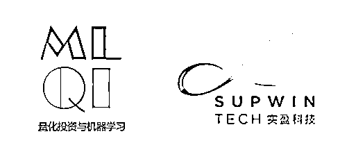
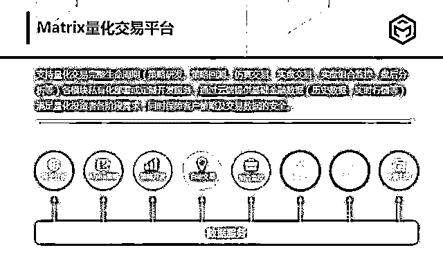
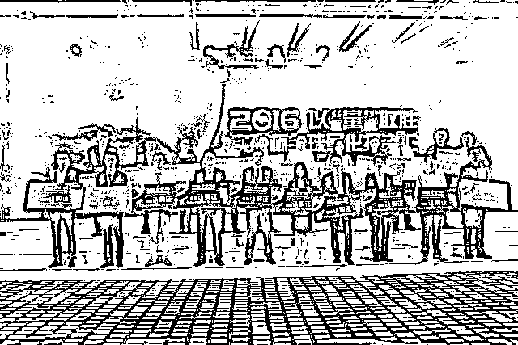
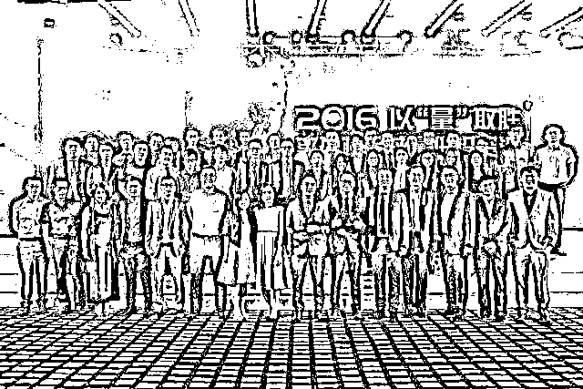
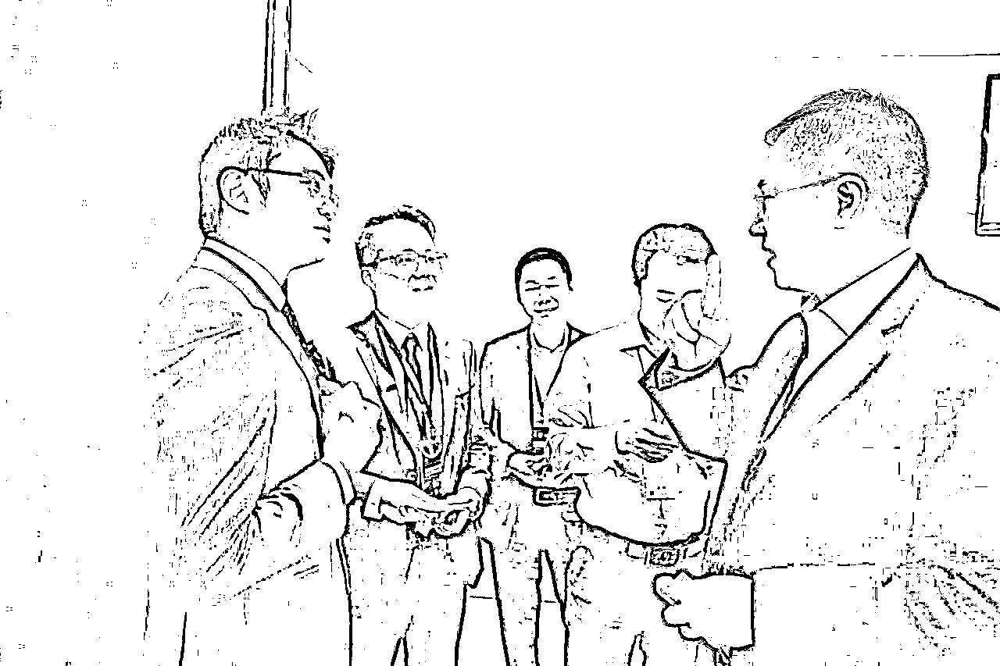
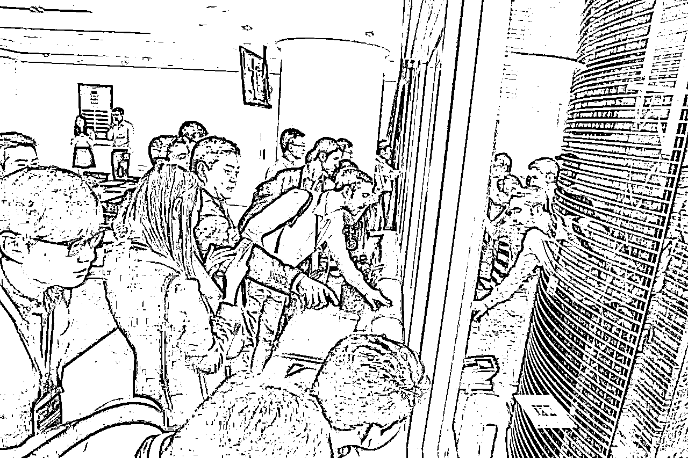
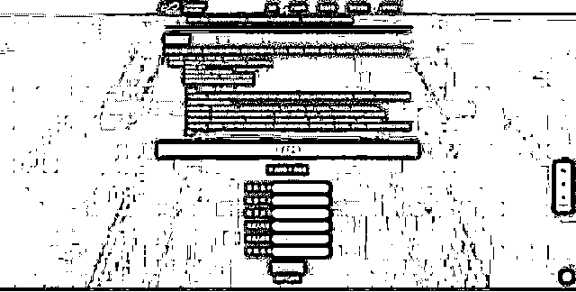
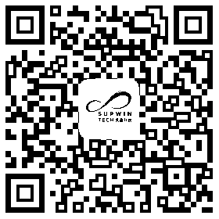

# 全球量化争霸赛，赢 10 万元奖品与华尔街投资高手对决

> 原文：[`mp.weixin.qq.com/s?__biz=MzAxNTc0Mjg0Mg==&mid=2653285818&idx=1&sn=5a29ea5d2f9d6d9af544c15eae66f92d&chksm=802e2fafb759a6b9bc498e8aeecc0353fc2578b0a441daa6771f7feb3376ba964b8a7a2b4158&scene=27#wechat_redirect`](http://mp.weixin.qq.com/s?__biz=MzAxNTc0Mjg0Mg==&mid=2653285818&idx=1&sn=5a29ea5d2f9d6d9af544c15eae66f92d&chksm=802e2fafb759a6b9bc498e8aeecc0353fc2578b0a441daa6771f7feb3376ba964b8a7a2b4158&scene=27#wechat_redirect)

**量化投资**是目前国内最受关注的交易方式之一，由于投资业绩稳定，市场规模和份额不断扩大而日益受到重视和追捧，其中量化投资的核心在于交易策略。

  

为了不断挖掘量化投资人才、寻找更多优秀的投资策略，由**CCTV 证券资讯频道**主办，**广州实盈网络科技有限公司**和**五矿经易期货**共同承办的“**宽客天下全球量化争霸赛**”即将拉开帷幕。

2016 实盈杯全球宽客巅峰汇

本次量化大赛面向全社会发出邀请，只要是对投资感兴趣并且具备量化策略模型建设能力的人均可参加。

  

“2017 宽客天下 全球量化争霸赛”以创新、创造为出发点，**强调科学技术、信息处理、数学计算等不同领域与金融知识相结合，希望凝聚一批具有良好素质的量化投资精英。**

虽说比赛以较量为目的，但量化投资交流与研究同样重要。为此，本次赛事请来了中国量化投资学会、广东量化投资学会作学术指导。

   

去年的得奖者参观实盈总部

同时，赛事也开设**高校组**，**吸引在校大学生参加**，通过整合高校与行业资源，为大学校园和全社会的量化投资人才培养开拓了一条新的道路。

赛事报名

赛事将从 2017 年 5 月正式接受报名，**高校组****可以个人或团队的形式参加比赛，编写策略并在 10 月进行回测。实盘组将进行实盘股票交易，每天收盘后更新评分和排名**，务求令每一位参赛者有更高的参与度，也体现了赛事的挑战性。

**符合条件的参赛者，还可同时参与高校组和实盘组两个组别的比赛。**另外，**参赛者还可以选择将实盘操作与回测系统对接并评分收获大赛额外奖项**，而过**亿万元级别的种子基金**也在等待参赛者来赢取。

**赛程安排**

**实盘组**

****报名时间：**2017 年 5 月 2 日起至 2017 年 10 月 31 日

**比赛时间：**2017 年 7 月 3 日--2018 年 4 月 30 日（共 10 个月）

（特别说明：获奖选手可自行选择实盘操作的起止时间，但是实盘操作时间不得低于 6 个月且期间必须连续。）

**策略回测及评奖：**2018 年 5 月 

**中外 PK 赛：**2018 年 6 月** 

****高校组****

******高校巡回及报名时间****：**2017 年 5 月 2 日--9 月 30 日****

******策略编写时间：**2017 年 7 月 3 日起至 2017 年 9 月 30 日****

******模拟实盘时间：**2017 年 10 月 1 日--2018 年 4 月 30 日（共 7 个月）****

****（特别说明：获奖选手可自行选择模拟实盘操作的起止时间，但是模拟实盘操作时间不得低于 6 个月且期间必须连续。）****

******策略回测及评奖：**2018 年 5 月****

******中外 PK 赛：**2018 年 6 月****

******奖品丰厚******

****为了吸引更多人参加本次“2017 宽客天下 全球量化争霸赛”，赛事方特意为优秀出色的参赛者准备了丰厚的现金奖和奖品。****

****一****

******实盘组奖品******

****一等奖 1 名，可获现金奖**50000 元**；**** 

****二等奖 1 名，可获现金奖**30000 元**，****

****三等奖 1 名，可获现金奖**5000 元**，****

****月度奖 10 名，可获现金奖**3000 元**。****

****一****

******高校组奖品******

****高校组将会分 5 个项目进行评比（α对冲、期货择时、期货套利、股票多头、复合型策略）**** 

****一等奖各 1 名，可获现金奖**10000 元**；****

****二等奖各 1 名，可获现金奖**5000 元**，****

****三等奖各 1 名，可获现金奖**3000 元**。****

****除了接近**10 万元**的奖金奖品，本次大赛的优胜者还将有机会参加代表**中国中外量化 PK 大赛**。届时，**从赛事走出来的量化精英将有直接面对华尔街投资高手和常青藤学院量化精英的****机会，这是一次可遇不可求的高水平碰撞，更是一次深度的量化投资研讨**。高校组表现优秀者，更有机会获得金融科技公司的实习或就业机会！****

****量化投资正在改变这个时代，而“宽客天下 全球量化争霸赛”则在寻找能改变时代的你！****

******大赛官网：******

********http://www.supwintech.com/home/banners/competition/********

****更多比赛详情，请关注微信公众号****

********

******电话客服：**020-28183090****

******全国高校巡回宣讲即将启航，了解各地详情报名参与，更多量化投资行业干货，等着你来！******

******事不宜迟，**马上点击“阅读原文”！！********