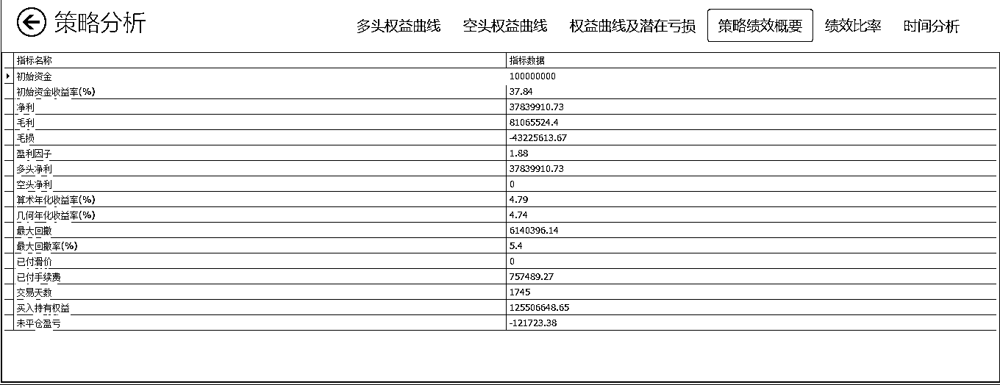

# 精选股票、期货量化投资策略系列（三）基于 AT 量能-MATLAB

> 原文：[`mp.weixin.qq.com/s?__biz=MzAxNTc0Mjg0Mg==&mid=2653285812&idx=1&sn=5f643bbfd818a4db6714910b2bdfe33f&chksm=802e2fa1b759a6b71d87f42ad402b0f58a39a453837c09e954cd33a9756a14bf3969f84849d8&scene=27#wechat_redirect`](http://mp.weixin.qq.com/s?__biz=MzAxNTc0Mjg0Mg==&mid=2653285812&idx=1&sn=5f643bbfd818a4db6714910b2bdfe33f&chksm=802e2fa1b759a6b71d87f42ad402b0f58a39a453837c09e954cd33a9756a14bf3969f84849d8&scene=27#wechat_redirect)

**编辑部**

微信公众号

**关键字**全网搜索最新排名

**『量化投资』：排名第一**

**『量       化』：排名第一**

**『机器学习』：排名第四**

我们会再接再厉

成为全网**优质的**金融、技术类公众号

> **本期 2 个 MATLAB 开发的策略筛选自点宽 digquant 量化社区**
> 
> **社区地址：www.digquant.com.cn**
> 
> **策略开发平台：Auto-Trader 量能策略研究平台**

**网格资金管理（****突破进场）**

**策略原理**

*   将资金分为 N 份，采取突破高点的形式入场，止损为 10%，止盈为 11%

*   如果该份资金获利超过 11%，则上移止盈止损线，且启动下一份资金抛点入场。

*   仅多头入场

**策略收益**

**策略代码**

**Retrace**

**入场**

突破唐奇案上轨，且加速度由负转正，做多。

突破唐奇案下轨，且加速度由正转负，做空。

**出场**

周期较短的唐安奇通道反向突破

Art 跟踪止损

**策略收益**

****

****

****

****

****

****

****

****

****策略代码****

****

****

****

**本期量化策略，digquant 网站独家授权**

****策略开发平台**：**AT 量能策略研究平台**基于 MATLAB，支持股票、期货、期权等全市场品种的策略研究和自动化交易，目前已经有超过 300 家高校的数学背景的学生、近万名专业量化用户。**

****

****策略来源**：**点宽 DigQuant 量化社区**（***www.digquant.com.cn***）是国内首家基于 Matlab 的专业在线量化研究社区，为专业策略研究人员及量化爱好者提供 Auto-Trader 量能策略研究平台，30 多篇严谨的专业文章和超百个完全公开源代码的策略资源池。**

**本系列，策略每周更新，敬请期待！**

**- END -**

****关注者****

****从****1 到 10000+****

****我们每天都在进步****

****

****下载策略：****

****