# 用于算法交易的神经网络基于多变量时间序列

> 原文：[`mp.weixin.qq.com/s?__biz=MzAxNTc0Mjg0Mg==&mid=2653285782&idx=1&sn=5848c4071a6204c2d232204e4770ae68&chksm=802e2f83b759a69531e990bd69d28f746c292183934e20a3fb56f0b039c3a3da8897422ab90c&scene=27#wechat_redirect`](http://mp.weixin.qq.com/s?__biz=MzAxNTc0Mjg0Mg==&mid=2653285782&idx=1&sn=5848c4071a6204c2d232204e4770ae68&chksm=802e2f83b759a69531e990bd69d28f746c292183934e20a3fb56f0b039c3a3da8897422ab90c&scene=27#wechat_redirect)

**编辑部**

微信公众号

**关键字**全网搜索最新排名

**『量化投资』：排名第一**

**『量       化』：排名第一**

**『机器学习』：排名第四**

我们会再接再厉

成为全网**优质的**金融、技术类公众号

**数据准备**

为了更好地了解多维时间序列，让我们来看看如何看图像，其实也不只有两个尺寸（高度和宽度），还有表示颜色的“深度”：

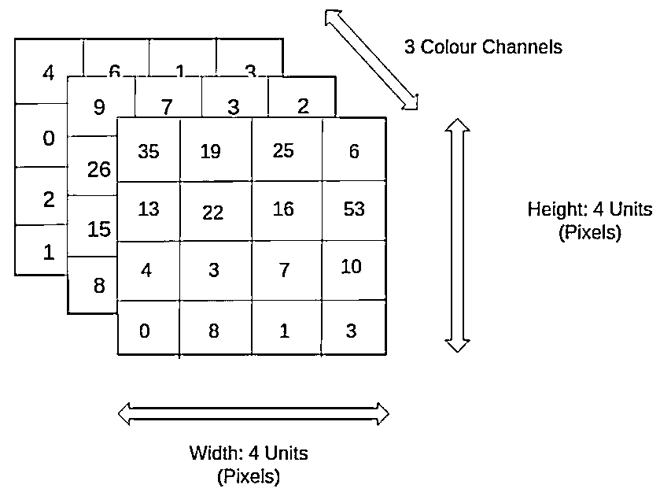

在时间序列的情况下，我们的图像只是一维的（在图上看到的），channels 的角色扮演者不同值——开，高，收、低和成交量。 你也可以从其他观点考虑——在任何时间戳我们的时间序列不代表一个单一的价，而是一个矢量（每天的开，高，收、低和成交量），但图片的 metaphor 是更加有用的去理解为什么我们今天将卷积神经网络应用于这个问题。

我们不需要预测一些确切的值，所以预期的价和未来的变化对我们来说并不感兴趣——我们只需要预测这个时刻是上涨还是下跌。 这就是为什么我们会尝试和标准化我们 30 天的窗口只通过他们的均值和方差（z-score 规范化），假设在单一时间窗口中，它们没有变化很大，不会影响未来的信息。

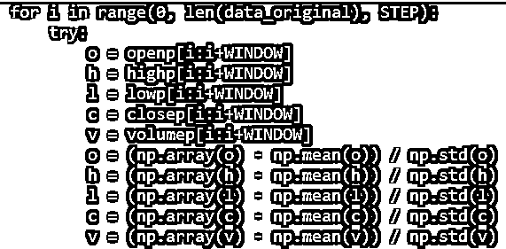

但是，由于我们想预测第二天涨价的走势，我们需要考虑一个维度的变化：

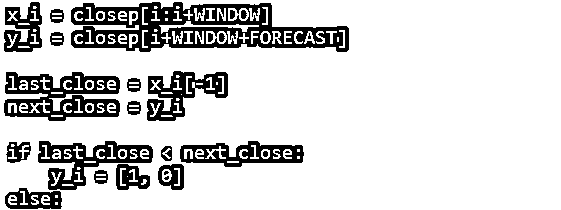

所以，我们要训练的数据就是 30 天的时间窗口，但现在，我们每天将考虑整个开高收低成交量数据正确归一化以预测近距离移动的方向。 

**神经网络架构**

如前所述，使用 CNN 作为分类器。 主要选择它是因为超参数的灵活性和可解释性（卷积核，下采样大小等）和 RNNs 性能类似，比 MLP 更好，训练更快。代码如下：

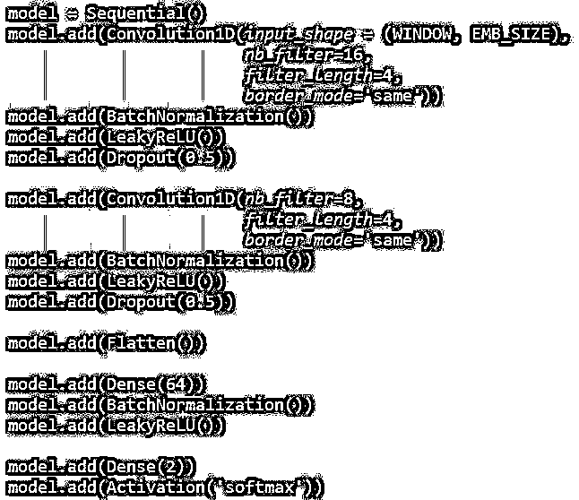

**训练过程**

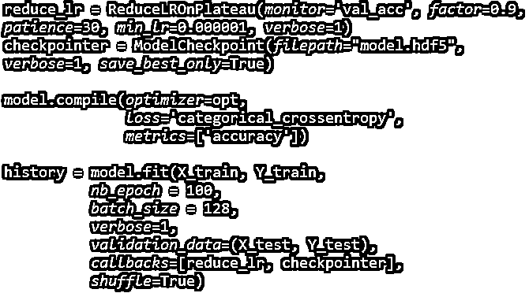

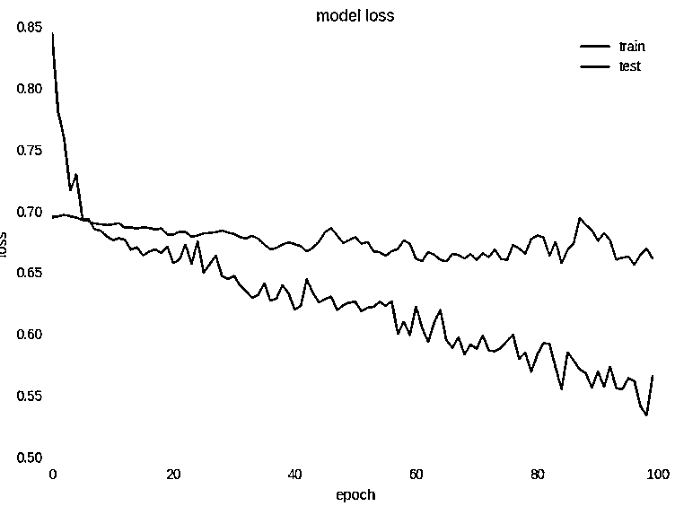

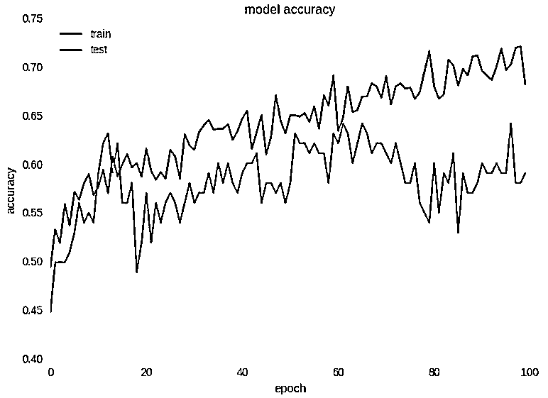

从上图我们可以清楚地看到网络训练充分（对于非常嘈杂的数据），训练集的损失随着时间的推移而减少，准确性增加。 而且，最重要的是，与上一期的单变量时间序列相比，我们表现能从 58％提高到接近 65％的精度！

检查过拟合，我们也可以绘制混淆矩阵：

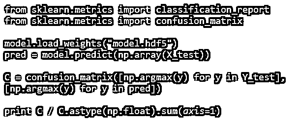

[[ 0.75510204 0.24489796]
[ 0.46938776 0.53061224]]

这表明我们预测精度为 75％的“UP”时刻，精度为 53％的“DOWN”时刻，这个结果当然可以用于测试数据集。 

**关于回归**

不预测二进制变量，可以预测实际值——次日回报或收盘价。 在以前的测试中，没有获得良好的效果。

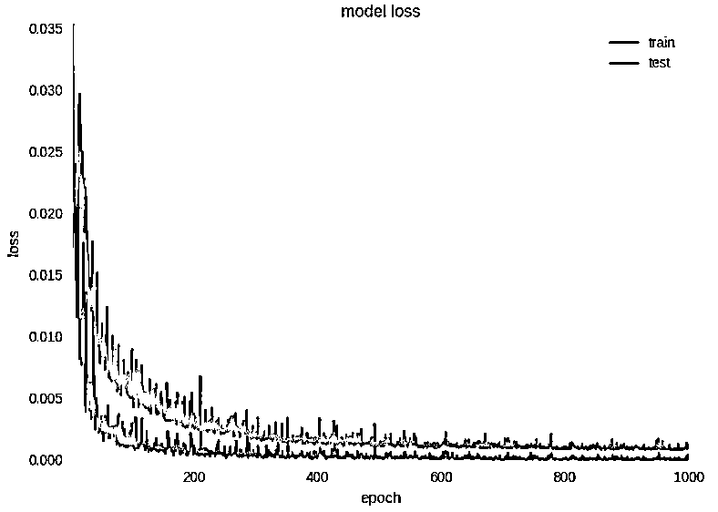

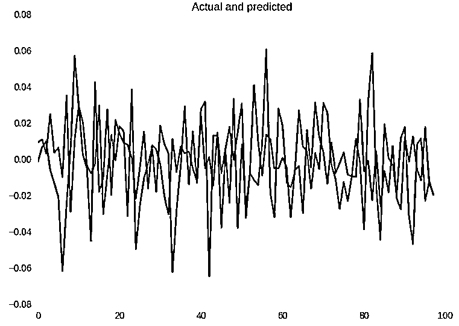

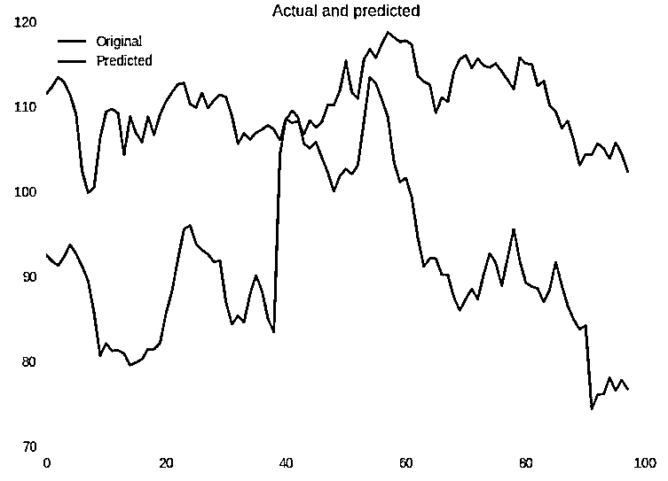

**关注者**

**从****1 到 10000+**

**我们每天都在进步**

