# 高效灵活的概率建模方法基于 Python

> 原文：[`mp.weixin.qq.com/s?__biz=MzAxNTc0Mjg0Mg==&mid=2653285768&idx=1&sn=2a8919a04d3ad7eea49305e36104f97b&chksm=802e2f9db759a68b9bdd9588488d2ff79c4b11ea9e9defc1a22b8d90d29fba3deb64c33ba7c7&scene=27#wechat_redirect`](http://mp.weixin.qq.com/s?__biz=MzAxNTc0Mjg0Mg==&mid=2653285768&idx=1&sn=2a8919a04d3ad7eea49305e36104f97b&chksm=802e2f9db759a68b9bdd9588488d2ff79c4b11ea9e9defc1a22b8d90d29fba3deb64c33ba7c7&scene=27#wechat_redirect)

**编辑部**

微信公众号

**关键字**全网搜索最新排名

**『量化投资』：排名第一**

**『量       化』：排名第一**

**『机器学习』：排名第四**

我们会再接再厉

成为全网**优质的**金融、技术类公众号

**前言**

在今天给大家介绍一个研究工具：**pomegranate。**它比其他软件包更加灵活，更快，直观易用，并且可以在多线程中并行完成。

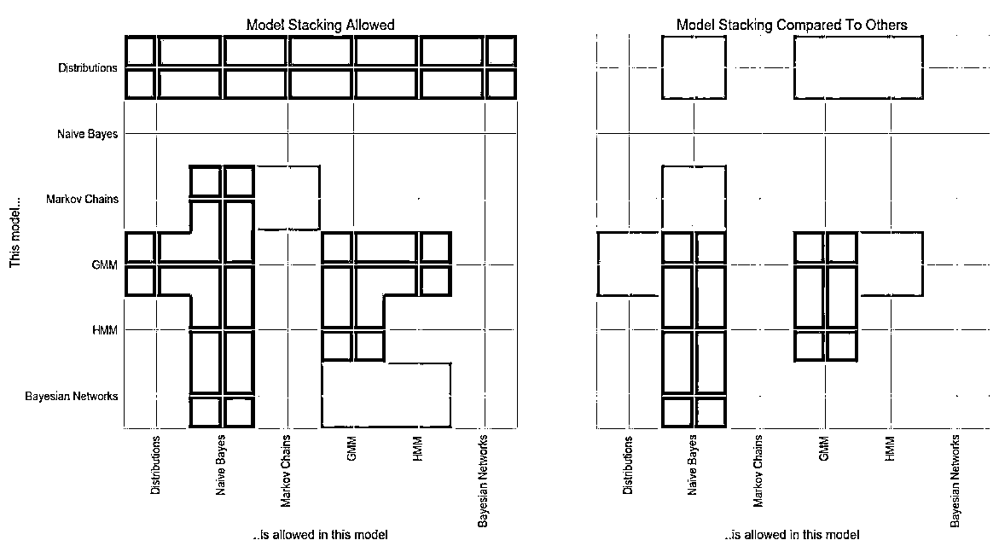

**The API**

**主要模型介绍**

*   一般混合模型

*   隐马尔可夫模型

*   贝叶斯网络

*   贝叶斯分类器

**所有模型使用做多的方法**

model.log_probability(X) / model.probability(X)
model.sample()
model.fit(X, weights, inertia)
model.summarize(X, weights)
model.from_summaries(inertia)
model.predict(X)
model.predict_proba(X)
model.predict_log_proba(X)
model.from_samples(X, weights)

**支持很多分布函数**

**单变量分布** 1\. UniformDistribution
    2\. BernoulliDistribution
    3\. NormalDistribution
    4\. LogNormalDistribution
    5\. ExponentialDistribution
    6\. BetaDistribution
    7\. GammaDistribution
    8\. DiscreteDistribution
    9\. PoissonDistribution

**内核密度**

    1\. GaussianKernelDensity
    2\. UniformKernelDensity
    3\. TriangleKernelDensity

**多变量分布**

    1\. IndependentComponentsDistribution
    2\. MultivariateGaussianDistribution
    3\. DirichletDistribution
    4\. ConditionalProbabilityTable
    5\. JointProbabilityTable

**模型可以从已知值中创建**

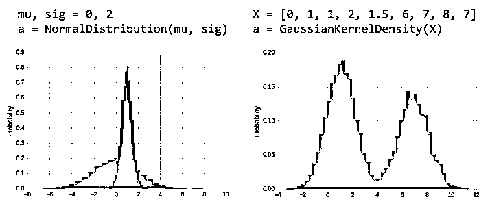

**模型也可以从数据直接学习**

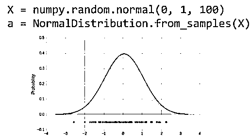

**pomegranate 比 numpy 快**

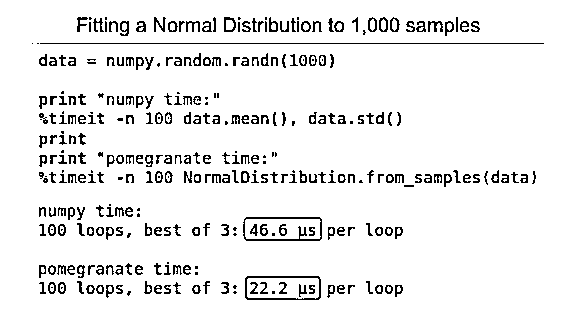

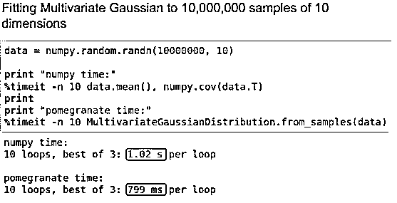

只需要一次数据集（适用于所有模型）。以下是正态分布统计示例：

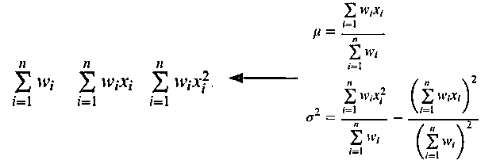

**支持核心学习**

由于使用了足够多的统计数据，因此可以支持外核/在线学习。

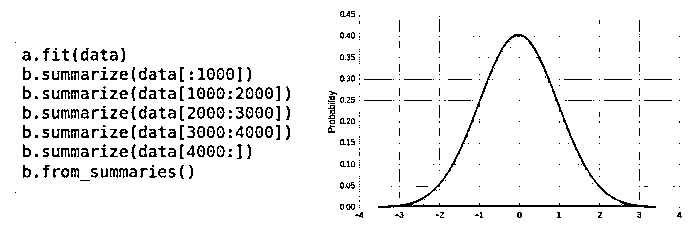

**pomegranate 比 scipy 快**

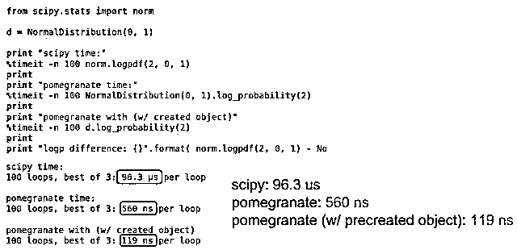

**The API**

**主要模型介绍**

*   **一般混合模型**

*   隐马尔可夫模型

*   贝叶斯网络

*   贝叶斯分类器

**通用混合模型（GMM）可以对多组****分布进行建模**

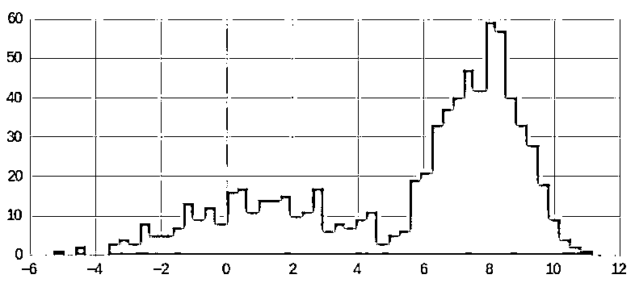

GMM 使用期望最大化（EM）来拟合

    1、使用 kmeans ++或 kmeans ||初始化集群

    2、对于等于后 P（M | D）（E 步）的所有点分配权重

    3、使用加权点更新分布（M 步）

    4、重复 2 和 3，直到收敛

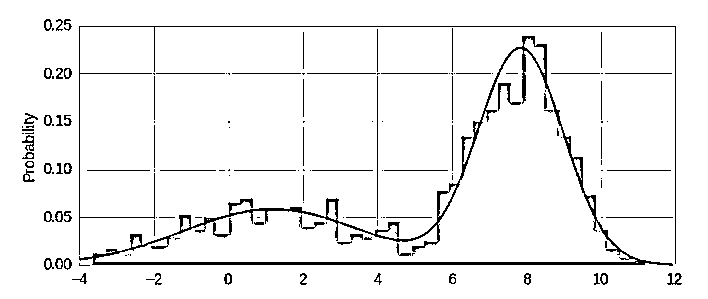

model = GeneralMixtureModel.from_samples(NormalDistribution, 2, X) 

**GMM 不限于高斯分布**

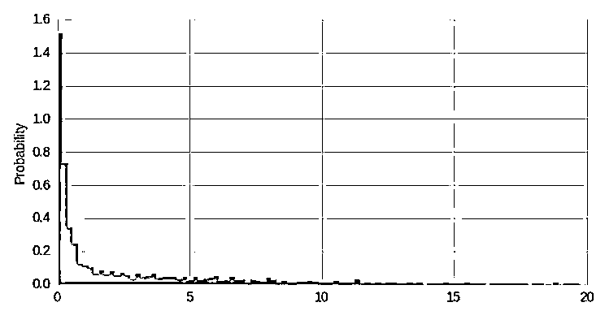

**单个指数分布不能很好的数据进行建模**

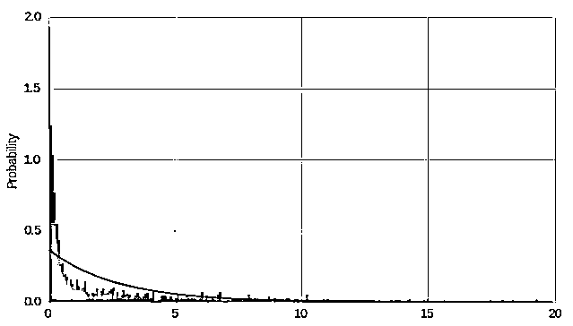

model = ExponentialDistribution.from_samples(X)

**两个指数混合使数据更好的模拟**

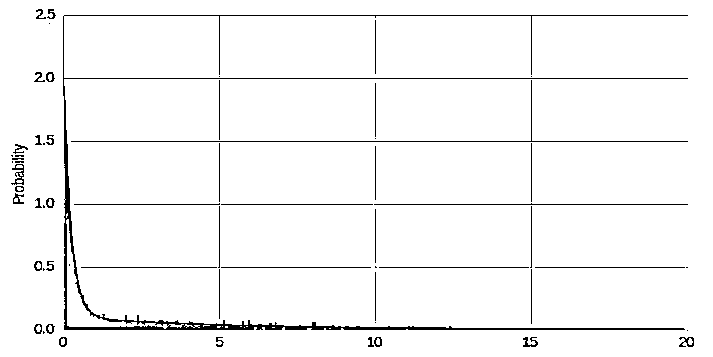

model = GeneralMixtureModel.from_samples(ExponentialDistribution, 2, X)

**Heterogeneous mixtures are natively supported**

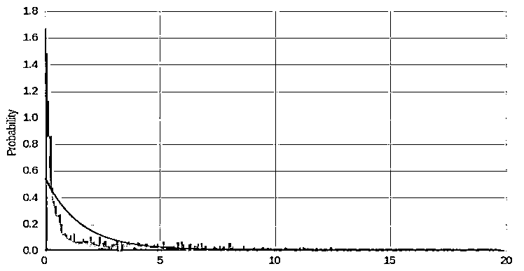

model = GeneralMixtureModel.from_samples([ExponentialDistribution, UniformDistribution], 2, X)

**一般混合模型比 sklearn 快**

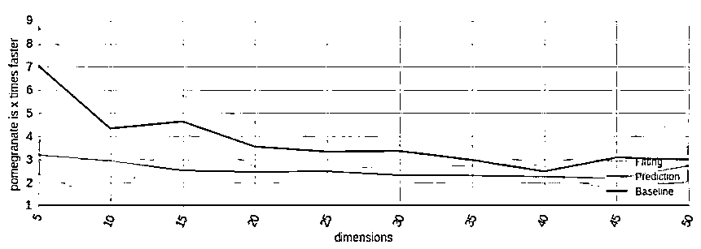

**The API**

**主要模型介绍**

*   一般混合模型

*   **隐马尔可夫模型**

*   贝叶斯网络

*   贝叶斯分类器

**CG enrichment detection HMM**  

GACTACGACTCGCGCTCGCGCGACGCGCTCGACATCATCGACACGACACTC

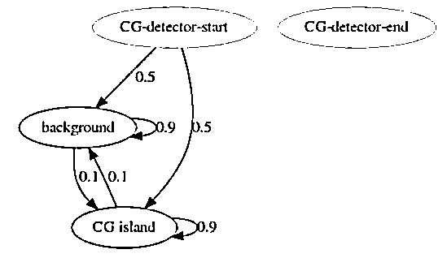

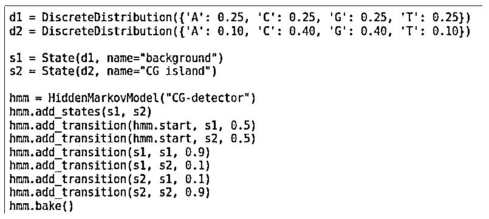

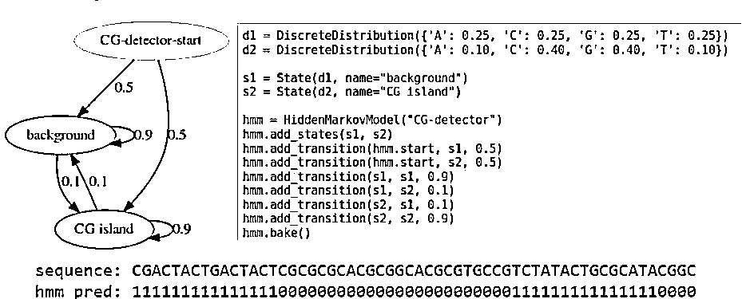

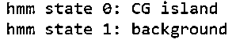

**GMM-HMM**

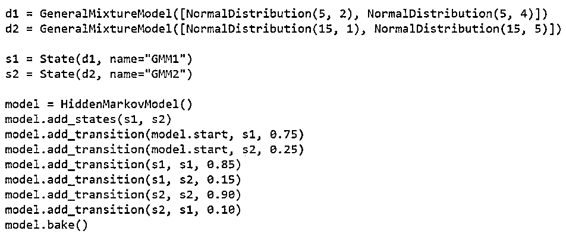

**HMM 比 hmmlearn 快**

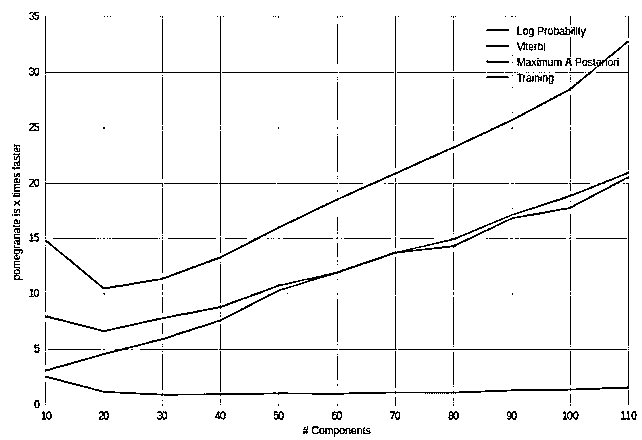

**The API**

**主要模型介绍**

*   一般混合模型

*   隐马尔可夫模型

*   **贝叶斯网络**

*   **贝叶斯分类器**

P(M|D)= P(D|M)P(M) / P(D)
Posterior = Likelihood * Prior / Normalization

**基于数据建立一个简单的分类器**

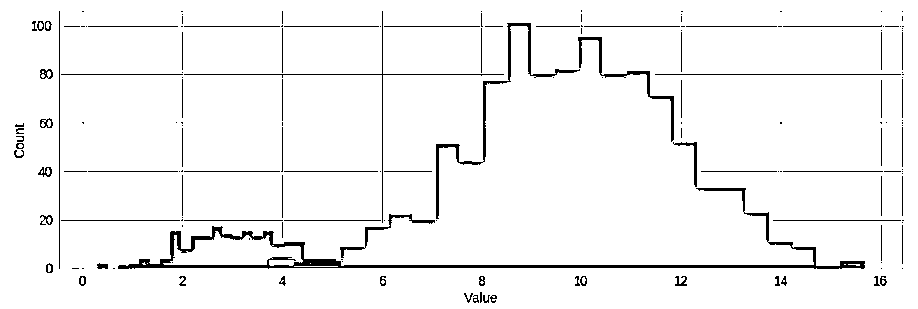

**似然函数本身忽略了类不平衡**

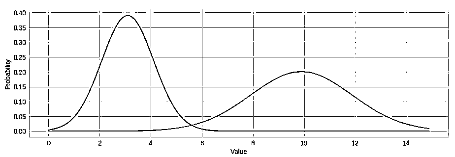

**先验概率可以模拟分类不平衡**

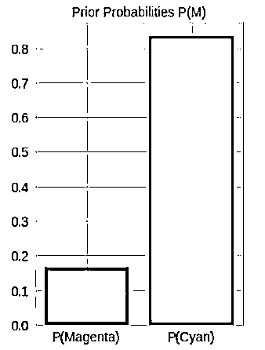

**后验模型更真实地对原始数据进行建模**

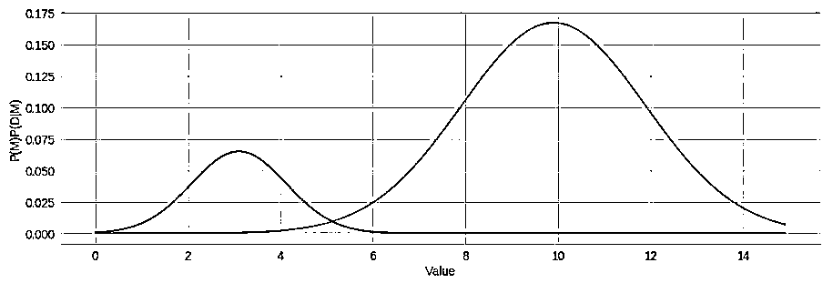

**后者的比例是一个很好的分类器**

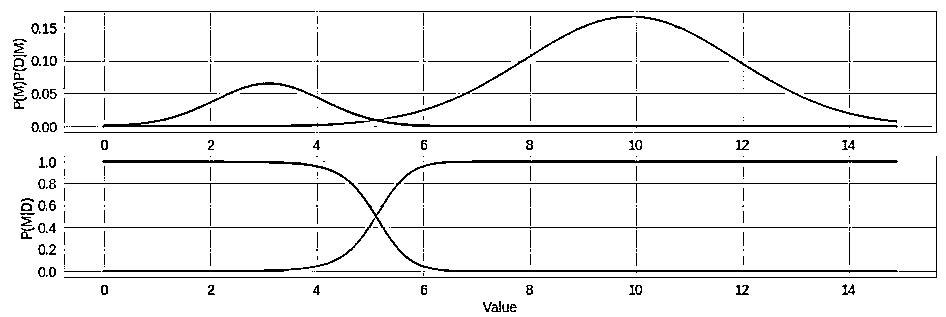

model = NaiveBayes.from_samples(NormalDistribution, X, y)
posteriors = model.predict_proba(idxs)

P(M|D)= ∏P(D|M) P(M) / P(D)
Posterior = Likelihood * Prior / Normalization

Naive Bayes does not need to be homogenous

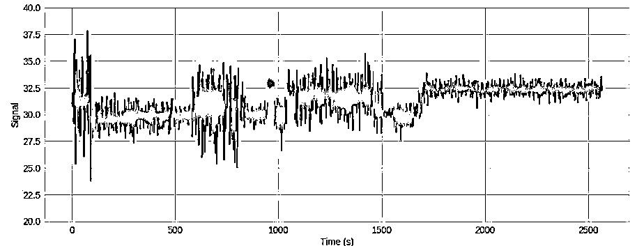

**不同的功能属于不同的分布**

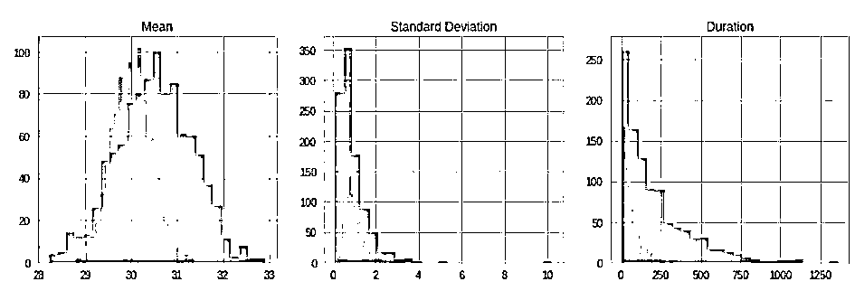

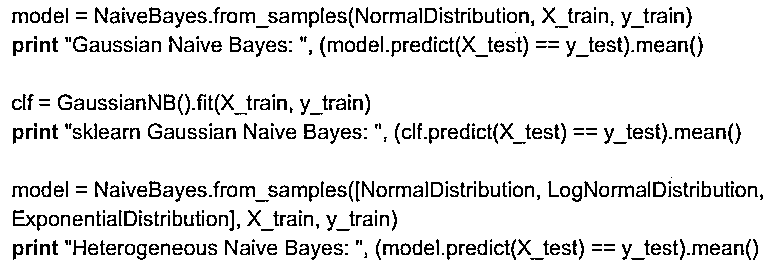

Gaussian Naive Bayes: 0.798
sklearn Gaussian Naive Bayes: 0.798
Heterogeneous Naive Bayes: 0.844

**与 sklearn 一样快**

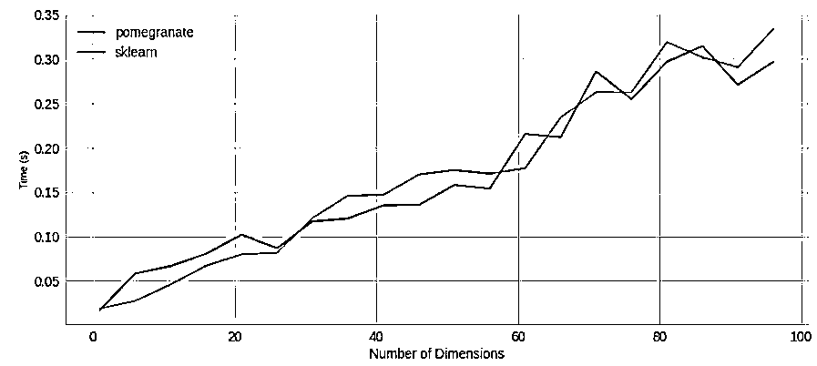

P(M|D)= P(D|M) P(M) / P(D)
Posterior = Likelihood * Prior / Normalization

mc_a = MarkovChain.from_samples(X[y == 0])
mc_b = MarkovChain.from_samples(X[y == 1])
model_b = BayesClassifier([mc_a, mc_b], weights=numpy.array([1-y.mean(), y.mean()]))

 hmm_a = HiddenMarkovModel…
hmm_b = HiddenMarkovModel...
model_b = BayesClassifier([hmm_a, hmm_b], weights=numpy.array([1-y.mean(), y.mean()]))

 bn_a = BayesianNetwork.from_samples(X[y == 0])
bn_b = BayesianNetwork.from_samples(X[y == 1])
model_b = BayesClassifier([bn_a, bn_b], weights=numpy.array([1-y.mean(), y.mean()]))

**并行**

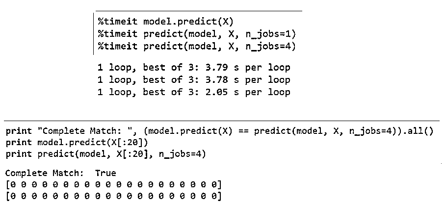

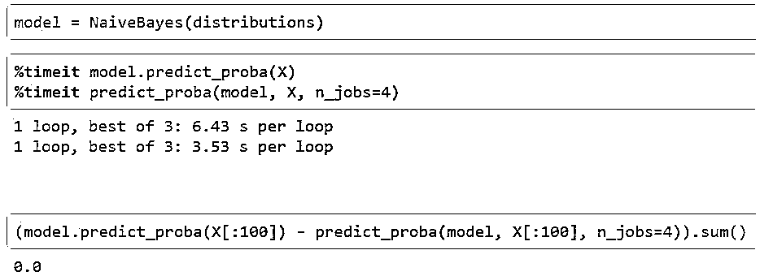

**关注者**

**从****1 到 10000+**

**我们每天都在进步**

