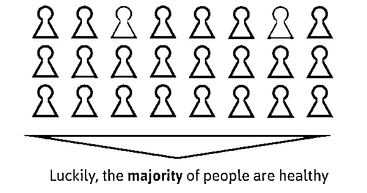

# 五个案例，三大心得，带你进阶深度学习实践应用之路

> 原文：[`mp.weixin.qq.com/s?__biz=MzAxNTc0Mjg0Mg==&mid=2653285715&idx=1&sn=823ab393ba0eac1d7b7d55e13850e9cb&chksm=802e2f46b759a650bcd1193445b948c13042b90704d614f4bdaca31bf74c947de201a27a46f5&scene=27#wechat_redirect`](http://mp.weixin.qq.com/s?__biz=MzAxNTc0Mjg0Mg==&mid=2653285715&idx=1&sn=823ab393ba0eac1d7b7d55e13850e9cb&chksm=802e2f46b759a650bcd1193445b948c13042b90704d614f4bdaca31bf74c947de201a27a46f5&scene=27#wechat_redirect)

**编辑部**

微信公众号

**关键字**全网搜索最新排名

**『量化投资』：排名第一**

**『量       化』：排名第一**

**『机器学习』：排名第四**

我们会再接再厉

成为全网**优质的**金融、技术类公众号

> 不谈理论，只谈实战。
> 
> 当我们需要用深度学习处理现实问题时，除了相关的技术和数据，你还需要掌握一系列的小诀窍，并将这些技巧用在级联模型、智能增强、合理的评价标准、建立可重用的训练管道、有效推断与减小模型大小等等方面。
> 
> 本文由深度学习的实践者，位于柏林的创业公司 Merantix 所著，五个案例，三大心得，带你在深度学习的应用之路上快速打怪升级。

近年来，人工智能正迅速崛起，这主要归功于深度学习的成功。

深度神经网络的突破来自三大因素的驱动：**海量的训练数据、性能强劲的计算架构，以及学术研究上的相关进展。**

正是因为这三大因素，深度学习系统在图像分类、面部识别等任务上，不仅表现开始优于各类经典方法，而且超过人类的水平。这一切，为那些用深度学习来解决实际问题的颠覆性新业务创造了无限可能。 

位于柏林的 Merantix，致力于研究这样的新型商业案例，目前这些案例是来自汽车、医疗、金融业和广告等行业。

<inherit style="max-width: 100%; box-sizing: border-box !important; word-wrap: break-word !important;"></inherit>

**学术世界往往不同于现实**

如今，神经网络的训练正变得前所未有地容易。但这并不是说，把指导教程的代码拿出来就能直接服务于应用。**值得注意的是，许多最为重要的使用诀窍极少在学术文献中被讨论，但它们对产品的成功至关重要。**

把深度学习用到实际问题中时会遇到很多麻烦（via:pinsdaddy.com）

因此，我认为领会这方面的技巧和诀窍，对于那些打算在实际业务中应用深度学习以的人会有所帮助。

**在本文中，我想分享的是三个比较关键的心得，它们在我们 Merantix 用深度学习解决实际问题的过程中起到了很大的作用：**

*   **心得 I：预训练的重要价值**

*   **心得 II：实际标注分配的注意事项**

*   **心得 III：理解黑箱模型**

一点声明：

*   本文中的方法并不代表全部，还有很多其他的重要诀窍。

*   一般来说，这里的心得不仅适用于深度学习，而且适用于其他的机器学习算法。

*   所有这些心得都不特别针对对某一行业。

*   本文所涉及的问题大多都适用于监督式学习。

本文基于我 5 月 10 日在柏林人工智能大会 Berlin.AI 上的演讲修改而成。

> 演讲 PPT
> 
> https://www.slideshare.net/RasmusRothe/3-learnings-from-applying-deep-learning-to-real-world-problems

**心得 I：预训练的重要价值**

在机器学习学术领域，人们并不关注数据集的获取。恰恰相反，为了比较深度学习与其他方法，并确保其中之一能够优于别的方法，标准做法是在某一标准数据集上，用相同的评价程序来衡量不同算法的性能。

然而，**在真实情境中，重要的不在于证明新算法在性能上超过老算法 1%，而在于构建出能准确解决目标任务的高性能系统。对所有机器学习系统来说，这一点就需要算法能够从中进行有效学习的标记训练****。**

不幸的是，就许多实际问题而言，获取到标注完备的训练数据成本十分高昂。为详尽说明这里的问题，我们来看两个案例：

**案例一、医学影像检测：**

如果要打造一个能在 CT 图像中检测人体淋巴结的系统，我们就需要有那些已经标注淋巴结的 CT 图像来进行训练。

而这是一项相当耗时的任务，因为 CT 图像是 3D 的，而需要从中标记出来的淋巴结结构又非常之小。

假定一位放射科医生的时薪是 100 美元，他每小时能认真标注好 4 张图，这就意味着标注一张图的成本是 25 美元，或说标注 10000 张图的成本是 25 万美元。

考虑到接近百分之百的更高诊断准确度，是需要有更多的医生来标注相同的图像才能确保的，针对该特定医学任务的训练数据获取成本，很容易就能超过 25 万美元。

**案例二、信用评分：**

如果要打造一个能对信用行为进行评分的系统，我们就需要知道哪些客户更有可能违约，这样我们才能对机器学习系统进行训练，以提前识别出这样的客户。问题在于，只有当违约发生时我们才能确定客户是不是真的违约。一个朴素的策略是给每个人发放贷款，比如说 1 万美元。但这意味着，每有一个人违约，我们都将损失 1 万美元。这就使得每个标注数据点的获取成本都非常昂贵。

显然，我们可以用一些窍门来降低这里的成本，但是总体来看，针对现实问题的注记数据获取成本都很昂贵。

**我们该如何来解决这一问题呢？**

*   **预训练**

预训练帮助（via:massivejoes.com）

**预训练的基本原理，是先用某相关领域的廉价大数据集或相同领域的噪声数据（noisy data）训练神经网络（或其他机器学习算法）。尽管这种方法不能直接解决原始问题，但它能使神经网络对于要预测的问题形成一个模糊的印象。****第二步，针对要解决的问题获取一个更小、更昂贵的数据集，并利用它来进一步优化神经网络的参数。**

其流程如下图所示：

<inherit style="max-width: 100%; box-sizing: border-box !important; word-wrap: break-word !important;"></inherit>

当数据集很难获取时：先在某相关领域的廉价大数据集上对神经网络进行预训练；而后，在标注准确的高价值数据集上对神经网络进行优化调整。同小数据集训练相比，该方法能使算法的性能得到很大的提升。

在优化调整时，类别数可能会发生改变：人们通常在类别数为 1000 的数据集（如 ImageNet）上预训练神经网络，然后根据所要解决的特定问题来对神经网络进行优化调整，这些问题的类别数可能不同。

这就意味着必须重新初始化最后一层网络。最后一层网络的学习速率通常会设置得高一点，因为它需要从零开始学习，而前面几层的学习速率设置则较低。对于像 ImageNet 这样的数据集来说，（最后全连接层的）特征学习非常通用，可直接用来处理其他计算机视觉问题。

**如何来获取预训练所需的数据？**

*   **预训练数据源**

1、预训练模型：网上有很多经过训练的模型。**首先要推荐的就是 Model Zoos****。**

Model Zoos 网站上发布有一系列不同的已训练模型，它们都已经过专家学者、公司机构与深度学习爱好者的训练。

可查看

> https://github.com/BVLC/caffe/wiki/Model-Zoo
> 
> https://github.com/fchollet/deep-learning-models
> 
> http://mxnet.io/model_zoo/

2、公共数据集**：**网上还有很多数据集。所以在自己动手采集数据前，要先检查网上是否已存在能够解决你手上问题的那些数据集。

可查看：

> http://www.cvpapers.com/datasets.html
> 
> https://github.com/caesar0301/awesome-public-datasets
> 
> https://archive.ics.uci.edu/ml/datasets.html

3、数据抓取**：**如果找不到公开的预训练模型或数据集，你可以用一种懒办法来生成数据集，无需你手动标记：做一个能自动从特定网站抓取标注数据的爬虫。这样你就能自动生成一个新的数据集。

<inherit style="max-width: 100%; box-sizing: border-box !important; word-wrap: break-word !important;"></inherit>

预训练数据源

*   **弱标注数据（Weakly labeled data）**

我们是在标注准确的数据上优化调整神经网络，因而在所谓的弱标注数据上进行预训练是可行的。

**弱标记数据是指标注不完全准确的数据（比如，90%的标注是正确的，剩下的 10%是错误的）****。**这种数据的优势是可以自动获取，无需人类手动进行标注。这与那些由人类手动标注每张图像的数据相比，在成本上较为低廉。

**举例来说****：**读博期间，我从维基百科和 IMDB 抓取了 500 张面部图像。结合个人档案的出生日期与照片标题所暗示的拍摄日期，我们就能为每张图像估算一个大致的年龄。注意，某些情况下，图像标题中的年份可能是错误的；或是照片显示有多人，但面部检测器所选择的人脸却是另一个人的。这样一来，我们就不能确保年龄标注在所有情况下都正确。但结果说明，相比只在准确标注的小型数据集上训练，在弱标注的大型数据集上进行预训练更有助于提升算法的性能。

同样的逻辑可以用在医学影像检测的问题上，**该问题要求，多位医生必须独立标注相同的图像，以确保百分之百的准确率。这样的数据集可用作优化调整。此外，采用仅由一人来做的弱标注，我们就能采集到一个更大的数据集。由此，我们不仅降低了标注的总成本，同时还仍能确保神经网络训练图像的多样性。**

总之，**提升性能并不总是意味着你要进行非常昂贵的手工标注，你还是能以免费或极低的成本来获取到一个标注数据集。**

**心得 II：实际标注分配的注意事项**

<inherit style="max-width: 100%; box-sizing: border-box !important; word-wrap: break-word !important;"></inherit>

实际分配（via:r4risk.com.au）

获得预训练和优化调整所需的数据后，我们就能进行下一步了——**开始训练神经网络。****这一环节上，学术研究与现实世界之间又大不相同。**

在学术研究中，数据集通常是平衡的。这就意味着，对于监督分类问题，每个类别的样本数大抵相同。

**下面是两个实例：**

MNIST 是一个非常有名的手写数字数据集，其中每个数字的样本数大致相等。

Food 101 是学术数据集的另一典型，其中每种食物类别（共 101 个）都准确包含 1000 张图像。

<inherit style="max-width: 100%; box-sizing: border-box !important; word-wrap: break-word !important;"></inherit>

<inherit style="max-width: 100%; box-sizing: border-box !important; word-wrap: break-word !important;"></inherit>

<inherit style="max-width: 100%; box-sizing: border-box !important; word-wrap: break-word !important;">MNIST<ununderline style="max-width: 100%; box-sizing: border-box !important; word-wrap: break-word !important;">和</ununderline>Food101<ununderline style="max-width: 100%; box-sizing: border-box !important; word-wrap: break-word !important;">都是平衡的数据集</ununderline></inherit>

*   **不平衡的标注分配**

我再一次用这两个现实案例来说明问题：

**医学影像检测**：医学影像训练的数据非常不平衡。大部分人都是健康的，只有一小部分的人患有某种疾病。

**信用评分：**事实上，大部分客户都会偿还贷款，只有 1–2%的客户会违约。

<inherit style="max-width: 100%; box-sizing: border-box !important; word-wrap: break-word !important;"></inherit>

<inherit style="max-width: 100%; box-sizing: border-box !important; word-wrap: break-word !important;"></inherit>

不平衡的实际标注分配

如上图所示，这两个实例中的标注分配很不平衡。这在绝大部分现实应用中都很典型。事实上，每个类别都是相同数量的样本才很罕见。

*   **误分类的不均衡成本**

**不幸的是，这种情况会变得更糟：在学术数据集中，各类别的误分类成本通常相同。但在现实应用中，情况却大为不同：**

**医学影像检测：**把健康的人误诊为病人还不是最糟的情况，只要医生能对诊断结果进行复查，并把健康的这个人找出来就可以了。但反过来，未能诊断出真正的病人而不提供给他任何治疗，则就非常危险了。

**信用评分：**拒绝向有能力偿还的客户发放贷款，意味着你只是损失一点利息。但如果向违约的客户发放贷款，你就要对全部的贷款损失负责了。

我们用下面的图表来说明问题：

<inherit style="max-width: 100%; box-sizing: border-box !important; word-wrap: break-word !important;"></inherit>

<inherit style="max-width: 100%; box-sizing: border-box !important; word-wrap: break-word !important;"></inherit>

现实应用中误分类的不均衡成本

**如何解决这一问题？**

意识到通常情况的类别与误分类成本的不均衡后，我们就必须想办法来解决问题。研究过这一课题的学术文献相当有限，但某些博客与 Stack Overflow 的社区问答往往能给我们一些启发。

**注意，****类别与误分类成本的不均衡是两个高度相关的问题，这就意味着，一部分样本几乎没有训练数据，从而使出错的几率更高、成本更昂贵。**

**我把有助于改进我们模型的稀有样本分类能力的方法分为四类：**

****1.更多数****据：针对稀有类别，显而易见的办法是收集更多数据。****

**对于医学影像检测案例，这就意味着要着重于收集患有某种目标疾病的病人的图像。**

**如果这种方法因成本过高而无法实现，我们还可以借助其他办法来获取训练数据，如前所述。注意，调整训练标注的分配必须要小心，因为这将影响模型预测推断结果的方式：如果增加训练数据集的病人数量，模型预测患病的频率也会更高。**

****

**收集稀有类别的更多数据。当训练期间的标注分配与推断结果不匹配时要当心。** 

****2.更改标注****

**如果无法获得稀有类别的更多数据，另一种方法是重新考虑分类方法。在实际应用中，可能并不需要区分疾病 A 与疾病 B，只要能识别出是这两者一就够了。这样的话，你就可以合并这两个类别。这在训练期间能够简化程序，即便搞混疾病 A 和疾病 B，也不会惩罚推断结果。**

**<inherit style="max-width: 100%; box-sizing: border-box !important; word-wrap: break-word !important;"></inherit>**

**在训练获评价期间合并两个或更多类别能够简化问题**

****3.采样****

**如果既无法获得更多数据也不能更改标注，那你就必须从原始数据下手了。如何能使该模型特别善于处理稀有类别？你只需要改变算法在训练过程中观察样本的方式。通常，样本的采样十分均匀。这就意味着训练过程中算法对每个样本的观察频率是相同的。**

**以下是几种不同的采样方法，可有助于改进模型对某些稀有类别的标注能力。**

*   ****忽略****

**忽略常见类别的部分样本可能是最简单的方法。当每个类别的样本数大体相近时，可使用这种方法。**

**<inherit style="max-width: 100%; box-sizing: border-box !important; word-wrap: break-word !important;"></inherit>**

*   ****过度采样或欠采样****

**过度采样是指算法学习稀有类别样本的频率较高，而欠采样则是相反的情况。**从算法角度看，这两种方法产生的都是相同的结果。相比前一种方法，这种方法的优势是不忽略任何样本。****

**<inherit style="max-width: 100%; box-sizing: border-box !important; word-wrap: break-word !important;"></inherit>**

*   ****消极采样****

**第三种采样方法有些复杂，但也最为有效。既不过度采样也非欠采样，我们有目的地选择样本。虽说常见类别的样本数更多，但我们最关心的还是最困难的那些样本，比如最有可能被错误分类的样本。这样，我们就可以在训练期间定期评价模型并研究样本，以识别出那些最有可能被错误分类的样本。这让我们可以明智地选出算法更常学习的样本。**

****

****4.给损失加权****

**通过应用这部分所阐述的 1–3 类方法，我们从数据角度考虑了能够改善类别分配的所有可能。因而，我们现在就可以把注意力转移到算法本身。幸运的是，通过一些方法，我们可以在训练期间让算法的注意力更多关注那些稀有的类别。一个非常直接的办法，是增加稀有类别样本的损失权重。**

****

**稀有类别的损失权重更大**

****心得 III：理解黑箱模型****

****

**黑箱模型（来源：《辛普森一家》）**

**正如前文对预训练的描述，学术研究最重要的目的是达到或超越当前最先进的性能，无论采用哪种模型。**但处理现实问题时，仅仅去设计性能最好的模型往往是不够的。****

**相反，更重要的是，能做到以下几点：**

*   ****能够理解模型为什么以及如何会作出错误的预测；****

*   ****能直观解释为什么当前模型的性能会比先前的更好；****

*   ******确保模型不被欺骗。******

******在深度神经网络出现前，大多数模型解释起来都较为容易。举例来说：******

*   ********线性模型**：线性模型或回归模型可以给出各特征和预测之间的直接关系，这使该模型的决策机制解释起来较为直白。******

*   ******决策树**：决策树的魅力在于，只要顺着逻辑树就能理解决策的形成过程。通常，根节点代表最为重要的特征。虽说随机决策树解释起来更为困难，但树形结构总体还是相对易懂的。****

****不幸的是，深度神经网络的决策机制就很难理解了。它们是高度非线性的，参数的数量轻轻松松就能上亿。让人很难用简单的方式能解释清深度神经网络的决策细节。****

****<inherit style="max-width: 100%; box-sizing: border-box !important; word-wrap: break-word !important;"></inherit>****

****对比图：经典机器学习 vs. 深度学习****

****随着深度学习迅速进入我们生活的方方面面——自动驾驶、医学诊断、制定金融决策等，如何解释这个黑箱就成为实际应用中一个很重要的挑战。大部分应用的直接成果能显著影响我们生命、财产与敏感信息。因此，算法的错误决策往往会伤财害命。****

****<inherit style="max-width: 100%; box-sizing: border-box !important; word-wrap: break-word !important;"></inherit>****

****<inherit style="max-width: 100%; box-sizing: border-box !important; word-wrap: break-word !important;"></inherit>****

****特斯拉汽车交通事故与一篇关于 AI 种族歧视的文章****

****不幸的是，这些失败可能并不仅仅是因为意外事故，还能由袭击者引发。为证实其中的相关性，研究者发现，只需在普通图像中添加简单的随机噪点，就能改变深度神经网络的分类结果，但人眼却并未看出图像的变化。同样，使用完全由人工生成的图像，深度神经网络仍能给出非常自信的预测结果。****

****<inherit style="max-width: 100%; box-sizing: border-box !important; word-wrap: break-word !important;"></inherit>****

****<inherit style="max-width: 100%; box-sizing: border-box !important; word-wrap: break-word !important;"></inherit>****

****在图像中加入少许随机噪点（左）或使用完全由人工生成的图像（右）都可以轻松骗过神经网络。****

****通常在现实中，你就想去弄清楚，为什么系统会无法作出它本应该作出的行为。****

****在 Merantix，我们在非常严肃地对待这些问题，并相信它们在未来会变得更加重要，因为越来越多的深度神经网络肯定会被用在至关重要的实际应用上。****

****最近，我们开源了一个名为 Picasso 深度学习可视化工具。由于经常要跟各种神经网络架构打交道，**我们开发 Picasso 的目的，就是为了让人能够更容易看到我们所有模型的视觉效果，因为这些模型早已被整合进我们的汽车产品——当遇到道路分叉或目标检测失败时能够解释具体的原因，广告产品——可以解释为什么某些创意能获得更高的点击率，医学成像产品——用以分析 CT 或 X 光照片的哪些区域出现异常。******

> ****https://medium.com/merantix/picasso-a-free-open-source-visualizer-for-cnns-d8ed3a35cfc5****
> 
> ****https://github.com/merantix/picasso****

****下图是开源可视化工具 Picasso 的一个预览****

********

****Picasso 可视化工具预览****

******总结******

****我在本文中分享了 Merantix 应用深度学习解决实际问题过程中的三项很重要的心得。我希望这些想法能为那些打算在实际业务中使用深度学习的人带来帮助。****

****正如本文开篇所描述的，用深度学习处理现实问题时，除了相关的技术和数据，你还需要很多其他的技巧、诀窍与心得（级联模型、智能增强、合理的评价标准、建立可重用的训练管道、有效推断与减小模型大小，等等）。****

******关注者******

******从****1 到 10000+******

******我们每天都在进步******

********