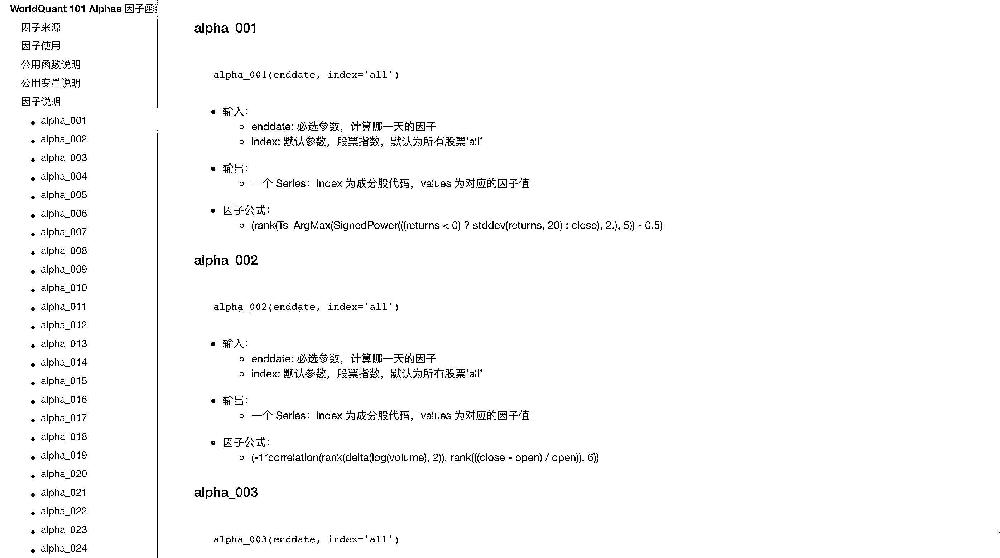
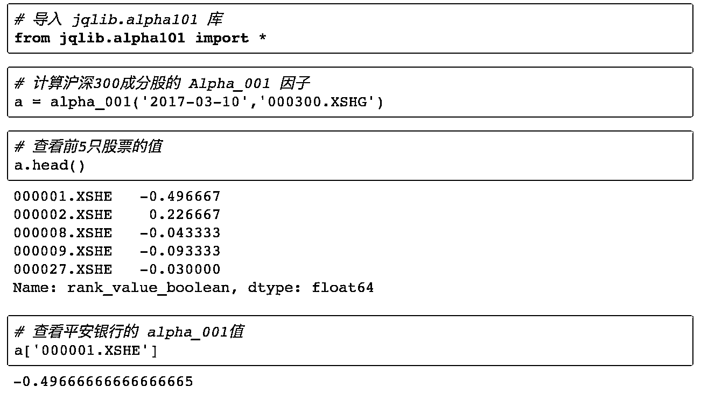
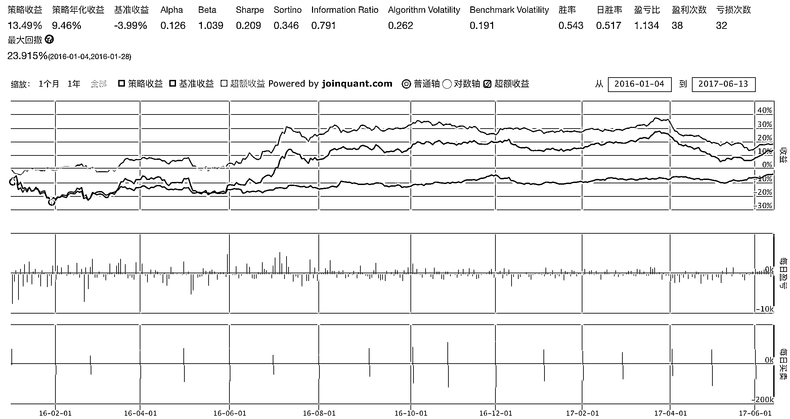
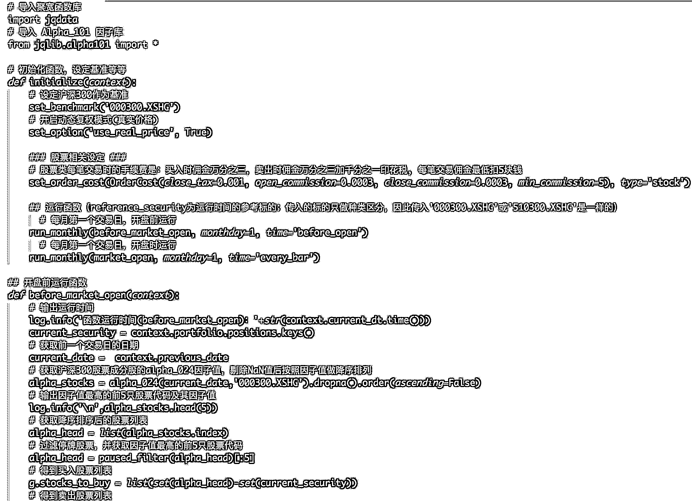
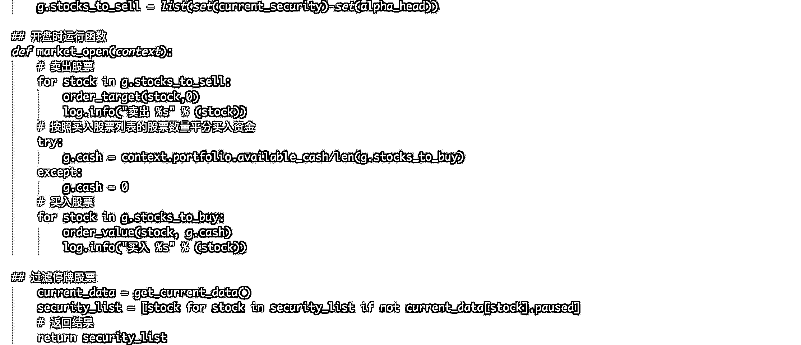

# 【独家编写】WorldQuant Alpha 101 因子

> 原文：[`mp.weixin.qq.com/s?__biz=MzAxNTc0Mjg0Mg==&mid=2653285712&idx=1&sn=953c7802b14bc811b64f750b6b58097b&chksm=802e2f45b759a6535fb4a149b2315148079dc7fbca4b2f0e5a4fd29c770eda3b0d1c80f0b7aa&scene=27#wechat_redirect`](http://mp.weixin.qq.com/s?__biz=MzAxNTc0Mjg0Mg==&mid=2653285712&idx=1&sn=953c7802b14bc811b64f750b6b58097b&chksm=802e2f45b759a6535fb4a149b2315148079dc7fbca4b2f0e5a4fd29c770eda3b0d1c80f0b7aa&scene=27#wechat_redirect)


**编辑部**

微信公众号

**关键字**全网搜索最新排名

**『量化投资』：排名第一**

**『量       化』：排名第一**

**『机器学习』：排名第四**

我们会再接再厉

成为全网**优质的**金融、技术类公众号

**说在前面的话**

**前言：**

聚宽（*www.joinquant.com*）实现 WorldQuant(世坤投资) 的 101 个 alpha 因子，初衷是想为大家提供更多的投资思路及可使用的数据。但至于这些因子如何使用能达到策略最佳收益，或者说这些因子是否适用于 A 股市场等问题，还需要大家自己去研究与钻研。

### **因子来源：**

根据 WorldQuant LLC 发表的论文 101 Formulaic Alphas 中给出的 101 个 Alphas 因子公式，我们将公式编写成了函数，方便大家使用。

**因为在国内在线平台上，聚宽是把 101alpha 因子写的最完整的一家。对我们进行有效的测试带来了很多方便和参考，但是因子的好坏是我们自己研究的课题！**

**因子文档：**



**具体因子操作展示：**



### 其余因子调用方式相同。

**查询函数说明：**

>>> alpha_101?

```py
Signature: alpha_101(enddate, index='all') Docstring: 公式：
((close - open) / ((high - low) + .001))

Inputs:
    enddate: 查询日期
    index: 股票池

Outputs:
    因子的值

File:/opt/conda/lib/python3.4/site-packages/jqlib/alpha101.py
Type:function
```

### **策略介绍：**

策略使用了 Alpha101 因子中的 alpha_024 因子。



**策略代码：**





**关注者**

**从****1 到 10000+**

**我们每天都在进步**


****快去测试啊！****