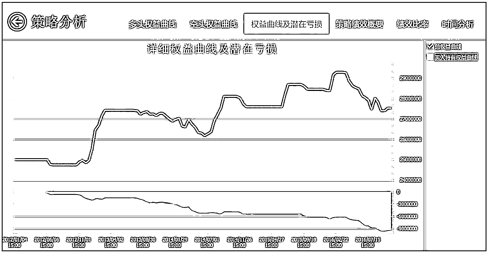
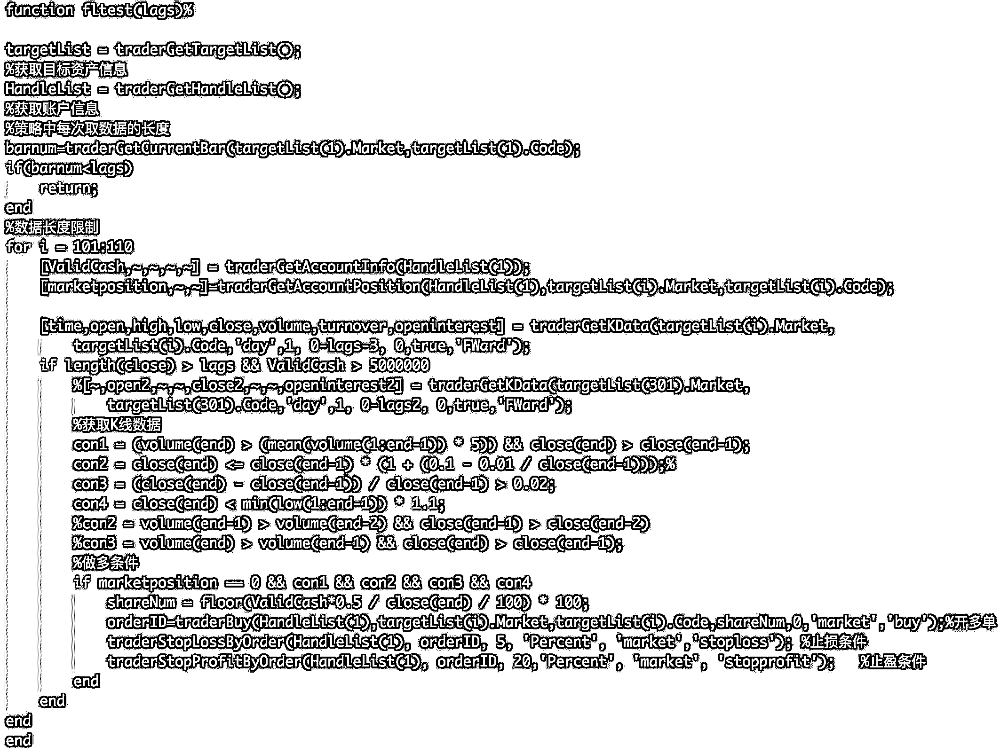
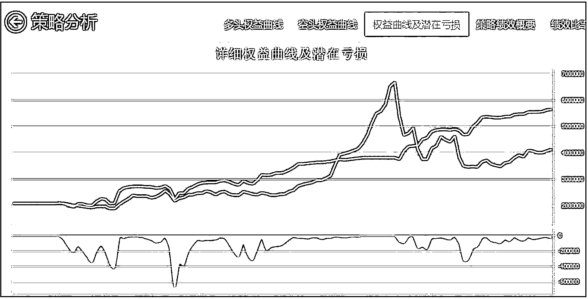
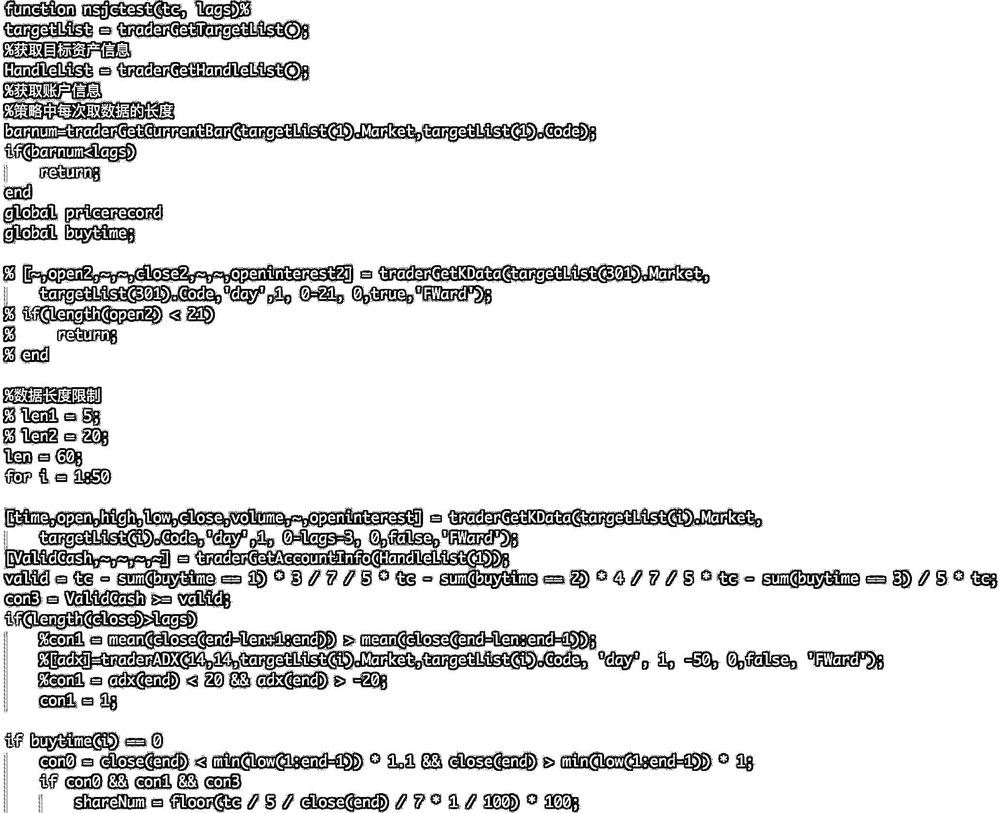
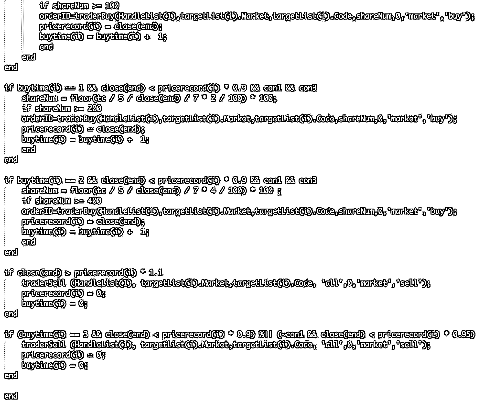
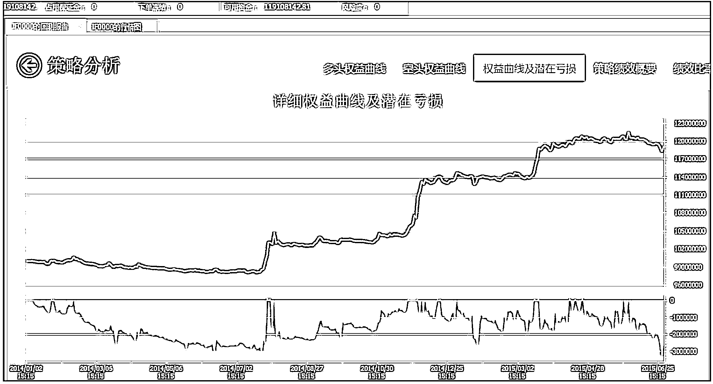
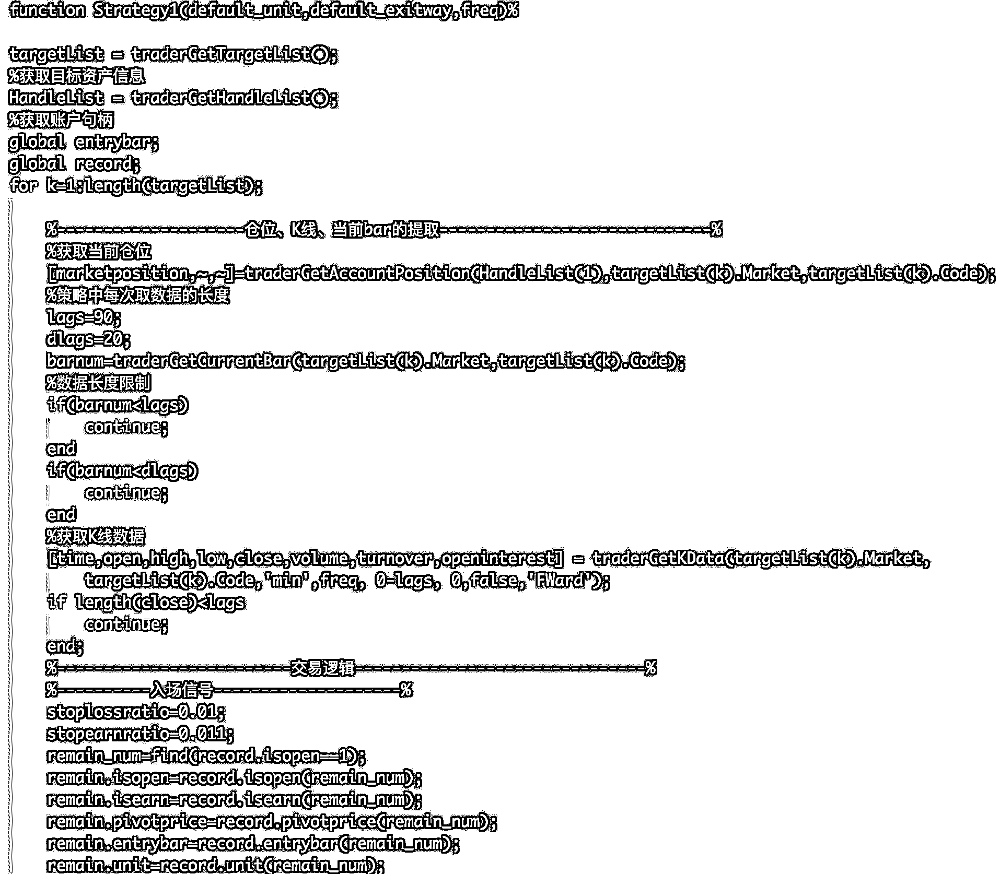
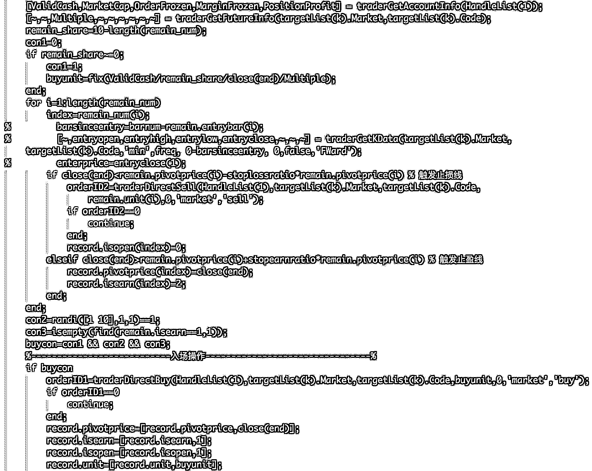

# 精选股票、期货量化投资策略系列（二）基于 AT 量能-MATLAB

> 原文：[`mp.weixin.qq.com/s?__biz=MzAxNTc0Mjg0Mg==&mid=2653285704&idx=1&sn=b013978089d22674b4f85267b2069816&chksm=802e2f5db759a64bdc40f23ccb6eb26a0366960543feebd2c3bd7a5741e119c4dcf16b5edb7d&scene=27#wechat_redirect`](http://mp.weixin.qq.com/s?__biz=MzAxNTc0Mjg0Mg==&mid=2653285704&idx=1&sn=b013978089d22674b4f85267b2069816&chksm=802e2f5db759a64bdc40f23ccb6eb26a0366960543feebd2c3bd7a5741e119c4dcf16b5edb7d&scene=27#wechat_redirect)

**编辑部**

微信公众号

**关键字**全网搜索最新排名

**『量化投资』：排名第一**

**『量       化』：排名第一**

**『机器学习』：排名第四**

我们会再接再厉

成为全网**优质的**金融、技术类公众号

> **本期 3 个 MATLAB 开发的策略筛选自点宽 digquant 量化社区**
> 
> **社区地址：www.digquant.com.cn**
> 
> **策略开发平台：Auto-Trader 量能策略研究平台**

**底部放量择时策略**

**选股标准**

沪深 300 成分股任选 100 只

**择时标准**

*   当前股价小于 100 交易日内最低价的 1.1 倍

*   当前成交量大于 100 日平均成交量的 5 倍，且当日上涨

**止盈止损**

*   止损：5%

*   止盈：20%

**择时原理**

*   股票处于底部有较高安全边际

*   放量预示着行情启动

**策略代码**

**逆势加仓策略**

**回测标的**

沪深 300

**回测区间**

2012 年 1 月 1 日至 2016 年 11 月 11 日

**选股**

选出当前处于 100 日低点的股票

**进场**

将资金等分为 5 份，将 1 份资金的 1/7 买入股票，当该股票下降 10%时，追加买入 1 份资金的 2/7。当股票再下降 10%，追加买入 1 份资金的 4/7。

**出场**

*   止损出场：第三次加仓后再下降 10%    

*   止盈出场：无论第几次加仓，只要上涨 10%，平仓止盈。

**策略代码**

**网格资金管理**

**策略原理**

将资金分为 N 份，采取随机抛点的形式入场，止损为 10%，止盈为 11%。如果该份资金获利超过 11%，则上移止盈止损线，且启动下一份资金抛点入场。

只有多头入场。

**策略代码**

本期量化策略，digquant 网站独家授权

**策略开发平台**：**AT 量能策略研究平台**基于 MATLAB，支持股票、期货、期权等全市场品种的策略研究和自动化交易，目前已经有超过 300 家高校的数学背景的学生、近万名专业量化用户。

**策略来源**：**点宽 DigQuant 量化社区**（www.digquant.com.cn）是国内首家基于 Matlab 的专业在线量化研究社区，为专业策略研究人员及量化爱好者提供 Auto-Trader 量能策略研究平台，30 多篇严谨的专业文章和超百个完全公开源代码的策略资源池。

本系列，策略每周更新，敬请期待！

- END -

**关注者**

**从****1 到 10000+**

**我们每天都在进步**

**下载策略：**

