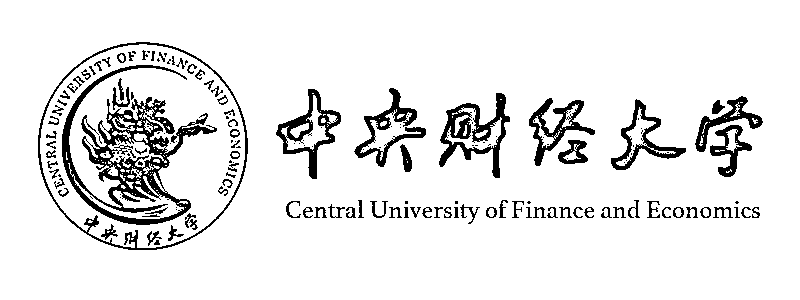

# 【致敬高考】那些开设『量化投资』专业的大学

> 原文：[`mp.weixin.qq.com/s?__biz=MzAxNTc0Mjg0Mg==&mid=2653285659&idx=1&sn=448bcb635bb45bd7aa3cd3ebaa54146b&chksm=802e2f0eb759a61836c12abc76b79df9a37916f6a29b2f61b50adfd43c6f1a99a94017f5d22e&scene=27#wechat_redirect`](http://mp.weixin.qq.com/s?__biz=MzAxNTc0Mjg0Mg==&mid=2653285659&idx=1&sn=448bcb635bb45bd7aa3cd3ebaa54146b&chksm=802e2f0eb759a61836c12abc76b79df9a37916f6a29b2f61b50adfd43c6f1a99a94017f5d22e&scene=27#wechat_redirect)

**编辑部**

微信公众号

**关键字**全网搜索最新排名

**『量化投资』：排名第一**

**『量       化』：排名第一**

**『机器学习』：排名第四**

我们会再接再厉

成为全网**优质的**金融、技术类公众号

**说在高考前面的话**

人生是一场马拉松，大多数人都会经历高考的洗礼，无论最终成绩如何，它能改变人生，但不会决定人生。

今天公众号编辑部特别统计了开设有**【量化投资】**专业课程大学的名单介绍。也许会有你的母校哦。

希望未来的你也许有一天，会在量化投资的道路上有属于自己的一片天地！

高考迷人之处

不在于如愿以偿

而在于阴差阳错

> **申明**
> 
> 我们只选取开设有【量化投资】专业关键字的院校，其他院校可能有类似专业，但是名称里不含有【量化投资】专业关键字，因此，对于一些声望很高的院校我们没有进行统计纳入，还望周知。

> **金融学院**
> 
> **专业**
> 
> 金融工程
> 
> **研究方向**
> 
> 量化投资
> 
> **初试考试科目**
> 
>   ① 101 思想政治理论
> 
>   ② 201 英语一
> 
>   ③ 303 数学三
> 
>   ④ 830 经济学综合（微、宏观及计量经济学）

> **金融学院**
> 
> **专业**
> 
> 金融
> 
> **研究方向**
> 
> 量化投资与证券管理
> 
> **初试考试科目**
> 
>   ① 101 思想政治理论
> 
>   ② 201 英语一
> 
>   ③ 396 经济类联考综合能力 
> 
>   ④ 431 金融学综合 
> 
> **复试考试科目**
> 
>   ① 国际金融学 
> 
>   ② 金融市场学
> 
>   ③ 商业银行经营管理
> 
>   ④ 金融工程

> **上海高级金融学院**
> 
> **专业**
> 
> 金融
> 
> **研究方向**
> 
> 量化投资策略
> 
> **初试考试科目**
> 
>   ① 101 思想政治理论
> 
>   ② 201 英语一
> 
>   ③ 303 数学三 
> 
>   ④ 431 金融学综合 
> 
> **复试**
> 
>   ① 采取差额复试，原则上按不低于 1：1.5 的比例确定复试人数
> 
>   ② 英语听力和口语测试在复试中进行，成绩计入复试成绩。

> ****汉青经济与金融高级研究院****
> 
> **专业**
> 
> 金融
> 
> **研究方向**
> 
> 量化投资策略分析
> 
> **申请条件**
> 
>   ① 全国重点大学本科三年级学生，专业不限。具有经济、金融方向浓厚兴趣和培养潜 力，具备一定的理工科或经济学、金融学基础
> 
>   ② 本科前 5 学期平均学分成绩排名应为本专业前 10%（对于在某一方面突出优势或者本科院校优秀生源集中的声请人，可放宽学分成绩排名要求）
> 
>   ③ 具有两名熟悉申请人情况的推荐人推荐（推荐人资格不限）
> 
>   ④ 具有良好的英语水平（六级成绩 450 分以上，或者提供其他证明英语能力烦人成绩证书，如 GRE、托福、GMAT）
> 
> **申请流程**
> 
> 
> 
> 本课程讲述在股票市场上量化投资分析的方法以及投资策略的开发。课程内容涵盖宏观 经济分析，行业分析，上市公司分析，技术分析，投资风险与收益评估，对冲基金投资策略，股票市场因子的建立, SAS 在投资当中的应用等。本课程将投资理论与实务相结合，并重点讲述量化投资在中国股票市场上的运用。本课程将运用多种教学手段，如案例分析、模拟投资比赛、实际公司财务与股票交易数据分析等，帮助学生建立量化投资分析和开发量化投资策略的能力。

> **金融学院**
> 
> **专业**
> 
> 金融
> 
> **研究方向**
> 
> 金融工程与量化投资
> 
> **初试考试科目**
> 
>   ① 101 思想政治理论
> 
>   ② 204 英语二
> 
>   ③ 301 数学
> 
>   ④ 431 金融学综合 
> 
> **复试考试科目**
> 
>    指定参考书目

> **金融学院**
> 
> **专业**
> 
> 金融
> 
> **研究方向**
> 
> 量化投资
> 
> **初试考试科目**
> 
>   ① 101 思想政治理论
> 
>   ② 201 英语一
> 
>   ③ 396 经济类联考综合能力 
> 
>   ④ 431 金融学综合（本校自行命题，所含内容 参见教育部考试中心公布的考试大纲）
> 
> **复试考试科目**
> 
> 二、题型及分值分布
> 
> 1. 通识题目（与专业无关），满分 60 分，选择 30 分作答
> 
> 2. 金融量化模型题目，满分 40 分，选择 20 分（2 题）作答
> 
> *   股票定价 2 题，每题 10 分
>     
>     
> *   衍生品 2 题，每题 10 分
>     
>     
> 
> 3. 数学与统计题目，满分 60 分，选择 30 分（2 题）作答
> 
> *   时间序列分析分析 1 题，每题 15 分
>     
>     
> *   运筹与优化 1 题，每题 15 分
>     
>     
> *   随机分析 1 题，每题 15 分
>     
>     
> *   数理统计 1 题，每题 15 分
>     
>     
> 
> 4. 编程题目，满分 40 分，选择 20 分作答
> 
> 共 4 题，每题 10 分，选择 2 题，可以选择自己熟悉的语言实现

> **金融学院**
> 
> **专业**
> 
> 金融
> 
> **研究方向**
> 
> 量化投资与程序化交易
> 
> **初试考试科目**
> 
>   ① 101 思想政治理论
> 
>   ② 201 英语一
> 
>   ③ 303 数学
> 
>   ④ 801 经济学
> 
> **复试考试科目**
> 
>   ① 货币银行学
> 
>   ② 证券投资学
> 
>   ③ 国际金融学
> 
> **专业**
> 
> 金融学工程
> 
> **研究方向**
> 
> 量化投资与互联网金融
> 
> **初试考试科目**
> 
>   ① 101 思想政治理论 
> 
>   ② 201 英语一
> 
>   ③ 303 数学
> 
>   ④ 801 经济学
> 
> **复试考试科目**
> 
>   ① 货币银行学
> 
>   ② 证券投资学
> 
>   ③ 金融工程学
> 
> **应用金融研究中心**
> 
> **专业**
> 
> 金融学
> 
> **研究方向**
> 
> 量化金融
> 
> **初试考试科目**
> 
>   ① 101 思想政治理论 
> 
>   ② 201 英语一
> 
>   ③ 303 数学
> 
>   ④ 801 经济学
> 
> **复试考试科目**
> 
>   ① 证券投资学 
> 
>   ② 金融经济学
> 
>   ③ 期权与期货市场基本原 理(原书第 7 版)

> **岭南学院**
> 
> **专业**
> 
> 金融
> 
> **研究方向**
> 
> 量化投资策略
> 
> **初试考试科目**
> 
>   ① 101 思想政治理论
> 
>   ② 204 英语二
> 
>   ③ 301 数学
> 
>   ④ 431 金融学综合 
> 
> **复试考试科目**
> 
>    ① 金融学综合 2

> **金融系**
> 
> **专业**
> 
> 应用经济学
> 
> **研究方向**
> 
> 金融危机、金融监管、套利、量化投资分析
> 
> **初试考试科目**
> 
>   ① 101 思想政治理论
> 
>   ② 201 英语一
> 
>   ③ 303 数学三
> 
>   ④ 848 管理学原理 或 849 经济学原理 或 850 运筹学 
> 
> **复试考试科目**
> 
>    依据校方考试大纲

**关注者**

**从****1 到 10000+**

**我们每天都在进步**

