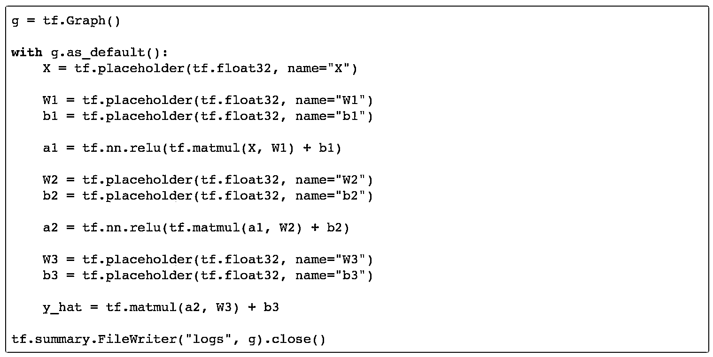

# 【精选】Jupyter Notebooks 里的 TensorFlow 图可视化

> 原文：[`mp.weixin.qq.com/s?__biz=MzAxNTc0Mjg0Mg==&mid=2653285644&idx=1&sn=01f59a3d43d7b8d7df96dd929b94f371&chksm=802e2f19b759a60fa6daf44300de9a8921b996bb57ad5e992aaaa431c288c0f3dd893a3929d6&scene=27#wechat_redirect`](http://mp.weixin.qq.com/s?__biz=MzAxNTc0Mjg0Mg==&mid=2653285644&idx=1&sn=01f59a3d43d7b8d7df96dd929b94f371&chksm=802e2f19b759a60fa6daf44300de9a8921b996bb57ad5e992aaaa431c288c0f3dd893a3929d6&scene=27#wechat_redirect)

**编辑部**

微信公众号

**关键字**全网搜索最新排名

**『量化投资』：排名第一**

**『量       化』：排名第一**

**『机器学习』：排名第四**

我们会再接再厉

成为全网**优质的**金融、技术类公众号

**前言**

***前提：****假设你熟悉 Python，TensorFlow 和 Jupyter notebooks。 我们的目标只是可视化计算图。*

TensorFlow 操作形成计算图。 而对于简单的例子，你可能可以查看代码，并立即看到发生了什么，较大的计算图可能不那么明显。 可视化图表可以帮助诊断计算本身的问题，也可以帮助了解 TensorFlow 中的某些操作是如何工作的以及事情如何组合在一起的。

让我们来看几种不同的可视化 TensorFlow 图形的例子，最重要的是，如何以一种非常简单和有效的方式来实现。

首先，让我们创建一个简单的 TensorFlow 图。 常规操作（如使用 tf.placeholder）会在所谓的默认图形中创建一个节点。 我们可以通过 tf.get_default_graph（）访问它，但是我们也可以临时更改它。 在下面的示例中，我们将创建一个 tf.Graph 对象的新实例，并创建一个添加两个变量的例子。

**c=a+b**

变量 g 现在包含操作 c = a + b 的计算图的定义。 我们可以使用 g.as_graph_def（）方法获取表达式的图形的文本表示。 虽然这主要用于通过 tf.import_graph_def 进行序列化和随后的反序列化，但我们将使用它来创建一个 GraphViz DOT graph。

让我们来看看 GraphDef 的简单表达。 首先，我们查看图中所有节点的名称。

结果有三个节点。 一个是每一个变量，另一个用于添加操作。 占位符变量节点有一个名称，因为我们在调用 tf.placeholder 时明确命名它们。 如果我们省略了 name 关键字参数，TensorFlow 将简单地生成一个名称，就像在 add 操作中一样。

接下来，我们可以看看图中的边。 每个 GraphDef 节点都有一个输入字段，指定具有边缘的节点。 让我们来看看：

我们可以看到，有两个边，每个变量一个。 我们可以直接将其直接提供给 GraphViz。

**构建 GraphViz DOTgraph**

GraphViz 是一个非常受欢迎的库，用于绘制图形，树形和其他图形数据结构。 我们将使用 Python GraphViz 软件包，它提供了一个很好的界面。 我们可以通过安装 graphviz 直接安装在 Jupyter notebooks 中。

图形定义本身将非常简单，我们将从 TensorFlow 本身的一个类似的代码（在 graph_to_dot.py 中）获得灵感，该代码生成给定 GraphDef 的 DOTgraph 文件格式。 不过，它只能作为命令行脚本使用，因此我们不能直接从我们的代码中调用它。 这就是为什么我们想自己来实现它，但不要担心，它只会是几行代码。

现在让我们将它打包成一个函数，并尝试在更复杂的表达式上使用它。

我们将建立另一个图，计算公式为π* r2 的圆的面积。

**使用本地 TensorBoard 实例可视化图形信**

GraphViz 对于可视化小图很适用，神经网络可以增长到相当大的大小。 TensorBoard 允许我们轻松地将的方程组分成有效范围，然后在结果图中将其视觉分离。 但是在这样做之前，让我们尝试用 TensorBoard 来显示我们之前的图形。

我们需要做的就是使用 tf.summary.FileWriter 来保存它，它使用一个目录和一个图形，并以 TensorBoard 可以读取的格式对图形进行序列化。 该目录可以是任何你想要的，只需确保您使用 tensorboard --logdir = DIR 命令（DIR 是您为 FileWriter 指定的目录）指向同一目录。

接下来，打开控制台并执行 FileWriter 命令在同一目录下，然后运行 tensorboard --logdir = logs。 这将启动一个 TensorBoard 的实例，你可以访问 http:// localhost:6006。 然后运行到图形部分，你应该会看到一个如下图所示的图形。 请注意，你也可以点击图形中的节点进一步检查。

幸运的是，TensorFlow 允许我们将操作连在一起，称为 scope。 但首先，让我们来看一个更复杂的例子，而不使用 scope。 我们将创建一个非常简单的前馈神经网络，具有三层（各自权重 W1，W2，W3，偏置 b1，b2，b3）。

我们可以通过使用上述的 tf.name_scope 函数来改善这一点。 让我们重写前馈网络代码，将每个层分成自己的 scope。

以下是结果图形，展示了整个网络的紧凑视图（左）以及展开其中一个节点时的外观（右）。

**使用云托管的 TensorBoard 实例来做 rendering**

我们将使用从 this StackOverflow answer 中获取的 DeepDream notebook 的修改的片段。 它基本上需要 tf.GraphDef，将其发送到云端，并将生成的可视化文件的<iframe>嵌入到 Jupyter notebooks。

这是它的整体片段。 所有你需要做的是调用 show_graph（），它将处理所有内容，如下面的例子，如上图 g 所示。 这种方法明显的优点是你不需要运行 TensorBoard 来可视化数据，但你也需要访问互联网。

**关注者**

**从****1 到 10000+**

**我们每天都在进步**

