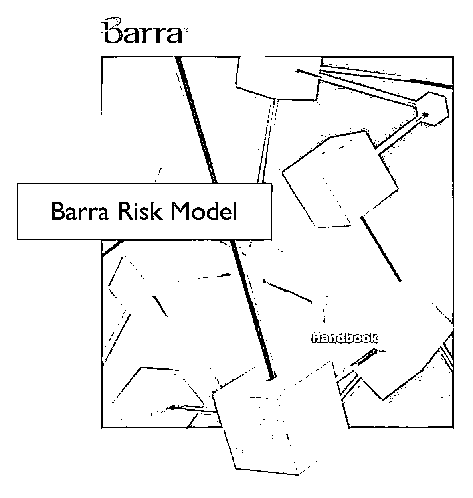

# 【独家】The Barra China Equity Model (CNE5)中文翻译版系列一

> 原文：[`mp.weixin.qq.com/s?__biz=MzAxNTc0Mjg0Mg==&mid=2653285619&idx=1&sn=2c2bc616b4289f5a5ea0ba7bd4a734ab&chksm=802e2ee6b759a7f07b738bc80f34e214fc8961aa8c9b924cc94f064d08fd61d32dc931d69d51&scene=27#wechat_redirect`](http://mp.weixin.qq.com/s?__biz=MzAxNTc0Mjg0Mg==&mid=2653285619&idx=1&sn=2c2bc616b4289f5a5ea0ba7bd4a734ab&chksm=802e2ee6b759a7f07b738bc80f34e214fc8961aa8c9b924cc94f064d08fd61d32dc931d69d51&scene=27#wechat_redirect)

**编辑部**

微信公众号

**关键字**全网搜索最新排名

**『量化投资』：排名第一**

**『量       化』：排名第一**

**『机器学习』：排名第四**

我们会再接再厉

成为全网**优质的**金融、技术类公众号

**新中国股票模型更好地捕捉到中国本土市场长短期趋势和变化，充分运用风险理论研究的最新成果，使机构投资者能够把风险模型完全融入到其投资过程之中。****改进的新一代模型能够真实地捕获中国股票市场的最新状况，通过丰富的因子结构把握市场特征，并提供相比上一代模型更强的模型解释力。**

**公众号觉得有必要详细、系统的翻译介绍基于 MSCI 在这方面的文献报告。以便大家更好的了解掌握。我们不知晓有没有其他自媒体做过这件事情，但是我们想做好这件事。**

我们尽最大可能表达原文所述，对于一些专业词汇，如有翻译错误，请在**留言区**提出，我们会进行更正。

**量化投资与机器学习****公众号**

**翻译部**

**模型介绍**

**1.1  模型亮点**

这篇报告主要提供实证结果和分析通过新一代 Barra 中国股票模型（CNE5）。其中包括更全面的内容在模型整体结构、表现和因子的解释力上。 此外，这篇报告还对 CNE5 模型与之前的 CHE2 模型在预测精度方面进行了完善的比较。CNE5 模型利用了与 Barra US Equity Model（USE4）相同的方法。

简单来说，主要内容如下：

● 优化偏差调整旨在通过减少采样误差对因子协方差矩阵的影响来改善优化投资组合要素的风险预测

● 波动状态调整旨在根据当前市场水平校准因子波动率和具体的风险预测

● 引入市场因素，将行业影响与整体市场分开，并及时提供相关性预测

● 一个新的特定风险模型基于每日特定的资产水平回报

● 贝叶斯调整技术，以减少由于抽样误差导致的特定风险偏差

● 统一的响应针对因子和特定组成部分，为投资组合风险的来源提供更大的稳定性

● 通过双盲开发过程对生产代码进行独立验证，以确保研究代码和生产代码之间的一致性和可靠性

● 模型每日进行更新

CNE5 模型包括：短期（CNE5S），长期（CNE5L）和每日（CNE5D）三个版本。这三个版本具有相同的因子暴露和因子回报，但其因子协方差矩阵和具体风险预测有所不同。 CNE5S 模型旨在更加灵活，并在每月提供更准确的预测信息。 CNE5L 模型旨在为长期投资者提供一定程度的准确性，以提高风险预测的稳定性。 CNE5D 模型提供为期一天的风险预测为所有投资者。

**模型亮点**

**2.1 优化偏差调节**

经 Muller(1993)实证检验，低估最优化结果的风险会导致风险模型的重大偏差。 近来，Shepard(2009)推导出一个偏差大小的分析结论，表明了预测的准确性会大幅下降当因子的数量增长超过用于估量协方差矩阵的时间段数。估测误差是导致这个偏差的主要原因。也就是说，虚假相关性会导致有些股票在样本内表现良好，样本外却不如人意。

识别投资组合上的一个重要创新在于抓取偏差并设计对应的程序在协方差矩阵内直接修正。Menchero, Wang, 以及 Orr (2011)表明，样本协方差矩阵中的特征因子偏差是系统性的。更具体地说，样本协方差矩阵趋向于低估低波动性因子的风险，又过度预估高波动性因子的风险。此外，减少特征因子的偏差有助于提升最优化结果的风险因素预测。

在 CNE5 模型的背景下，特征因子代表原始纯因子组合。这种组合是比较特殊的，因为它们互不相关。同时需要注意的是，特征因子的数量等同于模型内原始因子的数量。

如在 USE4 中指出，我们通过特卡洛模拟方法估测特征因子的偏差，进而调整预测的波动率，修正这些偏差。这个步骤有助于在因素协方差矩阵中进行直接修正，又充分保留了纯因子的意义和直观性。

**2.2 波动状态调整**

另一个风险模型的偏差的原因在于随着时间的推移，波动率一直在变化，即非定常性是一个重要的特征。由于风险模型必须解析过去预测未来，因此出现了在波动率上升时期容易低估风险，而在波动率下降时高估风险的趋势。

CNE5 另一个创新在于引进了波动机制调整以更好地预测因子的波动性。如在 USE4 中指出的波动价值调整有赖于横向统计偏差，即引入波动率状态调整（具有每日横截面波动率调整的功能），使得模型对于市场突发事件更为敏感。该方法于 2011 年推出并在 Barra 美国股票模型 USE4 中首先得到应用。

因子波动率具有不稳定性，特定风险也是如此。在 CNE5 模型中，我们将波动状态调整一样运用于特定风险。我们通过计算特定回报的横向统计偏差数据进行调整的评估。

**2.3 国家因素**

一般来说，单一国家模型（例如，CHE2）包括产业因素和风格因素，而没有国家因素。CNE5 模型一个重大的改进即是引进国家因素，类似于 Menchero, Morozov, 和 Shepard (2008, 2010)引进 GEM2 的世界因素。

引进国家因素一个明显的好处在于它所提供的洞悉和直觉。例如，在 USE4 中所讨论的。国家因素组合可以理解为国家投资组合的市值加权。此外，国家因素也从整体市场效应中脱离了纯粹的行业效应，从而为行业因素提供了更为清晰的解释。

没有国家因素，行业因素代表了特定行业的净权重为 100％的投资组合，其他行业的净重为零。 与国家因素相比，行业因素代表了一种以美元中性（dollar neutral 就是对美元是跌是涨的走势保持一个中性态度 - 看平，也就是说，既不看涨，也不看跌，持有这种态度只要在一定的小范围波动策略而获利。可以是见高峰就卖出而见低谷就买进。或者采取 Butterfly 期权交易方式。）的投资组合，该投资组合是 100%的行业和 100%的短期国家因素；也就是说，行业绩效是衡量市场的净价。

从归因角度来看，以美元中性行业要素组合很重要。例如，假设投资组合经理投资一个表现不佳市场的行业权重很大，但仍然有正回报。显然，过度加权一个表现不佳的行业会降低业绩。然而，如果行业因素是由净多头投资组合来代表的，那么一个归因分析就会虚假地显示，过度加权表现不佳的行业对业绩做出了积极的贡献。这种不直观的结果是通过引入国家因素来解决的，这使得行业因素投资组合与美元保持中立，从而产生了一种直观的结果，即过度加权一个表现不佳的行业会降低业绩。包括国家因素也解决了风险归因中的其他的问题，如 Davis 和 Menchero(2011 年)所述的。

国家因素的另一个好处是可以改善风险预测。凭直觉和经验，我们知道，在金融危机时期，行业往往会变得更紧密相关。正如 USE4 中所示，国家因素能够以更及时的方式捕捉行业相关性的变化。这一效应的基本机制是，净多头行业投资组合对国家因素有共同的影响，当国家因素的波动性在市场压力期间上升时，它解释了行业增长的相关性。

**2.4 贝叶斯调整的特殊风险模型**

CNE5 具体风险模型建立在由 Briner，Smith 和 Ward（2009）所描述的欧洲股票模型（EUE3）引入的方法学进展的基础上。EUE3 模型利用每日观察，直接从特定回报的时间序列中提供特定风险的及时估计。这种方法的一个重要好处是，每种股票都有单独的风险估计，从而反映了风险来源的特殊性。

纯时间序列方法的一个潜在缺点是，特定的波动性可能不会完全持续正如 USE4 方法所示，有时间序列波动性预测的趋势是过度预测高波动性股票的具体风险，并且低估了低波动性股票的风险。

为了减少这些偏差，我们应用贝叶斯调整技术。我们把股票根据它们的市值分成十类， 在每个分类内我们计算具体风险预测的平均值和标准差。然后我们将波动预测拉或“收缩”为大小十分位数内的平均值，收缩强度随着平均值的标准偏差数量而增加。

3、4、5 在下一期推送。

**预告**

**读书笔记**

**后半年不定期推送**

**关注者**

**从****1 到 10000+**

**我们每天都在进步**

