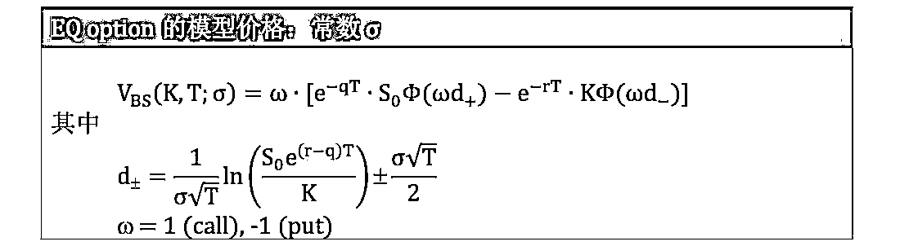
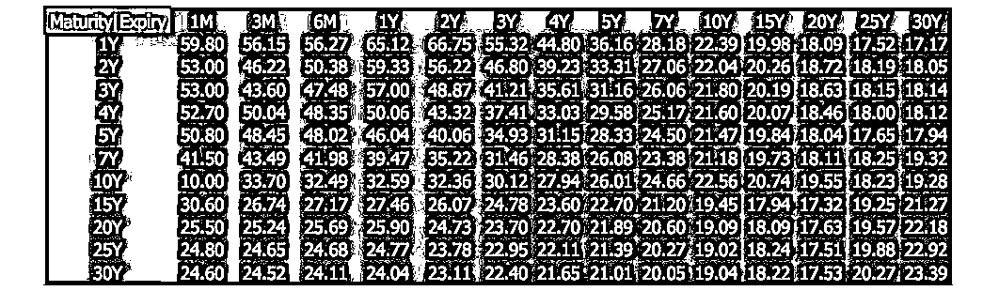
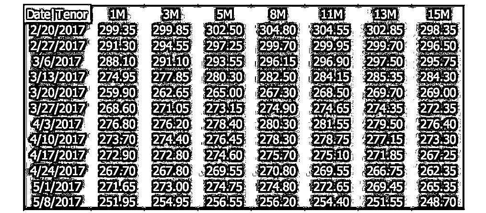

# 【重量级】模型校正在量化金融中的应用

> 原文：[`mp.weixin.qq.com/s?__biz=MzAxNTc0Mjg0Mg==&mid=2653285614&idx=1&sn=849a71582314edcd4f686e522ee62f9a&chksm=802e2efbb759a7ed5ca3455549a0c7ed6d5c05184d447061eb180ce8ae0c92b3757be7b1f1a0&scene=27#wechat_redirect`](http://mp.weixin.qq.com/s?__biz=MzAxNTc0Mjg0Mg==&mid=2653285614&idx=1&sn=849a71582314edcd4f686e522ee62f9a&chksm=802e2efbb759a7ed5ca3455549a0c7ed6d5c05184d447061eb180ce8ae0c92b3757be7b1f1a0&scene=27#wechat_redirect)

**编辑部**

微信公众号

**关键字**全网搜索最新排名

**『量化投资』：排名第一**

**『量       化』：排名第一**

**『机器学习』：排名第四**

我们会再接再厉

成为全网**优质的**金融、技术类公众号


**未经授权，禁止转载**

**违者追究法律责任**

**前言**

**由于这篇文章包含的信息量较多，再加上内容比较长，所以希望大家收藏后慢慢阅读和研究。**

**历时一个多月的劳动成果**

**希望你能从中有所收获**

斯蒂文管理着一个交易组合包含着各种资产类 (asset class) 的金融产品。

老板：有一百万欧元，欧元对美元 (EURUSD) 可能会涨，3 个月后 锁定一个汇率换成美元

斯蒂文：买 EURUSD 看涨期权 (call option)

老板：美元三个月同业拆放利率 (USD Libor3M) 可能会降，1 年后 锁定一个利率赚利差

斯蒂文：买 USD 利率下限 (IR floor)

老板：咖啡价格 3 个月可能会涨，抓住它的平均涨幅

斯蒂文：买咖啡亚式固定行权看涨期权(Asian fixed strike calloption)

老板：通用汽车 (GM) 在 1 年内可能会涨，但是一旦超过 38 就不 会跌破 30

斯蒂文；买 GM 向上敲出障碍看跌期权 (up-and-out put option)， 障碍价位 38，行权价为 30。 

要买这么多金融衍生品，以什么价格买?这可不是简单的折现现金流(discounted cash flow) 就可以算出来，都需要对其原生资产 (underlying asset) 价格进行建模。原因很简单，衍生品的价值是原生资产价格的函数。

• 外汇看涨期权的价值是汇率价格的函数 

• 利率下限的价值是利率价格的函数

• 商品亚式期权的价值是商品价格的函数 

• 股权障碍期权的价值是股票价格的函数

但是产品定价 (instrument pricing) 易，模型校正 (model calibration) 难， 因为

• 定价是个正问题，给定模型参数算出产品价格

• 校正是个反问题，给定产品价格反推模型参数 

为了让大家保持兴趣，现在来看看两个最简单的定价和校正：

1.  定价问题是 1 + 2 = 3，把加法看成是个“模型”，那么与之对应的校正问题就是 1 加上多少等于 3，校正 (用减法 3 - 1) 出来的结果是 2。

2.  定价问题是 sin(π/6) = 0.5，把正弦函数看成是个“模型”，那么与之对应的校正问题就是 sin 多少等于 0.5，校正 (用反正弦 argsin(0.5)) 出来的结果是π/6 。

虽然上面两例“校正”不难，但也比“定价”难吧。在量化金融中，用复杂模型的定价问题已经不易，那么相对应的校正问题更加困难，如：

定价问题是 BS(σ) = 1 美元，把 BS 看成是个模型，那么与之对应的校正问题就是多少波动率σ带入 BS 公式里得到期权价值 1 美元。

本推文就为大家展示各种资产类的常见模型的模型校正！里面画的图全是基于真实的市场数据，而作者也有一套系统的程序来实现各种模型校正。**出于里面有些技巧是公司或客户的私有财产和作者多年以来的心血，作者还是不发整套代码怕担当法律责任，但是有问必答！**

**前戏王**

**0.1 模型参数形式**

在金融模型中，时间 t 是个很重要的变量，而模型参数 c 通常认为和 t 有 关，写作 c(t)。在建模时，将 c(t) 的整个函数形式完全描述出来不容易也 不实际，通常把 c(t) 看成是常数形式和分段常数形式，如下图: 


给定时间结构 t0 < t1 < ... < ti-1 < ... < tn，常数和分段常数的表达形式如下表所示 


**0.2 随机微分方程**

随机微分方程 (SDE) 就是常微分方程 (ODE) 加个随机过程。在各种金融 衍生品模型中，其对应的原生资产都能用 SDE 来描述。比如股票类 Black-Scholes 模型，利率类 Hull-White 模型，商品类 Schwartz 模型和外 汇类 Heston 模型相对应的 SDE 如下：


我们可以不严谨把 SDE 当成模型，而里面红色项就是模型参数，这些参数都不是随意给定，而是从金融市场中“校正”出来的。

**股权类**

**1.1 Black-Scholes 模型**

**模型介绍**

股权类的 Black-Scholes (BS) 模型下的 SDE 是描述股票价格 (stock price) 的走势：


其中

S(t) = 股票价格

r(t) = 瞬时无风险利率

q(t) = 瞬时红利率

ς(t) = S(t)的瞬时波动率 

B(t) = 布朗运动

该模型是 Fischer Black 和 Myron Scholes 在 1973 年提出，其论文题目是 *The Pricing of Options and Corporate Liabilities*

**模型参数**

一般情况下

 r(t) 和 q(t) 当成常数

 ς( ) 可以是常数，但通常是分段常数 

它们的获取方式为

*   r：根据股票结算的货币，找到其掉期曲线，如美元对应 USD Libor 3M 曲线，欧元对应 EUR Euribor 6M 曲线等，在曲线上插出 T 点 的 r 值

*   q：根据该股票在估值日和到期日 T 之间的所有离散红利，折现到 0 点得到红利现值 div，再利用公式 div = e-qT 计算出 T 点的 q 值， q = -ln(div/T)

*    ς 或 ς( ) :从一系列股权欧式期权中校正出来

**1.2 市场标准产品和数据**

**产品定义**

股权类市场标准产品是“一系列不同行权价格 K 和不同年限 T 股权欧式 期权 (EQ option)”，定义如下:

在股权欧式期权 (equity vanilla option) 合约下，买方和卖方将同意以下内容：

*   买方付出期权金 (premium) 便有权利 (right)去行使，而卖方收取 期权金后则有义务 (obligation) 履行买方行使权利的义务。

*   看涨期权:买方有权在到期日以 K 买入 S，而卖方一旦被行使期权 时，则有责任以 K 卖出 S

*    看跌期权:买方有权在到期日以 K 卖出 S，而卖方一旦被行使期权 时，则有责任以 K 买入 S

其中 S 是到期日股权的价格，K 是执行价格 (strike price)。

**市场数据**

它们的成交价就是用于模型校正的市场数据，但市场惯例是用波动率当市 场数据，原因是价格在价内和价外是差别会很大，而波动率是一个没有单 位的量。某天的日经平均指数 (N225) 的真实数据如下:


上图数据又称 EQ option 波动率平面，它是二维数据结构

*    行对应的年限 (expiry)，期权年限从 1 个月到 5 年

*    列对应的行权价格 (strike)，注意第三列白色粗体 17450.77 是

*   ATM 行权价格，其对应的绿色粗体是 ATM 波动率

*    波动率与行权价格和年限有关，可写成 ς(K, T)

*    波动率单位是%，28.63 实际上指的是 28.63%

*    市场波动率带进 BS 公式得到期权的市场价格

**1.3 市场价格和模型价格**

**市场价格**


EQ option 市场价格是之后模型校正的基准 (benchmark)。关于 BS 模型的 EQ option 公式推导细节，可参考 *Options, Futures And Other Derivatives, 9th edition, Chapter15, Appendix.*

**模型价格**




当模型参数为 t 的函数时，关于 BS 模型的 EQ option 公式推导细节，可参考 *Volatility and Correlation, 2th edition, Chapter3.*

**1.4 模型校正**

在 EQ option 市场上，对每一个标准 K 有 n 个到期的 EQ option，到期日分别为

0 = T0 < T1 < ... < i < ... < n

而对于每一个 Ti，EQ option 的行权价格为 K1 ... j ... m。 接下来我们分别讨论当模型参数为常数和分段常数是的校正过程。

**常数型参数**

当参数为常数时，BS 模型校正本质上是找到“最优”ς，从而最小化一系列 EQ option 的市场价格和模型价格之间的差异，其目标函数为:


其中

*   Vmkt 是 EQ option 市场价格，惯例是用 BS 公式计算的

*   ςmkt(K, T) 是 EQ option 市场波动率，有 n 个 T 和 m 个 K

*   VBS 是 EQ option 模型价格

*   ς 是 BS 模型的模型参数

**分段常数型参数**

当参数为分段常数时，对每一个标准 K，市场上都有一系列 Ti 到期的 EQ option，由上面公式发现期权价格 V 是 ς2(t) 积分的函数，如下:


注意 ς0-i 是从 0 到 Ti 的波动率 ς(t )的均方根 (root-mean-square)，而它们可以直接反解 BS 公式得到。之后我们可以得到从 Ti 到 Ti+1


上面公式建立了即期波动率到远期波动率的关系，而这个关系通常称为方 差平衡条件 (balance-of-variance condition)。具体步骤如下:

**步骤 1** - 在每个 Kj 下的所有年限 T 上计算:即期方差 = ς2mkt*T


**步骤 2**- 用方差平衡条件从即期方差推出远期波动率，如下表所示


```py
#BS 模型校正代码 spot_var = spot_vol.*2.*Te
for i = 1 : size(spot_vol,2)
    fwd_Vol(:,i) = sqrt( diff([0; spot_var(:,i)]) ./ diff([0;Te]) )
end
```

在做模型校正的同时，一旦我们发现下面的关系，那么就有套利机会。


上式意思就是股票价格到 Ti+1 的不确定性比到 Ti 的不确定性还小，这显然违背常理。如果有这种机会出现，买 Ti+1 到期的便宜期权，卖 Ti 到期 的昂贵期权。

**1.5 校正结果**

下图展示着 N225 option 的市场价格 (红圈) 和模型价格 (蓝线)，发现它们在不同 K 和 T 时都高度吻合。


下图展示着在不同 K 下的分段常数 ς( )，基本上 ς( ) 是 t 的增函数，走 势正常。


**利率类**

**2.1 Hull-White 模型**

**模型介绍**

利率类的 Hull-White (HW) 模型下的 SDE 是描述短期利率 (short rate) 的走势:


其中

*   r(t) = 短期利率

*   k( )=r(t)的均值回归速率

*   ς( )=r(t)的均值

*   6(t)= r(t)的波动率

*   B(t) = 布朗运动

该模型是 John Hull 和 Alan White 在 1990 年提出，其论文题目是

*Pricing Interest-Rate Derivative Securities*

**模型参数**

一般情况下

*   k (t) 当成常数

*    6(t) 可以是常数，但通常是分段常数 

*   ς(t )是 t 的函数

它们的获取方式为

*   k：根据历史数据人为设定，也可以从一系列利率期权中校正出来 

*   6 或 6(t)：从一系列利率期权中校正出来

*   ς( )：从收益率曲线中校正出来


其中 f(0, t)是 0 点观察到的 t 点瞬时远期利率

为了消除 ( ) 这个复杂项，令 x(t) = r(t) – f(0, t)，那么 x(0) = r(0) –f(0,0) = 0。原来 r(t) 的 SDE 转换成 x(t) 的 SDE:


这样在 HW 模型下的零息债券的公式如下:


关于上面 ( ) 和 P(t, T) 推导细节，可以参考 *Interest Rate Modeling Volumn II, Term Structure Model, Chapter 10, 10.1.2.2.*

**2.2 市场标准产品和数据**

**产品定义**

利率类市场标准产品包括:

1\. 一系列不同行权价格 K 和不同年限 T 利率上限 (cap)

2\. 一系列不同行权价格 K，不同期权年限 TO 和不同掉期年限 TU 利率

掉期期权 (swaption) Cap 和 swaption 定义如下:

Cap 和 swaption 定义如下:

在利率上限或下限 (interest rate cap/floor) 合约下，买方和卖方将同意以 下内容:

*    买方付出期权金 (premium) 便有权利 (right) 去行使，而卖方收取期权金后则有义务 (obligation) 履行买方行使权利的义务。

*    双方就未来某一时期商定一个固定利率 K 作为利率上限/下限

*   上限：买方有权利在每期获得市场利率 L 与上限利率 K 的差额 (L – K)，而卖方一旦被行使期权时，则有义务将市场利率 L 与上限利率 K 的差额支付给买方

*   下限：买方有权利在每期获得下限利率 K 和市场利率 L 的差额 (K – L)，而卖方一旦被行使期权时，则有义务将下限利率 K 和市场利率 L 的差额支付给买方

其中 L 通常是 LIBOR，但是不是当期定盘，而是上一期定盘的 LIBOR。

市场上流动性强的 cap 以美元、欧元和日元计价，每个 cap 都一连串 caplet 组成

*    USD cap 每年由 4 个 caplet 组成，每个 caplet 期限是 3 个月，以 USD LIBOR 3M 作标的利率

*    EUR cap 每年由 2 个 caplet 组成，每个 caplet 期限是 6 个月，以 EUR EURIBOR 6M 作标的利率

*    JPY cap 每年由 2 个 caplet 组成，每个 caplet 期限是 6 个月，以 JPY LIBOR 6M 作标的利率

在利率掉期期权 (interest rate swaption) 合约下，买方和卖方将同意以下 内容:

*    买方付出期权金 (premium) 便有权利 (right) 去行使，而卖方收取 期权金后则有义务 (obligation) 履行买方行使权利的义务。

*    支付类掉期期权 (payer swaption):买方有权利在期权到期日获得 一个“支付固定利率接受浮动利率 (pay fixed receive floating) 的利率 掉期”，而卖方一旦被行使期权时，则有义务将上述利率掉期给买 方

*    接受类掉期期权 (payer swaption):买方有权利在期权到期日获得一个“接受固定利率支付浮动利率 (receive fixed pay floating) 的利率 掉期”，而卖方一旦被行使期权时，则有义务将上述利率掉期给买 方

其中利率掉期 (interest rate swap, IRS) 是指交易双方以一定的名义本金为 基础，将该本金产生的一种利率计算的利息收入 (支出) 与另一种利率计 算的利息收入 (支出)。交换的只是不同特征的利息，没有实质本金的互 换。

市场上流动性强的以美元、欧元和日元计价的 swaption。其实 swaption 波动率是一个立方 (cube)，有行权利率、期权到期日、掉期到期日这三 个维度。通常我们用的最多的是 ATM swaption 波动率，当行权利率等于 远期掉期率，那么波动率立方降维成一个波动率平面，维度为二维。

**市场数据**

某天的 JPY cap 的真实数据如下:


上图数据又称 cap 波动率平面，它是二维数据结构

*    行对应的年限 (expiry)，期权年限从 1 年到 20 年

*    列对应的行权利率 (strike rate)，注意第一列绿色粗体是 ATM 波动率，而每个年限对应的 ATM 行权利率都不同

*    波动率与行权价格和年限有关，可写成 ς(K, T)

*    波动率单位是 %，43.01 实际上指的是 43.01%

*   市场波动率带进 Black 公式得到利率上限的市场价格

某天的 USD ATM swaption 的真实数据如下:



上图数据又称 ATM swaption 波动率平面，它是二维数据结构

*    行对应的利率掉期的年限 (maturity)，年限从 1 年到 30 年

*    列对应的掉期期权的年限 (expiry)，年限从 1 个月到 30 年

*    ATM 波动率与期权年限和掉期年限有关，可写成 ς(TO, TU)

*    波动率单位是%，59.80 实际上指的是 59.80%

*   市场波动率带进 Black 公式得到掉期期权的市场价格

**2.3 市场价格和模型价格**

定义 T0 <T1 <...< k <...< N 是 cap 的年限结构，那么定义

{T0, T1, ..., TN-1} = LIBOR 定盘日 

{T1, T2, ..., TN} = 支付日

N = caplet 的个数

τk =Tk–Tk-1

**Cap 市场价格**

Cap 市场价格是之后模型校正的基准 (benchmark)。关于 Black 模型的 cap 推导细节，可以参考 *Interest Rate Model – Theory and Practice, Chapter 1 and Appendix D.*


**Cap 模型价格**


当模型参数为常数时，关于 HW 模型的 cap 推导细节，可以参考 *Interest Rate Model – Theory and Practice, Chapter 3.*

```py
function price = HW_IRO( omega, Ds, De, Ts, Te, tau, K, kappa, sigma )
 X = 1 + K*tau; price = X .* HW_ZBO( -omega, Ts, Te, Ds, De, 1./X, kappa, sigma );
end  --------------------------------------  function price = HW_ZBO( omega, T1, T2, PT1, PT2, X, kappa, sigma ) tau = T2 - T1;
 if kappa < 1e-12    
 sigmaP = sigma * tau .* sqrt(T1);
else sigmaP = sigma * sqrt((1-exp(-2*kappa*T1))/2/kappa) /kappa .* (1- exp(-kappa*tau));
end

h1 = (1./sigmaP) .* log(PT2./(PT1.*X)) + sigmaP/2;
h2 = h1 - sigmaPprice = omega * ( PT2.*normcdf(omega*h1) - X.*PT1.*normcdf(omega*h2) ) end
```


**Swaption 市场价格**

定义 T0 <T1 <...< k <...< N 是 swaption 的年限结构，那么定义

*   T0 = swaption 到期日 

*   TN = swap 到期日

*   τk =Tk–Tk-1


Swaption 市场价格是之后模型校正的基准 (benchmark)。关于 Black 模 型的 Swaption 推导细节，可以参考 *Interest Rate Model – Theory and Practice, Chapter 1 and Appendix D.*

**Swaption 模型价格**

Swaption 可看成在期权到期日 T1 时交换 IRS 的固定端和浮动端，因此它在 T1 的支付函数为


由小节 2.1 可知 P(t, T;x)是 x 的减函数，因此定义一个临界值 x* 使得


其中


根据 Jamshidian Trick，swaption 只有在 w x(T1) > * 时才有 payout， 为了简化符号引进 P1,k(x) = P(T1,Tk, x)，我们有


最后 swaption 在 T1 的 payout 可表示为一系列的零息债券期权 (zero- coupon bond option, ZBO) 在的 payout，因此其价值为这些 ZBO 的价值 的组合。


```py
#计算 HW Swaption 代码 function price = HW_Swaption( D, Tvec, tau, c, kappa, sigma ) Pt = D(1); PT = D(2:end); t = Tvec(1); T = Tvec(2:end);
x_star = fzero( @(x) Jamshidian( Pt, PT, kappa, sigma, t, T, c, tau, x ), 0 );
K = HW_zcb( Pt, PT, kappa, sigma, t, T, x_star )';
 price = HW_ZBO( -1, t, T(end), Pt, PT(end), K(end), kappa, sigma ) ... + c*sum( tau.*HW_ZBO( -1, t, T, Pt, PT, K, kappa, sigma ) );
end
```

```py
function y = Jamshidian( Pt, PT, kappa, sigma, t, T, c, tau, x ) y = HW_zcb(Pt, PT(end), kappa, sigma, t, T(end), x) ...
+ c*sum( tau.*HW_zcb(Pt, PT, kappa, sigma, t, T, x)' ) - 1; end -------------------------------------- function PtT = HW_zcb( Pt, PT, kappa, sigma, t, T, Xt ) 
G = 1-exp(-kappa*(T-t))) / kappa; y = sigma² * (1-exp(-2*kappa*t)) / (2*kappa)
PtT = (PT/Pt) * exp( -Xt*G -0.5*y*G² );
end
```


关于 HW 模型的 swaption 推导细节，可以参考 *Interest Rate Modeling – Volumn II, Term Structure Model, Chapter 10, 10.1.3.*

**2.4 模型校正 (cap)**

在 cap 市场上，对每一个标准 K 有 n 个到期的 cap，到期日分别为

0 = T0 < T1 < ... < i < ... < n

而对于每一个 Ti，cap 的行权价格为 K1 ... j ... m。 接下来我们分别讨论当模型参数为常数和分段常数是的校正过程。

**常数型参数**

当参数为常数时，HW 模型校正本质上是找到“最优” 和 ς，从而最小 化一系列 cap 的市场价格和模型价格之间的差异，其目标函数为:


其中

*   Cap 是市场价格，惯例是用 Black 公式计算的

*   ςmkt(K, T) 是市场波动率，有 n 个 T 和 m 个 K

*   CapHW 是模型价格

*   k 和 ς 是 HW 模型的模型参数

**分段常数型参数**

从小节 2.3 的公式出发，

*    用上标 i 表示每一个 K 下的第 i 个 cap

*    用 Ni 表示该 cap 里面 caplet 的个数

*    用 tNi 代表第 i 个 cap 到期日，tNi =Ti


当参数为分段常数时，假设选取 ATM cap 做校正，那么 HW 模型校正的 步骤为:

步骤 1 - 参数 根据历史数据手动输入，或者用常数形式的 HW 模型校 正得出

步骤 2 - 对第 1 个 cap，反解 ς1 使得 Capmkt(T1) = Cap1HW(ς1)

步骤 3 - 对第 2 个 cap，已知 ς1，反解 ς2 使得 Capmkt(T2) = Cap2HW(ς1,ς2)

步骤 4 - 重复上面过程到第 n 个 cap，已知 ς1, ς2 ... ςn-1，反解 ςn 使得 Capmkt(Tn) = CapnHW(ς1,ς2 ... ςn-1,ςn)

```py
%HW 模型校正代码 sigma = zeros(num_of_T,1);
for i = 1 : num_of_T,
    [ itau, iTs, iTe, iDs, iDe ] = reference( (1:nFlt(i)-1), tau, Ts, Te, Ds, De );
 sigma(i) = fzero(@(x) Cap_diff( iDs, iDe, iTs, iTe, itau, K(i), kappa, x, mkt_price(i) ), 0.005 );
end
```

以上过程把 1 个 n 维的优化问题转成 n 个 1 维的优化问题，增加了模型 校正的效率。需要注意的是，上述步骤并不是每次都行得通，这种情况称 为“波动率紧缩 (volatility squeeze)”，出现在当 Ti+1 到期的 cap 比 Ti 到期的 cap 价格小很多的时候。这种情况很少见，一旦出现可以当成是套 利的信号。

**2.5 模型校正 (swaption)**

在 ATM swaption 市场上，在以下的年限结构上考虑一串特殊的 swaption

0 = T0 < T1 < ... < i < ... < n

此类 swaption 的 option 到期日为 Ti, ... -1，而它们的 swap 到 期日都是 Tn，这样的 swaption 成为 coterminal swaption，记作 aYbY， 指的是 a 年 option 到期可以换一个 b 年 swap 的 swaption。

由于此类结构和市场交易的百慕大期权 (Bermudan swaption) 很类似，因 此 coterminal swaption 经常被当作校正工具来使用。

接下来我们分别讨论当模型参数为常数和分段常数是的校正过程。

**常数型参数**

当参数为常数时，HW 模型校正本质上是找到“最优” 和 ς，从而最小 化一系列 coterminal swaption 的市场价格和模型价格之间的差异，其目 标函数为:


其中

*   Swaption 是市场价格，惯例是用 Black 公式计算的 

*   ςmkt(K, T) 是市场波动率，有 n 个 T 和 m 个 K 

*   Swaption HW 是模型价格

*   k 和 ς 是 HW 模型的模型参数 

**分段常数型参数**


当参数为分段常数时，选取 ATM coterminal swaption 做校正，那么 HW 模型校正的步骤为:

步骤 1 - 参数 根据历史数据手动输入，或者用常数形式的 HW 模型校 正而得

步骤 2 - 对第 1 个 swaption，反解 ς1 使得 swaptionmkt(T1) = swaption1HW(ς1)

步骤 3 - 对第 2 个 swaption，已知 ς1，反解 ς2 使得 swaptionmkt(T2) = swaption2HW(ς1,ς2)

步骤 4 - 重复上面过程到第 n-1 个 swaption，已知 ς1, ς2 ... ςn-2，反解 ςn- 1 使得 swaptionmkt(Tn-1) = swaptionn-1HW(ς1,ς2 ... ςn-2,ςn-1)

```py
#HW 模型校正代码 sigma = zeros(num_of_T,1);
for i = 1 : num_of_T,
 T = getTenor( settle, fixedLegDate{i}, 'act/365' );
    D = getDiscount( settle, spotDate, fixedLegDate{i}, LiborCurve ); 
    [ iT, iD ] = reference( 1:nFix(i), T, D );
    sigma(i) = fzero(@(x) Swaption_diff( iD, iT, fixtau{i,i}, K(i),
kappa, x, mkt_price(i) ), 0.005 );     
end
```

和 cap 校正是遇到的问题一样，波动率紧缩也是 swaption 的校正可能出 现的问题。该情况出现在当 Ti+1 到期的 swaption 比 Ti 到期的 swaption 价格小很多的时候。这种情况很少见，一旦出现可以当成是套利的信号。

**2.6 校正结果**

下图展示着当 和 ς 为常数时，USD ATM cap 的市场价格 (红圈) 和模型 价格 (蓝线)，发现它们在不同 T 时结果相近但不完全吻合，原因是 2 个 未知量来拟合 13 个 cap，只能平均接近不能各个匹配。


下图展示着当 为已设好的 0.01 和 ς(t) 为分段常数时，USD ATM cap 的 市场价格 (红圈) 和模型价格 (蓝线)，发现它们在不同 T 时完全吻合，原 因是当 已知，每个 cap 和 ς 是一一对应关系。


下图展示着当 和 ς 为常数时，USD ATM coterminal swaption 的市场价 格 (红圈) 和模型价格 (蓝线)，发现它们在短期 T 时结果相近但长期 T 相 差很远。原因是 2 个未知量来拟合 11 个 cap，只能平均接近不能各个匹 配，而且后面几个 swaption 的到期日从 15 年到 30 年，常数参数很难能 把这么长的掉期期权拟合好。


下图展示着当 为常数和 ς( ) 为分段常数时，USD ATM coterminal swaption 的市场价格 (红圈) 和模型价格 (蓝线)，发现它们在不同 T 时完 全吻合，原因是当 先校正好，每个 swaption 和 ς 是一一对应关系。


**商品类**

**3.1 Schwartz 模型**

**模型介绍**

股权类的 Black-Scholes 模型也适用于商品类，但是它无法处理具有均值 回归 (mean-reverting) 特征的商品。为解决上述缺点，一个方法就是将均 值回归特征融合到商品价格过程中，而 Schwartz 模型涵盖这些特点。

商品类的 Schwartz (SW) 模型下的 SDE 是描述商品即期价格 (commodity spot price) 的走势:


其中

*   r(t) = 短期利率

*   k(t)=C(t) 的均值回归速率 

*   ς(t)=C(t) 的均值

*   6(t)=C(t) 的波动率

*   B(t) = 布朗运动

该模型是 Eduardo S. Schwartz 在 1997 年提出，其论文题目是

*The Stochastic Behavior of Commodity Prices Implications for Valuation and Hedging*

**模型参数**

一般情况下

*    r(t) 当成常数

*   6 (t)和 k(t)当成常数 

*   ς(t)当成分段常数

它们的获取方式为

*   r：根据商品结算的货币，绝大部分情况是 USD，用其掉期曲线 USD Libor 3M 曲线，在曲线上插出 T 点的 r 值

*   k 和 6：从一系列商品期货欧式期权中校正出来 

*   ς(t) :从商品期货曲线中校正出来

**3.2 市场标准产品和数据**

**产品定义**

商品类市场标准产品是一系列“不同行权价格 K 和不同年限 T 商品欧式期货期权 (CM futures option)”，定义如下:

定义:期权买方和卖方进入商品欧式期货期权 (commodity futures option) 合约的将同意以下内容:

*    期权买方付出期权金 (premium) 便有权利 (right)去行使，而卖方 收取期权金后则有义务 (obligation) 履行买方行使权利的义务。

*    看涨期权:买方有权在到期日以 K 买入期货，而卖方一旦被行使期 权时，则有责任以 K 卖出期货

*    看跌期权:买方有权在到期日以 K 卖出期货，而卖方一旦被行使期 权时，则有责任以 K 买入期货

其中 K 是执行价格 (strike price)。

**市场数据**

某天的咖啡期货期权和期货价格的真实数据如下:


上图数据又称 CM futures option 波动率平面，它是二维数据结构

*    行对应的年限 (expiry)，期权年限从 1 个月到 2 年

*    行对应的行权价格 (strike)，注意第四行白色粗体 302.85 是 ATM

*   行权价格，其对应的绿色粗体是 ATM 波动率

*    波动率单位是%，32.33 实际上指的是 32.33%

*    市场波动率带进 Black 公式得到期货期权的市场价格


上图数据又称 CM futures 价格曲线，它是一维数据结构，每一个年限对 应一个期货价格。

**3.3 市场价格和模型价格**

**市场价格**


CM futures option 的市场价格是之后模型校正的基准 (benchmark)。关于 Black 模型的 CM futures option 推导细节，可以参考 *Commodities and **Commodity Derivatives Modeling and Pricing for Agriculturals, Metals and Energy, Chapter 4.*

**模型价格**

给定 k 和 6，通过 Ito's'lemma 可以推出 F(0,T)在 SW 模型下的表达式以及它的 SDE:


从上面的 SDE 发现参数 ( ) 不见了，而且在 SW 模型下 FSW(0,T) 的分布 和 Black 模型下的分布非常相似，不同的只是离散项。因此，套用 Black 模型的公式，类比出 CM futures option 的定价公式:


**3.4 模型校正**

SW 模型校正步骤总结如下:

1.  先假设 FSW(0,Ti)=F(0,Ti),从一系列欧式期货期权校正出和

    2\. 再使得 FSW(0,Ti)=F(0,Ti),从期货曲线进行校正出(t)

步骤 1

SW 模型校正本质上是找到“最优” 和 ς，从而最小化一系列 ATM CM futures option 的市场价格和模型价格之间的差异，其目标函数为:


```py
#SF 模型校正步骤 1 代码 MP = fminsearch(@(x) option_diff( F_mkt, K, r, 0, x, T1, OptFlavor, vol_mkt), [0.1;0.1] ); 

function diff = option_diff( F, K, r, b, x, T, Flavor, vol_mkt ) kappa = x(1); sigma = x(2);

vol_mdl = sigma .* sqrt( (1-exp(-2*kappa.*T))./(2*kappa.*T) );
opt_mdl = OPTION_BLACK( Flavor, F, K, T, r, b, vol_mdl ); 
opt_mkt = OPTION_BLACK( Flavor, F, K, T, r, b, vol_mkt );

diff = sum( (opt_mdl - opt_mkt).² );
end
```

步骤 2

在 SW 模型下定价 CM futures option 时不需要 ，因为 F 是从期货曲线中 提取的。在确定了 6 和 k 之后，再校正 (t) 从而完全匹配期货的市场价格 和模型价格，其目标函数为:


其中

Fmkt(0, Ti) = 从期货曲线插出 Ti 时点的期货价格 

FSW(0, Ti; ) = SW 模型计算的 Ti 时点的期货价格


```py
#SF 模型校正步骤 2 代码 theta = Calibration_F( MP, SRspline, C, F_mkt, T );
 function theta = Calibration_F( x, SRspline, C, F, T ) kappa = x(1); sigma = x(2);
temp = integration( SRspline, kappa, T );
RHS = exp(-kappa*T).*log(C)-log(F)+temp-0.5*sigma²/kappa.*(1-exp(-kappa*T)) + 0.25*sigma²/kappa*(1-exp(-2*kappa*T)); 
LHS = (1-exp(-kappa*T)) / kappa;
 theta = RHS ./ LHS;
end
```

**3.5 季节性调整**

与典型的投资性资产相比，农产品的价格通常显示出季节性特征。在旺季 时，农产品的产量会剧增而导致价格下降。之后，农产品价格通常会逐渐 上涨，当然这也取决农产品不可预见的存储量。因此，在对农产品价格进 行建模时会考虑季节性因素。对那些长期期权进行定价时，季节性因素显 得更为重要。

为了在商品价格过程中体现季节性因素的影响，通常会用一个函数来对 “季节性的贡献”进行建模。说明如下:


带季节性调整的 SW 模型校正步骤总结如下:

1\. 用 KalmanFilter 和 m 个期货校正季节性函数的β和ψ

2\. 最小化一系列欧式期货期权的市场价格和模型价格得出和

3\. 最小化一系列期货曲线的市场价格和模型价格得出(t)

上述步骤 2 和 3 和不带季节性调整的 SW 模型步骤 1 和 2 一样 (见小节 3.4)，不同的是期权公式里面的 FSW(0,T)要做季节性调整。

因此在上面校正过程之前，我们必须知道季节函数 f 里面的参数 β 和 ψ， 而校正它们用的是 Kalman Filter (KF)方法。

**3.6 Kalman Filter 方法**

为了节省空间，将时间 t 写成下标，比如 S(t)写成 St，F(t, T) 写成 Ft,T，定义

xt = lnSt = 现货价格的对数

yt = lnFt,T + fT = 经过季节因素调整后的期货价格的对数 

根据以上符号和 SW 模型可推出以下两个线性方程:


上面两个方程:

*    E2 是一个观察方程，它将列向量 yt 和标量 xt，解释列向量 ct 和误差列向量 et 联系起来。

*   E1 是一个动态方程，它描述一个一阶马可夫链 (Markov chain) 过 程。变量 Tt, Rt, Qt, Zt 和 Ht 称为系统变量，它们是关于 SW 模型参数的函数。

在 KF 校正过程中需要不同期限期货的历史价格，如下图所示



*   每行代表不同天数上的期货价格 (每隔 7 天)

*    每列代表不同期限的期货价格 (1 个月、3 个月到 15 个月)

KF 方法是在已知数据 Yt = {y1, y2 ... yt} 和相关模型的情况下，更新 xt+1 条 件分布。因为条件分布是一个正态分布过程，用条件均值和协方差矩阵就 足以说明此过程。

将 xj|i 和 Σ j|i 定义在已知 Yi 的情况下 xj 的条件均值和协方差矩阵，我们有 xj|Yi~N(xj|i Σj|i)

做好准备工作

*    算出起始值 x1|0 和 Σ1|0

*   

*    初始化对数密度概率函数 p = 0

KF 算法描述如下:


最后最大化 p 来得到 β* ψ* ς* * μ* H*。关于以上 Kalman Filter 校正步 骤，可以参考 *Analysis of Financial Time Series, Chapter 11.*


**外汇类**

**4.1 Heston 模型**

**模型介绍**

虽然 Black-Scholes 模型在市场上被广泛应用于定价欧式期权，该模型假 设波动性是常数或是时间 t 的函数。从实证证据可以看出，这一假设是错 的，资产的波动率也表现出随机性，就像资产价格一样。而 Heston 模型 在 Black-Scholes 模型基础上把波动率看成是个随机变量。

股权类的 Heston 模型下的 2 个 SDE 分别描述即期汇率 (spot FX rate) 和 其波动率 (volatility) 的走势:


该模型是 Steven L. Heston 在 1993 年提出，其论文题目是

*A Closed-Form Solution for Options with Stochastic Volatility with Applications to Bond and Currency Options*

**模型参数**

一般情况下

*    rd(t) 和 rf(t) 当成常数  

*   v0 当成常数

它们的获取方式为


**4.2 市场标准产品和数据**

**产品定义**

外汇类市场标准产品是一系列“不同 Delta 和不同年限 T 外汇欧式期权 (FX option)”，定义如下:

用 FOR 代表外币，DOM 代表本币，FOR/DOM 为货币对。 期权买方和卖 方进入外汇欧式期权 (FX vanilla option) 合约的将同意以下内容:

*    买方付出期权金 (premium) 便有权利 (right)去行使，而卖方收取 期权金后则有义务 (obligation) 履行买方行使权利的义务。

*    看涨 FOR/DOM 期权 (看涨外币看跌本币): 买方有权在到期日进入 当前即期市场买入外币 N，并卖出本币 N×K;而卖方一旦被行使期 权时，则有责任卖出外币 N，并买入本币 N×K

*    看跌 FOR/DOM 期权 (看跌外币看涨本币): 买方有权在到期日进入 当前即期市场卖出外币 N，并买入本币 N×K ;而卖方一旦被行使 期权时，则有责任买入外币 N，并卖出本币 N×K

其中 N 是名义金额 (notional)，K 是执行汇率 (strike rate)。

**市场数据**

某天的 EURUSD 期权的真实数据如下:


上图数据又称 FX option 波动率平面，它是二维数据结构



*   行对应的年限 (expiry)，期权年限从 1 天到 2 年

*    行对应的报价惯例 (convention)，外汇市场最常见的报价类型是价中(ATM)，25 和 10 风险反转 (risk reversal, RR) 组合，25 和 10 蝶式 (butterfly, BF) 组合

*   波动率单位是%，6.44 实际上指的是 6.44%

*   市场波动率带进 BS 公式得到期权的市场价格

下表根据 ATM, RR 和 BF 之间波动率的联系推出 10 和 25 delta 对应的波动率:


利用上表右边的公式算出各个 delta 和 T 下的波动率。


**4.3 市场价格和模型价格**

**市场价格**


FX option 的市场价格是之后模型校正的基准 (benchmark)。关于 BS 模型 的 FX option 公式推导细节，可参考 *Foreign Exchange Option Pricing - A Practitioner's Guide, Chapter 2.*

**模型价格**


当模型参数为常数时，关于 Heston 模型的 option 推导细节，可以参考 *The Heston Model and Its Extensions in Matlab and C#, Chapter 1.*

当参数为分段常数时，表达如下:


为了简化公式，用 Wk 代表 Heston 模型参数集，即


当模型参数为分段常数时，关于 Heston 模型的 option 推导细节，可以参考 *The Heston Model and Its Extensions in Matlab and C#, Chapter 9.*

上面公式难点就是如何用迭代的方法求得 C 和 D，最后计算出 P，代码如 下:


**4.4 模型校正**

在外汇期权市场上，对每一个标准 delta 有 n 个到期的 option，到期日分别为

0 = T0 < T1 < ... < k < ... < n

而对于每一个 Tk，option 的行权汇率为 K1,k ... j,k ... m,k。 

接下来我们分别讨论当模型参数为常数和分段常数是的校正过程。

**常数型参数**

**分段常数型参数**


**4.5 校正结果**

下图展示着 USDJPY option 的市场价格 (红圈) 和模型价格 (蓝线)，发现它们在不同 delta 和 T 时差别不大。


下图展示着模型参数的分段常数形式，发现它们都不是和时间 t 呈单调关 系，但除了 上下摇摆而变化很大之外，其他三个参数总体来讲还比较 稳定。


**总结**

模型校正是选择模型中的参数使得市场流动性强的交易价格 (市场价格) 和模型输出 (模型价格) 完全匹配或尽可能接近。完全匹配价格意味着消 除套利机会。

几乎所有的金融模型都有一些不能准确测量的参数。在最简单 Black- Scholes 模型，该参数是波动率。如果我们无法测量该参数，我们如何决 定波动率的值?如果决定不了，那么该模型是无用的。

两种方式可以得到波动率的值。一个是使用历史数据，另一个是使用当天 的期权价格数据。

*   历史波动率：它的主要问题是使用过去的数据向后看而未来无关。 另一个问题是，它可能给出一个和市场价格不一致的价格。例如你 有兴趣购买一个期权。 你根据历史波动率算出的价格是 10 美元， 然而该期权的市场价格是 19 美元。你还有兴趣购买吗? 这时候， 要不期权市价错了，要不你对波动率的估计的不正确。

*    隐含波动率：它是隐含在市场交易产品的价格里面。在上面的例子 中，我们要问什么波动率放入 Black-Scholes 以获得 19 美元的“正 确”价格。然后使用该波动率来定价其他复杂产品。 这时我们是向 前看的，而不是用来自过去的信息。

在量化金融上，第二种叫做模型校正，第一种不是。

模型校正使得市场流动性强的交易价格接近模型价格，但是这些产品的市 场价格已经有了，为何还需要模型价格呢?请注意，模型校正从来不是为 了定价那些有市价的简单产品，而且为了定价那些没有市价的复杂产品。 但是，一个模型连一个简单产品的价格都算不准，谁还会对它算准一个复 杂产品有信心呢?理清这个就知道模型校正的意义了。本文只是讲了模型 校正的基本知识，此外:

*    模型校正在实际应用上还会有许多变种，目标函数除了最小化绝对 价格，还有最小化相对价格或绝对波动率，它们各有优缺点限于篇 幅就不延伸了。

*    模型校正和机器学习也有同异，相同之处是它们最终都是用“最小化代价函数技巧”来解决问题;不同之处是前者用数量少的当前数 据，而后者用数量多的历史数据。

*    模型校正也可以用于量化交易上，比如校正一个均值回归例如 Hull-White 模型加上 Kalman Filter 方法可以用于配对交易 (pairs trading)。

*    模型校正还有更有挑战的内容，比如 Libor Market+SABR 模型、 Local Stochastic Volatility 模型，这些内容是量化金融的巅峰。

**关注者**

**从****1 到 10000+**

**我们每天都在进步**

