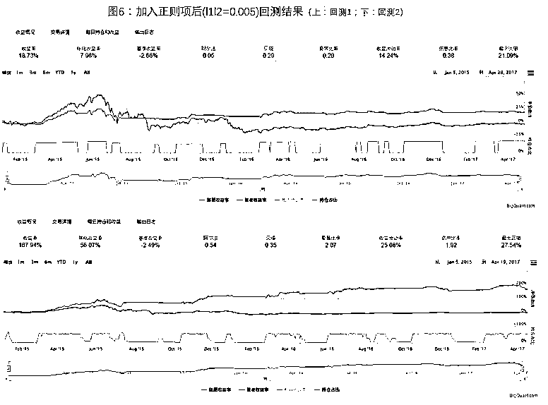

# LSTM Networks 在股票市场上的探究

> 原文：[`mp.weixin.qq.com/s?__biz=MzAxNTc0Mjg0Mg==&mid=2653285529&idx=1&sn=a1521d7b2e0af6dc5cb4ff59e9e5fa5e&chksm=802e2e8cb759a79a850cc33d2fe8855b5a8dffee9f5d0cda09630e88aaf2e498387b7af6abf6&scene=27#wechat_redirect`](http://mp.weixin.qq.com/s?__biz=MzAxNTc0Mjg0Mg==&mid=2653285529&idx=1&sn=a1521d7b2e0af6dc5cb4ff59e9e5fa5e&chksm=802e2e8cb759a79a850cc33d2fe8855b5a8dffee9f5d0cda09630e88aaf2e498387b7af6abf6&scene=27#wechat_redirect)


**编辑部**

微信公众号

**关键字**全网搜索最新排名

**『量化投资』：排名第一**

**『量       化』：排名第一**

**『机器学习』：排名第四**

我们会再接再厉

成为全网**优质的**金融、技术类公众号


**LSTM Networks 简介**

LSTM Networks 是递归神经网络（RNNs）的一种，该算法由 Sepp Hochreiter 和 Jurgen Schmidhuber 在 Neural Computation 上首次公布。后经过人们的不断改进，LSTM 的内部结构逐渐变得完善起来（图 1）。在处理和预测时间序列相关的数据时会比一般的 RNNs 表现的更好。目前，LSTM Networks 已经被广泛应用在机器人控制、文本识别及预测、语音识别、蛋白质同源检测等领域。基于 LSTM Networks 在这些方面的优异表现，本推文旨在探究 LSTM 是否可以应用于股票时间序列的预测。


**LSTM Networks 建模流程**

## **处理股票时间序列的流程**

本推文使用的 LSTM 处理股票序列的流程如图 2。构建 LSTM 模型使用库主要为 Keras。

**数据获取与处理：**对于时间序列，我们通常会以[X(t-n),X(t-n+1),…,X(t-1),X(t)]这 n 个时刻的数据作为输入来预测(t+1)时刻的输出。对于股票来说，在 t 时刻会有若干个 features，因此，为了丰富 features 以使模型更加精确，本推文将 n(time series)×s(features per time series)的二维向量作为输入。LSTM 对于数据标准化的要求很高，因此本推文所有 input 数据均经过 z-score 标准化处理。

**LSTM 模型构建：**作为循环层的一种神经网络结构，只使用 LSTM 并不能构建出一个完整的模型，LSTM 还需要与其他神经网络层（如 Dense 层、卷积层等）配合使用。此外，还可以构建多层 LSTM 层来增加模型的复杂性。

**回测：**本推文进行的回测分为两种，一是直接将 LSTM 输出结果作为做单信号在个股上进行回测，二是将 LSTM 的预测结果作为一种择时信号，再配合其他选股模型（如 BigQuant 平台的 StockRanker）进行回测。


**LSTM 应用股票市场初探**

之前公众号发过一篇文章，Jakob Aungiers 在他的个人网站上比较详细地介绍了 LSTM 在 Time Series Prediction 上的运用（传送门[点击标题即可查看]：[**通过 LSTM 神经网络进行时序预测针对股票市场**](http://mp.weixin.qq.com/s?__biz=MzAxNTc0Mjg0Mg==&mid=2653284793&idx=1&sn=76c954a5a8006c815565d8669411f983&chksm=802e2bacb759a2ba4dd2ad122fe7cd99ab85ed29900b212189ab0af36749123c9e39b422363b&scene=21#wechat_redirect)），以 BigQuant(https://bigquant.com)为平台进行了实现，其使用方法为利用沪深 300 前 100 天的收盘价预测下一天的收盘价。从结果来看，LSTM 对未来 20 天的预测基本上是对过去 100 天收盘价变化的趋势的总括，因此最终的预测结果以及回测结果都不是很理想。 之后尝试增加了 features（每日 Open，High，Low，Close，Amount，Volume），效果依然不是很好。

通过对结果进行分析以及阅读研究一些研报，得到的初步结论为：一是 input 时间跨度太长（100 天的价格走势对未来一天的价格变化影响很小），而待预测数据时间跨度太短；二是收盘价（Close）是非平稳数据，LSTM 对于非平稳数据的预测效果没有平稳数据好。

**LSTM 对沪深 300 未来五日收益率预测**

综合以上两点，本推文所使用的输入和输出为利用过去 30 天的数据预测将来五天的收益。

测试对象：沪深 300

数据选择和处理：

*   input 的时间跨度为 30 天，每天的 features 为['close','open','high','low','amount','volume']共 6 个，因此每个 input 为 30×6 的二维向量。

*   output 为未来 5 日收益 future_return_5（future_return_5>0.2,取 0.2;future_return_5<-0.2,取-0.2)，为使训练效果更加明显，output=future_return_5×10； features 均经过标准化处理(在每个样本内每个 feature 标准化处理一次)。

*   训练数据：沪深 300 2005-01-01 至 2014-12-31 时间段的数据；测试数据：沪深 300 2015-01-01 至 2017-05-01 时间段数据。

*   模型构建：鉴于数据较少（训练数据约 2500 个，预测数据约 500 个），因此模型构建的相对简单。模型共四层，为一层 LSTM 层+三层 Dense 层（图 3）。

*   回测：得到 LSTM 预测结果后，若 LSTM 预测值小于 0，则记为-1，若大于 0，记为 1。

部分代码：

```py
# 数据处理：设定每个 input（30time series×6features）以及数据标准化 train_input = []
train_output = []
test_input = []
test_output = []
for i in range(conf.seq_len-1, len(traindata)):
    a = scale(scaledata[i+1-conf.seq_len:i+1])
    train_input.append(a)
    c = data['return'][i]
    train_output.append(c)
for j in range(len(traindata), len(data)):
    b = scale(scaledata[j+1-conf.seq_len:j+1])
    test_input.append(b)
    c = data['return'][j]
    test_output.append(c)
 # LSTM 接受数组类型的输入 train_x = np.array(train_input)
train_y = np.array(train_output)
test_x = np.array(test_input) 
test_y = np.array(test_output)
```

```py
# 自定义激活函数 import tensorflow as tf
def atan(x): 
    return tf.atan(x)
 # 构建神经网络层 1 层 LSTM 层+3 层 Dense 层 # 用于 1 个输入情况 lstm_input = Input(shape=(30,6), name='lstm_input')
lstm_output = LSTM(128, activation=atan, dropout_W=0.2, dropout_U=0.1)(lstm_input)
Dense_output_1 = Dense(64, activation='linear')(lstm_output)
Dense_output_2 = Dense(16, activation='linear')(Dense_output_1)
predictions = Dense(1, activation=atan)(Dense_output_2)

model = Model(input=lstm_input, output=predictions)

model.compile(optimizer='adam', loss='mse', metrics=['mse'])

model.fit(train_x, train_y, batch_size=conf.batch, nb_epoch=10, verbose=2)
 # 预测 predictions = model.predict(test_x)
 # 预测值和真实值的关系 data1 = test_y
data2 = predictions
fig, ax = plt.subplots(figsize=(8, 6))
ax.plot(data2,data1, 'o', label="data")
ax.legend(loc='best')
```


```py
# 如果预测值>0,取为 1；如果预测值<=0,取为-1.为回测做准备 for i in range(len(predictions)):    
 if predictions[i]>0:
        predictions[i]=1
    elif predictions[i]<=0:
        predictions[i]=-1 # 将预测值与时间整合作为回测数据 cc = np.reshape(predictions,len(predictions), 1)
databacktest = pd.DataFrame()
databacktest['date'] = datatime
databacktest['direction']=np.round(cc)
```

每个模型做两次回测，第一次回测（后文简称回测 1）为直接以 LSTM 预测值在沪深 300 上做单：若 LSTM 预测值为 1，买入并持有 5day（若之前已持仓，则更新持有天数），若 LSTM 预测值为-1，若为空仓期，则继续空仓，若已持有股票，则不更新持有天数；

第二次回测（后文简称回测 2）为以 LSTM 为择时指标，与 StockRanker 结合在 3000 只股票做单：若 LSTM 预测值为 1，则允许 StockRanker 根据其排序分数买入股票，若 LSTM 预测值为-1，若为空仓期，则继续空仓，若已持有股票，则禁止 StockRanker 买入股票，根据现有股票的买入时间，5 天内清仓；


### **1)future_return_5 是否二极化处理比较**

对于 future_return_5 的处理分为两种情况，一种为直接将 future_return_5 作为 output 进行模型训练，二是将 future_return_5 二极化（future_return_5>0,取 1；future_return_5<=0,取-1），然后将二极化后的数据作为 output 进行模型训练。

两种处理方法的回测情况如图 4，图 5。由于模型每次初始化权重不一样，每次预测和回测结果会有一些差别，但经过多次回测统计，直接将 future_return_5 作为 output 进行模型训练是一个更好的选择。在本推文接下来的讨论中，将会直接将 future_return_5 作为 output 进行模型训练。


### **2)在权重上施加正则项探究**

神经网络的过拟合：在训练神经网络过程中，“过拟合”是一项尽量要避免的事。神经网络“死记”训练数据。过拟合意味着模型在训练数据的表现会很好，但对于训练以外的预测则效果很差。原因通常为模型“死记”训练数据及其噪声，从而导致模型过于复杂。本推文使用的沪深 300 的数据量不是太多，因此防止模型过拟合就尤为重要。

训练 LSTM 模型时，在参数层面上有两个十分重要的参数可以控制模型的过拟合：Dropout 参数和在权重上施加正则项。Dropout 是指在每次输入时随机丢弃一些 features，从而提高模型的鲁棒性。它的出发点是通过不停去改变网络的结构，使神经网络记住的不是训练数据本身，而是能学出一些规律性的东西。正则项则是通过在计算损失函数时增加一项 L2 范数，使一些权重的值趋近于 0，避免模型对每个 feature 强行适应与拟合，从而提高鲁棒性，也有因子选择的效果；在 1)的模型训练中，我们加入了 Dropout 参数来避免过拟合。接下来我们尝试额外在权重上施加正则项来测试模型的表现。

回测结果如图 6，加入正则项之后回测 1 和回测 2 的最大回撤均有下降，说明加入正则项后确实减轻了模型的过拟合。比较加入正则项前后回测 1 的持仓情况，可以看到加入正则化后空仓期更长,做单次数减少(19/17)，可以理解为：加入正则项之后，模型会变得更加保守。

正则项的问题：经过试验,对于一个 LSTM 模型来说，正则项的参数十分重要，调参也需要长时间尝试，不合适的参数选择会造成模型的预测值偏正分布(大部分预测值大于 0)或偏负分布，从而导致预测结果不准确，而较好的正则参数会使模型泛化性非常好(图 6 所用参数训练出来的模型的预测值属于轻度偏正分布)。本文之后的讨论仍会基于未加权重正则项的 LSTM 模型。



### **3)双输入模型探究**

除了传统的 Sequential Model(一输入，一输出)外，本推文还尝试构建了 Functional Model(支持多输入，多输出)。前面提到的 features 处理方法丢失了一项重要的信息：价格的高低。相同的 input 处在 3000 点和 6000 点时的 future_return_5 可能有很大不同。因此，本文尝试构建了"二输入一输出"的 Functional Model：标准化后的 features 作为 input 输入 LSTM，LSTM 层的输出结果和一个指标-label(label=np.round(close/500))作为 input 输入后面的 Dense 层，最终输出仍为 future_return_5(图 7)。


部分代码：

```py
# LSTM 与 stockranker 配合回测  class conf:
    start_date = '2010-01-01'
    end_date='2017-05-01'
    # split_date 之前的数据用于训练，之后的数据用作效果评估
    split_date = '2015-01-01'
    instruments = D.instruments(start_date, end_date)    
    label_expr = ['return * 100', 'where(label > {0}, {0}, where(label < -{0}, -{0}, label)) + {0}'.format(20)]    # 持有天数，用于计算 label_expr 中的 return 值(收益)
    hold_days = 5

    # 特征
    features = ['close_5/close_0',  # 5 日收益
    'close_10/close_0',  # 10 日收益
    'close_20/close_0',  # 20 日收益
    'avg_amount_0/avg_amount_5',  # 当日/5 日平均交易额
    'avg_amount_5/avg_amount_20',  # 5 日/20 日平均交易额
    'rank_avg_amount_0/rank_avg_amount_5',  # 当日/5 日平均交易额排名
    'rank_avg_amount_5/rank_avg_amount_10',  # 5 日/10 日平均交易额排名
    'rank_return_0',  # 当日收益
    'rank_return_5',  # 5 日收益
    'rank_return_10',  # 10 日收益
    'rank_return_0/rank_return_5',  # 当日/5 日收益排名
    'rank_return_5/rank_return_10',  # 5 日/10 日收益排名
    'pe_ttm_0',  # 市盈率 TTM
    ]
# 给数据做标注：给每一行数据（样本）打分，一般分数越高表示越好 m1 = M.fast_auto_labeler.v5(
    instruments=conf.instruments, start_date=conf.start_date, end_date=conf.end_date,
    label_expr=conf.label_expr, hold_days=conf.hold_days,
    benchmark='000300.SHA', sell_at='open', buy_at='open' )

# 计算特征数据 m2 = M.general_feature_extractor.v5(
    instruments=conf.instruments, start_date=conf.start_date, end_date=conf.end_date,
    features=conf.features)

# 数据预处理：缺失数据处理，数据规范化，T.get_stock_ranker_default_transforms 为 StockRanker 模型做数据预处理 m3 = M.transform.v2(
    data=m2.data, transforms=T.get_stock_ranker_default_transforms(),
    drop_null=True, astype='int32', except_columns=['date', 'instrument'],
    clip_lower=0, clip_upper=200000000)
 # 合并标注和特征数据 m4 = M.join.v2(data1=m1.data, data2=m3.data, on=['date', 'instrument'], sort=True)
 # 训练数据集 m5_training = M.filter.v2(data=m4.data, expr='date < "%s"' % conf.split_date)

# 评估数据集 m5_evaluation = M.filter.v2(data=m4.data, expr='"%s" <= date' % conf.split_date)

# StockRanker 机器学习训练 m6 = M.stock_ranker_train.v2(training_ds=m5_training.data, features=conf.features)

# 对评估集做预测 m7 = M.stock_ranker_predict.v2(model_id=m6.model_id, data=m5_evaluation.data)
 # 生成卖出订单：hold_days 天之后才开始卖出；对持仓的股票，按 StockRanker 预测的排序末位淘汰 if databacktest['direction'].values[databacktest.date==current_dt]==-1: # LSTM 择时卖
    instruments = list(reversed(list(ranker_prediction.instrument[ranker_prediction.instrument.apply(lambda x: x in equities and not context.has_unfinished_sell_order(equities[x]))])))        
 for instrument in instruments:            
 if context.trading_calendar.session_distance(pd.Timestamp(context.date[instrument]), pd.Timestamp(current_dt))>=5:
                context.order_target(context.symbol(instrument), 0)if not is_staging and cash_for_sell > 0:
    instruments = list(reversed(list(ranker_prediction.instrument[ranker_prediction.instrument.apply(lambda x: x in equities and not context.has_unfinished_sell_order(equities[x]))])))        
 # print('rank order for sell %s' % instruments) for instrument in instruments:
        context.order_target(context.symbol(instrument), 0)
        cash_for_sell -= positions[instrument]            
 if cash_for_sell <= 0:                
 break # 生成买入订单：按 StockRanker 预测的排序，买入前面的 stock_count 只股票 if databacktest['direction'].values[databacktest.date==current_dt]==1: # LSTM 择时买
    buy_dt = data.current_dt.strftime('%Y-%m-%d')
    context.date=buy_dt
    buy_cash_weights = context.stock_weights
    buy_instruments = list(ranker_prediction.instrument[:len(buy_cash_weights)])
    max_cash_per_instrument = context.portfolio.portfolio_value * context.max_cash_per_instrument        
 for i, instrument in enumerate(buy_instruments):
        cash = cash_for_buy * buy_cash_weights[i]            
 if cash > max_cash_per_instrument - positions.get(instrument, 0): # 确保股票持仓量不会超过每次股票最大的占用资金量
            cash = max_cash_per_instrument - positions.get(instrument, 0)            
 if cash > 0:
            context.order_value(context.symbol(instrument), cash)
            buy_dates[instrument] = current_dt

context.date = buy_dates
```

回测结果如图 8。由回测结果可以看出，加入指示标后的 LSTM 模型收益率相对下降，但是回撤更小。LSTM 预测值小于 0 的时间段覆盖了沪深 300 上大多数大幅下跌的时间段,虽然也错误地将一些震荡或上涨趋势划归为下跌趋势。或许这是不可避免的，俗话说高风险高回报，风险低那么回报也不会非常高，高回报和低风险往往不可兼得。


**结论与展望**

**结论：**本推文通过探究性地应用 LSTM 对沪深 300 未来五日收益率进行预测，初步说明了 LSTM Networks 是可以用在股票市场上的。由于 LSTM 更适用于处理个股/指数，因此，将 LSTM 作为择时模型与其他选股模型配合使用效果较好。利用 LSTM 模型对沪深 300 数据进行预测并将结果作为择时信号，可以显著改善 stockranker 选股模型在回测阶段的回撤。

**展望：**由于个股数据量较少，LSTM 模型的可扩展程度和复杂度受到很大制约，features 的选择也受到限制（若 input 的 features 太多，而 data 较少的话，会使一部分 features 不能发挥出应有的作用，也极易造成过拟合）。将来我们希望能在个股/指数的小时或分钟数据上测试 LSTM 的性能。另外，将探究 LSTM 模型能否将属于一个行业的所有股票 data 一起处理也是一个可选的方向。

**说明：**由于每次训练 LSTM 模型权重更新情况不同以及 Dropout 的随机性，LSTM 模型的每次训练训练结果都会有差异。

**提示：**由于 LSTM 涉及参数众多，目前还不能保证 LSTM 模型的稳定性，本推文所附回测结果均为多次训练模型后选取的较为理想的情况，目的是说明 LSTM 是可以应用于股票市场的以及将其作为择时模型是可能的。本推文所述以及提供的代码仅供探究及讨论，若要形成一个在股票市场比较实用的 LSTM 模型，还需要在 features 选择、模型构建、模型参数选择以及调优等方面花费大量精力。

**关注者**

**从****1 到 10000+**

**我们每天都在进步**

