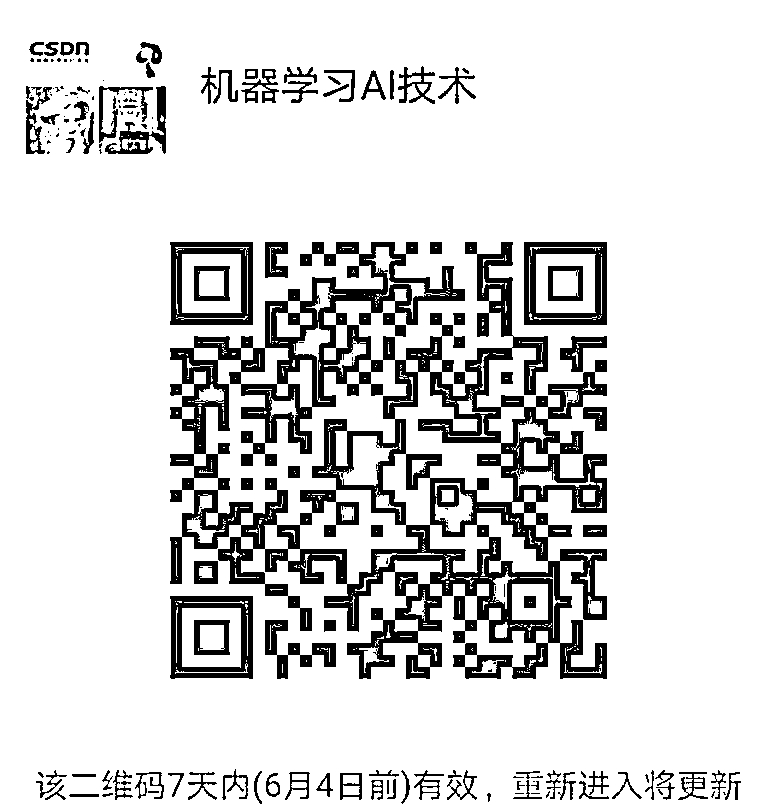

# 六、周计划 | 机器学习系统掌握！

> 原文：[`mp.weixin.qq.com/s?__biz=MzAxNTc0Mjg0Mg==&mid=2653285516&idx=1&sn=cf03f991e612c5d4d421fe13cb5aa5fe&chksm=802e2e99b759a78fefcc37856c0ddb382264f9031a9a60d01d28d04d2c5ee28d6bb30cc46d4d&scene=27#wechat_redirect`](http://mp.weixin.qq.com/s?__biz=MzAxNTc0Mjg0Mg==&mid=2653285516&idx=1&sn=cf03f991e612c5d4d421fe13cb5aa5fe&chksm=802e2e99b759a78fefcc37856c0ddb382264f9031a9a60d01d28d04d2c5ee28d6bb30cc46d4d&scene=27#wechat_redirect)

**编辑部**

微信公众号

**关键字**全网搜索最新排名

**『量化投资』：排名第一**

**『量       化』：排名第一**

**『机器学习』：排名第四**

我们会再接再厉

成为全网**优质的**金融、技术类公众号

人工智能，机器学习，深度学习等词，这两年一直频频出现在我们的视野，随着人机大战中 AlphaGo 击败李世石，到今年乌镇再一战。都在提醒我们：这一次，我们必须跟着人工智能的方向所拼搏。

众所周知，目前国内知名的互联网企业无一不在建立自己的机器学习团队，以期用机器学习技术，提升产品的体验和智能化程度。对于机器学习，很多人的观点是：**机器学习技术是今后所有技术人员都绕不过的一个门槛**。

**但许多人仍有此疑问**：学习机器学习，但无从下手怎么办？尝试过各种学习方法，为什么依然是个门外汉？为什么传统的学习机器学习的途径收效甚慢？作为一名对机器学习心有向往的程序员，我该以什么样的姿势开始呢？

**答案是：抓住浪潮，主动出击，广泛学习。**

深入了解机器学习技术在每个行业中是如何应用的：深入了解的技术细节，吸收工程上的最佳实践，掌握成熟的产品架构设计，观察行业的上下游……

深入接触行业的核心技术人员，直接交流、沟通、学习。

基础这种现状，CSDN 开设了 6 周决胜 AI 的实训计划。

60+知识点，12 课时，6 周学习计划。

详情

> 【**计划信息**】
> 
> **主题：**机器学习&深度学习 6 周实战
> 
> **时间：**每周二，四晚直播（错过有回放）
> 
> **形式：**在线直播，实时答疑
> 
> **内容：**100+知识点，12 场主题，每周 2 次直播讲解！
> 
> **福利：**资料共享，基础免费补，源码发放，金牌答疑，长期问答，交流群
> 
> 【**内容覆盖**】
> 
> *   本次直播课程覆盖：当下爆火的机器学习与深度学习核心算法原理与项目实战。
>     
>     
> *   从基本的机器学习算法开始讲起，对于每一个经典算法给出原理推导以及算法流程通俗解读。
>     
>     
> *   原理与案例相结合，使用真实数据集结合 python 使用分析与建模库来解决问题。
>     
>     
> *   由神经网络迈向深度学习的世界，通俗解读复杂的神经网络原理，逐步进军计算机视觉领域，结合当下最流行的两大深度学习框架 Tensroflow 与 Caffe 和大家共同完成两个经典的项目实战，验证码识别与人脸检测。
>     
>     
> 
> 【**适合谁听？**】
> 
> ☑ 对机器学习/深度学习感兴趣的同学☑ 准备从事机器学习/数据挖掘/计算机视觉等人工智能方向等人员

**直播**

**计划**

**三个阶段**

*   一 基础实战   

*   二 算法突击

*   三 应用解析

**十二场主题一览**

（一）回归算法原理推导

（二）决策树与随机森林

（三）实战样本不均衡数据解决方法（上）

（四）实战样本不均衡数据解决方法（下）

（五）支持向量机

（六）聚类与 PCA 降维方法

（七）集成算法

（八）迈向深度学习-神经网络

（九）卷积神经网络

（十）深度学习框架-Tensorflow 实战

（十一）案例实战-验证码识别

（十二）案例实战-人脸检测

**说明**

*   1 详细知识点请到到报名页面查看！

*   2 基础资料，报名后为您开通权限，即刻学习基础，有问题可以加群找群主！

**如何报名？**

**点击阅读原文报名，支持外链**

**群满到报名页查看最新！**

此外！

我们还为你准备了第二重优惠！

凡转发此条信息至微信群的用户，将截图发送给群主

即可获得 50 元优惠券