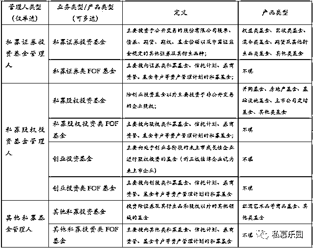
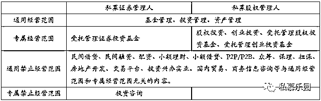
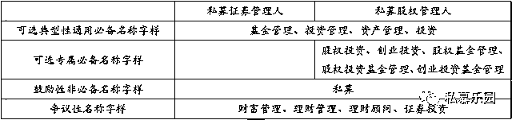
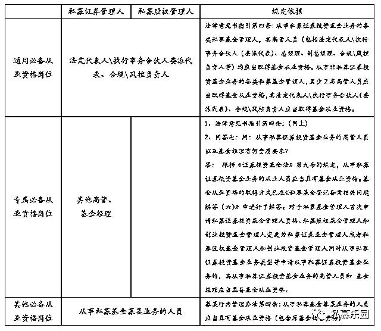
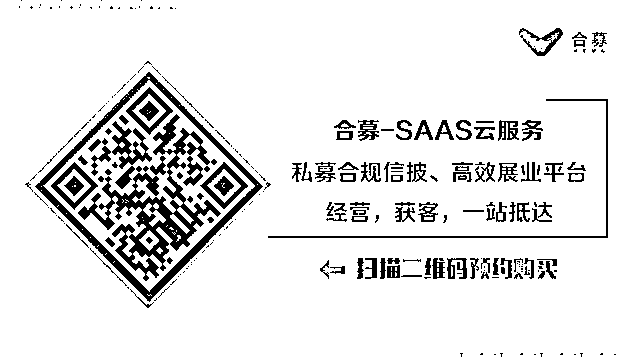

# 实操详述！私募证券、股权基金管理人登记备案条件差异及细节，具体到机构名称必备及禁止字样

> 原文：[`mp.weixin.qq.com/s?__biz=MzAxNTc0Mjg0Mg==&mid=2653285512&idx=1&sn=1632ddf96eb1e2b42a88a775ccb201b5&chksm=802e2e9db759a78b0a8cc3142d676a5dc177441602aab1b5b469673bc12095c339f8288047aa&scene=27#wechat_redirect`](http://mp.weixin.qq.com/s?__biz=MzAxNTc0Mjg0Mg==&mid=2653285512&idx=1&sn=1632ddf96eb1e2b42a88a775ccb201b5&chksm=802e2e9db759a78b0a8cc3142d676a5dc177441602aab1b5b469673bc12095c339f8288047aa&scene=27#wechat_redirect)

本文长度：4700 字，建议阅读时长：8min

2016 年 9 月 8 日，中国证券投资基金业协会（以下简称“中基协”）正式上线运行“资产管理业务综合报送平台”（登录入口：https://ambers.amac.org.cn，业界通称“新系统”）。

同时，中基协还发布了《有关私募投资基金“业务类型/基金类型”和“产品类型”的说明》，重新明确了各类私募投资基金业务类型和产品类型。

**具体分类如下表所示：**

根据上述分类，私募基金管理人在进行登记备案时，都面临着在“私募证券投资基金管理人”（以下简称“私募证券管理人”）和“私募股权投资基金管理人”（包含创投类私募管理人，以下简称“私募股权管理人”）中单项选择的问题（由于“其他私募基金管理人”登记数量较少，且登记备案要求与私募股权管理人基本相同，故在此并入私募股权管理人类型讨论）。

**二者差异何在？对于各自登记备案条件又有何具体要求？**笔者根据中基协相关规定及登记备案审核要求，并结合数十家私募管理人成功登记备案的实务经验，对此问题进行具体分析如下：

**一、经营范围**

根据中基协《关于进一步规范私募基金管理人登记若干事项的公告》（中基协发〔2016〕4 号，以下简称“4 号文”）及附件《私募基金管理人登记法律意见书指引》（以下简称“法律意见书指引”）的规定以及笔者实务经验，两类私募管理人登记备案的经营范围要求如下表所示：

如上表所示，除通用经营范围和通用禁止经营范围之外，两类私募管理人均有专属经营范围，仅可用于该类私募管理人登记备案。

**据此，两类私募管理人的经营范围存在三种模式：**

（1）仅具备通用经营范围；

（2）仅具备专属经营范围；

（3）具备通用经营范围+专属经营范围。

此外，需要特别指出，“投资咨询”属于私募证券管理人的专属禁止经营范围，原因在于《证券投资咨询业务资格证书》系由中国证监会审批的一类专属证券业务经营资格（证监会自 2016 年 9 月后未新批该类业务资格）。

如果私募证券管理人经营范围中包含“投资咨询”，则有可能导致与证券投资咨询机构出现经营混同，有悖于私募基金专业化经营的监管原则。而对于私募股权管理人，“投资咨询”并非禁止性经营范围，笔者也曾为多家经营范围中包含“投资咨询”的私募股权管理人成功办理登记备案。

**二、机构名称**

**根据法律意见书指引及笔者实务经验，两类私募管理人的名称必备及禁止字样情况如下表所示：**

如上表所示，“基金管理”、“投资管理”、“资产管理”、“投资”均为可选典型性通用必备名称字样，两类私募管理人均可采用；“私募”属于中基协鼓励的非必备名称字样，但名称中不含“私募”字样不会对申请管理人登记构成实质性障碍。

对于私募股权管理人可选专属必备名称字样，通常仅适用于该类私募管理人，但经查询中基协私募管理人信息公示平台可知，在 4 号文颁布前，有一些名称中包含“股权投资基金”、“股权基金管理”的私募管理人登记的管理基金主要类别却为证券投资基金（甚至仅包括证券投资基金一种基金类别）。

笔者亦曾在 2016 年 5 月为一家名为“深圳 XXX 股权投资基金管理有限公司”的私募证券管理人成功办理通过法律意见书。

即便如此，笔者认为，这并不代表上述名称字样可以适用于私募证券管理人新登记备案，随着中基协私募专业化经营监管思路的逐步清晰，上述股权类可选专属必备名称字样仅适用于私募股权管理人。

“财富管理”和“理财管理”、“理财顾问”、“证券投资”是否为合规名称字样则存在争议，前者“财富管理”虽非典型性名称字样，但经查询中基协私募管理人信息公示平台可知，在 4 号文颁布前后及新系统上线后，均有名称中包含“财富管理”的私募管理人完成登记备案，笔者亦有成功案例，但也曾收到中基协要求变更名称的反馈意见。因此，笔者认为，“财富管理”原则上属于可选通用名称字样，但存在一定的审批风险。

而对于“理财管理”、“理财顾问”、“证券投资”三种名称字样，笔者查询中基协私募管理人信息公示平台后发现，在 4 号文颁布前，有极少数成功登记备案案例，在 4 号文颁布及新系统上线后，未发现有成功登记备案案例，故笔者认为该等字样属于“特定历史阶段的特殊现象”，随着中基协私募监管的规范化和严格化，不建议采用该等名称字样申请私募管理人登记。

**三、境外股东资质要求**

根据中基协 2016 年 6 月 30 日发布的《私募基金登记备案相关问题解答（十）》（以下简称“问答十”）的规定，外商投资的私募证券管理人（包括外商独资及合资企业），除需要符合其他必备条件外，还应当符合：

“该私募证券基金管理机构的境外股东为所在国家或者地区金融监管当局批准或者许可的金融机构，且境外股东所在国家或者地区的证券监管机构已与中国证监会或者中国证监会认可的其他机构签订证券监管合作谅解备忘录。”

这一条件，即对境外股东的资质存在特殊要求。

而对于外商投资的私募股权管理人是否也存在上述要求，中基协相关书面规定和问答中没有明确规定，但笔者曾电话咨询中基协官方热线，得到私募股权管理人不适用问答十的肯定答复。

笔者经办的两家外商投资私募股权管理人，其境外股东均为香港主板地产类上市公司，不符合问答十规定的资质要求，但均于新系统成功通过私募管理人登记。

由此可见**，对于外商投资的私募股权管理人，并不存在对境外股东的特殊资质要求。**

**四、基金从业资格**

根据 4 号文、《私募投资基金募集行为管理办法（试行）》（以下简称“募集行为管理办法”）、《私募投资基金登记备案的问题解答（七）》（以下简称“问答七”）的相关规定，笔者总结了两类私募管理人对于基金从业资格的要求：

**如上表所示：**私募证券管理人登记备案对于基金从业资格的要求高于私募股权管理人，除全体高管均需要具备基金从业资格外，对于由非高管人员担任基金经理的情况，要求基金经理也必须具备基金从业资格。

**有必要澄清的是，**对于私募管理人高管以通过考试方式获得从业资格的情况，近期有传言称私募股权管理人高管人员必须通过基金从业资格考试科目三《私募股权投资基金基础知识》方能获得从业资格。

但根据笔者最新实务经验及中基协官方热线的解答结果，**目前而言：**

**通过科目一《基金法律法规、职业道德与业务规范》和科目二《证券投资基金基础知识》的从业人员，无论是作为私募证券管理人还是私募股权管理人的高管，中基协均认定其具备从业资格。**

**但仅通过科目一和科目三的人员只能担任私募股权管理人的高管人员。**

尽管如此，鉴于中基协的监管标准日益提高，笔者仍建议拟从事私募股权业务的从业人员通过科目三考试，以提前应对政策变动风险。

此外，根据笔者近期实务经验，在私募证券管理人登记备案审批中，中基协对于全体从业人员中具备基金从业资格人员的比例也有一定的要求，对于该等比例低于 50%的，中基协通常会对登记备案申请提出如下反馈意见：

“贵机构具有基金从业资格的人员较少，建议贵机构对高管、员工人员结构进行优化”。

因此，笔者建议私募证券管理人在办理登记备案时，至少确保全体从业人员中具备基金从业资格人员的比例不低于 50%。

**五、外包服务协议**

由于私募证券投资基金和私募股权投资基金在主流形式上存在差异，前者通常采取契约型，后者通常采取有限合伙型（或公司型）。

基于保障投资人资金安全和私募基金规范运营监管目标的考虑，中基协鼓励私募基金尤其是契约型私募基金与取得中基协外包服务资格的机构签署基金外包服务协议。

此外，签署外包服务协议有助于私募管理人强化内部控制、提高管理水平。在登记备案实务中，员工人数较少的私募证券管理人经常收到中基协如下反馈意见：

“鉴于申请机构员工人数较少，请核实申请机构在将来是否具有签订外包服务的意愿或计划，并进一步阐述申请机构是否具备相应的外包制度及其执行基础和条件。”

因此，为了顺利完成登记备案，笔者建议私募证券管理人尽早与外包服务机构签署外包服务协议或达成外包服务意向。

**综上所述，**在“专业化经营、规范化监管”的原则愈加明确的态势下，中基协对私募证券基金的监管标准高于私募股权基金，因此在私募管理人登记备案条件上也存在上述诸多差异，笔者建议：

**私募管理人应当进行针对性准备和完善，以便顺利通过登记备案。**

**\ 作者简介 /** 

（图片顺序：由左至右）

**谭彦华  广东华商律师事务所律师**

武汉大学法律硕士，已累计成功办理私募登记备案及重大变更法律意见书 130 余份，并为多家私募机构提供产品结构设计、项目尽职调查、交易风险控制等法律服务，此外，谭彦华律师团队还提供投融资并购、企业上市、法律顾问等专业服务

**鲁   悦  广东华商律师事务所实习律师**

**[ The End ]**

- - - - -  **私募人，请查收您的合规利****器**  - - - - -

- - - - - - -  ****您也可以在这里看我们**** - - - - - - -

