# 白马股量化选股模型

> 原文：[`mp.weixin.qq.com/s?__biz=MzAxNTc0Mjg0Mg==&mid=2653285510&idx=1&sn=e30d60c44a443011ce2a272cc6c25785&chksm=802e2e93b759a785aa786d3cc55e7e24faf5afc4b86ca258dee242122435c1ba024139c0a50e&scene=27#wechat_redirect`](http://mp.weixin.qq.com/s?__biz=MzAxNTc0Mjg0Mg==&mid=2653285510&idx=1&sn=e30d60c44a443011ce2a272cc6c25785&chksm=802e2e93b759a785aa786d3cc55e7e24faf5afc4b86ca258dee242122435c1ba024139c0a50e&scene=27#wechat_redirect)

**编辑部**

微信公众号

**关键字**全网搜索最新排名

**『量化投资』：排名第一**

**『量       化』：排名第一**

**『机器学习』：排名第四**

我们会再接再厉

成为全网**优质的**金融、技术类公众号

**前言**

**今天我们来介绍一篇来自国信证券的研究报告**

**绩优白马股** 

绩优白马股相关研究简介

按字面理解，绩优白马股是指业绩优秀、稳定成长的公司。围绕公司业绩：

1.  PB-ROE 模型对 A 股市场的行业层面约束效果不明显；所以用 ROE 指标截面比较，行业内选股。

2.  将 ROE 分解为杜邦三因子，通过因子收益归因发现，销售利润率和资产周转率是显著的收益来源，而财务杠杆在 A 股市场范围内，对收益无明显的解释作用。因此，分别通过销售利润率，资产周转率和 ROE 三部分来 对公司经营质量进行评价打分。

**绩优白马股的反思与启示**

对绩优白马股的定义并无统一标准，本报告将用两类特征作为切入点，研究绩优白马股：

1.  ROE 长期水平，以及波动特征。

2.  利润长期水平。 

从 ROE 到净利润，再到股票收益率

**绩优白马股:从基本面到二级市场的传导**

**长期高 ROE 的公司研究**

我们采用 2007 年至 2016 年年报数据，对过去十年的上市公司年报，按照长期 ROE 的高低进行了梳理。首先我们将全市场上市 10 年以上的股票，按照 ROE 的长期波动率分为两类，即 ROE 稳定组和 ROE 高波动组。其中，ROE 稳定组的列表如下: 

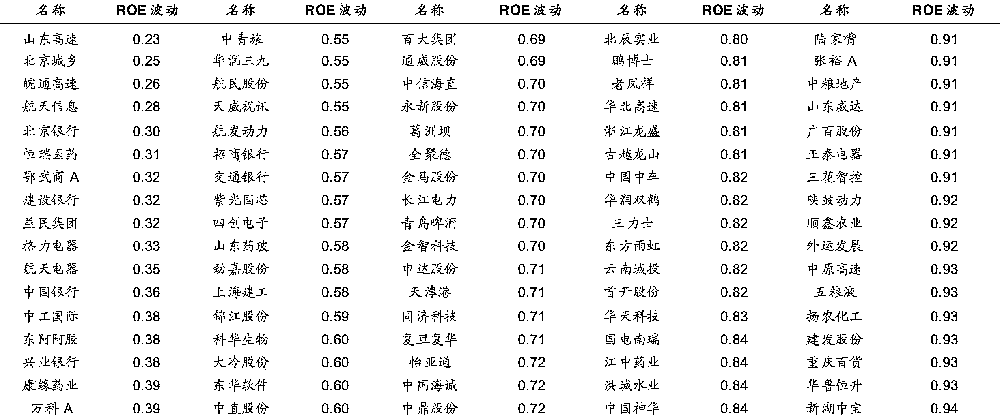

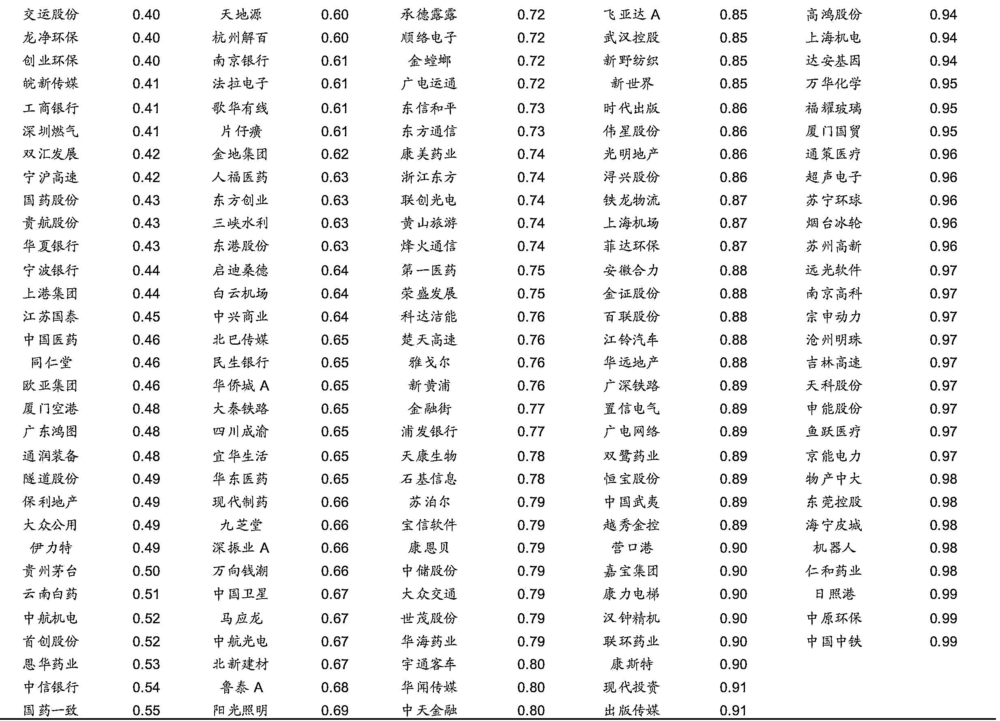

上表共有 237 家公司，这些公司过去 10 年的 ROE 波动率均未超过 ROE 均值水平。

**ROE 与净利润增长的关系** ROE 波动组中，长期 ROE 和净利润复合年增长率的关系，如下图所示：

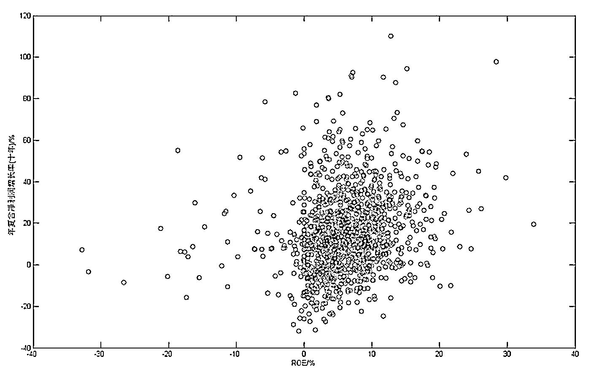

ROE 高波动组中，长期 ROE 和净利润复合年增长率 

图中显示，在 ROE 高波动组中，净利润在 ROE 每个固定位臵上的分布较为分散，长期 ROE 对净利润复合年增长率的解释度不强。

ROE 稳定组中，长期 ROE 和净利润复合年增长率的关系，如下表所示：

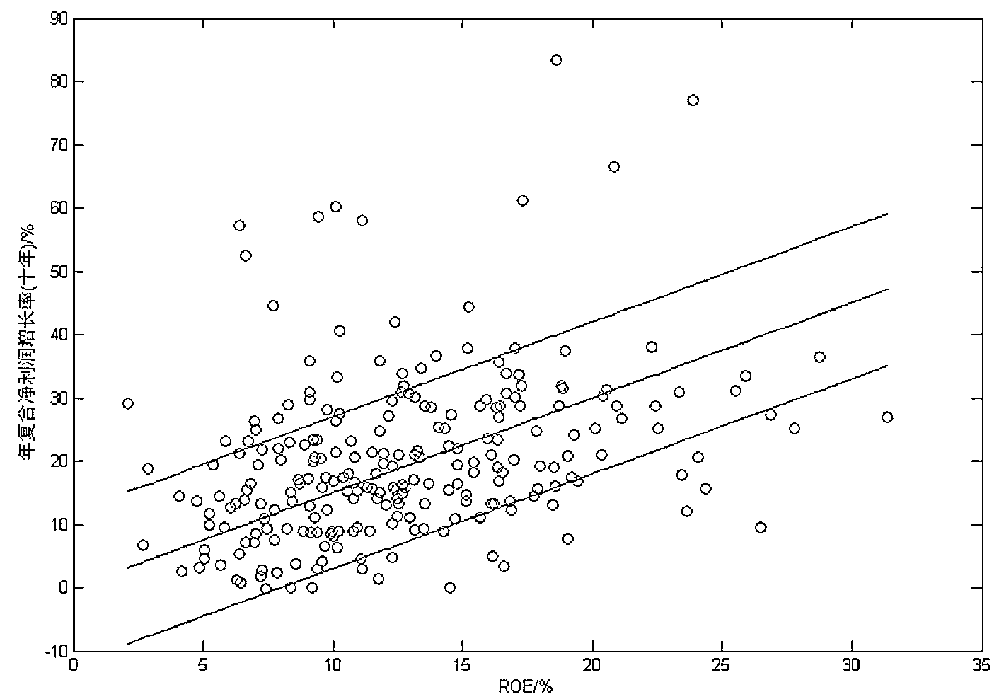

ROE 稳定组中，长期 ROE 和净利润复合年增长率 

如上图所示，在 ROE 稳定组中，长期 ROE 较好的解释了净利润复合年增长率。

**净利润增长与股票收益率的关系**

ROE 波动组中，净利润复合年增长率与股票收益率的关系，如下图所示：

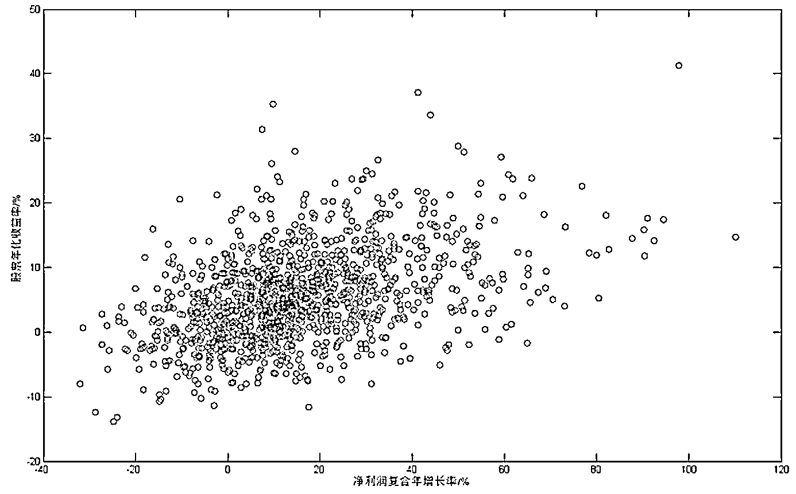

ROE 高波动组中，净利润复合年增长率和股票年化收益率 

上图显示，随着净利润复合年增长率上升，股票十年年化收益率也上升。即便在 ROE 高波动组当中，长期净利润增长也能较好地解释不同股票长期收益率的差异。

ROE 稳定组中，净利润复合年增长率与股票收益率的关系，如下图所示：

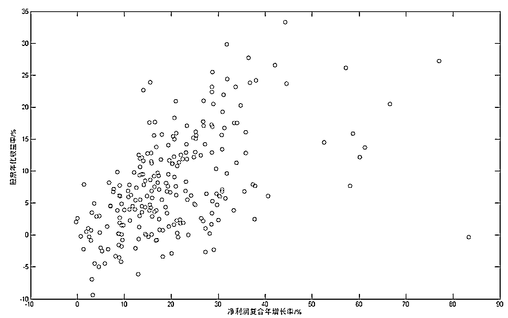

ROE 稳定组中，净利润复合年增长率和股票年化收益率 

上图显示，净利润复合年增长率和股票年化收益率正相关。在 ROE 稳定组当中，股票之间长期净利润增长的差异解释了股票长期收益率的差异。

至此，我们总结出在 ROE 不同组当中的传导逻辑:

1.  在 ROE 稳定组中，长期 ROE 较好地解释了长期净利润增长，而长期净利润又显著影响了股票长期收益率。从而，此类股票的长期收益主要取决于长期 ROE 水平的差异。

2.  在 ROE 高波动组中，ROE 本身对长期净利润增长无显著解释。此类股票的长期收益主要受到长期净利润增长率的影响。

**ROE 稳定组中寻找绩优白马股** 在 ROE 稳定组中，我们选择长期 ROE 综合水平最高的前 20 名，分析这类公司 ROE，净利润和二级市场十年收益率的情况，如下表所示:

ROE 稳定组中，ROE 均值最高 top20 的年报 ROE(单位:%) 

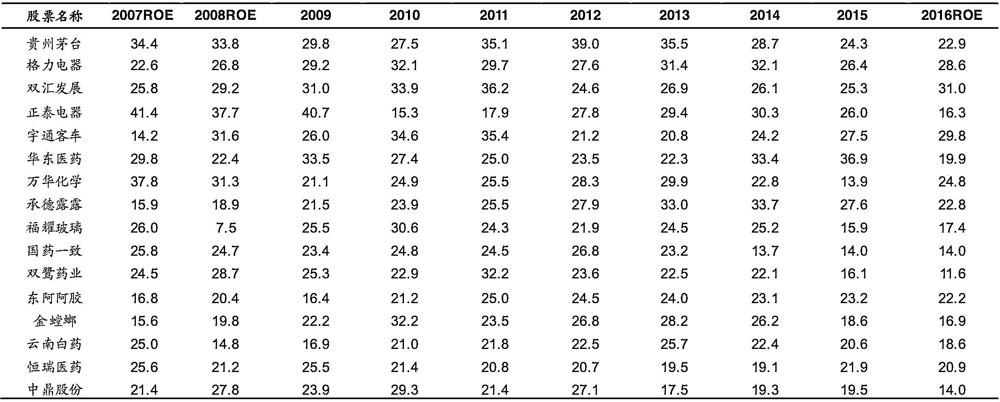

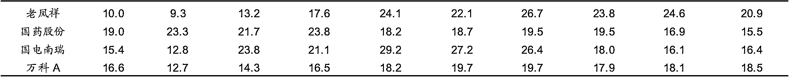

上表中这 20 家公司，从 2007 年至 2016 年的 ROE 来看，呈现出“ROE 波动小，整体水平高”的特征。 

ROE 稳定组中，ROE 最高 top 20 的业绩指标和股票收益率统计(单位: %) 

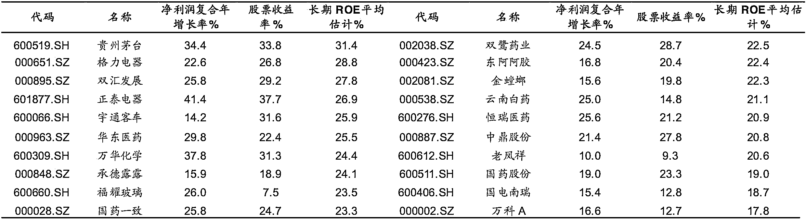

表中显示这类公司的长期 ROE 能够保持较高水平，长期净利润复合增长率较高， 二级市场长期收益率也显著高于市场平均水平。值得一提的是，这类公司的长期 ROE 水平，与其长期净利润复合增长率基本相当(长期净利润增长既没有过高，保证了可持续性;也显著比多数公司高，反映了公司良好的成长能力)。此外，此类公司的长期负债结构也呈现出稳定的态势: 

ROE 稳定组中，ROE 均值最高 top 20 的资产负债率(单位: %)

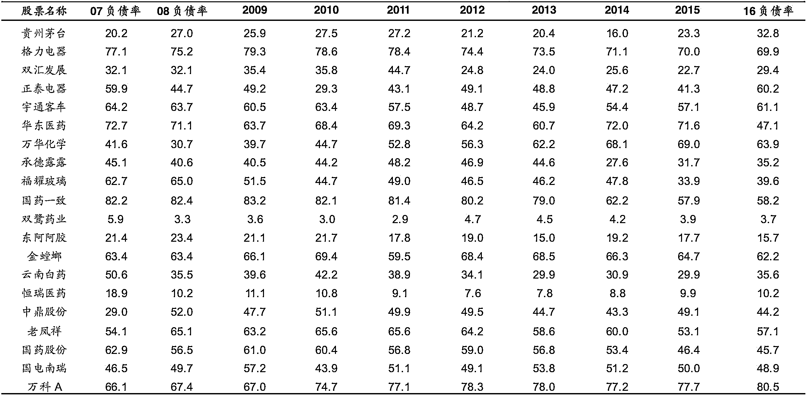

上表显示，无论宏观或行业景气或不景气时，公司的负债率都比较稳定。负债率稳定是公司经营稳定的体现，比一般公司更能抵御经济周期风险。

绩优白马股在 ROE，利润等方面所展现出的特征，有助于我们去理清选股的目 标。更有针对性地制定选股模型。 

**茅台魔咒：注定还是巧合？**

多年以来，A 股市场的股票存在“茅台魔咒”。那么这是巧合?还是其中另有原因?本章我们从绩优白马股的角度，来就此进行一番探讨。 

**茅台魔咒:股价超越茅台，就意味着要调整?**

每当一只股票价格超越贵州茅台之后，随之而来都会经历一波显著的调整。我们选取了 2007 年至 2017 年的 A 股市场具有代表性的 25 个例子: 

2007-2017 年股价超越茅台的典型案例 

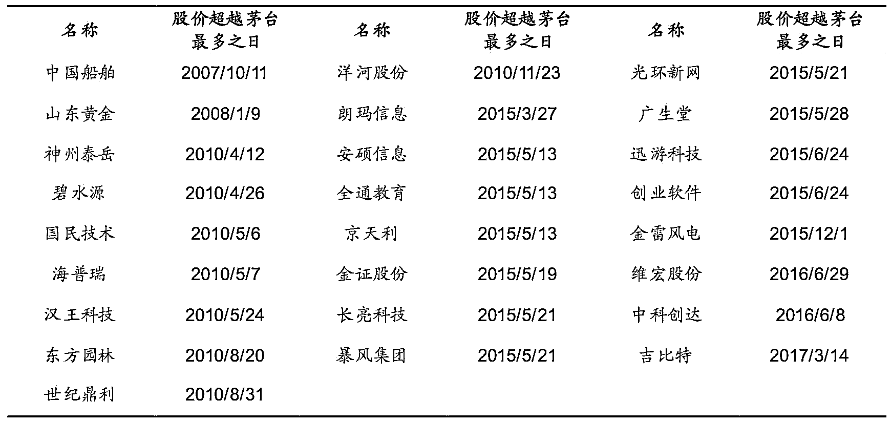

上表显示，多数股票都是在牛市当中，股价超越茅台的。07 年底附近，牛市有两只股票股价超过茅台，分别是中国船舶和山东黄金;10 年和 15 年两轮牛市中，上表共有 20 家公司股价超过茅台；之后 16 年有两家，17 年有一家。

**股价超越茅台是否合理?**

我们将上述在过去十年股价曾超越茅台的公司，剔除 2016 年以后上市的股票，与 茅台从基本面和二级市场两方面的客观数据进行对比: 

超越茅台的公司基本面和股价近期表现 

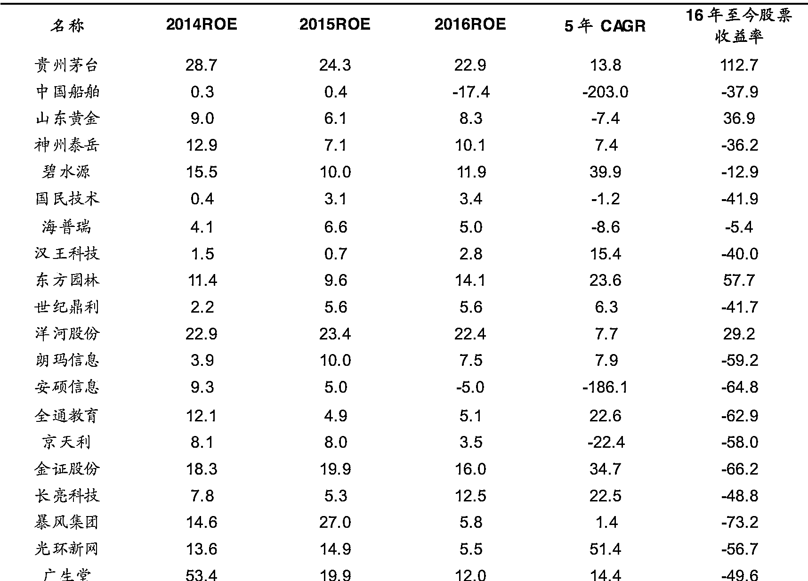

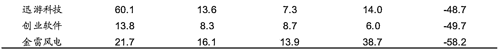

上表显示，过去股价超越茅台的公司按照基本面大致分为两类：其中多数属于 “基本面看，无法称作白马股”这一类。无论从长期 ROE 水平，还是长期净利润复合增长，这些公司 2007 至 2016 年所体现出成长的可持续性、经济周期抗风险能力，尚未具有白马股的特征；另有少部分诸如碧水源、东方园林、洋河股份属于拥有较好的基本面，但长期 ROE 整体水平低于茅台，从而公司的长期盈利质量难以超越茅台。成长性欠佳则长期净利润增速不高，进而长期股票收益率不可能太高。另一方面，考虑到茅台过去十年股本并无大幅度的扩张，所以综合公司基本面和股本扩张两方面因素考虑，股价想超越茅台的机会就微乎其微。 

**白马股量化选股模型**

绩优白马股的特征鲜明:长期 ROE 保持较高水平;公司业绩长期具有较高的成长性。并且绩优白马股的长期收益率也比较显著。因为，我们制作了以下绩优白马股量化选股模型，仅供参考。 

**模型目标**

寻找下一年 ROE 仍能保持高水平;且下个季度业绩增速显著高于市场平均水平的公司。

**选股逻辑**

1.  按照 ROE 波动率，将全市场分为 ROE 稳定组和高波动组。

2.  在 ROE 稳定组中，过去三年 ROE 每年均在 10%以上的公司。

3.  营业收入同比 /环比 改善。

4.  净利润同比/环比改善。

**回测结果** 对 2007 年至 2017 年进行了回测，每年 5/1，9/1，11/1 日换仓。结果如下:

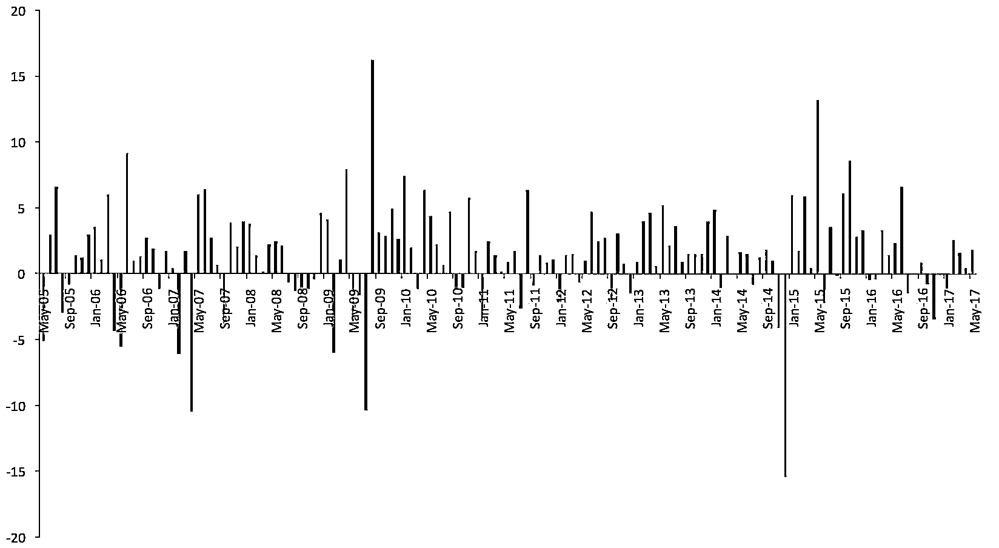

模型月度超额收益时间序列分布 

上图显示，模型收益分布均匀。最大回撤出现在 2014 年 12 月，市场行情出现金融和非金融板块极端分化的时候。 

国信白马股量化选股模型主要绩效评价指标 

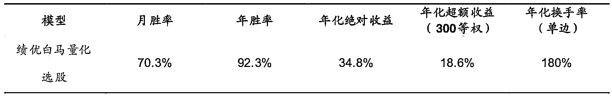

无论从月度还是年度，绩优白马股模型胜率还是不错的。过去 12 年，年化绝对收益超过 30%。换手率也不算特别高。 

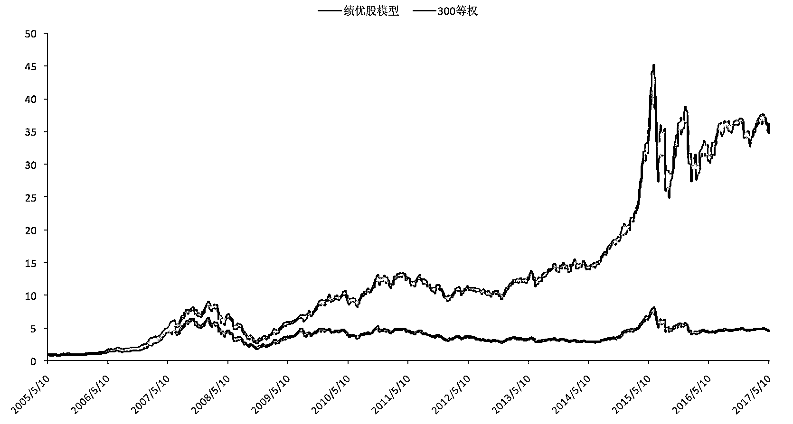

模型绝对收益净值图 

上图显示，绩优白马股模型长期持续跑赢沪深 300 等权指数，在每轮牛市(或者结构性牛市)中净值都创出了新高。第一波高点出现在 07 年底;第二波高点在 2011 年初，第三波高点出现在 15 年中期。 

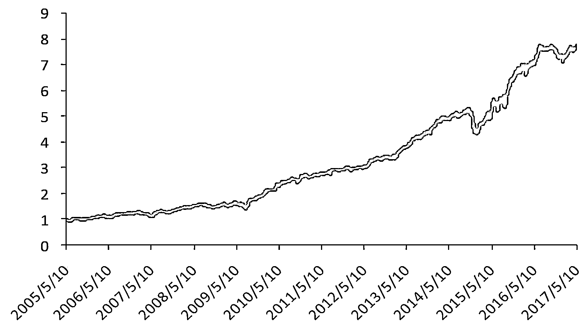

模型累计超额收益净值图 

上图显示，绩优白马股模型超额收益净值不断创新高，且整体回撤较小。三次较大的回撤分别出现在 2009 年 8 月，2014 年 12 月和 2016 年 1 月。

**基本面实证( ROE 和净利润兑现) **

逻辑上讲，本模型的收益主要来自于公司业绩的增长。为了检验这一目标的兑现情况，我们对每期组合下期的业绩状况进行了验证。 

首先我们验证，下期年报模型组合 ROE 的情况: 

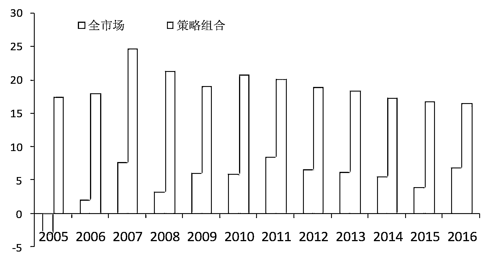

模型与全市场整体在下期年报 ROE 水平的比较 

可以看到，每年模型组合下期年报整体的 ROE 水平介于 15%以上，25%以下；大幅高于市场整体水平。 

然后我们验证，下期季报模型组合净利润增长的情况: 

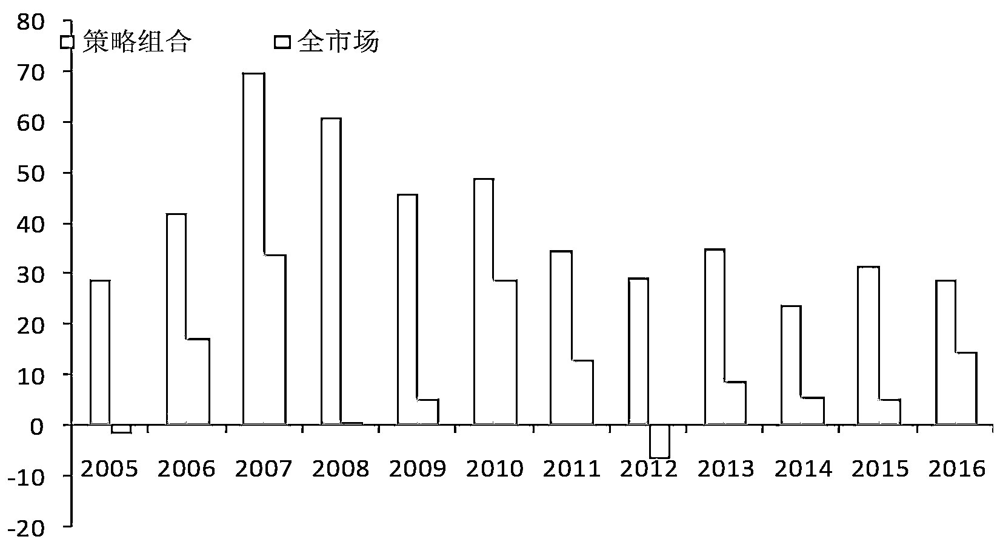

模型与全市场整体在下期净利润同比增速的比较 

上图显示，每年模型组合下期净利润增长介于 25%至 70%之间，大幅跑赢市场。 综合上述 ROE 和净利润增速的兑现情况，则不难理解本模型长期收益显著跑赢市场的原因。所以，本模型基本达成了所需目标，选择绩优白马股，坚持基本面驱动的价值投资风格。 

总结

本篇报告核心探讨了一个问题:虽然全市场股票的长期收益率是由长期业绩增长驱动;但绩优白马股的长期收益率可能更加直接地由长期稳定的高 ROE 驱动。 绩优白马股通过长期兑现未来的 ROE，兑现未来的利润增长，以实现长期高于市场平均 水平的股票收益率。

本模型的预测指标仅包含 ROE，营业收入和净利润增长三项。在报告中我们也有提到过，我们猜测绩优白马股的负债结构可能相对比较稳定，这可能是一个区分绩优白马股的潜在指标。如果有其它对区分绩优白马股有辨识力的指标，也会对模型产生增量贡献。 

**白马股模型最新组合列表**

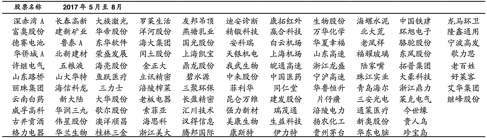

**关注者**

**从****1 到 10000+**

**我们每天都在进步**

