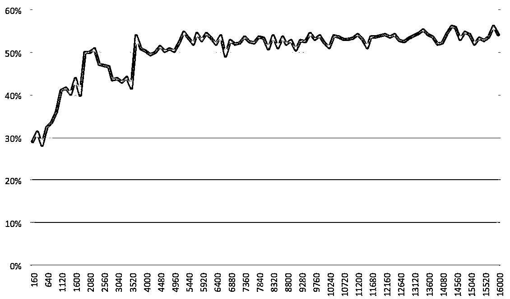
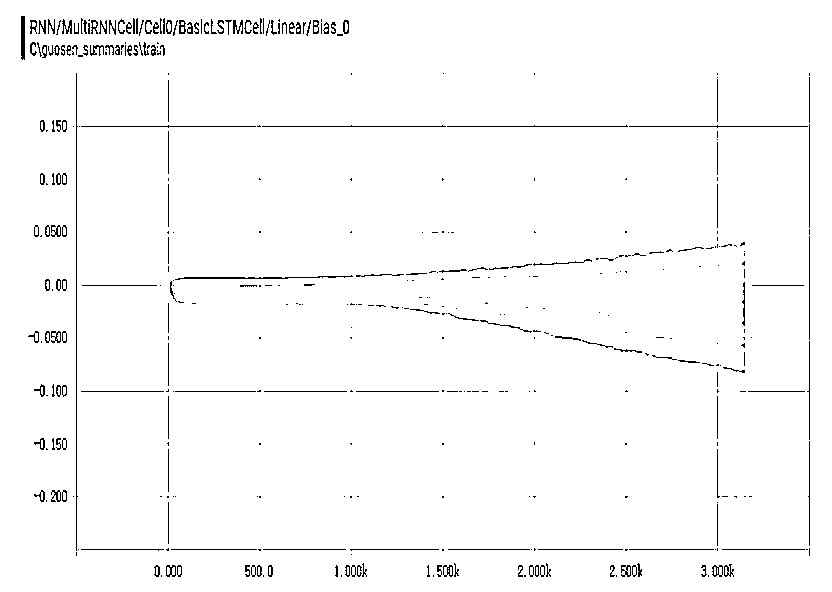

# 基于 RNN & LSTM 的股票多因子预测模型

> 原文：[`mp.weixin.qq.com/s?__biz=MzAxNTc0Mjg0Mg==&mid=2653285487&idx=1&sn=db4bcfd996ba461eb372d31df92bce91&chksm=802e2e7ab759a76c8f479c991c13f395b5876dee0dbd37f381bfbae7d783a85841b33728b9cb&scene=27#wechat_redirect`](http://mp.weixin.qq.com/s?__biz=MzAxNTc0Mjg0Mg==&mid=2653285487&idx=1&sn=db4bcfd996ba461eb372d31df92bce91&chksm=802e2e7ab759a76c8f479c991c13f395b5876dee0dbd37f381bfbae7d783a85841b33728b9cb&scene=27#wechat_redirect)

**编辑部**

微信公众号

**关键字**全网搜索最新排名

**『量化投资』：排名第一**

**『量       化』：排名第一**

**『机器学习』：排名第四**

我们会再接再厉

成为全网**优质的**金融、技术类公众号

 **前言** 

在机器学习如何应用到量化投资的系列文章中，今天我们专门来介绍一篇来自国信证券的研究报告，来从券商角度分析这个问题。

对于最直接的问题：能否利用神经网络，要机器自己识别 K 线图，自己做出判断，本篇推文的内容无法给出肯定的答案，但也不能否定其可能性，回答它需要更为深入、更为复杂的神经网络。本篇推文的目的是利用深度神经网络中的 RNN 的一些基本结果，对多因子模型进行尝试，以检验深度神经网络在多因子、投资领域的适用性，使得投资者能够对神经网络有 更为实践的理解，并能够在投资领域有所运用。 

**机器学习应用到量化投资往期系列:**

（点击标题，即可查看）

01. [机器学习该如何应用到量化投资系列（一）](http://mp.weixin.qq.com/s?__biz=MzAxNTc0Mjg0Mg==&mid=2653283935&idx=1&sn=56e84e986f278403d8840387c615a2a7&chksm=802e244ab759ad5c43720a7960567d215970877250ca72534016bf53a021c73f83665068639d&scene=21#wechat_redirect)

02. [机器学习该如何应用到量化投资系列（二）](http://mp.weixin.qq.com/s?__biz=MzAxNTc0Mjg0Mg==&mid=2653283982&idx=1&sn=6a14e2e145d8e7db46ba64a1439e1b2f&chksm=802e249bb759ad8d436e05f51625be0f5142ab8af374ebcfad24c332efc5fd0190a8283cbdfb&scene=21#wechat_redirect)

03. [机器学习该如何应用到量化投资系列（三）](http://mp.weixin.qq.com/s?__biz=MzAxNTc0Mjg0Mg==&mid=2653283997&idx=1&sn=15516e5874384a1c959c9ec037926e8a&chksm=802e2488b759ad9ed6cc8c3320bed22427b26bb89aa113fa77508e931254d6c78fa745a21fbe&scene=21#wechat_redirect)

04. [基于 SVM 模型的商品期货择时交易策略](http://mp.weixin.qq.com/s?__biz=MzAxNTc0Mjg0Mg==&mid=2653284388&idx=1&sn=8c0a75165ef3eee5a7ca089dfee85e72&chksm=802e2a31b759a327d106923b4e2c74706e8dab9848f998ec62de7bf19a4aeececc9aac362072&scene=21#wechat_redirect)

05. [关于涨跌的思考](http://mp.weixin.qq.com/s?__biz=MzAxNTc0Mjg0Mg==&mid=2653284479&idx=1&sn=19e499c32cb1ecca292ac1085de557ea&chksm=802e2a6ab759a37c2d745a875ab980318b7f75a3f581576371cb74c704d811625a7177bcab4b&scene=21#wechat_redirect)
06. [GoogLeNet 构建技术分析因子的模式识别](http://mp.weixin.qq.com/s?__biz=MzAxNTc0Mjg0Mg==&mid=2653284595&idx=1&sn=6439b58326185c23887ac205d84942bb&chksm=802e2ae6b759a3f08047f0ed169eecd528b733d89734cc74842f38f8f06f276d9926530931ac&scene=21#wechat_redirect)

07. [随机森林在因子选择上的应用](http://mp.weixin.qq.com/s?__biz=MzAxNTc0Mjg0Mg==&mid=2653284721&idx=1&sn=d10574bab3dd2c9e180ba10dfd997b36&chksm=802e2b64b759a272c0955c8d30f33e4fc94567d0924ea7503370413413afe5658c6d5479e3d7&scene=21#wechat_redirect)

08. [拟合具有非平稳特征的神经网络对股票进行预测](http://mp.weixin.qq.com/s?__biz=MzAxNTc0Mjg0Mg==&mid=2653284528&idx=1&sn=f67a9c0009ec0c4d737dd34ceb251e47&chksm=802e2aa5b759a3b36aec976833094c367add62bef415d6a833893ef1025852c6642e42fc0eec&scene=21#wechat_redirect)

09. [SVR 预测第二天开盘趋势和股价的正负统计分析](http://mp.weixin.qq.com/s?__biz=MzAxNTc0Mjg0Mg==&mid=2653284430&idx=1&sn=e54b370a96f11c87eab44fb2cfcaae6e&chksm=802e2a5bb759a34d910976b7b494eae954da9c7a5568c013af97f831563a0d01aca79619c75f&scene=21#wechat_redirect)

10. [通过 LSTM 神经网络进行时序预测针对股票市场](http://mp.weixin.qq.com/s?__biz=MzAxNTc0Mjg0Mg==&mid=2653284793&idx=1&sn=76c954a5a8006c815565d8669411f983&chksm=802e2bacb759a2ba4dd2ad122fe7cd99ab85ed29900b212189ab0af36749123c9e39b422363b&scene=21#wechat_redirect)

11. [时间序列预测与递归神经网络在 Keras 的应用](http://mp.weixin.qq.com/s?__biz=MzAxNTc0Mjg0Mg==&mid=2653284849&idx=1&sn=c5b70fa679397e654c1468ea2fb8f3f1&chksm=802e2be4b759a2f2f6acac4efb6f780ab0eca54cf32dbc1fc4fade7ba43e284ff8592fb35c9a&scene=21#wechat_redirect)

12. [机器学习模型的变量评估和选择基于技术指标](http://mp.weixin.qq.com/s?__biz=MzAxNTc0Mjg0Mg==&mid=2653284861&idx=1&sn=5c277b32615588758b192f5964dc5afa&chksm=802e2be8b759a2fe6c5237f29d7e0b1bb98c93b20bef23430db3418f4ee68a070abbb034c745&scene=21#wechat_redirect)

13. [RNNs 在股票价格预测的应用基于 Keras](http://mp.weixin.qq.com/s?__biz=MzAxNTc0Mjg0Mg==&mid=2653284925&idx=1&sn=97822360217b50ee3d2f74353753f62c&chksm=802e2828b759a13ee3090c9b14954fccbc008ea81938b14445ebbcd6ac71737c6ce94da643f4&scene=21#wechat_redirect)

14. [HMM 模型在量化交易中的应用](http://mp.weixin.qq.com/s?__biz=MzAxNTc0Mjg0Mg==&mid=2653285058&idx=1&sn=933d9e5739c24ff4f275cec5bec535c7&chksm=802e28d7b759a1c10824ffc4c29f5048df7d43ee730e226e97616eab3e4a27db3be6a48255e8&scene=21#wechat_redirect)

15. [CNN 预测股票走势基于 Tensorflow](http://mp.weixin.qq.com/s?__biz=MzAxNTc0Mjg0Mg==&mid=2653285128&idx=1&sn=fd4868634ce59b68809e7e4a3de80a21&chksm=802e291db759a00b734f2343936cb8339ddf6fbb5fcbd48c851e778cfcea04769ddc1aca894e&scene=21#wechat_redirect)

16. [gcForest（多粒度级联森林）算法预测股指期货涨跌](http://mp.weixin.qq.com/s?__biz=MzAxNTc0Mjg0Mg==&mid=2653285179&idx=1&sn=f3d07a411aff07a7c49125ce1a057db4&chksm=802e292eb759a0381ddf6f91534585aba72ec972fd022e673bc88d20ec33adb279da4d5bcb31&scene=21#wechat_redirect)

17. [股票成交量的预测基于 Keras&sklearn](http://mp.weixin.qq.com/s?__biz=MzAxNTc0Mjg0Mg==&mid=2653285152&idx=1&sn=dffda5618726811aa7ea22d10fe7dda8&chksm=802e2935b759a023469de332c9ea0c1b5a9da48082000544eb9ca49023ee57ccae5a685300e3&scene=21#wechat_redirect)

**RNN 简介**

RNN 不同于传统神经网络的感知机的最大特征就是跟时间挂上钩，即包含了一 个循环的网络，就是下一时间的结果不仅受下一时间的输入的影响，也受上一 时间输出的影响，进一步地说就是信息具有持久的影响力。放在实际中也很容 易理解，人们在看到新的信息的时候产生的看法或者判断，不仅仅是对当前信 息的反应，先前的经验、思想的也是参与进去这次信息的推断的。人类的大脑 不是一张白纸，是包含许多先验信息的，即思想的存在性、持久性是显然的。

举个例子，你要对某电影中各个时点发生的事件类型进行分类:温馨、烂漫、 暴力等等，如果利用传统神经网络是很难做到这一点的，但是 RNN 因为具备一 定的记忆功能，可以较好处理这个问题。 

其 中 A 代表隐 含层， X 为 输 入信号 ， h 为输出 信号。

从图中我们也可以看出，RNN 是具备链式结构特征的。递归神经网络因为该循 环结构而具有一定的记忆功能，可以被用来解决很多问题，例如：语音识别、 语言模型、机器翻译等。但是它并不能很好地处理长时依赖问题，这一问题在 (Yoshua Bengio，1994 )这篇论文中阐释得很明白。文章指出，最直接的的 原因是原始 RNN 模型也是采用 BP 算法进行权重和阈值的调整优化，梯度消失 问题依然得不到解决，虽然由于记忆功能的存在使得该问题比传统神经网络有 所缓解。但是类似于人类的记忆，人总是会忘事的，即在后面的时间步难以走 不回过去了，过去的时间步传递到现在也效果甚微了。所以这使得难以习得远 距离的影响。 

**长期依赖问题**

RNN 的一个核心思想是，既然网络结构是时间列表特征的，那么可以将以前的信息用到当前的任务中来，例如，在语义推断中，通过前面的话来猜测接下来 的话。如果 RNN 真的能够这样做的话，那么它们将会极其有用。但是事实真是 如此吗?我们来看下面的例子。

考虑一个语言模型，通过前面的单词来预测接下来的单词。如果我们想预测句 子“the birds are flying in the sky”中的最后一个单词，我们不需要考虑上下文 信息，就可以得到答案，很明显下一个单词应该是 sky。在这种情况下，当前 要预测位臵(sky)与相关信息(birds 和 fly)所在位臵之间的距离相对较小，RNN 可以被训练来使用这样的信息。 

但是如果当前位臵和相关信息位臵距离很远时候，RNN 就会遇到困难了。比如 “I grew up in China, when I was ten years old,...,I speak Chinese ”，如果要 预测最后一个单词 Chinese，那么我们得搜索较长距离，才能获取到有用的信 息 China。但令人失望的是，当需预测信息和相关信息距离较远时，原始 RNN 结构的传输的效率并不让人满意。虽然有学者证明了，我们可以通过精心设计 参数来达到预测较远处信息的目的，但是这样无疑是成本很高的，实现起来也很困难，也就失去了实践意义。

从上面分析可以看出，原始 RNN 中存在的长期依赖问题本质上还是梯度消失问 题。 

**LSTM**

LSTM (long-short term memory)，长短期记忆网络，就是为了解决上面的长 期依赖问题而生的。LSTM 是一种经过精心巧妙设计的 RNN 网络，尽管 LSTM 和原始 RNN 总的来看都会三大层，即输入层、隐含层、输出层。但是 LSTM 和原始 RNN 在隐含层设计上有较大的差异，主要是 LSTM 是在隐含层具备特 殊的 cell 结构。我们用下面两个对比图来进行较好的说明。 

原始 RNN 的隐含层设计 

LSTM 的隐含层设计 

LSTM 的隐含层设计中图标解释 

每一条黑线传输着一整个向量，从一个节点的输出到其他节点的输入。粉色的圈代表 pointwise 的操作，诸如向量的和，积等运算，而黄色的矩阵就是学习到的神经网络层。合在一起的线表示向量的连接，分开的线表示内容被复制， 然后分发到不同的位臵。

**LSTM 结构设计与思想**

LSTM，长短期记忆网络，从上面的图中也可以看出，LSTM 是将一个简单型的 激活改成几部分的线性组合的储存单元 cell 去激活。相当于每次都可以控制下 一步的输出信息，如是否要包含前面的信息，包含多少的问题等。类似于进行下一步操作前，根据情况提醒你需要注意的信息。好记性不如烂笔头，就是这 个 道理。

每个存储单元由三大构件组成，输入门，输出门和跨越时间干扰的传入自身的 内部状态。 

LSTM 的单元结构 

**输入门(input gate)：**控制当前输入和前一步输出 ,他们能进入新的 cell 单元的信息量。

**忘记门(forget gate)：**为了更有效传输，需要对信息进行过滤，决定哪些信息可以遗忘。

**输出门：**cell 的新状态下信息更新。

**LSTM 详细实现步骤图解**

为了更好地说明，我们下面在进行每一步图解时候，都结合语义识别功能进行 说 明，这样有更直观的认识。

第一步，先由忘记门决定丢弃哪些信息。 

LSTM 的单元结构之忘记门 

即结合当前输入和前一步输出，经激活函数，得到一个概率变量，再与原 cell 结构 做运算得到遗忘后的信息。比如 f=0 时，表示 的所有信息都会被遗 忘，f=1 时表示 的信息都会被保存。

让我们回头看看语义预测的例子中来基于已经看到的词去预测下一个词。在这个问题中，细胞状态可能包含当前主语的性别，因此正确的代词可以被选择出 来。当我们看到新的主语时要想匹配对应的代词，则我们希望忘记旧的主语和代词。

第二步， 由输入 层决定 什么样 的信息 会被存 储到细 胞中。 

LSTM 的单元结构之输入门 

这一步这里包含两个部分。第一，sigmoid 层决定什么值我们将要更新。然后，

一个 tanh 层创建一个新的候选值向量 ，会被加入到状态中。 

在我们语义预测的例子中，我们希望增加新的主语的性别或者别的信息添加到细胞状态中，来替代旧的主语并完善新的主语的信息。 下一步，我们会讲这两个信息来产生对状态的更新。 

LSTM 的单元结构之 cell 更新 

即我们 cell 的更新是由经忘记门剩下的信息和需要更新的信息的结合，在语义预测中就是，我们忘记了旧的主语，我们在换成新的主语的时候可以由输入层决定需要更新的信息，比如性别、年龄等。这些作为整体保存在新的 cell 中。

再接着，就是输出信息。这个输出将会基于我们的细胞状态，但是也是一个过滤后的版本。首先，我们运行一个 sigmoid 激活函数来确定细胞状态的哪个部分将输出出去。接着，我们把细胞状态通过 tanh 进行处理(得到一个在 -1 到 1 之间的值)并将它和 sigmoid 的输出相乘，最终我们仅仅会输出我们确定输 出的那部分。

在语义预测的例子中，当我们看到了一个代词，可能需要输出与一个动词相关的信息。例如，由 sigmoid 决定可能输出是否代词是单数还是负数，这样如果经过 tanh 函数的细胞状态是动词的话，sigmoid 和 tanh 结合我们也就知道了动词需要进行的词形变化 。具体如下图所示：

LSTM 的单元结构之输出 

**LSTM 的发展**

上面我们已经把标准的 LSTM 解释清楚了，但是为了满足更复杂的需求，LSTM 出现很多变形。其中最流行的是由 Gers & Schmidhuber (2000) 提出的，增加 了 “peepholeconnection”。是说，我们让“门”也要接受细胞状态的输入。 

LSTM 的变形 1-peephole connection 

另一个变体是通过使用复合忘记和输入门。不同于之前是分开确定什么忘记和需要添加什么新的信息，这里是一同做出决定。 

LSTM 的变形 2-复合忘记门和输入门 

还有比较流行的是改动较大的变体是 Gated Recurrent Unit (GRU)，这是由 Cho, et al. (2014) 提出。它将忘记门和输入门合成了一个单一的更新门。同样还混合了细胞状态和隐藏状态，和其他一些改动。最终的模型比标准的 LSTM 模型要简单 

LSTM 的变形 3-GRU

**多因子建模**

**数据结构**

多因子模型处理的数据结构是标准的面板数据，包括三个维度:个股、时间、 因子，对应的应变量是 T+1 期的收益率。 

应用于 RNN 网络结构中时，与传统的多因子模型有一定的区别:

T+1 期的收益率仍然是训练的标签(label)，因子对应的是样本的特征(feature)， 个股对应的是一个样本，但是，时间维度，在 RNN 中，是一个循环的过程，将过去 T-n 期的因子数据都要纳入 T+1 期收益率的预测之中: 

多因子的 RNN 数据结构 

我们先设定具体的参数，再进一步理解 RNN 在多因子训练中的具体过程。

**参数设定**

**回测时间：**2007 年 5 月 1 日-2016 年 4 月 30 日，该时间区间下月度数据训练样本数超过 18w(每一个股票每一个月底代表一个样本)

**策略时间：**2016 年 5 月 1 日-2017 年 4 月 30 日

**RNN 时间长度( steps)：**24 个月，即每一个训练样本包含过去 24 个月的因子 数据，依次从第一个月输入神经网络，并将返回值与下一个月因子同时循环输 入神经网络，以此类推，直到得到第 24 个月的预测值。

**因子数：**由于放入神经网络中训练，我们在期初并不评价因子的有效性，同时也不对因子进行合并，全部输入模型之中。(剔除部分相关性过高，且属于同类因子，该过程可以降低模型训练过拟合的可能)最终入选 48 个小因子，属于 10 类常见的风格因子。(详见后文统计与国信多因子系列报告)

**分类数：**为了验证预测的准确性，同时排除样本中的部分噪声，我们将样本的收益率类型分为三类:上涨(月收益率大于 3%)、下跌(月收益率小于-3%)、 中性(月收益率处于-3%与 3%之间) 

**batch size：**1000，该参数属于 RNN 神经网络的系统参数，是 BP 算法中用来计算梯度的参数，即每次的训练，随机抽取 18w 训练样本中的 1000 个样本作为训练样本。 

**隐层神经元个数：**400，2 层，该参数同样属于 RNN 神经网络的系统参数，是 输入样本与隐层细胞连接的“神经”个数，受限于电脑的性能，只能设定为三位数，隐层个数也仅为 2 层。

**学习速率：**0001，RNN 神经网络的系统参数，是模型训练时梯度下降的速度， 过 高容易导致梯度消失 ，过低则训练过慢。

**交叉检验比例：**10%，为了防止模型过拟合，选择 18w 样本中的 90%作为训练 集，用以训练模型参数，而剩余 10%不参与训练，只作为测试集进行检验，如果训练集准确率与测试集准确率同时上升，则说明模型过拟合的可能较小。

需要说明的是，通过训练，我们发现，最后的 4 个 RNN 系统参数，在本推文中并不敏感，我们只设定为常见的参数值，就可以得到较为理想的准确率。

**训练结果**

数据预处理:仿照多因子的流程，对截面因子进行去极值、标准化的处理，同时， 为了剔除行业的效果， 截面单因子对行业矩阵回归，取残差作为最终输入的因子 数据。

**样本内训练**

经过 100 次迭代，已经能够观察到训练收敛的结果。 

基于上图的基本的两层 RNN 网络结构，得到的损失率如下图: 

Basic_LSTM 损失率 

转换为模型的 3 类收益率预测值与真实值的对比准确率： 

从曲线中可以看到，检验集的准确率最终收敛于 85%-90%之间，这个准确率水平在机器学习的大多数模型中并不足够高，但考虑到我们使用的是基本的 RNN 结构，同时是存在市场博弈的股票市场，我们认为这一收敛水平能够反映出 LSTM 神经网络对多因子数据进行了有效的训练与特征抓取。

**样本外检验**

通过训练的最终结果，我们将样本外数据 2016-2017 输入，得到模型对未来 12 个月的股票收益率的估计。其准确率的走势如下图: 

Basic_LSTM 样本外选股准确率 

样本外的准确率最终收敛水平仅高于 50%，但是需要区分这一水平所能够反映的真实预测程度。为了直观的检验 LSTM 模型样本外的选股效果，我们选择模型给出的每个月个股的预测结果作为选股标准。

每月末，将样本外数据输入模型，并根据模型输出的对个股收益的三类(-3%、3%)预测，将全 A 股股票分为三个组合——高收益预测、低收益预测、中性预测。 

全 A 股预测组合净值 

可以看到，模型在最近一年，对高、低收益的预测胜率较高，但对于居中的中性组合预测效果较差。 

全 A 股多空组合累计净值 

多空超额收益在最近 12 个月的胜率为 75%。从多空累计净值上看，多空超额收益最近 12 个月在 4.5%。

为了进一步验证模型对于股票预测的准确性，我们把选股的标准从模型输出的预测变为模型最终预测前的激活值。由于我们将预测目标分为了三类(高、中、 低)，神经网络会选择激活值最大的类别，作为预测类别。因此，激活值实际上 反映了模型对个股未来收益的预测概率。

基于此，我们重新构建三类股票组合，每一期，选择激活值最大的 30%的股票最 为对应组合: 

30%多空组合净值 

可以发现，模型对于中性收益的预测效果仍然没有改进，但是多空收益的预测效果比全 A 股更加准确。 

多空组合的超额收益超过 9%，而最近 12 个月的月度胜率超过 90%。通过样本外数据的回测，我们发现，通过 LSTM 的 RNN 网络学习，对股票的收益率预测实际上是较为准确的，同时，模型对于不同收益类型的预测概率能够更进一 步的反映出股票上涨与下跌的概率大小。 

**结果分析**

回顾 RNN 神经网络的结构，在基本的 LSTM 结构中，每一期的输入样本，其与隐层、隐层与输出层的 连接权重是共享的，也就是说，在 我们具体的模 型里，每一期 48 个因子的输入，都对应有 400 个权重连接到隐层 400 个神经元上， 每一期的循环都会对这 400 个权重进行更新。

下图是输入层的权重分布的更新过程: 

输入层权重 w 分布变化 

输入层 bias 分布变化 

输入层权重 w 分布 

输入层 bias 分布 

与我们观察到的模型训练的损失率收敛特征一致，神经网络在较早的迭代次数时已经逐渐收敛，参数权重趋于稳定。

既然知道了输入层的权重，我们考虑观察训练结束时，模型得到的因子与隐层的连接权重，作为因子在系统中的贡献程度。 

参数权重变化示意图 

从示意图能够直观的理解因子的权重。X1、X2 代表实际模型中的因子，连接输入样本 X1、X2 与隐层神经元的曲线即为训练的权重，随着样本迭代，权重朝着最优解的方向变化，权重越大，则示意图中的曲线越粗。

由于我们观察到本报告中的参数分布较为稳定，因此我们认为，可以大致将输入层因子的权重总和作为该因子在模型中的贡献度。虽然因子真实的贡献度也 会受到隐层权重的影响，但输入层的最终结果仍然具有一定的参考意义。 

输入层因子权重绝对值之和 

**总结**

多因子模型的发展趋于成熟，因子的 alpha 收益出现了下降的趋势。如果维持多因子模型的收益是量化领域的一个核心问题。

我们认为 扩展的方向包括**新的因子挖 掘、股票池的区分，以及非线性因子特征的 挖掘。 而机器学习，正是非线性问题的一个有效解决途径。**具体到本篇推文涉及的深度神经网络 RNN 来说，即是通过时间维度的扩展，以及空间深度的扩展，将目前的因子空间，扩散到更高维度的空间中去，并在其中找寻有效的路径，实现对因子模型的预测。

在严格区分了训练集、测试集、样本外数据集之后，我们通过训练能够得到较高准确度的收敛结果，并且在样本外数据回测中，得到显著的超额收益。交叉检验的准确度接近 90%，样本外多空收益最近 12 个月的胜率则超过 90%。

这些结果的意外之处在于，利用基本的 LSTM 结构，能够在参数未优化之前得到如此高的准确率与显著水平，对于模型的进一步改进和优化令人有所期待。 同时，这些结果的意料之中在于，当我们不再将机器学习、神经网络当做复杂的 “黑箱”，其强大的数据处理能力必将在投资领域展露出来，也同样令人期待。 

**关注者**

**从****1 到 10000+**

**我们每天都在进步**

