# N-CryptoAsset 投资组合 | 使用 PCA 识别高度相关的加密货币（最近听说某币很疯狂哦！）

> 原文：[`mp.weixin.qq.com/s?__biz=MzAxNTc0Mjg0Mg==&mid=2653285430&idx=1&sn=48b97a90d7c3d8a25dedd59b3e8cc8f5&chksm=802e2e23b759a73581443d0c4f9a2ea42b08b55a40835acd6568860e8c4332ad081d497b1c38&scene=27#wechat_redirect`](http://mp.weixin.qq.com/s?__biz=MzAxNTc0Mjg0Mg==&mid=2653285430&idx=1&sn=48b97a90d7c3d8a25dedd59b3e8cc8f5&chksm=802e2e23b759a73581443d0c4f9a2ea42b08b55a40835acd6568860e8c4332ad081d497b1c38&scene=27#wechat_redirect)


**编辑部**

微信公众号

**关键字**全网搜索最新排名

**『量化投资』：排名第一**

**『量       化』：排名第一**

**『机器学习』：排名第四**

我们会再接再厉

成为全网**优质的**金融、技术类公众号

**前言**

在本文中，以每日加密货币价格时间序列为例，以选择其中一个加密货币，通过巧妙地合并，我们将创建一个可存储的（例如 HDF5，CSV 文件格式）和可重用的 N-CryptoAsset 投资组合的文件。接下来，对于任何手动定义的时间间隔，我们将应用主成分分析（PCA）去实现建立一些模型，最后基于几个主要组件的分析来识别高度相关的加密货币。

520

找个好人

**Python 中的**

**N-Cryptocurrency 组合**

考虑任何资产的单一（每日抽样）收盘价时间序列。 它有开始和结束日期。 如果我们使用的数据来源是直接通过交易所，每个交易日都有相应的收盘价。 与外汇货币不同，加密货币全年都可以全天候交易。 但是，请记住，每个单一的加密货币在市场上都有自己的“fist time”，因此历史价格系列的长度不一样。 幸运的是，Python 和它的 pandas 可以让我们控制时间序列范围和进一步的过滤。 下面直接开始程序吧:

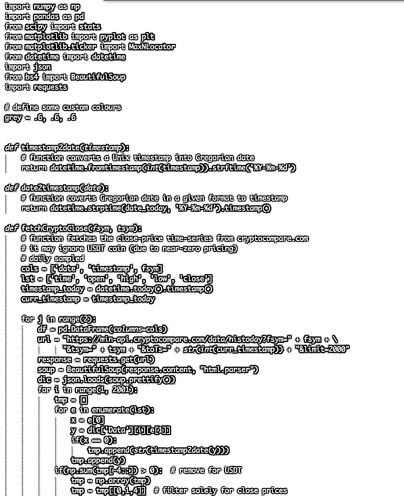

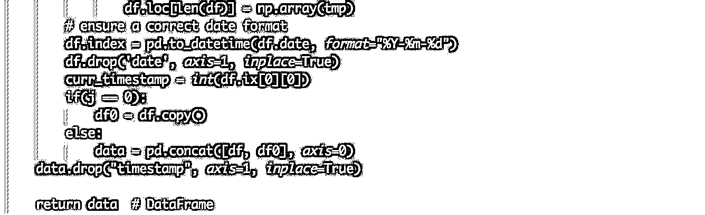

获取时间序列很容易。 创建投资组合需要更多的关注细节。 让我们把选择的加密货币相对应的代码列表（fsym）放在一起，让我们定义“versus”我们希望表达的全部货币（tsym）：

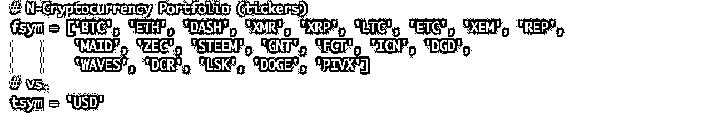

由于交易中流动性很差，所以省略了 USDT。

通过运行程序我们给定（fsym）代码列表（每日历史收盘价）创建**N-CryptoAsset**投资组合：

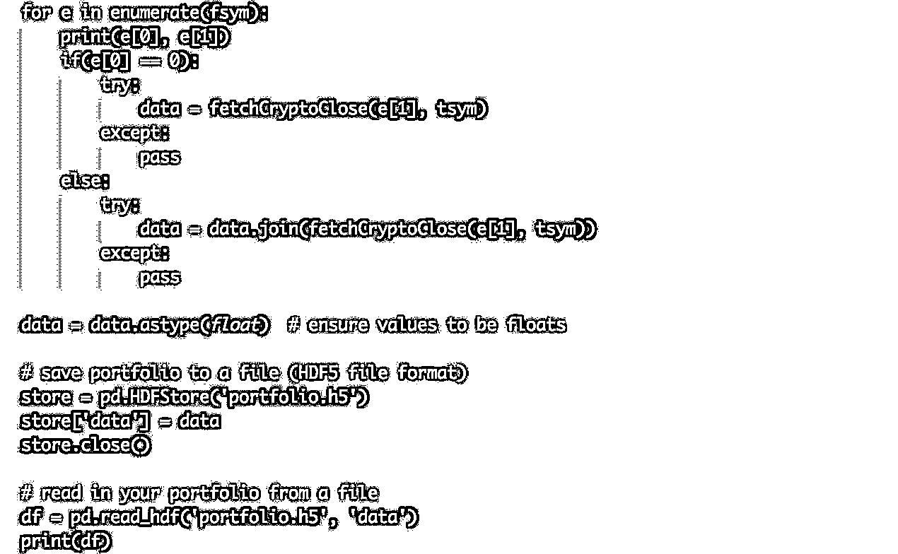

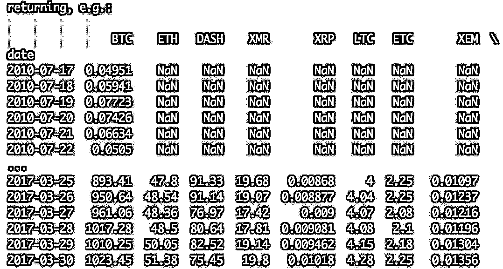

比特币（BTC）是所有加密货币的头一把交易。

由于我们的 DataFrame（df）包含大量缺失值（NaN），所以从这一点来看，有多种可能性可以提取数据分析子集。 例如，如果您想创建一个子组合，比如 df1，只能存储 BTC，DASH 和 XMR，可以通过以下方式实现：

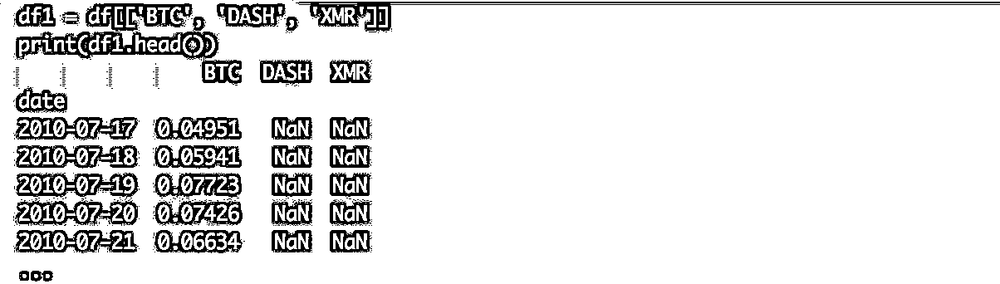

那些 NaN 可以分散注意力。 不好的做法是用固定值（例如零）替换它们，因为它引入了无效数据。 插值也是一个坏主意。 一个好的是根据选择的日期/时间间隔进行过滤，或强制所有的时间序列在同一天开始，数据可用于所有三个货币。 后者由 pandas 自动完成，如下所示：

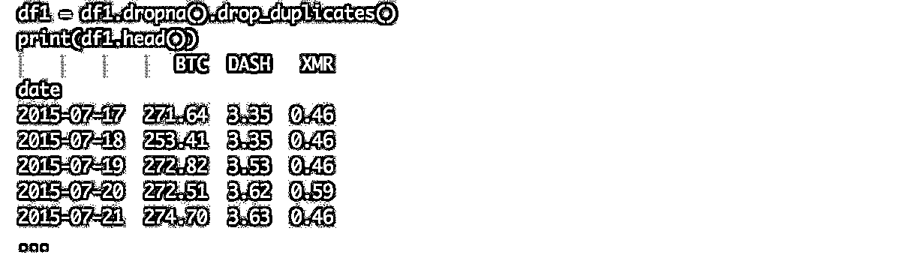

在此选择 2017 年 3 月作为输入数据，所有 21 个加密时间序列将在以下内容中进行分析。

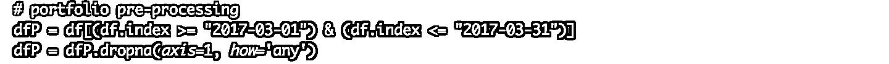

**相关性基于 PCA**

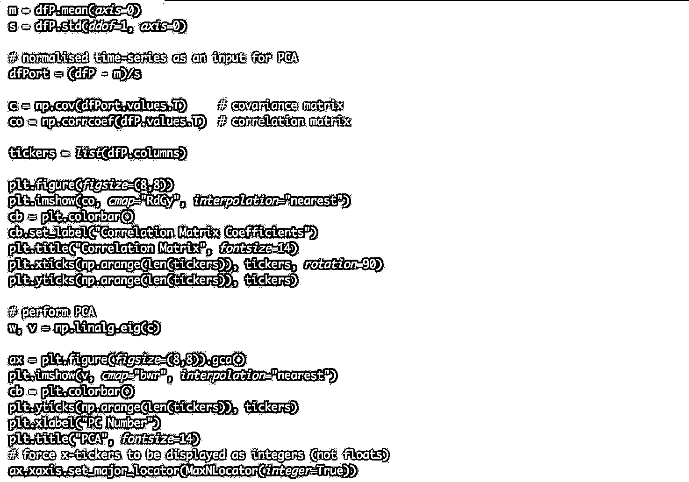

相关矩阵：

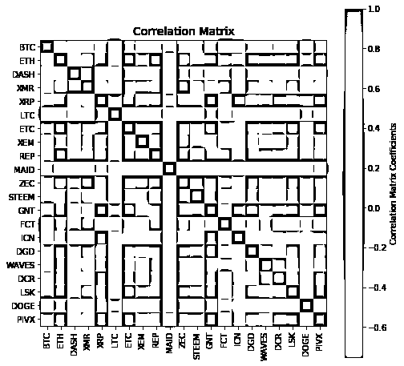

PC loadings (columns, <nobr aria-hidden="true">k=1,…,21):</nobr> 

<nobr aria-hidden="true">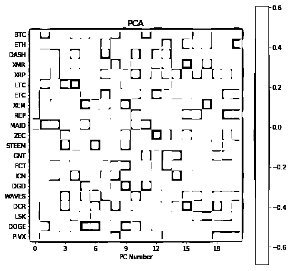</nobr>

<nobr aria-hidden="true">现在，构建一个涵盖 PCA 的最后两个 PC 组件（PC-20 和 PC-21）中每个隐式货币的相对权重的二重曲线，该协方差矩阵涵盖 2017 年 3 月的全时间段：</nobr>

<nobr aria-hidden="true">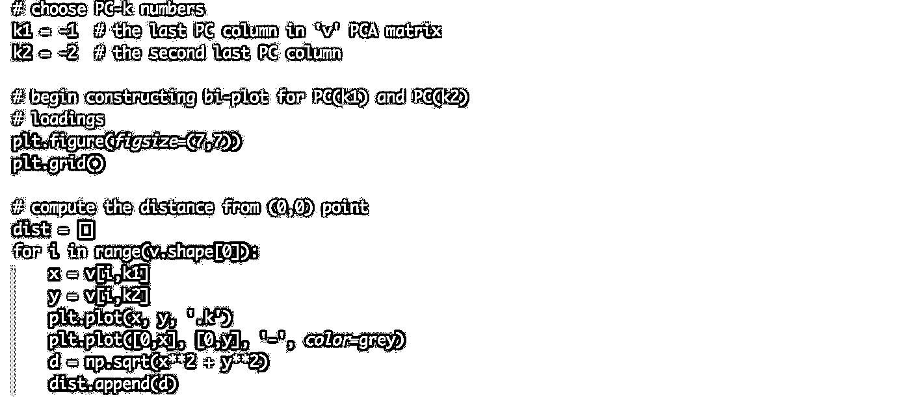</nobr>

<nobr aria-hidden="true">我们需要确定最大负载的加密货币。 通过阈值，采用导出距离的平均值加上一个标准偏差。 接下来，检查每个货币的数量为 1 号，2 号，3 号或 4 号，保存为一个列表中的元组。 最后，通过分别添加 x 和 y 标签来完成一个双曲线的绘制：</nobr>

<nobr aria-hidden="true">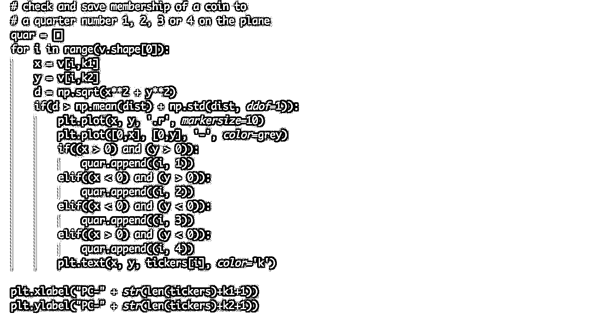</nobr>

<nobr aria-hidden="true">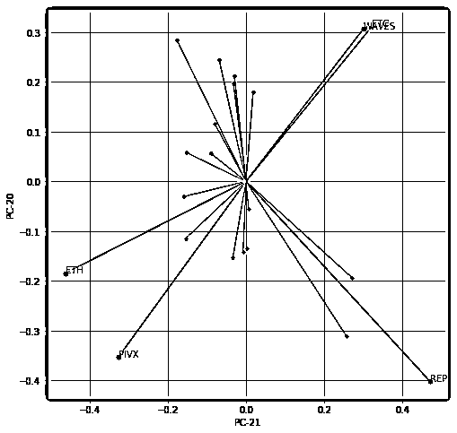</nobr>

<nobr aria-hidden="true">第 1 季度“高于门槛值”的货币可能与第 3 季度发生的高度相关。同样适用于第 2 季度与第 4 季度。我们使用两种不同工具的这种货币对（密码时间序列）的线性相关性，即单因素线性回归（R2）和 Kendall 的等级相关度量τ</nobr>

<nobr aria-hidden="true">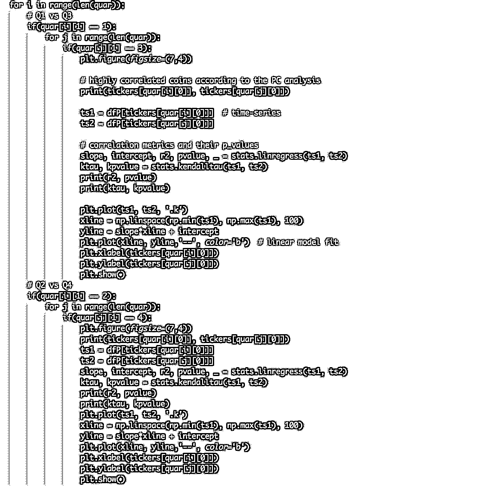</nobr>

<nobr aria-hidden="true">高度相关的加密货币：</nobr>

```py
ETC ETH
0.953695467194 1.13545626686e-16  # R²  p-value
0.840760907233 3.03600231596e-11  # tau  p-value
```

<nobr aria-hidden="true">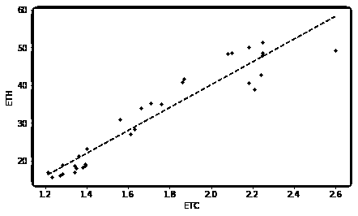</nobr>

```py
ETC PIVX
0.937915426073 7.20370581785e-15  # R²  p-value
0.78875507792 4.55270029579e-10   # tau  p-value
```

<nobr aria-hidden="true">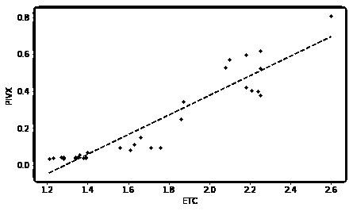</nobr>

<nobr aria-hidden="true">WAVES ETH</nobr>

<nobr aria-hidden="true">0.909168786883 1.48631538239e-12  # R²  p-value</nobr>

<nobr aria-hidden="true">0.81377872765 1.26296896563e-10   # tau  p-value</nobr>

<nobr aria-hidden="true">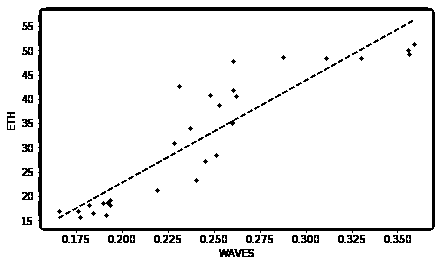</nobr>

<nobr aria-hidden="true">WAVES PIVX</nobr>

<nobr aria-hidden="true">0.894512813936 1.18055349284e-11  # R²  p-value</nobr>

<nobr aria-hidden="true">0.753498821898 2.59829246278e-09  # tau  p-value</nobr>

<nobr aria-hidden="true">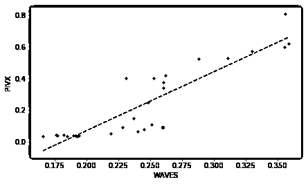</nobr>

<nobr aria-hidden="true">- END -</nobr> 

<nobr aria-hidden="true">**关注者**</nobr>

<nobr aria-hidden="true">**从****1 到 10000+**</nobr>

<nobr aria-hidden="true">**我们每天都在进步**</nobr>

<nobr aria-hidden="true"></nobr>