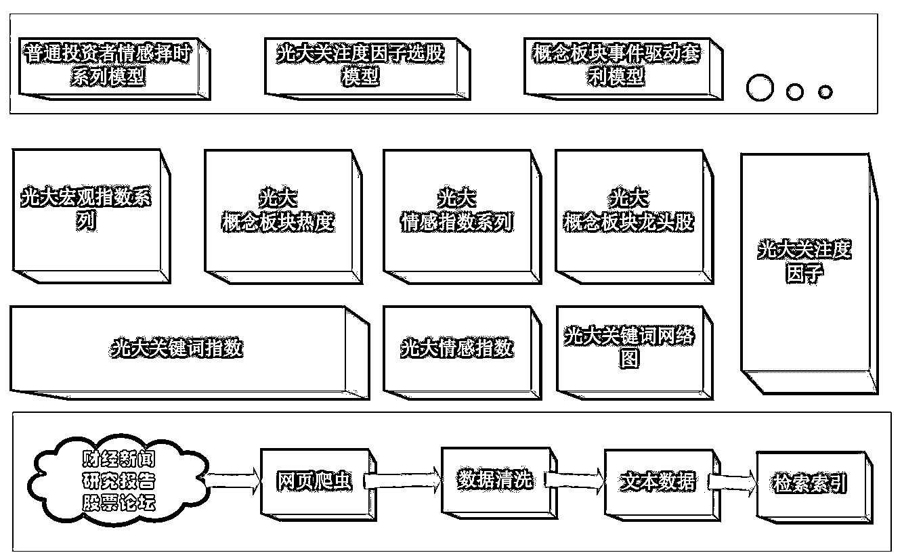

# 文本挖掘在量化投资中的应用之（28 篇最全券商研报）+（2 个策略程序）

> 原文：[`mp.weixin.qq.com/s?__biz=MzAxNTc0Mjg0Mg==&mid=2653285408&idx=1&sn=a21c1ba55f954cf8875a45b736977645&chksm=802e2e35b759a72314dda71191036327642ebf168e1bb161ec37f6f56a563c73cc73d72fefda&scene=27#wechat_redirect`](http://mp.weixin.qq.com/s?__biz=MzAxNTc0Mjg0Mg==&mid=2653285408&idx=1&sn=a21c1ba55f954cf8875a45b736977645&chksm=802e2e35b759a72314dda71191036327642ebf168e1bb161ec37f6f56a563c73cc73d72fefda&scene=27#wechat_redirect)

**编辑部**

微信公众号

**关键字**全网搜索最新排名

**『量化投资』：排名第一**

**『量       化』：排名第一**

**『机器学习』：排名第四**

我们会再接再厉

成为全网**优质的**金融、技术类公众号

**前言**

在量化投资交流群里【[群链接（点击进入）】](http://mp.weixin.qq.com/s?__biz=MzAxNTc0Mjg0Mg==&mid=2653284755&idx=1&sn=4e9ac5627fd01f9996166cec1b37f5d5&chksm=802e2b86b759a29023763d4ee5002ced8ad4546adf5086bb9b08bc75e47627ec18b2082eef61&scene=21#wechat_redirect)，有人讨论一些关于文本挖掘在量化投资中的应用，编辑部特别整理了一下。希望大家有所收获哦！

我们始终坚持

**不让大家像别的公众号一样**

通过朋友圈和微信群转发来获取干货

**分享就是分享**

**就应该做到无偿**

我们只不过做了

搬运工

希望大家可以支持我们

**文本研究报告**

我们从 2010 年开始到现在，基本筛选了所有券商涉及文本挖掘的研究报告，主要是： 

**光大证券**

在光大中文云系统中，我们主要是分为三个具体模块，分别是数据获取与 清洗模块、数据引擎与指标构建模块、策略开发模块。

处于最底层的是数据获取与清洗模块。在该模块中，我们及时地从相应的 网站获取所需的所有文本信息。然后对获取得到的数据进行清洗，清除掉一些 重复和无意义的文本，然后将其存储于相应的文件库内。目前我们获取的文本 资料主要由三个来源，一是热门财经新闻，其次是所有分析师的研究报告，最 后是一些热门股票论坛上的所有帖子。从 2010 年 6 月到现在，我们的系统上 较为完整的积累了近 36 万篇研究报告、300 万篇财经新闻、2500 万条论坛帖子。 而考虑到文本数量的巨大以及为了维持较高的性能，我们为这些文本资料建立 了相应的全文索引，通过该全文索引，我们可以迅速地在海量的文本资料中获 取所需的具体资料，目前从 2500 万条论坛帖子中搜寻出某个关键词所在的所 有位臵仅需要 1 秒左右。

系统的中间部分是数据引擎与指标构建模块。针对于底层的全文索引，为 了方便我们日常的管理与引用，我们开发了各种数据引擎，这些数据引擎在一 定程度上隔绝了应用和底层的文本资料，保持了各自的独立性，同时也可以让 使用者较为方便地进行调用。这些数据引擎主要包括了光大关键词指数、光大 情感指数、光大关键词网络图以及光大关注度因子。在该模块中，我们还完成 了基于各数据引擎，构造我们的因子与指标产品的工作。目前我们的因子和指 标产品主要包括有光大宏观系列指数、光大情感指数系列、光大概念板块热度、 光大概念板块龙头股、光大关注度因子等。

而在文本挖掘系统最上层的模块就是基于中间模块所产生的各指标和因 子数据，我们所开发的各类投资模型，目前主要有普通投资者情感择时系列模 型、光大关注度因子选股模型、概念板块事件驱动的套利模型等。

在数据的维护及更新上，我们编写好所有的自动执行的程序，在相应的时 间自行地启动和执行，这样可以方便我们及时获取最新的数据，并且减轻了我 们进行系统维护的成本。 

**广发证券**

广发证券主要是有一个系列的研究报告，值得研究：

**互联网大数据挖据系列专题（1-10）**

**国泰君安**

国泰君安和广发一样，也是有一个系列的研究报告

**招商证券**

招商金工团队在 Pyhon 的 jieba 分词工具的基础上，开发了一 款为金融类文本专门打造的分词工具—招金词酷。

**所有研报**

**文本策略程序**

**程序**

**程序**

- END -

**关注者**

**从****1 到 10000+**

**我们每天都在进步**

在后台回复

**文本量化投资**

即可获取源资料

有些人不知道**后台回复**如何操作

为大家介绍一下：

**预祝周末快乐！**