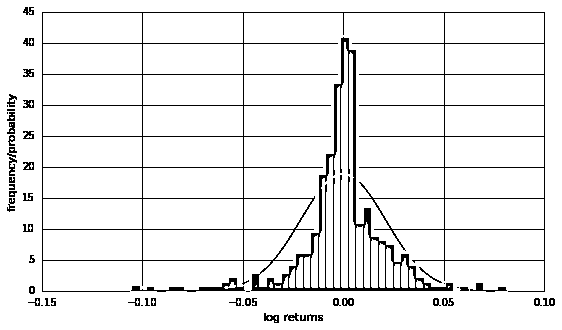

# 统计学在期权定价和交易中的应用

> 原文：[`mp.weixin.qq.com/s?__biz=MzAxNTc0Mjg0Mg==&mid=2653285387&idx=1&sn=3db5268bbba384facec6b2492698ec94&chksm=802e2e1eb759a708efb5dc63645d9a5f43bd343b30295d6a78e461186f5b796c7fbc38e57816&scene=27#wechat_redirect`](http://mp.weixin.qq.com/s?__biz=MzAxNTc0Mjg0Mg==&mid=2653285387&idx=1&sn=3db5268bbba384facec6b2492698ec94&chksm=802e2e1eb759a708efb5dc63645d9a5f43bd343b30295d6a78e461186f5b796c7fbc38e57816&scene=27#wechat_redirect)


**编辑部**

微信公众号

**关键字**全网搜索最新排名

**『量化投资』：排名第一**

**『量       化』：排名第一**

**『机器学习』：排名第四**

我们会再接再厉

成为全网**优质的**金融、技术类公众号

公众号与优矿联合推出几期关于期权知识的分享。希望能给大家从不同角度解读期权知识。


**期权定价与内在价值**

## 常见的期权内在价值被定义为 0 与期权立刻执行所能获得回报的较大值，即 max(S-K, 0)(看涨期权的情形)和 max(K-S, 0)(看跌期权的情形)。

```py
# Option Strike K = 8000 # Graphical Output S = np.linspace(7000, 9000, 100)  # index level values h = np.maximum(S - K, 0)  # inner values of call option plt.figure()
plt.plot(S, h, lw=2.5)  # plot inner values at maturity plt.xlabel('index level $S_t$ at maturity')
plt.ylabel('inner value of European call option')
plt.grid(True)
```


下面的代码是使用 BSM 模型来对期权进行定价：

*   无收益资产欧式看涨期权的定价公式：


*   无收益资产欧式看跌期权的定价公式:


下面画出了根据 BSM 模型计算出的期权的现值

```py
# Model and Option Parameters K = 8000  # strike price T = 1.0  # time-to-maturity r = 0.025  # constant, risk-less short rate vol = 0.2  # constant volatility # Sample Data Generation S = np.linspace(4000, 12000, 150)  # vector of index level values h = np.maximum(S - K, 0)  # inner value of option C = [BSM_call_value(S0, K, 0, T, r, vol) for S0 in S] 
  # calculate call option values# Graphical Output plt.figure()
plt.plot(S, h, 'g-.', lw=2.5, label='inner value') 
  # plot inner value at maturity plt.plot(S, C, 'r', lw=2.5, label='present value')  
 # plot option present valueplt.grid(True)
plt.legend(loc=0)
plt.xlabel('index level $S_0$')
plt.ylabel('present value $C(t=0)$')
```


**历史波动率刻画**

已经知道，B-S-M 期权定价公式中的期权价格取决于下列五个参数：标的资产的市场价格，执行价格，到期期限，无风险利率和标的资产价格波动率。这五个参数中，前三个都是交易获得确定的值，在发达的经济市场，无风险利率也很容易估计，而估计标的资产的波动率要比估计无风险利率要困难的多。估计标的资长价格波动率有两种方法：历史波动率和隐含波动率。

所谓历史波动率，就是从标的资产价格的历史数据中计算出价格对数收益率的标准差，具体方法一般有以下两种：

*   直接估计（矩估计）

*   GARCH 模型

很遗憾，GARCH 模型在中国市场无效。

模拟数据

```py
gbm = simulate_gbm()
print_statistics(gbm)
```

RETURN SAMPLE STATISTICS

--------------------------------------------- 

Mean of Daily  Log Returns  0.000294 

Std  of Daily  Log Returns  0.012479 

Mean of Annua. Log Returns  0.074109 

Std  of Annua. Log Returns  0.198092

 --------------------------------------------- 

Skew of Sample Log Returns  0.008369 

Skew Normal Test p-value   0.861095

 --------------------------------------------- 

Kurt of Sample Log Returns  0.059948 

Kurt Normal Test p-value   0.495981 

--------------------------------------------- 

Normal Test p-value  0.781084 

--------------------------------------------- 

Realized Volatility  0.198147 

Realized Variance  0.039262

```py
quotes_returns(gbm)
```


上证 50ETF 的实际波动率

```py
etf50 = DataAPI.MktFunddGet(ticker=u"510050",beginDate=u"20150206",endDate=u"20160929",field=[u"closePrice", u"tradeDate"] ,pandas="1")
etf50.set_index=("tradeDate")
etf50['returns'] = np.log(etf50['closePrice'] /etf50['closePrice'].shift(1))
# Realized Volatility (eg. as defined for variance swaps) etf50['rea_var'] = 252 * np.cumsum(etf50['returns'] ** 2) / np.arange(len(etf50))
etf50['rea_vol'] = np.sqrt(etf50['rea_var'])
print_statistics(etf50)
```

RETURN SAMPLE STATISTICS

---------------------------------------------

 Mean of Daily  Log Returns -0.000067 

Std  of Daily  Log Returns  0.021153 

Mean of Annua. Log Returns -0.016917 

Std  of Annua. Log Returns  0.335787

--------------------------------------------- 

Skew of Sample Log Returns -0.734791 

Skew Normal Test p-value    0.000000 

--------------------------------------------- 

Kurt of Sample Log Returns  4.597651 

Kurt Normal Test p-value   0.000000 

--------------------------------------------- 

Normal Test p-value    0.000000 

--------------------------------------------- 

Realized Volatility   0.335789 

Realized Variance   0.112754

```py
# histogram of annualized daily log returns def return_histogram(data):
    ''' Plots a histogram of the returns. '''
    plt.figure(figsize=(9, 5))
    x = np.linspace(min(data['returns'][1:]), max(data['returns'][1:]), 100)
    plt.hist(np.array(data['returns'][1:]), bins=50, normed=True)
    y = dN1(x, np.mean(data['returns'][1:]), np.std(data['returns'][1:]))
    plt.plot(x, y, linewidth=2)
    plt.xlabel('log returns')
    plt.ylabel('frequency/probability')
    plt.grid(True)
return_histogram(etf50)
```



```py
etf50.index = etf50['tradeDate']
quotes_returns(etf50)
```


**期权的 Greeks**

期权的 Greeks 主要描述了期权价格对其标的的资产价格、到期时间、波动率和无风险利率四个参数值的敏感性指标。

```py
plot_greeks(BSM_delta, 'delta')
```


```py
plot_greeks(BSM_gamma, 'gamma')
```


```py
plot_greeks(BSM_theta, 'theta')
```


```py
plot_greeks(BSM_rho, 'rho')
```


```py
plot_greeks(BSM_vega, 'vega')
```


二叉树模型和 BSW 模型

```py
BSM_benchmark = BSM_call_value(S0, K, 0, T, r, sigma)
BSM_benchmark
```

10.45058357218553

```py
CRR_option_value(S0, K, T, r, sigma, 'call', M=2000)
```

10.449583775457942

```py
plot_convergence(10, 1011, 20)
```


```py
plot_convergence(10, 1011, 25)
```


**动态对冲**

```py
S, po, vt, errs, t = BSM_hedge_run(p=25)
```

APPROXIMATION OF FIRST ORDER -----------------------------    step |     S_t |   Delta       1 |   97.10 |   -0.46       2 |  100.34 |   -0.40       3 |  101.03 |   -0.39       4 |  104.38 |   -0.30       5 |  103.81 |   -0.32       6 |  106.85 |   -0.27       7 |  109.36 |   -0.22       8 |  111.16 |   -0.21       9 |  111.09 |   -0.20          wrong      10 |  115.83 |   -0.15

（部分）

```py
plot_hedge_path(S, po, vt, errs, t)
```


```py
pl_list = BSM_dynamic_hedge_mcs(M=200, I=150000)
```

Value of American Put Option is   4.461

Delta t=0 is   -0.011 

run  1000   p/l    0.044

run  2000   p/l    0.042

run  3000   p/l    0.305

run  4000   p/l    0.969

run  5000   p/l   -0.330

run  6000   p/l    0.093

run  7000   p/l   -0.438

run  8000   p/l   -0.156

run  9000   p/l   -0.126

run 10000   p/l    0.187

SUMMARY STATISTICS FOR P&L 

--------------------------------- 

Dynamic Replications  10000 

Time Steps  200 

Paths for Valuation  150000 

Maximum   2.358 

Average  0.008 

Median  0.006 

Minimum  -1.641 

---------------------------------

- END -

**关注者**

**从****1 到 10000+**

**我们每天都在进步**

