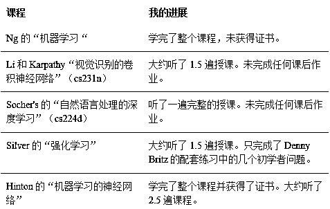

# 【精品】如何开始深度学习？这里有一份完整的攻略

> 原文：[`mp.weixin.qq.com/s?__biz=MzAxNTc0Mjg0Mg==&mid=2653285363&idx=1&sn=41fb3e3321a00bba63c4098c929e0940&chksm=802e29e6b759a0f0401a0220397b262ba130c754988c081af6e7989803f30222d06935df45ff&scene=27#wechat_redirect`](http://mp.weixin.qq.com/s?__biz=MzAxNTc0Mjg0Mg==&mid=2653285363&idx=1&sn=41fb3e3321a00bba63c4098c929e0940&chksm=802e29e6b759a0f0401a0220397b262ba130c754988c081af6e7989803f30222d06935df45ff&scene=27#wechat_redirect)

**编辑部**

微信公众号

**关键字**全网搜索最新排名

**『量化投资』：排名第一**

**『量       化』：排名第一**

**『机器学习』：排名第四**

我们会再接再厉

成为全网**优质的**金融、技术类公众号

本文是作者机器学习的经验总结，适合所有对机器学习感兴趣的初学者。

通过本文，你可以了解到机器学习的基础知识、梯度下降法、反向传播算法、架构、图像处理方法、自然语言处理方法以及（高级）无监督学习基础等多个方面的内容。

此外，对于初学者的延伸学习，作者也给出了自己的建议。

**我**自学深度学习有段时间了，非正式学习是从 2013 年开始的，当时我第一次阅读了 Hinton 的《语音识别中声学建模的深度神经网络》（“Deep Neural Networks for Acoustic Modeling in Speech Recognition”），用的是 Theano。更加“正式”的学习是从 2015 年夏季开始的，当时我刚被提升为首席语音架构师（Principal Speech Architect） [5]，学习了各种课程。毫不夸张地说，深度学习改变了我的生活和事业。举例来说，我现在比以前表现得更加活跃。如果你现在正在阅读这篇文章，那么你可能就是从人气很高的 Facebook 小组 AIDL 中转过来的，而我是这个小组的管理员。

这篇文章是我在看完 Richard Socher 的 cs224d 在线课程的老版本后完成的[1]。这门课程与 Ng、Hinton、Li 以及 Karpathy 和 Silvers 的课程是我在广为流传的“学习深度学习——我的前五课程名单”（“Learning Deep Learning - My Top-Five List”）中推荐的五门课程。我认为应当给这个课程组合起个名称，我们可以把它称为“基础五课”（Basic Five）。因为在我看来，**它们是你初学深度学习时应该最先学习的五门课程。**

在本文中，我将稍微解释一下为什么选择这五门课程。与 Kapathy、Olah 或 Denny Britz 等更有名的博主相比，我更像是深度学习领域的一名学习者[2]，虽然可能有一些经验，但仍是一名学习者。因此，这篇文章和我的其他文章一样，偏重的是学习。你能从这些课程中学到些什么呢？虽然很少谈到但是同样重要的问题是：在线学习有什么限制？作为一名学习者，我认为这些讨论很有意义，那么，让我们开始吧。

**基础五课有哪些？**

首先我要说明一下，我推荐的这五门课程是：

1.  Andrew Ng 在 Coursera 上的“机器学习”课程  - 我的评论 

2.  Fei-Fei   Li 和 Andrew Karpathy 的“视觉识别的卷积神经网络”（“Convolutional Neural Networks for Visual   Recognition”）或 Stanford cs231n 2015/2016

3.  Richard Socher 的“深度学习和自然语言处理”（“Deep Learning and Natural Language Processing”） 或者 Standard cs224d

4.  David Silver 的“强化学习”（“Reinforcement Learning”）

5.  Hinton 的“神经网络和机器学习”（“Neural Network and Machine Learning”） 

上述排名和我“前五课程名单”中的排名相同。这五门课程中的四门都提供免费的官方在线视频[6]。如果花费一点点费用，你还可以完成 Ng 和 Hinton 的课程并获得证书。

**我到底学到了什么？**

网上的许多面向初学者文章都附带有大量的链接，本文作者希望你从上到下点击每条链接（来学习相关内容）如果你真的一一观看的话，你可能需要花费超过 100 个小时来观看视频，或者是多达 200 小时完成学习。我不知道你会作何反应，但是我会怀疑作者本人有没有真正看完了列表里面的全部内容。 

因此，为了更加公平，我要告诉你，在第一次写这篇文章时（2017 年 5 月 13 日），我学习“基础五课”的进展如何。

如果我进一步深入学习某一课程的话，这个表格很可能会更新，但是它也能指出我的评论的局限性。例如，尽管我看完了所有的课程视频，但是我只完成了 Ng 和 Hinton 的课程的课后作业。这意味着我对“斯坦福三课”（“Stanford Trinities”）[3]中的两门课程理解相对薄弱，而且我对强化学习掌握得也不够扎实。Hinton 的课程与我在 Voci 的工作相结合，使我对无监督学习之类的内容的理解相比一般的评论者来说更加透彻。  

**为什么要学习“基础五课”？**

参加课程当然是为了学习。这五门课程会教给你基础知识，如果你喜欢学习“深度学习基础”（fundamentals of deep learning），请查看脚注[7]。我在过去一年半里学习的课程不止这五个，所以选择它们作为“基础五课”是经过仔细斟酌的。因此，这些课程就是你想要学到的，明白了吗？这是我的标准。

但是其他一千位博主可能也会告诉你上面这些内容，所以我要给你一个更加有趣的理由。如下：

如果你回到公元 2000 年。那时候谷歌刚刚推出了他们的搜索引擎，还没有现在的一系列谷歌产品，当然也没有 Imagenet。那么，**机器学习面对的最艰难的问题是什么？我认为你可能会给出这三个：**

> 1.  对象分类
>     
>     
> 2.  统计机器学习
>     
>     
> 3.  语音识别

**那么这三个问题在当时有什么特别之处呢？**回想公元 2000 年的情况，这三个问题是公认的难题。**它们代表着三个看似不同的数据结构：**

> 1.  对象分类——二维的密集数据序列
>     
>     
> 2.  统计机器学习（SMT）——离散符号，通过人们叫做语法和翻译规则的不严谨的规则相互关联。
>     
>     
> 3.  自动语音识别（ASR）——一维的时间序列，与对象分类有相似之处（通过声谱图），受到诸如词典和单词语法之类规则的松散限制。

这三个问题在当时都受到政府、大型机构（如 Big Four）和初创公司的关注。如果你解决了其中的任何一个，就足以谋得生路。而且，一旦你理解了这些内容，你就可以将这些知识用在其他问题上。举例来说，手写字符识别（HWR）与 ASR 类似，会话代理与 SMT 的工作原理相似。想要解决这些，只需要解决那三个问题——它们是许多其他机器学习问题的典型代表。 

那么，好的，让我再告诉你一件事：就算是现在，有些人仍然（或者试图）通过解决这些问题来养家糊口，因为我从来没有说这些问题已经得到解决。例如，如果我们将类数从 1000 增加到 5000 会怎样？如果我们研究会议发言或者 Youtube 视频语音而不研究总机（Switchboard）会怎样？如果我要求你使机器翻译的水平达到人类无法辨别的地步会怎样？这些应该足以说服你：“如果通过一种方法可以同时解决这三个问题，那么学习这种方法会是一个多么好的主意！” 

你可以猜到，深度学习就是为这三个领域带来彻底变革的方法[4]。这也就是你要学习“基础五课”的原因。**“基础五课”的并不会使你成为深度学习领域的顶尖专家，更多地，它们在教你学会基础知识。在你学习的这个阶段，懂得如何使用强大的模版解决问题是很重要的。你还会发现，学习“基础五课”会使你读得懂当今大部分的深度学习问题。**   

这就是我选择了这五门课程的原因。Ng 的课程和 Hilton 的课程是深度学习必不可少的基础知识。Li 和 Kaparthy 的课程教你如何把对象分类变成一种艺术。Socher 的课程会教你如何运用深度学习进行自然语言处理（NLP），也会涉及一些统计机器学习（SMT）和自动语音识别（ASR）的内容，但是你已经足以开始了。 

我给出解释并没有包括 Silver 的强化学习课程，应当承认，这个课程只是。我添加 Silver 的课程的原因是强化学习（RL）的应用越来越多，即使是传统的监督学习任务也会用到。当然，想了解 RL 的地位，你需要对它有充分的理解。学习 Silver 的课程能完美地帮你实现这点。  

**你会学到什么**

在某种程度上，这个问题还反映了学习深度学习时什么是最重要的。因此，我将在此列出 8 点，因为这几点在不同的课程中有所重复。  

1.  **机器学习基础：**这主要的 Ng 的课程的内容。但是在 NNML 和 Silver 的课程中也涉及到偏置方差之类的主题。

2.  **梯度下降法：**它的变量（例如：ADAM），它的选择对象（例如：二阶法），都是永无止境的研究。

3.  **反向传播算法：**如何看待它？将它看作为优化函数，还是计算图，又或是梯度流。不同的分类会给你到来不同的视角。即使你曾经学过这种算法，也不要略过这些不同的分类。

4.  **架构：**这三大家族分别为：DNN（深度神经网络）、卷积神经网络（CNN）和递归神经网络（RNN）。为什么其中有些网络在历史上一再出现，如何训练和构建这些网络，没有哪个课程会教会你一切知识，但是这五个课程所教授的知识足以使你生存。

5.  **图像处理方法：**不只是分类，还包括定位/检测/分隔（如 cs231n 2016 L8，L13 中所述）。不只是卷积，还包括“反卷积”，以及为什么我们不喜欢将其称为“反卷积”。

6.  **自然语言处理方法：**word2vec 和 Glovec，如何将它们应用在自然语言处理问题（如情绪分类）中。

7.  **（高级）无监督学习基础：**主要是 Hinton 的课程的内容，主要是关于 5 年前的方法，如 RBM、DBN 和 DBM 以及自动解码器，如果你想要学习更加先进的方法，如 GAN，你必须学习这些基础

8.  **（高级）强化学习方法：**主要是 Silver 的课程的内容，从缺陷预测型模型（DP-based model）到蒙特卡罗法（Monte-Carlo）和即时差分法（TD）。

**自学的限制**

当你学完“基础五课”时，如果你从中真正学到了东西，那么招聘者可能就开始寻找你了。你关于深度学习的见解和文章会吸引到很多人。也许你会开始回答论坛上的问题？或者你甚至可能会在 LinkedIn 上发表文章，获得读者的点赞。 

这都很好，但是需要注意！我在管理 AIDL 期间发现与我进行讨论的人中，有些人宣称自己学过很多深度学习的课程，但是但是在讨论几分钟之后，我几乎总是可以指出他们的理解中所存在的漏洞。某些人，我之后发现，只完整学完了一门课程，所以他们并没有理解类似反向传播的深入概念。换句话说，他们依然可以进一步学习，但是只是拒绝如此。毫无疑问，随着深度学习的大肆宣传，很多机灵的朋友只是了解深度学习的一点点概念，就去成立公司或者编写代码。  

这是很遗憾的。**我们所有人都应该知道自学具有局限性。****如果你打算接受正式的教育，例如进入研究生学院学习，绝大部分时间里你会和与你一样聪明的、而且每天都很乐意指出你的问题的人共同学习。因此你会更早地发现你的问题。** 

****你应该知道深度学习现在被过度鼓吹，你的理解中存在的问题不太可能会暴露出来。**尤其是当你在公司工作的时候，因为许多公司只是想雇用某个人完成某项任务，并且希望你在工作中学习而已。** 

****那么你应该怎么做？****

*   ****第一条建议就是保持谦虚，清楚丹宁克鲁格效应(Dunning-Kruger Effect)。**自学往往带给人们一种自我陶醉的感觉，他们总觉得自己学到了很多东西。但是学得多并不意味着懂得多。一山总比一山高，如果你停止学习或者闭目塞听，害的终究会是你自己。** 

*   ****第二条建议就是，你需要试验你的技能。**例如，了解卷积神经网络（CNN）是一件事，和能够用 Imagenet 的数据运行训练是另一件事。如果你聪明的话，前者只需要一天；而后者就需要更多的计划、一台性能强大的机器来训练 Alexnet 模型。** 

*   ****最后的一条建议就是，和别人聊天探讨，理解自己的局限**。举例来说，在阅读了我在 AIDL 上发布的内容之后，我注意到很多人虽然足够理解对象分类，但是他们并没有真正地理解对象定位/探测的基础内容。事实上，我第一次看过视频之后并没有直接试着理解。那么我做了什么呢？我只是一遍又一遍地观看定位/探测的视频，直到理解了为止[8]。**

****学完“基础五课”后……****

**你们当中的有些人会问“**接下来是什么呢？****”，是的，你完成了所有这些课程，就好像感到再也没什么好学的了！放弃这种想法！你要学习的东西仍然很多很多。因此，我将列出几个你可以学习的方向：**** 

1.  ******完成全部任务：**截至这篇文章发表时，我仍然未全部完成这五个课程的课后作业，注意：课后作业能使你真正理解学到的内容，因此如果你像我一样，我会建议你完成这些课后作业，测试你对知识的理解程度。**** 

2.  ******中级五课：**你已经学习了基础知识，那么现在该深入学习具体知识了。我现在还没有具体想出这 5 个课程，但是现在来说我会建议你学习 Koller 的“贝叶斯网络”课程、 哥伦比亚大学的“EdX CSMM 102x”课程,  伯克利大学的深度强化学习（Deep Reinforcement Learning）, Udacity 的“强化学习”课程  以及最后 牛津大学的“Deep NLP 2017”课程。**** 

3.  ******钻研深度学习基础：**这是另一个方向——让我们从你的基础知识部分下手。为了达到此目的，你可以钻研任何数学课题。我认为更重要而且有意义的部分是线性代数、矩阵微分和拓扑学。另外，你也查看这个很有用的链接：如何学习大学数学。**** 

4.  ******专攻某一领域：**如果你想精通我提及的三个新千年的机器学习问题中的某一个领域，那么，对你来说很重要的就是只学习关于计算机视觉或者自然语言处理的专门课程。由于我不想使这一点显得很杂乱，我会在以后的文章中对其进行讨论。****

5.  ******写文章：**这也是你们当中很多人都在做的，我认为这样做会帮你进一步理解所学到的知识。我的一条建议就是坚持写一些新的东西或者你自己想阅读的内容。例如，世界上有太多关于使用 Tensorflow 的计算机视觉的博客文章了，因此，为什么不写一篇告诉读者他们所不知道的东西的文章呢？例如：对象检测的实践迁移学习。或者什么是反卷积？或者关于重要架构（如 Mask-RCNN）的文献综述？将其与现有的解码-编码结构作对比。这样做可能会花费更多的时间，但是谨记质量胜于数量。****

6.  ******编码/在 Github 上发布****：**将论文上的想法进行再实现和开源化，这种做法有很大的空间。这还是一种非常有用的技能，因为很多公司需要使用这种技能来重复许多流行的深度学习方法。****

7.  ******研究：**如果你真正理解深度学习，你可能会明白许多方法需要改进。的确，现在有很多提出新方法的机会。当然，以专业研究人员的水平进行写作很难，而且也超出了我的水平。但是只有当你能发表论文时，人们才会将你当成研究共同体的一位成员。****

8.  ******框架：**构建出 C/C++水平的框架不是什么值得激动的成果。但是如果你和我一样，喜欢低阶编码，尝试自行构建框架会是进行进一步学习的好办法。查看 Darknet，这是竟然是用 C 语言编出来的！****

******总结******

****总而言之，这篇文章介绍来完整的“基础五课”，它们是什么，它们为什么是基础的，以及你在学完后可以学习哪些方向。在某种程度上，本文还是对我自 2015 年六月起从不同课程中所学到的知识的总结。和我其他的文章一样，如果我在今后学到了更多的内容，我也会一直对本文进行更新。希望这篇文章能使你坚持学习深度学习。**** 

******脚注：** [1]在 2017 年之前，网上没有任何连续的 Socher 的课程。遗憾的是，也没有任何完整的官方版本，所以我引用的版本是 2015 和 2016 年课程的混合版本。当然你可以在 Youtube 网站上找到官方的 2017 版的 cs224n 课程 。****

****[2]我真正的专长是语音识别，不幸的是，由于知识产权问题，我在这个课题上无法分享很多内容。****

****[3] “斯坦福三课”（“Stanford Trinity”）是我从 Andreseen Howoritz 的名单中的 AI Playbook 中看到的术语。****

****[4]你们当中有人（例如 ALDL 成员）会跳起来说：“不可能！我认为深度学习还没有解决自然语言处理问题！”。这是因为你被博客文章中的错误信息所误导了，。ASR 是利用深度学习解决的第一个领域，可追溯到 2010 年。你在 SMT 中看到的大多数系统都基于 seq2seq。****

****[5]我从 1998 年起就进入了语音识别领域，当时我在香港科技大学（HKUST）读研究生，负责语音激活项目。这个项目还很不完善，但是这就是我的学习生涯的开始。[6]最后一个你可以在 Youtube 上找到。当然，我并不能在这里合法地分享。****

****[7]我也查看了：****

*   ****麻省理工学院自动驾驶（MIT Self Driving 6.S094）****

*   ****John Schulman 的强化学习四讲****

****我也学习了如下课程：****

*   ****Radev 的自然语言处理课程（Radev's      Natural Language Processing）同样关注了机器学习。（我的评论）****

*   ****数据科学专门课程（Data      Science Specialization）的三讲****

*   ****华盛顿大学的机器学习专门课程（Machine      Learning Specialization）的第一讲****

****[8]这仍然是“我”能够进一步研究的学科。举例来说，只是逻辑看起来难以建立。**** 

******语音识别中声学建模的深度神经网络**https://static.googleusercontent.com/media/research.google.com/en//pubs/archive/38131.pd **Principal Speech Architect** https://www.linkedin.com/notifications/

 **基础五课**

**1.Andrew Ng's Coursera Machine Learning** https://www.coursera.org/learn/machine-learning
**2.Fei-Fei Li and Andrew Karpathy's Convolutional Neural Networks for Visual Recognition or Stanford cs231n 2015/2016**
http://cs231n.stanford.edu/
**3.Richard Socher's Deep Learning and Natural Language Processing or Stanford cs224d** **http://cs224d.stanford.edu/
**4.David Silver's Reinforcement Learning**
http://www0.cs.ucl.ac.uk/staff/d.silver/web/Teaching.html
**5.Hinton's Neural Network and Machine Learning**
https://www.coursera.org/learn/neural-networks**

 ****Stanford Trinities****

**http://aiplaybook.a16z.com/docs/reference/links****** 

****- END -****

******关注者******

******从****1 到 10000+******

******我们每天都在进步******

********