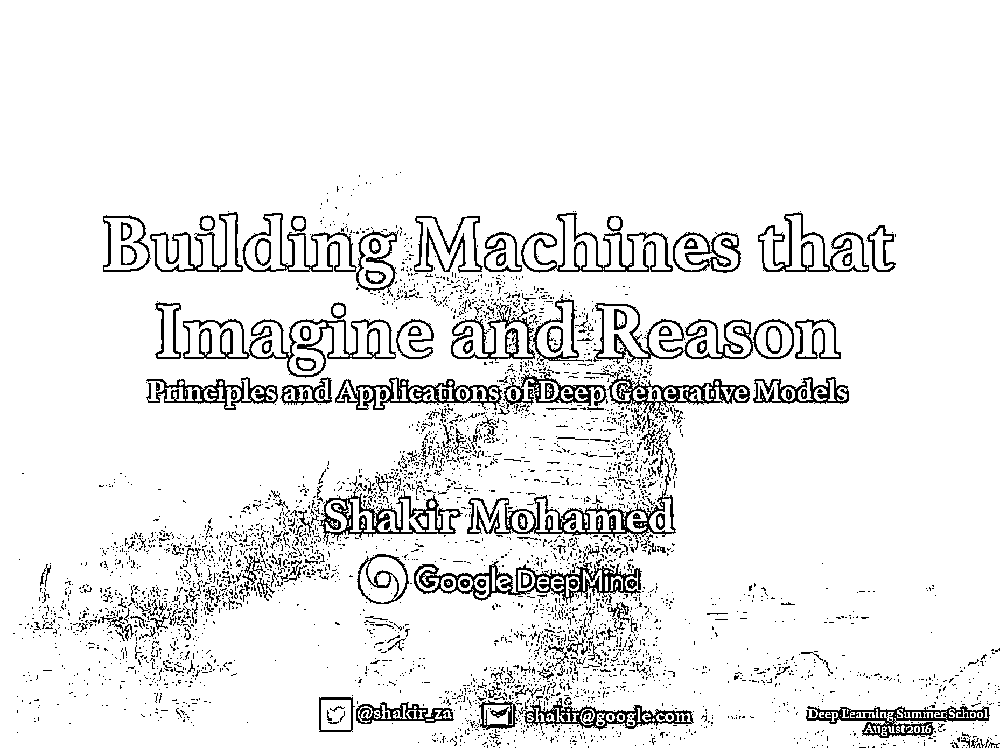

# 五、月干货第一波来袭（一本书+一套深度学习课程）

> 原文：[`mp.weixin.qq.com/s?__biz=MzAxNTc0Mjg0Mg==&mid=2653285320&idx=1&sn=f2c5938355ef8f7d462b402b46bbb85b&chksm=802e29ddb759a0cb2f23c963e35b53c3cea69dd4f893a5e0903786a0984c22ddc8306b881bda&scene=27#wechat_redirect`](http://mp.weixin.qq.com/s?__biz=MzAxNTc0Mjg0Mg==&mid=2653285320&idx=1&sn=f2c5938355ef8f7d462b402b46bbb85b&chksm=802e29ddb759a0cb2f23c963e35b53c3cea69dd4f893a5e0903786a0984c22ddc8306b881bda&scene=27#wechat_redirect)

**编辑部**

微信公众号

**关键字**全网搜索最新排名

**『量化投资』：排名第一**

**『量       化』：排名第一**

**『机器学习』：排名第四**

我们会再接再厉

成为全网**优质的**金融、技术类公众号

**前言**本月我们为大家带来第一波干货。分别是一本书和一些深度学习的资料（由于之前匆促，今天重新发一下）。祝大家周末愉快，好好读书。（资料获取在文末查看）

“

本书由奋战在 Python 开发一线近 20 年的 Luciano Ramalho 执笔，Victor Stinner、Alex Martelli 等 Python 大咖担纲技术审稿人，从语言设计层面剖析编程细节，兼顾 Python 3 和 Python 2，告诉你 Python 中不亲自动手实践就无法理解的语言陷阱成因和解决之道，教你写出风格地道的 Python 代码。

● Python 数据模型：理解为什么特殊方法是对象行为一致的关键。

● 数据结构：充分利用内置类型，理解 Unicode 文本和字节二象性。

● 把函数视作对象：把 Python 函数视作一等对象，并了解这一点对流行的设计模式的影响。

● 面向对象习惯用法：通过构建类学习引用、可变性、接口、运算符重载和多重继承。

● 控制流程：学习使用上下文管理器、生成器、协程，以及通过 concurrent.futures 和 asyncio 包实现的并发。

● 元编程：理解特性、描述符、类装饰器和元类的工作原理。

”

**9.5 分啊！**

中文也快出版了

如果想原汁原味

建议还是英文走起！

**8 月 1 日至 7 日由加拿大蒙特利尔大学举办的深度学习暑期课程！**

**另外我们还有两门深度学习量化课程，大家感兴趣可以点击标题查看！**

1. [深度学习应用到量化投资课程](http://mp.weixin.qq.com/s?__biz=MzAxNTc0Mjg0Mg==&mid=2653285137&idx=3&sn=9fc5b197617488f7df1f0cb56b76b79b&chksm=802e2904b759a01217f77efa7b2d65286dbf7bbd6828203836103ffbe3c4b08908cfef3541ab&scene=21#wechat_redirect)

2. [打造自己专属的量化交易系统基于—VN.PY](http://mp.weixin.qq.com/s?__biz=MzAxNTc0Mjg0Mg==&mid=2653284861&idx=2&sn=3fd82850fd770c6e6e32bd779f9907cf&chksm=802e2be8b759a2fe8299e1a24d348849c052ad2085ec780aefe38b83f6a03c0b185acdee5dbf&scene=21#wechat_redirect)

（持续报名中······）

- END -

**关注者**

**从****1 到 10000+**

**我们每天都在进步**

在后台回复

**5 月第一波**

即可获取源资料

有些人不知道**后台回复**如何操作

为大家介绍一下：

**周末快乐**