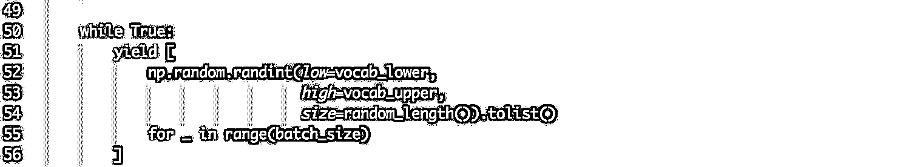

# seq2seq 理论研究和在量化上的延伸系列一（思路+代码）

> 原文：[`mp.weixin.qq.com/s?__biz=MzAxNTc0Mjg0Mg==&mid=2653285315&idx=1&sn=f86ff4300d6b8369e5106c8d4ba1535a&chksm=802e29d6b759a0c096ff084f544c0481c867cb4a7305775d92f296ae4faa801e161a9a019b1b&scene=27#wechat_redirect`](http://mp.weixin.qq.com/s?__biz=MzAxNTc0Mjg0Mg==&mid=2653285315&idx=1&sn=f86ff4300d6b8369e5106c8d4ba1535a&chksm=802e29d6b759a0c096ff084f544c0481c867cb4a7305775d92f296ae4faa801e161a9a019b1b&scene=27#wechat_redirect)


**512 汶川大地震 9 周年祭**


**今天**

**再次为逝者静默，为勇者致敬！**

**愿逝者安息，生者坚强！**

**编辑部**

从本期推文开始，我们将分 3+次介绍 seq2seq，文章的部分来自马修维兹，Ostrovok.ru 的研发主管，我们做了针对性的翻译。并且在今后的推文里，我们努力做出一期基于 seq2seq 模型应用到量化投资的文章，看看效果如何。同时，在后续的文章里，大家可以提出错误和意见。我们会及时采纳。

**前言**

 Sutskever，Vinyals 和 Le（2014）所描述的原始架构。


编码器接收[A，B，C]序列作为输入。 我们不关心编码器输出，只关于读取序列时积累的隐藏状态。 输入序列结束后，编码器将其最终状态传递给解码器，解码器接收[<EOS>，W，X，Y，Z]，并进行训练以输出[W，X，Y，Z，<EOS>]。 <EOS>指令是词汇中的一个特殊单词，用于信号解码翻译的开始。

**Static unrolling** involves construction of computation graph with a fixed sequence of time step. Such a graph can only handle sequences of specific lengths. One solution for handling sequences of varying lengths is to create multiple graphs with different time lengths and separate the dataset into this buckets.

**Dynamic unrolling** instead uses control flow ops to process sequence step by step. In TF this is supposed to more space efficient and just as fast. This is now a recommended way to implement RNNs.

**词汇**

Seq2seq 将序列映射到另一个序列上。 两个序列由固定范围的整数构成。 在语言任务中，整数通常对应于单词：我们首先通过将语料库中的每个单词分配为串行整数来构造词汇表。 前几个整数保留给特殊标记。 我们将把词汇的上限称为词汇大小。

输入由整数序列组成的数据。

```py
x = [[5, 7, 8], [6, 3], [3], [1]]
```

```py
import helpers
xt, xlen = helpers.batch(x)
```

```py
x
```

```py
[[5, 7, 8], [6, 3], [3], [1]]
```

```py
xt
```

```py
array([[5, 6, 3, 1],
       [7, 3, 0, 0],
       [8, 0, 0, 0]], dtype=int32)
```

序列形成大小为[max_time，batch_size]的矩阵列。 最短时间的序列用零填充到最后。

```py
xlen
```

```py
[3, 2, 1, 1]
```

对于某些形式的动态布局，使用指向不同张量的批次中每个序列的终端的指针是有用的。

**helpers 代码**




**建立模型**

**简单的 seq2seq**

编码器以空状态开始，并通过输入序列。 我们对编码器的输出不感兴趣，只有在 final_state。

解码器使用编码器的 final_state 作为其 initial_state。 其输入是在第一时间步长下具有<EOS>标记的批量大小矩阵，以下为<PAD>。 这是一个相当粗暴的设置，仅用于这篇文章的研究。 在实践中，我们希望在<EOS>之后提供以前生成的指令。

使用[hidden_units x output_vocab_size]投影层将解码器的输出映射到输出空间。 这是必要的，因为我们不能使解码器的 hidden_units 任意大，而我们的目标空间将随着字典的大小而增长。

这种编码器解码器要求学习可变长度输入序列的固定长度表示（具体来说是 hidden_units 大小），并且仅从该表示中恢复输出序列。

```py
import numpy as np
import tensorflow as tf
import helpers

tf.reset_default_graph()
sess = tf.InteractiveSession()
```

**模型的输入和输出**

第一个关键步骤：词汇大小。

动态 RNN 模型可以适应不同的批量大小和序列长度，而无需再训练（例如通过串行化模型参数和通过 tf.train.Saver 进行图形定义），但是改变词汇大小需要重新训练模型。

```py
AD = 0 EOS = 1 vocab_size = 10 input_embedding_size = 20 encoder_hidden_units = 20 decoder_hidden_units = encoder_hidden_units
```

理解复杂功能的好方法是研究其独有特征：输入和输出。 纯粹的功能只有输入和输出关系才是重要的。

*   encoder_inputs int32 张量大小[encoder_max_time，batch_size]

*   decode_targets int32 张量大小[decode_max_time，batch_size]

```py
encoder_inputs = tf.placeholder(shape=(None, None), dtype=tf.int32, name='encoder_inputs')
decoder_targets = tf.placeholder(shape=(None, None), dtype=tf.int32, name='decoder_targets')
```

我们额外添加一个节点，在 TensorFlow 中用 placeholder 来描述等待输入的节点。

*   decode_inputs int32 张量大小[decode_max_time，batch_size]

```py
decoder_inputs = tf.placeholder(shape=(None, None), dtype=tf.int32, name='decoder_inputs')
```

我们实际上不想手动输入 decode_inputs，它们在升级期间是 decode_targets 或以前的解码器输出的函数。但是，有不同的方式来构建它们。这可能是说明确指定它们的第一个 seq2seq 实现。

在训练期间，decode_inputs 将包含沿时间轴与 decode_target 连接的<EOS>标记。以这种方式，我们总是将目标序列作为历史传递给解码器，无需实际输出预测。这可以引导从训练到预测的分配转移。在预测模式下，模型将接收先前生成的指令（通过 argmax 超过对数），而不是基本真值，这将是不可知的。

请注意，所有形状都用 Nones（动态）指定。我们可以使用任意大小的批次和任意数量的时间步长。然而，这是方便和有效的，但是有明显的限制：

*   所有张量的 Feed 值应具有相同的 batch_size

*   解码器输入和输出（decode_inputs 和 decode_target）应该具有相同的 decode_max_time

**编码（降维）**

encoder_inputs 和 decode_inputs 是形状为[max_time，batch_size]的 int32 张量，而编码器和解码器 RNN 预期字的密集向量表示[max_time，batch_size，input_embedding_size]。 我们通过使用单词嵌入来将它们转换成另一个。 

首先我们初始化嵌入矩阵。 初始化是随机的。 我们依靠端到端训练来与编码器和解码器共同学习矢量表示。

```py
embeddings = tf.Variable(tf.random_uniform([vocab_size, input_embedding_size], -1.0, 1.0), dtype=tf.float32)
```

我们使用 tf.nn.embedding_lookup 来索引嵌入矩阵：给定单词 4，我们将其表示为第 4 列嵌入矩阵。 与单热编码字 4 的替代方法[0,0,0,1,0,0,0,0,0,0]（vocab size 10）相比，该操作是轻量级的，然后通过嵌入矩阵。

另外，除了 4th 之外，我们不需要计算任何列的渐变。

编码器和解码器将共享嵌入。 实际的 NLP 应用中，嵌入矩阵可以获得非常大的，具有 100k 甚至 1m 的列。

```py
encoder_inputs_embedded = tf.nn.embedding_lookup(embeddings, encoder_inputs)
decoder_inputs_embedded = tf.nn.embedding_lookup(embeddings, decoder_inputs)
```

**编码器**

TensorFlow 中所有 RNN 的核心是 RNNCell 类及其衍生（如 LSTMCell）

```py
encoder_cell = tf.contrib.rnn.LSTMCell(encoder_hidden_units)

encoder_outputs, encoder_final_state = tf.nn.dynamic_rnn(
    encoder_cell, encoder_inputs_embedded,
    dtype=tf.float32, time_major=True,
)
del encoder_outputs
```

我们丢弃 encoder_outputs，因为我们在 seq2seq 框架内对它们不感兴趣。 我们实际想要的是 encoder_final_state - 在编码器卷展栏最后一刻的 LSTM 隐藏单元格的状态。

encoder_final_state 也称为“思维向量”。 我们将使用它作为解码器的初始状态。 在 seq2seq 没有注意的情况下，这是编码器将信息传递给解码器的唯一点。 我们希望通过时间的反向传播（BPTT）算法将调整模型以通过思想向量传递足够的信息以进行正确的序列输出解码。

```py
encoder_final_state
```

```py
LSTMStateTuple(c=<tf.Tensor 'rnn/while/Exit_2:0' shape=(?, 20) dtype=float32>, h=<tf.Tensor 'rnn/while/Exit_3:0' shape=(?, 20) dtype=float32>)
```

TensorFlow LSTM 实现将状态存储为张量的元组。

*   encoder_final_state.h 是 LSTM 单元的隐藏层的激活

*   encoder_final_state.c 是最终输出

**解码器**

```py
decoder_cell = tf.contrib.rnn.LSTMCell(decoder_hidden_units)

decoder_outputs, decoder_final_state = tf.nn.dynamic_rnn(
    decoder_cell, decoder_inputs_embedded,

    initial_state=encoder_final_state,

    dtype=tf.float32, time_major=True, scope="plain_decoder",
)
```

由于我们将 encoder_final_state 作为 initial_state 传递给解码器，所以它们应该是兼容的。 这意味着相同的单元格类型（在本例中为 LSTMCell），相同数量的 hidden_units 和相同的图层数量（单层）。 我想这可以放宽，如果我们通过一个单层的 MLP 通过编码器 _final_state。 

使用编码器，我们对单元格输出不感兴趣。 但是解码器的输出是我们实际上的输出：我们使用它们来获得输出序列的单词的分布。

在这一点上，decode_cell 输出是每个时间步长的一个 hidden_units 大小的向量。 然而，对于训练和预测，我们需要大小为 vocab_size 的 logits。 合理的事情是将线性层（没有激活功能的完全连接层）放在 LSTM 输出的顶部，以获得非归一化的逻辑。 这个层被称为投影层。

```py
decoder_logits = tf.contrib.layers.linear(decoder_outputs, vocab_size)

decoder_prediction = tf.argmax(decoder_logits, 2)
```

**优化**

```py
decoder_logits
```

```py
<tf.Tensor 'fully_connected/Reshape_1:0' shape=(?, ?, 10) dtype=float32>
```

RNN 输出形状为[max_time，batch_size，hidden_units]的张量，其中投影层映射到[max_time，batch_size，vocab_size]。 vocab_size 部分是静态的，而 max_time 和 batch_size 是动态的。

```py
stepwise_cross_entropy = tf.nn.softmax_cross_entropy_with_logits(
    labels=tf.one_hot(decoder_targets, depth=vocab_size, dtype=tf.float32),
    logits=decoder_logits,
)

loss = tf.reduce_mean(stepwise_cross_entropy)
train_op = tf.train.AdamOptimizer().minimize(loss)
sess.run(tf.global_variables_initializer())
```

**测试**  

当构建图形时，当静态形状不匹配时，TF 将抛出错误。 但是，当我们尝试通过图形运行某些东西时，往往只会发现动态形状之间的不匹配。

所以让我们尝试运行一些东西。 为此，我们需要准备一些数据，我们将会投入到占位符中。

- 编码器形状如何固定为最大

- 解码器形状如何由输入进行仲裁和确定，但编码器应该可能会更长

- 如何解码器输入值也是仲裁的，以及我们如何使用指令，以及这些 0 是什么，可以使用什么（移位 Gold 序列，波束搜索）

```py
batch_ = [[6], [3, 4], [9, 8, 7]]

batch_, batch_length_ = helpers.batch(batch_)
print('batch_encoded:\n' + str(batch_))

din_, dlen_ = helpers.batch(np.ones(shape=(3, 1), dtype=np.int32),
                            max_sequence_length=4)
print('decoder inputs:\n' + str(din_))

pred_ = sess.run(decoder_prediction,
    feed_dict={
        encoder_inputs: batch_,
        decoder_inputs: din_,
    })
print('decoder predictions:\n' + str(pred_))
```

```py
batch_encoded:
[[6 3 9]
 [0 4 8]
 [0 0 7]]
decoder inputs:
[[1 1 1]
 [0 0 0]
 [0 0 0]
 [0 0 0]]
decoder predictions:
[[9 3 9]
 [9 0 9]
 [0 0 0]
 [0 0 0]]
```

## **toy task**

我们将教我们的模型记忆和再现输入序列。 序列将是随机的，具有不同的长度。

由于随机序列不包含任何结构，模型将无法利用数据中的任何模式。 它将简单地在思维向量中编码序列，然后从中解码。

```py
batch_size = 100batches = helpers.random_sequences(length_from=3, length_to=8,vocab_lower=2, vocab_upper=10,batch_size=batch_size)

print('head of the batch:')
for seq in next(batches)[:10]:
    print(seq)
```

```py
head of the batch:
[7, 2, 4, 5, 7, 6]
[5, 4, 8, 2, 9, 8, 2]
[3, 6, 9, 4, 4, 7]
[8, 8, 6, 7, 4]
[5, 8, 5, 9, 2, 8, 8, 5]
[9, 4, 6]
[2, 8, 6, 8, 4, 4, 6]
[8, 6, 2]
[6, 3, 9, 4]
[5, 4, 4]
```

```py
def next_feed():
    batch = next(batches)
    encoder_inputs_, _ = helpers.batch(batch)
    decoder_targets_, _ = helpers.batch(
        [(sequence) + [EOS] for sequence in batch]
    )
    decoder_inputs_, _ = helpers.batch(
        [[EOS] + (sequence) for sequence in batch]
    )    return {
        encoder_inputs: encoder_inputs_,
        decoder_inputs: decoder_inputs_,
        decoder_targets: decoder_targets_,
    }
```

给定 encoder_inputs [5,6,7]，decode_target 将为[5,6,7,1]，其中 1 为 EOS，decode_inputs 为[1,5,6,7] - decode_inputs 滞后 1 步， 将以前的指令作为当前步骤的输入。

```py
loss_track = []
max_batches = 3001 batches_in_epoch = 1000 try:    
 for batch in range(max_batches):
        fd = next_feed()
        _, l = sess.run([train_op, loss], fd)
        loss_track.append(l)        
 if batch == 0 or batch % batches_in_epoch == 0:
            print('batch {}'.format(batch))
            print('  minibatch loss: {}'.format(sess.run(loss, fd)))
            predict_ = sess.run(decoder_prediction, fd)                    for i, (inp, pred) in enumerate(zip(fd[encoder_inputs].T, predict_.T)):
                print('  sample {}:'.format(i + 1))
                print('    input     > {}'.format(inp))
                print('    predicted > {}'.format(pred))                
 if i >= 2:                    
 break
         print()
except KeyboardInterrupt:
    print('training interrupted')
```

batch 0  minibatch loss: 2.208172082901001  sample 1:    input     > [9 8 4 0 0 0 0 0]    predicted > [3 3 0 8 0 0 0 0 0]  sample 2:    input     > [3 4 3 5 6 0 0 0]    predicted > [9 9 8 8 9 9 9 0 0]  sample 3:    input     > [2 2 4 7 5 9 6 3]    predicted > [0 9 9 9 4 9 9 9 9] batch 1000  minibatch loss: 0.2542625367641449  sample 1:    input     > [5 4 9 8 8 0 0 0]    predicted > [5 4 9 8 8 1 0 0 0]  sample 2:    input     > [3 9 4 2 3 0 0 0]    predicted > [3 9 4 2 3 1 0 0 0]  sample 3:    input     > [2 6 4 4 7 0 0 0]    predicted > [2 4 4 4 7 1 0 0 0] batch 2000  minibatch loss: 0.15775370597839355  sample 1:    input     > [7 7 7 2 3 6 0 0]    predicted > [7 7 7 2 3 6 1 0 0]  sample 2:    input     > [8 3 9 9 5 9 0 0]    predicted > [8 3 9 9 5 9 1 0 0]  sample 3:    input     > [3 2 9 4 2 6 6 3]    predicted > [3 2 9 4 6 6 6 3 1] batch 3000  minibatch loss: 0.1039464920759201  sample 1:    input     > [8 6 2 3 0 0 0 0]    predicted > [8 6 2 3 1 0 0 0 0]  sample 2:    input     > [2 7 9 6 6 5 2 0]    predicted > [2 7 9 6 6 5 2 1 0]  sample 3:    input     > [3 3 8 5 4 0 0 0]    predicted > [3 3 8 5 4 1 0 0 0] 

```py
%matplotlib inlineimport matplotlib.pyplot as plt
plt.plot(loss_track)
print('loss {:.4f} after {} examples (batch_size={})'.format(loss_track[-1], len(loss_track)*batch_size, batch_size))
```

loss 0.1073 after 300100 examples (batch_size=100)


**模型的局限性**

我们无法控制 tf.nn.dynamic_rnn 的转换，它在单次扫描中展开。 在没有这种控制的情况下，一些事情是不可能的：

*   我们无法提供以前生成的指令，而不会退回到 Python 循环。 这意味着我们无法使用 dynamic_rnn 解码器进行有效的推断！

*   我们不能使用 Attention，因为 Attention 条件解码器输入其先前的状态

解决方案是使用 tf.nn.raw_rnn 而不是 tf.nn.dynamic_rnn 作为解码器。

- END -

**关注者**

**从****1 到 10000+**

**我们每天都在进步**

