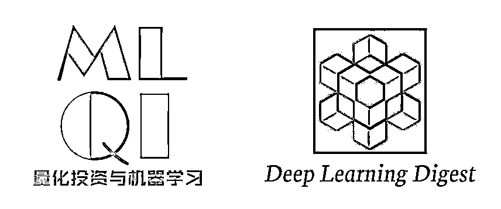

# 基于强化学习的 GridWorld（代码+思路）

> 原文：[`mp.weixin.qq.com/s?__biz=MzAxNTc0Mjg0Mg==&mid=2653285305&idx=1&sn=f86fcb297e3948d84f58e5563b2f582e&chksm=802e29acb759a0ba038bbd214519382dbf47bf20e6322c9d6a67922ec82dc82d8d7b5f536b5d&scene=27#wechat_redirect`](http://mp.weixin.qq.com/s?__biz=MzAxNTc0Mjg0Mg==&mid=2653285305&idx=1&sn=f86fcb297e3948d84f58e5563b2f582e&chksm=802e29acb759a0ba038bbd214519382dbf47bf20e6322c9d6a67922ec82dc82d8d7b5f536b5d&scene=27#wechat_redirect)


**编辑部**

微信公众号

**关键字**全网搜索最新排名

**『量化投资』：排名第一**

**『量       化』：排名第一**

**『机器学习』：排名第四**

我们会再接再厉

成为全网**优质的**金融、技术类公众号

我们与**深度学习每日摘要**公众号联合发起的**微信社区技术交流群**



开展几个月来效果还是蛮好的，我们希望更好的服务于这个社区群，也希望没有关注的读者加入这个社区群。**现在就扫码加入社区吧！**


申请加入社区

**备注**

**【申请加入社区】**

四个函数表达式（下文中的行动也可称为决策）：

**函数一、状态-价值函数：**


**函数二、行动-价值函数：****（虽然这里没有对下式进行展开，但是如果展开的话，就是上式除掉第一个求和符号和及π(a|s)）** 

****

****函数三、最优状态-价值函数：**** 

****

****函数四、最优行动-价值函数：****

********

****现在来对以上四个函数表达式做一点补充说明：****

*   ****其中的 p(s'|s,a)是状态转移概率；****

*   ****其中的 r 是由状态 s 到达状态 s'获得的回报值；****

*   ****其中的π(a|s)是指处在状态 s 时作出 a 行动的概率；****

****值得注意的是，我们使用以上明确的函数式来处理强化学习任务的时候，一般是只能处理有限状态的马尔科夫决策过程。接下来我们看一个简单的有限状态的马尔科夫决策过程实例。****

********

****这是一个 GridWorld 问题，如上图所示是一个包含 5*5 个元胞的网格，在每一个元胞内，agent 都有四种行动可以执行，它们分别是“上”、“下”、“左”、“右”。假设 agent 在每个格子处采取四种行动的概率是相同的，同时未来回报的折扣因子设为 0.9，而 agent 的状态转移以及回报值分为以下四种情况：****

1.  ****如果 agent 在边缘处，那么如果它此时执行的动作使它溢出网格的话，我们限制它的位置仍然固定不变，但是同时它会得到-1 的回报值；****

2.  ****如果 agent 处在 A 点，那么它的任意行动都将得到 10 的回报值，同时下一步的状态移至 A'处；****

3.  ****如果 agent 处在 B 点，那么它的任意行动都将得到 5 的回报值，同时下一步的状态移至 B'处；****

4.  ****其他情况则会得到 0 的回报值，状态转移遵从格子的位置变化；****

****根据以上提示，我们如何计算每个元胞的状态-价值函数（函数一）以及最优状态-价值函数（函数三）呢？****

******一、计算状态-价值函数****** 

****在正式开始写代码之前，我们需要理解状态-价值函数的含义。所谓状态-价值函数，在这里我们不妨理解为 agent 处在每个格子的时候未来得到的回报值。直观上来分析，我们可以很容易得出以下三条判断：****

1.  ****显然 agent 处在 A 和 B 处的时候状态-价值应该要大一些，为什么呢？因为当 agent 处在 A 或 B 时，下一步无论它采取什么行动，都会得到较大的 10 或 5 回报值。****

2.  ****那么，对于其他元胞的状态-价值呢？我们可以这样思考，既然 A 和 B 处的状态-价值较大，那么 A 或 B 附近处的元胞的状态-价值也肯定比远离 A 或 B 处元胞的状态-价值要大。****

3.  ****还有一点就是，既然边缘处很容易得到-1 的回报值，那么显然边缘处的元胞要比内部的元胞的状态-价值要小。**** 

****除此之外，我们还应该明白，在计算状态-价值函数的时候，我们是不用区分具体行动的，换句话说我们只用按照题意中的均匀概率进行决策即可。那么，每个元胞的状态-价值函数当然是包含了处在该元胞处的所有行动，因此，我们需要在遵从均匀随机决策下对所有行动进行迭代，直到所有元胞的状态-价值收敛为止，这种做法叫做**迭代策略评估**。****

****另外一点需要注意的是，在贝尔曼方程中，有一个量 P(s'|s,a)是状态转移概率，而在这里这个量的值是 1，原因是按照题意，每一个元胞的每一个行动都转移到唯一的下个状态，而不是随机的。****

****明白了以上的要点，代码写起来就很轻松了，求解状态-价值函数直接按照贝尔曼方程，进行如下迭代即可：****

********

******二、计算最优状态-价值函数******

****所谓最优状态-价值函数其实很好理解，一方面在数学公式上很好理解，直接对 a 进行迭代并取最大值即可，而且相比状态-价值函数省去了概率π(a|s)的计算；而直观上我们也可以这么想，前面我们计算的状态-价值函数实际上并没有给出当 agent 处于每个元胞时候下一步怎么走获得价值最大，而只是给出了当 agent 处于每个元胞的平均价值，即包含了下一步所有可能的行动。**** 

****计算最优状态-价值函数就是要找出 agent 在每个元胞处它下一步该采取什么行动可以保证状态-价值最大。按照贝尔曼最优方程，我们只用对行动 a 进行迭代即可，并且找出最大的价值，重复迭代，直到收敛为止。**** 

******三、实验结果******

****首先，计算出的状态-价值函数值如下。这个结果与我们最初的直观判断也很一致。****

********

****我将以上结果使用灰度图可视化一下，得到以下图，颜色越深处表明状态-价值越大。****

********

****同样的，计算出的最优状态-价值函数值如下：****

********

****将其可视化如下：****

********

****并且，得到的每个元胞的最优行动如下（U、D、L、R 分别代表上、下、左、右）：**** 

********

******四、代码实践****** 

****代码编写步骤如下：****

******1.定义好所有状态转移以及对应回报值（此处调用了 printboard 函数，详情请见源代码）：****** 

```py
**`#coding=utf-8 import numpy as np import argparse
from utils import printboard import matplotlib.pyplot as plt
plt.rcParams['axes.facecolor'] = 'white'# 命令行接收参数 parser = argparse.ArgumentParser()
parser.add_argument('--grid_size', type=int, default=5,
                       help='set size of grid stateValue')
parser.add_argument('--discount', type=float, default=0.9,
                       help='set discount factor of future expected reward')
parser.add_argument('--posA', type=list, default=[0, 1],
                       help='set position of A')
parser.add_argument('--posB', type=list, default=[0, 3],
                       help='set position of B')
parser.add_argument('--primeA', type=list, default=[4, 1],
                       help='set prime position of A')
parser.add_argument('--primeB', type=list, default=[2, 3],
                       help='set prime position of B')
args = parser.parse_args()

grid_size = args.grid_size
posA = args.posA
primeA = args.primeA
posB = args.posB
primeB = args.primeB
discount = args.discount# 四种可能的决策# left, up, right, downactions = ['L', 'U', 'R', 'D']

actionProb = []# 定义好每个状态处的行动概率，即均匀随机决策 for i in range(0, grid_size):
    actionProb.append([])    
 for j in range(0, grid_size):
            actionProb[i].append(dict({'L':0.25, 'U':0.25, 'R':0.25, 'D':0.25})) # 定义好每个状态处的状态转移，以及回报值 successorState = []
actionReward = []
for i in range(0, grid_size):
    successorState.append([])
    actionReward.append([])
    for j in range(0, grid_size):
        next = dict()
        reward = dict()
        # 其他元胞上下左右以及注意边缘处行动要保持不变
        if i == 0:
            next['U'] = [i, j]
            reward['U'] = -1.0
        else:
            next['U'] = [i - 1, j]
            reward['U'] = 0.0

        if i == grid_size - 1:
            next['D'] = [i, j]
            reward['D'] = -1.0
        else:
            next['D'] = [i + 1, j]
            reward['D'] = 0.0

        if j == 0:
            next['L'] = [i, j]
            reward['L'] = -1.0
        else:
            next['L'] = [i, j - 1]
            reward['L'] = 0.0

        if j == grid_size - 1:
            next['R'] = [i, j]
            reward['R'] = -1.0
        else:
            next['R'] = [i, j + 1]
            reward['R'] = 0.0

        # 定义 A、B 处的状态转移以及回报值
        # 同时，将上面边缘处的限制覆盖
     if [i, j] == posA:
            next['L'] = next['R'] = next['D'] = next['U'] = primeA
            reward['L'] = reward['R'] = reward['D'] = reward['U'] = 10.0

        if [i, j] == posB:
            next['L'] = next['R'] = next['D'] = next['U'] = primeB
            reward['L'] = reward['R'] = reward['D'] = reward['U'] = 5.0

        successorState[i].append(next)
        actionReward[i].append(reward)`**
```

******2\. 按照贝尔曼方程计算状态-价值函数并可视化：******

```py
**`stateValue = np.zeros((grid_size, grid_size)) while True:
    newStateValue = np.zeros((grid_size, grid_size))
    for i in range(0, grid_size):
        for j in range(0, grid_size):
            for action in actions:
                newPosition = successorState[i][j][action]
                newStateValue[i, j] += actionProb[i][j][action] * (actionReward[i][j][action] + discount * stateValue[newPosition[0], newPosition[1]])
    if np.sum(np.abs(stateValue - newStateValue)) < 1e-4:
        print('均匀随机策略:状态-价值')
        print(newStateValue)
        break
    stateValue = newStateValue

plt.matshow(newStateValue, cmap=plt.cm.Greys)
plt.colorbar()
plt.title('state value')
plt.show()`**
```

******3\. 按照贝尔曼优化方程计算最优状态-价值函数并可视化：******

```py
**`stateValue = np.zeros((grid_size, grid_size)) while True:
    newStateValue = np.zeros((grid_size, grid_size))
    a = ''
    for i in range(0, grid_size):
        for j in range(0, grid_size):
            values = []
            for action in actions:
                newPosition = successorState[i][j][action]
                values.append(actionReward[i][j][action] + discount * stateValue[newPosition[0], newPosition[1]])
            newStateValue[i][j] = np.max(values)
            # 找出所有最优状态-价值的行动
            indexes = np.argwhere(values == np.max(values))
            indexes = indexes.flatten().tolist()
            policyOfState = ''.join([actions[index] for index in indexes])
            a += policyOfState+' '

    if np.sum(np.abs(stateValue - newStateValue)) < 1e-4:
        a = a.strip().split(' ')
        policy = np.reshape(a,[grid_size, grid_size])
        print('均匀随机策略:最优状态-价值')
        print(newStateValue)
        printboard(policy)
        break
    stateValue = newStateValue

plt.matshow(newStateValue, cmap=plt.cm.Greys)
plt.colorbar()
plt.title('optimal state value')
plt.show()`**
```

****- END -****

******关注者******

******从****1 到 10000+******

******我们每天都在进步******

********