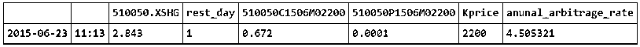
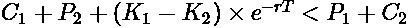

# 关于期权平价套利的实践

> 原文：[`mp.weixin.qq.com/s?__biz=MzAxNTc0Mjg0Mg==&mid=2653285297&idx=1&sn=462f18e58d1357f9e8001d2af7b357b8&chksm=802e29a4b759a0b2218f390e1333b79fb540d1c3ea8085150b04b989ab7354c36c1c2a06b458&scene=27#wechat_redirect`](http://mp.weixin.qq.com/s?__biz=MzAxNTc0Mjg0Mg==&mid=2653285297&idx=1&sn=462f18e58d1357f9e8001d2af7b357b8&chksm=802e29a4b759a0b2218f390e1333b79fb540d1c3ea8085150b04b989ab7354c36c1c2a06b458&scene=27#wechat_redirect)

**编辑部**

微信公众号

**关键字**全网搜索最新排名

**『量化投资』：排名第一**

**『量       化』：排名第一**

**『机器学习』：排名第四**

我们会再接再厉

成为全网**优质的**金融、技术类公众号

**买卖权平价关系，即 Put-Call Parity**，是期权市场最为经典且易于理解的著名等式关系。其不受制于任何期权定价模型，如 BS 模型，二叉树模型的影响，始终保持成立。投资者**无需考虑波动率因素即可根据其来判断期权价格是否偏离合理价格，从而发现套利机会**。

本文分析讨论了买卖期权平价关系，给出了原始平价套利策略以及变形买卖权平价关系的套利策略。

取出 50ETF（DataAPI.OptGet）信息，分析到期日为 2015 年 6 月 24 的所有期权。

获取某一日的分钟级期权收盘价与上证 50ETF 收盘价汇总，得到所有 2015 年 6 月 24 日到期的期权与标的资产分钟级别数据。

以这个为样本进行下一步的分析。

1

## 原始平价套利策略简介

原始平价套利策略是基于买卖权平价关系（Put-Call Parity）而产生的。在忽略市场交易成本的情况下，相同标的资产且执行价格也相同的看涨期权、看跌期权与标的资产价格之间满足如下公式关系。其中 T 为到期日、r 为同期限无风险收益率、并假设标的资产 S 不进行分红。

可以通过如下现金流分析来验证该等式的有效性：

如上图所示，在 t=T 时刻，持有等式两边资产组合的价值是相同的，根据无套利定价原理，在 t=0 时刻两个资产组合的价值也应该相同，否则将存在无风险套利的机会。基于上述买卖权平价关系，当公式所示关系不成立时，我们可以实施平价套利策略，而该策略存在下述两个方向： 

**1.1\. 做空看涨期权组合、做多看跌期权组合** 

当出现                              

的情况时，看涨期权被高估，因此我们卖出看涨期权，并借入<nobr style="max-width: 100%; box-sizing: border-box !important; word-wrap: break-word !important;">K×e−rT 价值的无风险资产，买入低估的看跌期权，同时买入标的资产。在 t=0 时刻，我们获得现金净流入</nobr>

<nobr style="max-width: 100%; box-sizing: border-box !important; word-wrap: break-word !important;"></nobr>

<nobr style="max-width: 100%; box-sizing: border-box !important; word-wrap: break-word !important;">而在到期日 t=T 时刻，现金流无变化。</nobr>

<nobr style="max-width: 100%; box-sizing: border-box !important; word-wrap: break-word !important;">**1.2\. 做空看跌期权组合，做多看涨期权组合**</nobr> 

<nobr style="max-width: 100%; box-sizing: border-box !important; word-wrap: break-word !important;">当出现</nobr>

<nobr style="max-width: 100%; box-sizing: border-box !important; word-wrap: break-word !important;"></nobr>

<nobr style="max-width: 100%; box-sizing: border-box !important; word-wrap: break-word !important;">的情况时，看跌期权被高估，因此我们卖出高估的看跌期权，同时卖出标的资产，买入低估的看涨期权，同时借出</nobr><nobr style="max-width: 100%; box-sizing: border-box !important; word-wrap: break-word !important;">K×e−rT 价值的无风险资产。在 t=0 时刻，我们获得现金净流入</nobr>

<nobr style="max-width: 100%; box-sizing: border-box !important; word-wrap: break-word !important;"></nobr>

<nobr style="max-width: 100%; box-sizing: border-box !important; word-wrap: break-word !important;">而在到期日 t=T 时，现金流无变化。</nobr> 

<nobr style="max-width: 100%; box-sizing: border-box !important; word-wrap: break-word !important;">**实际比较可行操作：**</nobr>

<nobr style="max-width: 100%; box-sizing: border-box !important; word-wrap: break-word !important;">我们不考虑借入借出无风险资产，使用自有资金代替。另外由于华夏上证 50ETF 不能进行单纯的卖空操作，因此当出现</nobr>

<nobr style="max-width: 100%; box-sizing: border-box !important; word-wrap: break-word !important;"></nobr>

<nobr style="max-width: 100%; box-sizing: border-box !important; word-wrap: break-word !important;">的情形时，我们无法卖出标的资产进行套利，故我们此处仅考虑出现</nobr>

<nobr style="max-width: 100%; box-sizing: border-box !important; word-wrap: break-word !important;"></nobr>

<nobr style="max-width: 100%; box-sizing: border-box !important; word-wrap: break-word !important;">的情况。</nobr> 

<nobr style="max-width: 100%; box-sizing: border-box !important; word-wrap: break-word !important;">实际上，期权平价套利忽略了卖出期权的保证金占用，因为通常在海外保证金产生的利息是归期权所有人所有的，所有没有影响，但在我国这部分利息通常是被经纪商拿去了。故更简化的了可以这么看，**当做空看涨期权、做多看跌期权组合产生的收益除以标的资产与保证金的成本得到的收益率大于无风险收益率，或者得到了收益率比较有诱惑力时**，我们可以做这样一次套利，做空看涨期权、做多看跌期权组合。</nobr>

<nobr style="max-width: 100%; box-sizing: border-box !important; word-wrap: break-word !important;">获取相同行权价的看涨看跌期权组，得到了 opt_summary_result 字典,保存了不同行权价的原始期权平价套利结果。</nobr>

<nobr style="max-width: 100%; box-sizing: border-box !important; word-wrap: break-word !important;"></nobr>

<nobr style="max-width: 100%; box-sizing: border-box !important; word-wrap: break-word !important;"></nobr>

<nobr style="max-width: 100%; box-sizing: border-box !important; word-wrap: break-word !important;">详细看下行权价为 2200 的原始平价套利年化收益率最大的情况。</nobr>

<nobr style="max-width: 100%; box-sizing: border-box !important; word-wrap: break-word !important;">将期权的信息与标的资产的信息输入到到期收益分析器。</nobr>

<nobr style="max-width: 100%; box-sizing: border-box !important; word-wrap: break-word !important;"></nobr>

<nobr style="max-width: 100%; box-sizing: border-box !important; word-wrap: break-word !important;">可以看出做了这样一个买卖组合后，无论标的资产的最后价格，到期获取的收益都是确定的。</nobr> 

<nobr style="max-width: 100%; box-sizing: border-box !important; word-wrap: break-word !important;">在不考虑滑点成交量手续费的因素下，以上述价格卖出一手看涨期权、买入 10000 手标的 ETF、买入一手看跌期权；隔天就可以获得 289 元的无风险利润，投入的成本是 10000 手的标的 ETF 与卖出看涨期权的保证金。实际上在此时，**不买这手看跌期权是更好的选择，因为其已经深度虚值了，在 A 股的涨停板的限制下，其在到期肯定是无法行权的。**不买该手期权又可以增加 1 块+手续费的利润。</nobr>

<nobr style="max-width: 100%; box-sizing: border-box !important; word-wrap: break-word !important;">2</nobr>

## <nobr style="max-width: 100%; box-sizing: border-box !important; word-wrap: break-word !important;">变形平价套利策略</nobr>

<nobr style="max-width: 100%; box-sizing: border-box !important; word-wrap: break-word !important;">在本部分中讨论将该公式进行一定的变形，并形成新的等式关系。**假设市场中存在相同标的资产，相同到期日、不同执行价格的两组期权合约（看涨期权及对应看跌期权）。**则存在如下两个等式，其中所有期权合约到期日相同均为 T，标的资产相同均为 S，区别仅仅在于执行价格：</nobr>

 <nobr style="max-width: 100%; box-sizing: border-box !important; word-wrap: break-word !important;"></nobr> 

<nobr style="max-width: 100%; box-sizing: border-box !important; word-wrap: break-word !important;">将两个等式相减，稍作变形我们可以得到：</nobr>

 <nobr style="max-width: 100%; box-sizing: border-box !important; word-wrap: break-word !important;"></nobr> 

<nobr style="max-width: 100%; box-sizing: border-box !important; word-wrap: break-word !important;">根据之前我们对于原始买卖权平价关系等式的证明，所得等式两边资产组合应保持等价，否则会出现套利机会。我们按以下两个方向讨论：</nobr>

<nobr style="max-width: 100%; box-sizing: border-box !important; word-wrap: break-word !important;">**1.1\. 做空 C1+P2、做多 P1+C2**</nobr>

 <nobr style="max-width: 100%; box-sizing: border-box !important; word-wrap: break-word !important;">当出现</nobr>

<nobr style="max-width: 100%; box-sizing: border-box !important; word-wrap: break-word !important;"></nobr>

<nobr style="max-width: 100%; box-sizing: border-box !important; word-wrap: break-word !important;">的情况时，若套利空间可观，我们卖出 C1 与 P2，买入 P1 与 C2。</nobr>

<nobr style="max-width: 100%; box-sizing: border-box !important; word-wrap: break-word !important;">**1.2\. 做空 P1+C2、做多 C1+P2**</nobr>

<nobr style="max-width: 100%; box-sizing: border-box !important; word-wrap: break-word !important;">当出现</nobr>

<nobr style="max-width: 100%; box-sizing: border-box !important; word-wrap: break-word !important;"></nobr>

<nobr style="max-width: 100%; box-sizing: border-box !important; word-wrap: break-word !important;">的情况时，若套利空间可观，我们买入 C1 与 P2，卖出 P1 与 C2。</nobr>

<nobr style="max-width: 100%; box-sizing: border-box !important; word-wrap: break-word !important;">**实际操作：**</nobr>

<nobr style="max-width: 100%; box-sizing: border-box !important; word-wrap: break-word !important;">只要</nobr>

<nobr style="max-width: 100%; box-sizing: border-box !important; word-wrap: break-word !important;"></nobr>

<nobr style="max-width: 100%; box-sizing: border-box !important; word-wrap: break-word !important;">我们就可以卖出高的买入低的，锁定利润；关键是这个利润的是否足够高，高过买入卖出期权的手续费加上无风险利息，这样的收益就是比较值得投入的。</nobr>

<nobr style="max-width: 100%; box-sizing: border-box !important; word-wrap: break-word !important;">通过一段小程序，得到了所有的 6 月 24 日到期期权的变形平价套利结果，来看对于详细看下行权价为 2200 和 2250 的变形平价套利年化收益率最大的情况。</nobr>

<nobr style="max-width: 100%; box-sizing: border-box !important; word-wrap: break-word !important;"></nobr>

<nobr style="max-width: 100%; box-sizing: border-box !important; word-wrap: break-word !important;">将买卖期权的信息输入到到期收益分析器。</nobr>

<nobr style="max-width: 100%; box-sizing: border-box !important; word-wrap: break-word !important;"></nobr>

<nobr style="max-width: 100%; box-sizing: border-box !important; word-wrap: break-word !important;">可以看出做了这样一个买卖组合后，无论标的资产的最后价格，到期获取的收益都是确定的。</nobr> 

<nobr style="max-width: 100%; box-sizing: border-box !important; word-wrap: break-word !important;">在不考虑滑点成交量手续费的因素下，以上述价格卖出一手行权价为 2.2 的看涨期权与一手行权价为 2.25 的看跌期权，买入一手行权价为 2.2 的看跌期权与一手行权价为 2.25 看涨期权；隔天就可以获得 1041 元的无风险利润，需要投入的是卖出 2 手期权的保证金。实际上同样，**不买这手 2.2 的看跌期权也是更好的选择，因为其已经深度虚值了，在 A 股的涨停板的限制下，其在到期肯定是无法行权的。****不买该手期权又可以增加 1 块+手续费的利润。**</nobr>

<nobr style="max-width: 100%; box-sizing: border-box !important; word-wrap: break-word !important;">**- END -**</nobr>

<nobr style="max-width: 100%; box-sizing: border-box !important; word-wrap: break-word !important;">****关注者****</nobr>

<nobr style="max-width: 100%; box-sizing: border-box !important; word-wrap: break-word !important;">****从****1 到 10000+****</nobr>

<nobr style="max-width: 100%; box-sizing: border-box !important; word-wrap: break-word !important;">****我们每天都在进步****</nobr>

<nobr style="max-width: 100%; box-sizing: border-box !important; word-wrap: break-word !important;">****</nobr>

<nobr style="max-width: 100%; box-sizing: border-box !important; word-wrap: break-word !important;">****</nobr>