# 如何使用 LSTM 网络进行权重正则化来进行时间序列预测

> 原文：[`mp.weixin.qq.com/s?__biz=MzAxNTc0Mjg0Mg==&mid=2653285296&idx=1&sn=393801e685a6bbfb06c95fb1119a0b6f&chksm=802e29a5b759a0b347738da9dabe681987992da24bb8d3984851ea8233240dd6fc30f0b8a0bd&scene=27#wechat_redirect`](http://mp.weixin.qq.com/s?__biz=MzAxNTc0Mjg0Mg==&mid=2653285296&idx=1&sn=393801e685a6bbfb06c95fb1119a0b6f&chksm=802e29a5b759a0b347738da9dabe681987992da24bb8d3984851ea8233240dd6fc30f0b8a0bd&scene=27#wechat_redirect)

**编辑部**

微信公众号

**关键字**全网搜索最新排名

**『量化投资』：排名第一**

**『量       化』：排名第一**

**『机器学习』：排名第四**

我们会再接再厉

成为全网**优质的**金融、技术类公众号

作者 / Jason Brownlee

翻译 / 编辑部翻译组

来源 / http://machinelearningmastery.com

权重正则化是一种对 LSTM 节点内的权重施加约束（如 L1 或 L2）的技术。 这具有减少过拟合并提高模型性能的效果。

今天的推文，让各位读者发现如何使用 LSTM 网络的重量正则化和设计实验来测试其对时间序列预测的有效性。

**01**

**测试环境**

假定您已安装 Python SciPy 环境。 您可以在此示例中使用 Python 2 或 3。

假定您使用 TensorFlow 或 Theano 后端安装了 Keras v2.0 或更高版本。

假定您已经安装了 scikit-learn，Pandas，NumPy 和 Matplotlib。

**02**

**洗发水销售数据集**

该数据集描述了 3 年内洗发水的月度销售数量。

单位是销售数量。 原始数据集来源于 Makridakis, Wheelwright, and Hyndman (1998).

您可以在这里下载并了解有关数据集的更多信息。

> https://datamarket.com/data/set/22r0/sales-of-shampoo-over-a-three-year-period#!ds=22r0&display=line

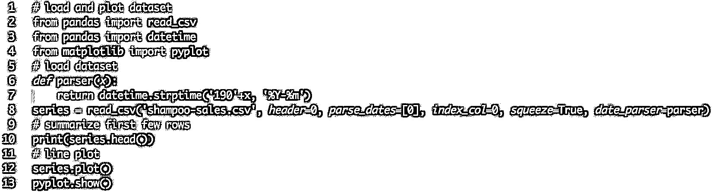

Month

1901-01-01 266.0

1901-02-01 145.9

1901-03-01 183.1

1901-04-01 119.3

1901-05-01 180.3

Name: Sales, dtype: float64

对数据进行作图，发现有明显的增长趋势。

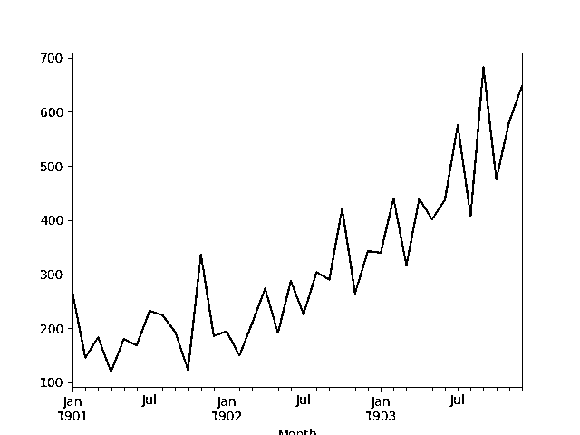

**03**

**测试框架**

**数据拆分**

我们将洗发水销售数据分为两部分：训练集和测试集。

头两年的数据将用于训练数据集，其余一年的数据将用于测试集。

将使用训练数据集开发模型，并对测试数据集进行预测。

测试数据集上的持续预测（简单预测）实现了每月洗发水销售量 136.761 的误差。 这提供了测试集上较低的可接受的性能界限。

**模型评估**

将使用滚动预测场景，也称为步行模型验证。

测试数据集的每个时间步长将每次走一步。 将使用模型对时间步长进行预测，然后将测试集中的实际预期值用于下一个时间步长的预测模型。

模拟一个真实世界的场景，每月可以使用新的洗发水销售观察，并用于下个月的预测。

这将通过训练和测试数据集的结构进行模拟。

将收集测试数据集上的所有预测，并计算误差分数，以总结模型的技能。 将使用均方根误差（RMSE），因为它会惩罚较大的错误，并产生与预测数据相同的分数，即每月洗发水销售量。

**数据准备**

在我们可以将模型拟合到数据集之前，我们必须转换数据。

在拟合模型并进行预测之前，在数据集上执行以下三个数据变换。

1.  转换时间序列数据使其稳定。 具体来说，a lag=1 差异来消除数据的增长趋势。

2.  将时间序列转化为监督学习问题。 具体来说，将数据组合成输入和输出模式，其中将上次时间步长的观测用作预测当前时间步长观测值的输入。

3.  将观察转化为具有特定的尺度。 具体来说，将数据重新缩放到-1 和 1 之间的值。

这些变换在预测中反转，以便在计算和误差得分之前将其转换为原始比例。

**LSTM 模型**

我们将使用基于状态的 LSTM 模型，其中 1 个神经元适合 1000 个时期。

需要批量大小为 1，因为我们将使用 walk-forward 验证，并对最终 12 个月的测试数据进行一步预测。

批量大小为 1 表示该模型将适合使用在线训练（而不是批次训练或小批量培训练）。 因此，预计模型拟合将有一些差异。

理想情况下，将使用更多的训练时期（如 1500），但是被截断为 1000 以保持运行时间合理。

该模型将适合使用有效的 ADAM 优化算法和均方误差损失函数。

**运行实验**

每个实验场景将运行 30 次，测试集上的 RMSE 分数将从每次运行结束时记录。

**04**

**Baseline LSTM 模型**

## 我们开始使用 BaselineLSTM 模型。

BaselineLSTM 模型具有以下参数：

*   Lag inputs: 1

*   Epochs: 1000

*   Units in LSTM hidden layer: 3

*   Batch Size: 4

*   Repeats: 3

完整的代码如下：

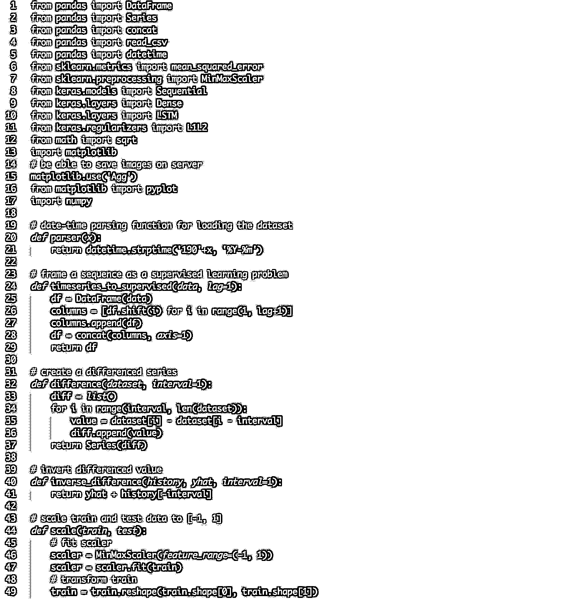

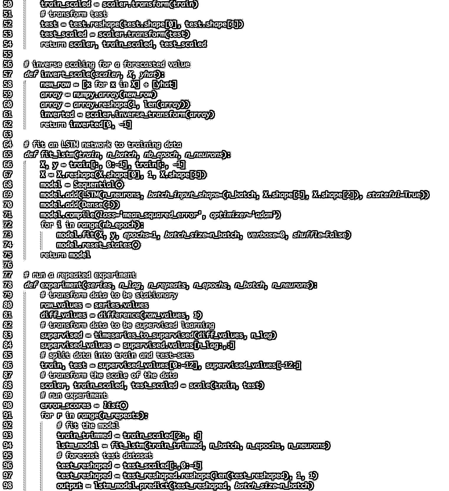

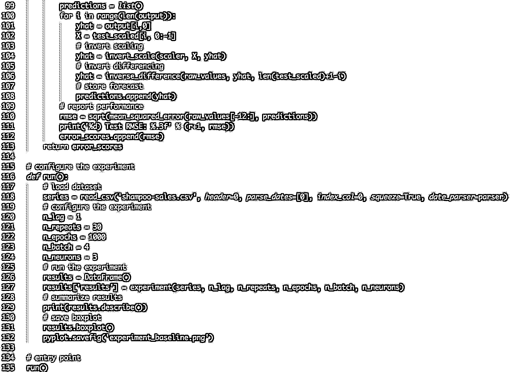

运行程序，打印所有重复的测试 RMSE 的汇总统计信息。

我们可以看到，平均而言，该模型配置实现了大约 92 个月洗发水销售的测试 RMSE，标准偏差为 5。

 results

count   30.000000

mean    92.842537

std      5.748456

min     81.205979

25%     89.514367

50%     92.030003

75%     96.926145

max    105.247117

还可以从测试 RMSE 结果的分布中创建一个盒形-虚线图，并保存到一个文件中。

中间值的 50％（框）和中位数（绿线）。

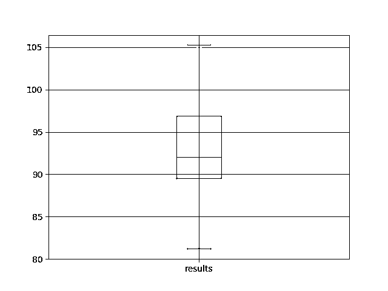

**05**

**偏重正则化**

权重正则化可以应用于 LSTM 节点内的偏置连接。

在 Keras 中，当创建 LSTM 层时，这是用 bias_regularizer 参数指定的。 正则化器被定义为 L1，L2 或 L1L2 类之一的实例。

更多细节在这里：

> https://keras.io/regularizers/

在本实验中，我们将比较 L1，L2 和 L1L2 与基线模型的默认值 0.01。 我们可以使用 L1L2 类指定所有配置，如下所示：

L1L2（0.0,0.0）[例如基线]

L1L2（0.01,0.0）[例如 L1]

L1L2（0.0,0.01）[例如 L2]

L1L2（0.01,0.01）[例如 L1L2 或弹性网]

下面列出了使用 LSTMs 使用偏倚正则化的更新的 fit_lstm（），experiment（）和 run（）函数。

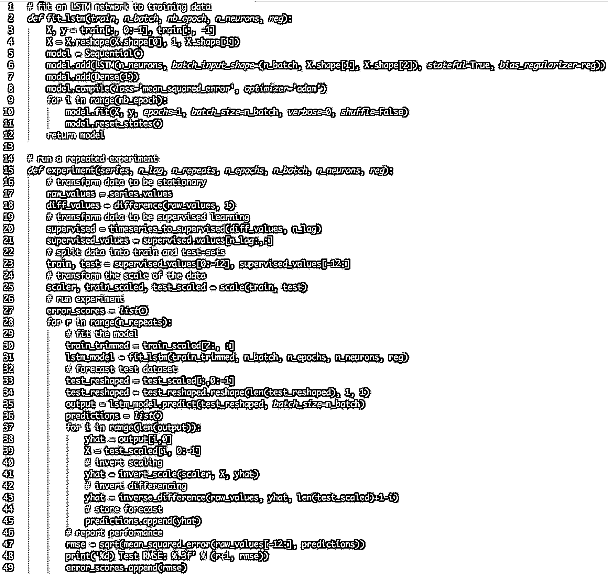

平均来说，默认的无偏差正则化导致更好的性能。

       l1 0.00,l2 0.00  l1 0.01,l2 0.00  l1 0.00,l2 0.01  l1 0.01,l2 0.01

count        30.000000        30.000000        30.000000        30.000000

mean         92.821489        95.520003        93.285389        92.901021

std           4.894166         3.637022         3.906112         5.082358

min          81.394504        89.477398        82.994480        78.729224

25%          89.356330        93.017723        90.907343        91.210105

50%          92.822871        95.502700        93.837562        94.525965

75%          95.899939        98.195980        95.426270        96.882378

max         101.194678       101.750900       100.650130        97.766301

还创建了一个盒形-虚线图，以比较每个配置的结果分布。

该图显示所有配置具有相同的扩展，并且均匀地添加偏差正则化对该问题没有帮助。

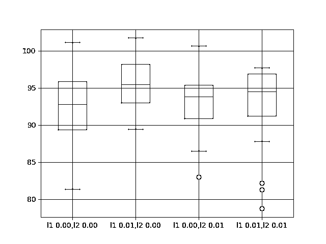

**06**

**输入权重正则化**

我们也可以对每个 LSTM 单元的输入连接进行正则化处理。

在 Keras 中，这是通过将 kernel_regularizer 参数设置为 regularizer 类来实现的。

我们将测试与上一节中使用的相同的正则化器配置，具体来说：

L1L2（0.0,0.0）[例如基线]

L1L2（0.01,0.0）[例如 L1]

L1L2（0.0,0.01）[例如 L2]

L1L2（0.01,0.01）[例如 L1L2 或弹性网]

下面列出了使用 LSTMs 使用偏倚正则化的更新的 fit_lstm（），experiment（）和 run（）函数。

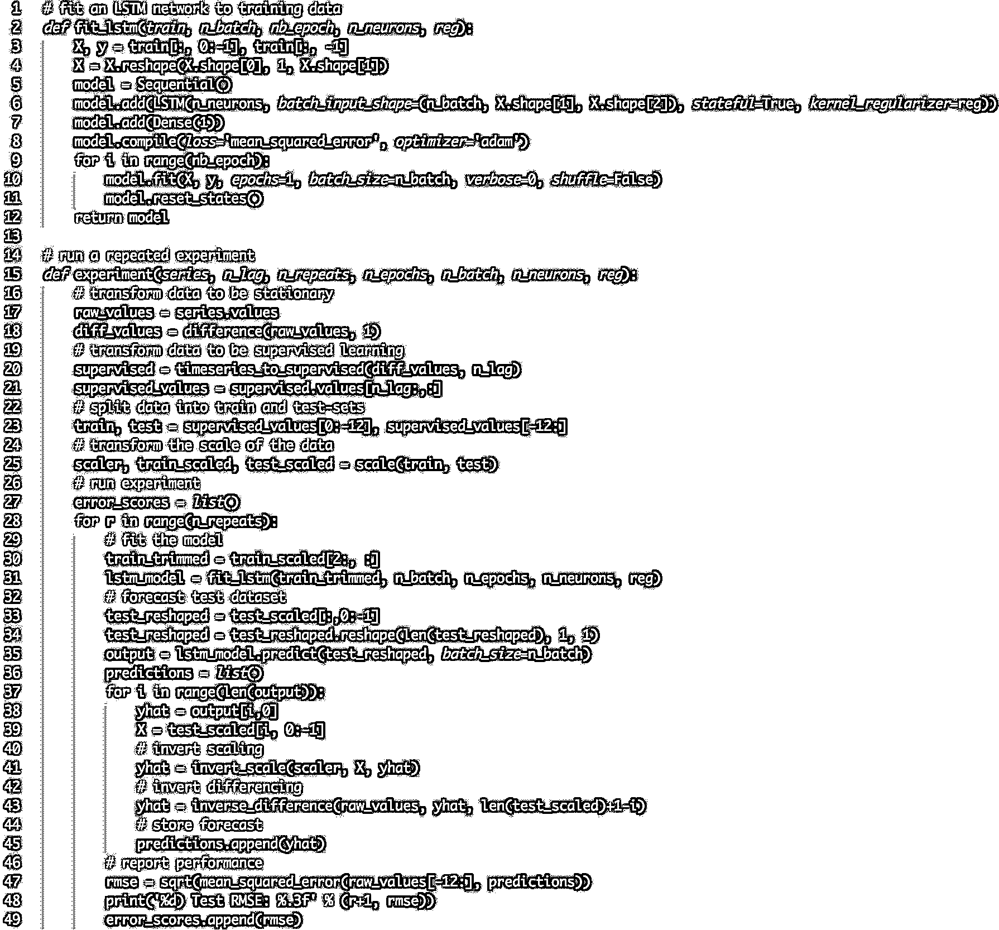

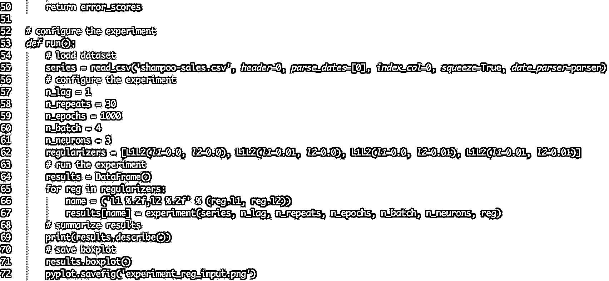

结果表明，为输入连接添加权重正则化确实在此设置上全面受益。

我们可以看到，对于所有配置，测试 RMSE 大约为 10 单位，当 L1 和 L2 组合成弹性网络类型约束时，可能更有利。

       l1 0.00,l2 0.00  l1 0.01,l2 0.00  l1 0.00,l2 0.01  l1 0.01,l2 0.01

count        30.000000        30.000000        30.000000        30.000000

mean         91.640028        82.118980        82.137198        80.471685

std           6.086401         4.116072         3.378984         2.212213

min          80.392310        75.705210        76.005173        76.550909

25%          88.025135        79.237822        79.698162        78.780802

50%          91.843761        81.235433        81.463882        80.283913

75%          94.860117        85.510177        84.563980        82.443390

max         105.820586        94.210503        90.823454        85.243135

下图显示输入正则化误差的一般较低分布。 结果还表明，采用正则化的结果会更加严格地扩展，而 L1L2 配置可能会更加明显。

这是一个令人鼓舞的发现，表明对输入正则化的不同 L1L2 值的附加实验将是非常值得研究的。

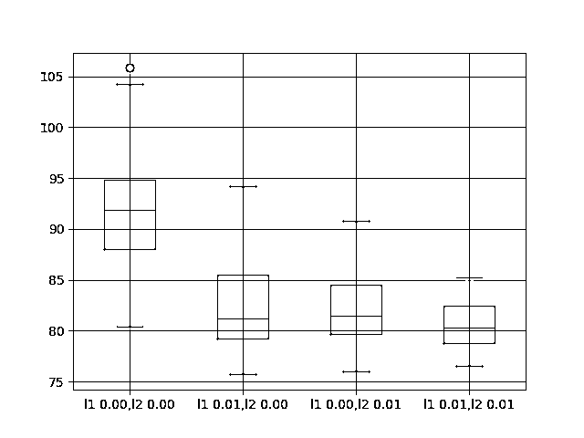

**07**

**循环权重正则化**

最后，我们也可以对每个 LSTM 单元的循环连接应用正则化。

在 Keras 中，通过将 recurrent_regularizer 参数设置为 regularizer 类来实现。

我们将测试与上一节中使用的相同的正则化器配置，具体来说：

L1L2（0.0,0.0）[例如基线]

L1L2（0.01,0.0）[例如 L1]

L1L2（0.0,0.01）[例如 L2]

L1L2（0.01,0.01）[例如 L1L2 或弹性网]

下面列出了使用 LSTMs 使用偏倚正则化的更新的 fit_lstm（），experiment（）和 run（）函数。

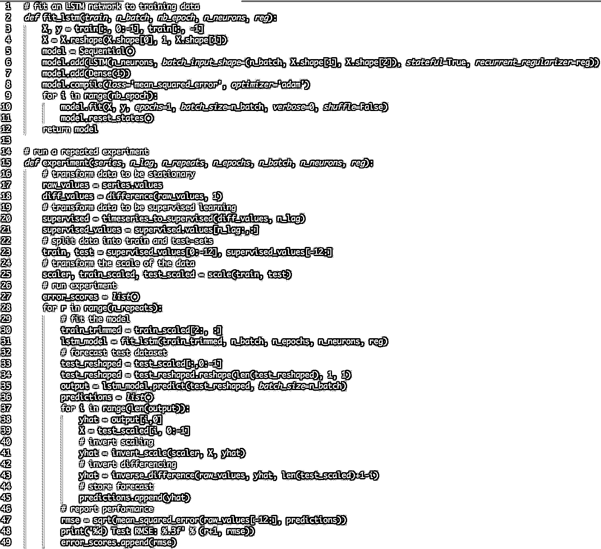

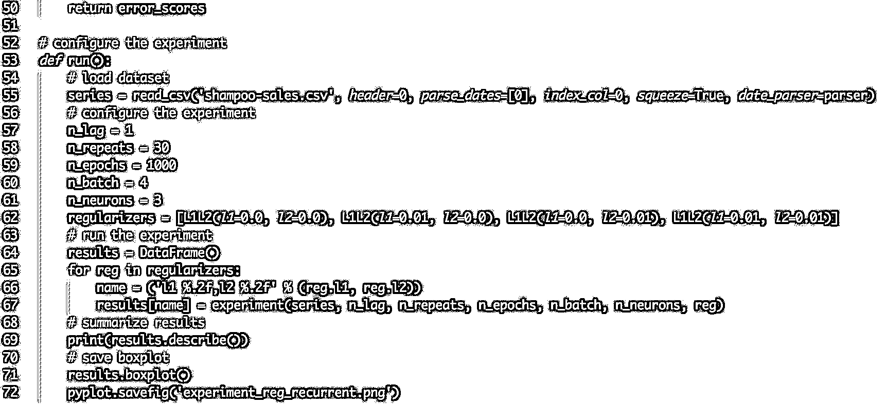

结果表明，使用正则化与 LSTM 在这个问题上的反复连接没有明显的好处。

所有变化的平均性能都比基准模型更差。

       l1 0.00,l2 0.00  l1 0.01,l2 0.00  l1 0.00,l2 0.01  l1 0.01,l2 0.01

count        30.000000        30.000000        30.000000        30.000000

mean         92.918797       100.675386       101.302169        96.820026

std           7.172764         3.866547         5.228815         3.966710

min          72.967841        93.789854        91.063592        89.367600

25%          90.311185        98.014045        98.222732        94.787647

50%          92.327824       100.546756       101.903350        95.727549

75%          95.989761       103.491192       104.918266        98.240613

max         110.529422       108.788604       110.712064       111.185747

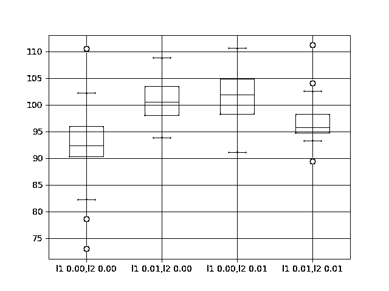

**08**

**拓展**

**输入权重正则化**。 关于这个问题的输入权重正规化的实验结果表明了上市业绩的巨大前景。 可以通过网格搜索不同的 L1 和 L2 值来进一步调查，以找到最佳配置。

**行为动力学**。 每个权重正则化方案的动态行为可以通过绘制训练和测试 RMSE 在训练时期进行调查，以获得过度拟合或适配行为模式的权重正则化的想法。

**结合正则化**。 可以设计实验来探索组合不同权重正则化方案的效果。

**激活正则化**。 Keras 还支持激活正则化，这可能是探索对 LSTM 施加约束并减少过度配对的另一个途径。

- END -

**关注者**

**从****1 到 10000+**

**我们每天都在进步**

