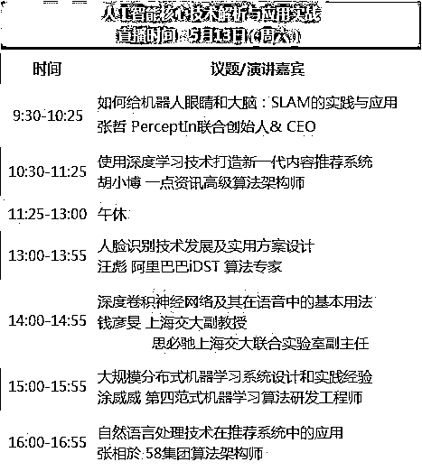

# 人工智能时代，这些技术必须掌握！

> 原文：[`mp.weixin.qq.com/s?__biz=MzAxNTc0Mjg0Mg==&mid=2653285270&idx=1&sn=98f18fc3fbefdcda91828514b63ebafa&chksm=802e2983b759a09553428a1f9f4865233c75b6095da97af37998392d1901e32d531582bc95f4&scene=27#wechat_redirect`](http://mp.weixin.qq.com/s?__biz=MzAxNTc0Mjg0Mg==&mid=2653285270&idx=1&sn=98f18fc3fbefdcda91828514b63ebafa&chksm=802e2983b759a09553428a1f9f4865233c75b6095da97af37998392d1901e32d531582bc95f4&scene=27#wechat_redirect)

人工智能已经进入了全球爆发的前夜。个性化信息推送、人脸识别、语音操控等人工智能技术，已“入侵”日常生活的细枝末节。而就在今年 3 月，李彦宏在深度学习国家工程实验室揭牌仪式上发出豪言，百度是深度学习国家队。3 月 9 日，马云在阿里巴巴首届技术大会上宣布启动“NASA”计划，面向未来 20 年组建研发部门。22 日，马化腾在腾讯 2016 年业绩发布会上表示，人工智能将成为未来业内的核心竞争力。

**未来已来，技术人，你来不来？**

人工智能有多火？平均每 10.9 个小时诞生一家 AI 企业。而众多一线公司已经在布局机器学习团队，优化智能产品，在这样的背景下，不难想象，未来机器学习技术将会是技术人的新门槛和领域。 

而在知乎上，也有诸多类似：普通程序员，如何转向人工智能方向的话题在蔓延。除去系统学习和广泛学习外，在这里给大家推荐一个在线直播峰会。

**直播信息**

直播主题：人工智能核心技术的应用与实战

直播平台：CSDN 学院

直播时间：5.13 号

> 人工智能在线直播峰会是 CSDN 倾力打造、以人工智能核心技术解析和应用实战为基础，邀请一线公司技术骨干做深度解读**。**
> 
> **其中有邀请了阿里巴巴、思必驰、第四范式、一点资讯、58 集团、****PercepIn****等在人工智能领域技术领先公司的核心研发成员**，在人脸识别、卷积神经网络、大规模分布式机器学习系统搭建、推荐系统、自然语言处理及 SLAM 在机器人领域应用等话题分享他们的心得和经验。
> 
> **而且为每位讲师演讲时段都安排了****答疑环节****，鼓励报名的同学与讲师交流切磋。在线直播，线上互动答疑，你来不来？**

**直播主题安排**

**演讲嘉宾**

**张哲**

PerceptIn 联合创始人& CEO，纽约州立大学机器人方向博士。先后在微软和 Magic Leap 带领团队从事 Robotics 和 AR 中的 SLAM 产品化研发。

**胡小博**

一点资讯高级算法架构师，在推荐系统建模、分布式机器学习架构设计、在线深度学习、自然语言处理和深度问答等领域有深刻的理解和丰富的经验。

**汪彪**

清华电子博士，阿里巴巴集团 iDST，视觉计算组算法专家，当前主要为阿里云平台提供人脸分析智能技术的研发与输出。

**张相於**

58 集团算法架构师，转转搜索推荐部负责人，负责转转的搜索、推荐以及算法相关工作。

**涂威威**

第四范式机器学习算法研发工程师，从事机器学习算法、大规模分布式机器学习计算框架研发，前百度商务搜索部资深研发工程师。

**钱彦旻**

上海交大计算机科学与工程系副教授，思必驰上海交大联合实验室副主任。清华大学博士英国剑桥大学工程系 MIL 机器智能实验室博士后，上海青年英才扬帆计划获得者。

**长按报名**

**人工智能技术微信群！**

**如群满****请到**

****报名页面查看新的群哦！****

****

****