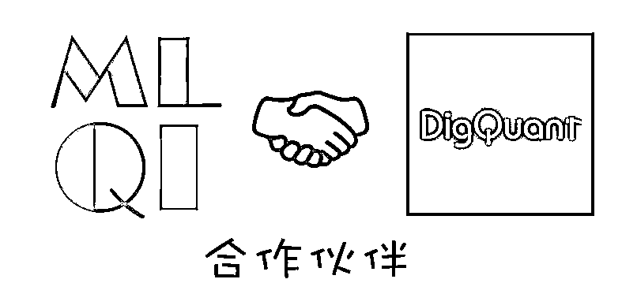

# 精选股票、期货量化投资策略系列（一）基于 Matlab

> 原文：[`mp.weixin.qq.com/s?__biz=MzAxNTc0Mjg0Mg==&mid=2653285266&idx=1&sn=b1023ea33a8483d6f0875ce92621faae&chksm=802e2987b759a0912d1bedabdf8c9bcdcaf61993e596af93bd386ad9c84e016506a50826acd9&scene=27#wechat_redirect`](http://mp.weixin.qq.com/s?__biz=MzAxNTc0Mjg0Mg==&mid=2653285266&idx=1&sn=b1023ea33a8483d6f0875ce92621faae&chksm=802e2987b759a0912d1bedabdf8c9bcdcaf61993e596af93bd386ad9c84e016506a50826acd9&scene=27#wechat_redirect)

**编辑部**

微信公众号

**关键字**全网搜索最新排名

**『量化投资』：排名第一**

**『量       化』：排名第一**

**『机器学习』：排名第四**

我们会再接再厉

成为全网**优质的**金融、技术类公众号

‍

> **本期 3 个基于 MATLAB 开发的策略筛选自点宽 digquant 量化社区**
> 
> **社区地址：www.digquant.com.cn**

**均线通道+突破+加仓**

策略原理： 

         20 均线为中轴，上下一个单位的标准差构成一个均线通道

         多头入场：价格突破通道上轨，且成为近期高点

         空头入场：价格突破通道下轨，且成为近期低点

         加仓：价格每变动 2 倍 ATR

         出场：动态跟踪止损

**短布林通道+高低点**

策略原理：

          通过布林带以及突破后的高低点的形成产生交易信号

          采取跟踪止损出场

**波动突破策略加止损**

策略原理：

从今天新开盘，确定今日的上轨和下轨，其中上轨由昨天的收盘价和过去 10 天的收盘价的标准差总和决定，下轨为二者之差。开盘价高于今日上轨，做多；反之做空。日内平仓。同时加入利用 ATR 控制的止损机制。

本期量化策略，digquant 网站独家授权

 点宽 DigQuant 量化社区（www.digquant.com.cn）是国内首家基于 Matlab 的在线量化研究社区，为金融工程领域的专业策略研究人员及量化爱好者提供专业的量化研究工具/严谨的专业文章和丰富的策略案例。

DigQuant 量化研究社区将尝试聚集数理统计、金融工程等背景出生的专业宽客群体或量化爱好者们，提供量化研究策略和交易思路等干货分享的平台。 

公众号在 DigQuant 量化社区有专栏推送，也希望大家去浏览查看。

- END -

**关注者**

**从****1 到 10000+**

**我们每天都在进步**

**下载策略：**

