# 使用 CNN（LSTM 架构）进行序列预测基于 TensorFlow

> 原文：[`mp.weixin.qq.com/s?__biz=MzAxNTc0Mjg0Mg==&mid=2653285248&idx=1&sn=0da13c725a92b1c9e7111f045fa0d277&chksm=802e2995b759a083736512992efa86a9b4901c5727b10bfec881195ea932ac480e53c7822060&scene=27#wechat_redirect`](http://mp.weixin.qq.com/s?__biz=MzAxNTc0Mjg0Mg==&mid=2653285248&idx=1&sn=0da13c725a92b1c9e7111f045fa0d277&chksm=802e2995b759a083736512992efa86a9b4901c5727b10bfec881195ea932ac480e53c7822060&scene=27#wechat_redirect)


**编辑部**

微信公众号

**关键字**全网搜索最新排名

**『量化投资』：排名第一**

**『量       化』：排名第一**

**『机器学习』：排名第四**

我们会再接再厉

成为全网**优质的**金融、技术类公众号

作者 / mouradmourafiq 

翻译 / 编辑部翻译组

来源 / https://github.com/mouradmourafiq

**前言**

这篇推文抛砖引玉的介绍如何使用循环神经网络逼近一系列向量，特别的是，将使用 LSTM 架构。

根据先前的观察预测一系列实数。 传统的神经网络架构不能做到这一点，这就是为什么要复制神经网络来解决这个问题，因为它们允许存储以前的信息来预测将来的事件。

在这个例子中，将尝试预测一些功能：

*   sin

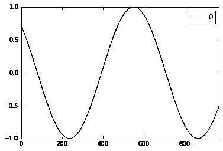

*   sin and cos on the same time

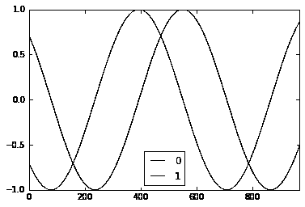

*   x*sin(x)

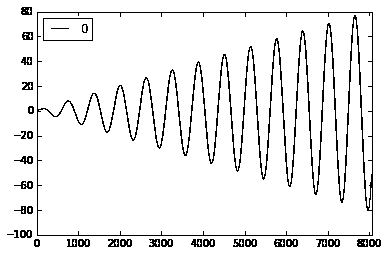

**模型的建立**

首先建立模型，lstm_model，该模型是不同时间步骤的堆叠 lstm 单元的列表，后面是一个密集层。

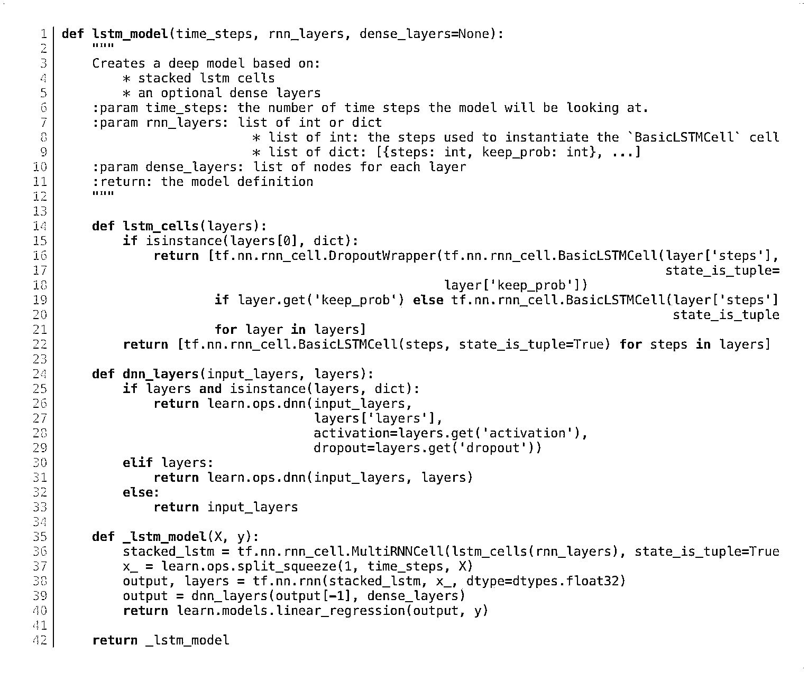

因此，我们的模型期望一个维度对应的数据（(batch size, time_steps of the first lstm cell, num_features in our data)

接下来，我们以模型可以接受的方式准备数据。

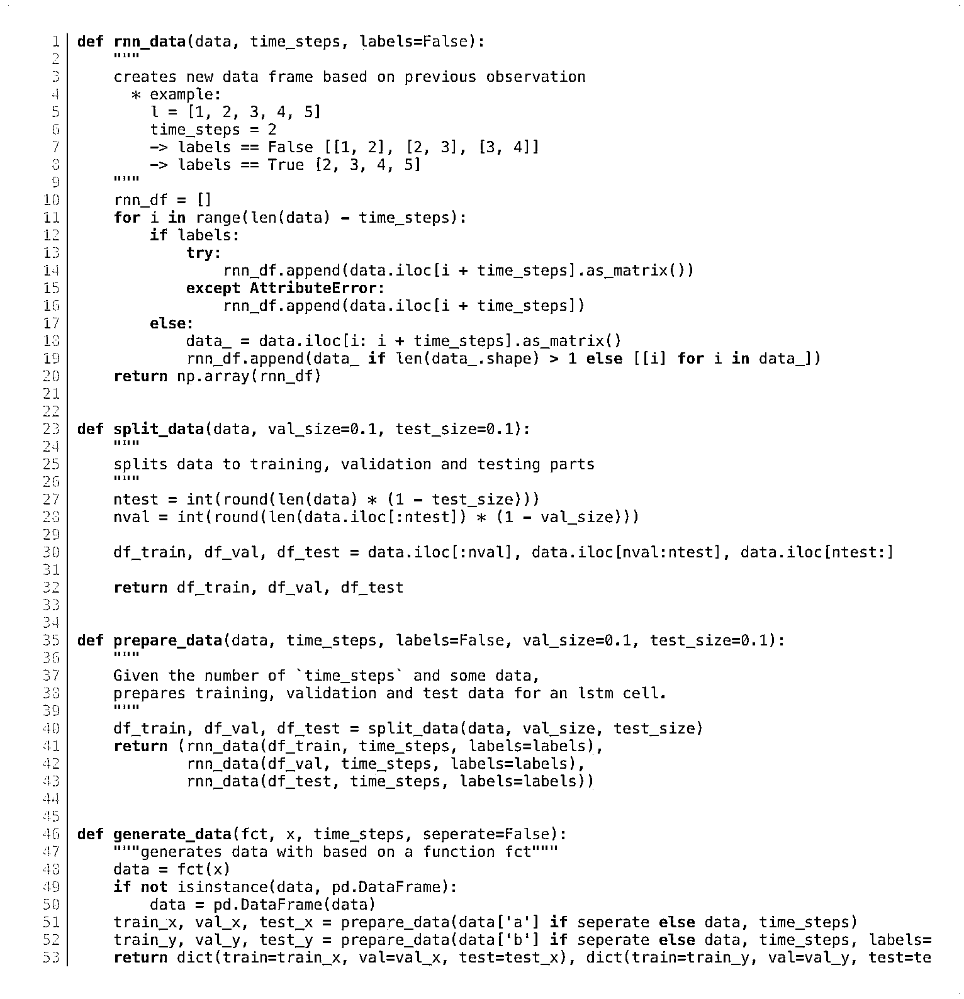

这将创建一个数据，这将允许我们的模型查看 time_steps 在过去的次数，以进行预测。 所以如果我们的第一个单元格是 10 个 time_steps 单元格，那么对于我们想做的每个预测，我们需要为单元格提供 10 个历史数据点。 y 值应该对应于我们想要预测的数据的第十个值。

我们首先定义超参数

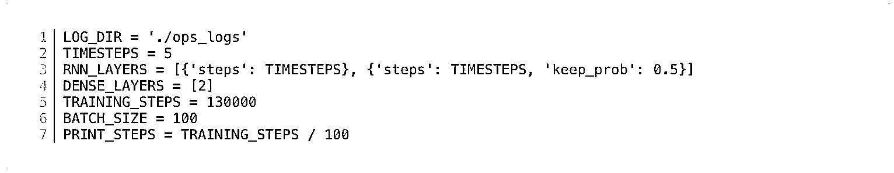

现在我们可以根据我们的模型创建一个回归函数

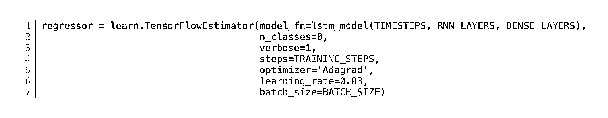

**预测 sin 函数**

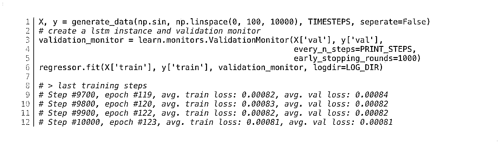

测试集

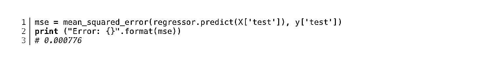

*   **real sin function**

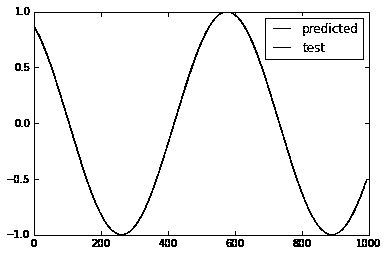

**一起预测 sin 和 cos 函数**

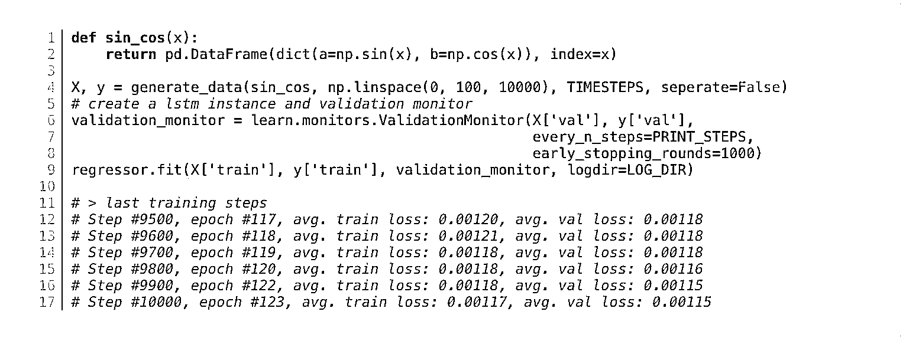

测试集

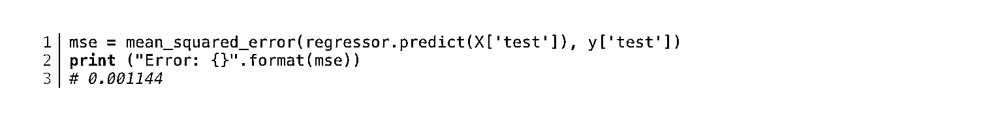

*   predicted sin-cos function

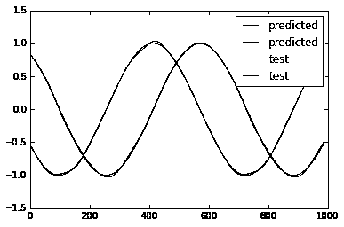

**x*sin**

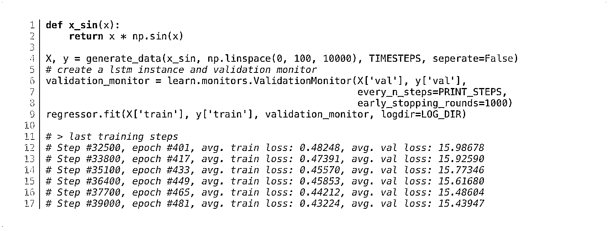

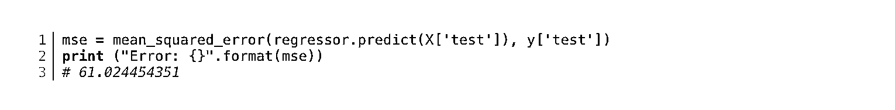

*   真实 x*sin 


*   预测 x*sin 

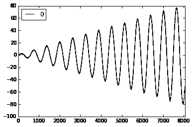

**model loss**

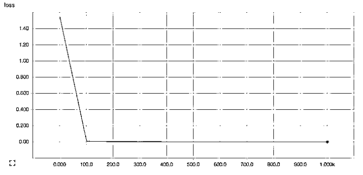

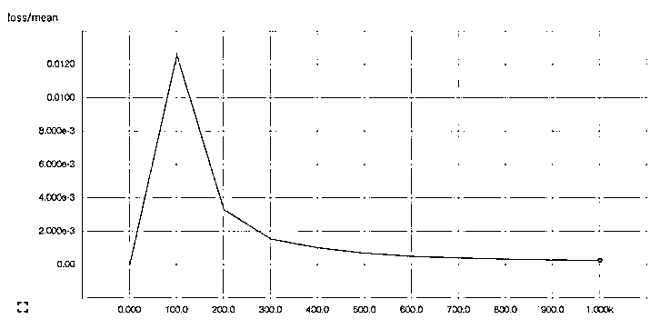

文档说明

## Install and Run

### Create a Virtual Environment

It is reccomended that you create a virtualenv for the setup since this example is highly dependant on the versions set in the requirements file.

```py
$ virtualenv ~/python/ltsm
$ source ~/python/ltsm/bin/activate
(ltsm) $
```

### Install Requirements

This example depends on tensorflow-0.11.0 to work. You will first need to install the requirements. You will need the appropriate version of tensorflow for your platform, this example is for mac. For more details goto TAG tensorflow-0.11.0 Setup

```py
(ltsm) $ pip install -U https://storage.googleapis.com/tensorflow/mac/cpu/tensorflow-0.11.0-py3-none-any.whl
(ltsm) $ pip install -r ./requirements.txt
```

### Running on Jupyter

Three Jupyter notebooks are provided as examples on how to use lstm for predicting shapes. They will be available when you start up Jupyter in the project dir.

```py
(ltsm) $ jupyter notebook
```

- END -

**关注者**

**从****1 到 10000+**

**我们每天都在进步**

