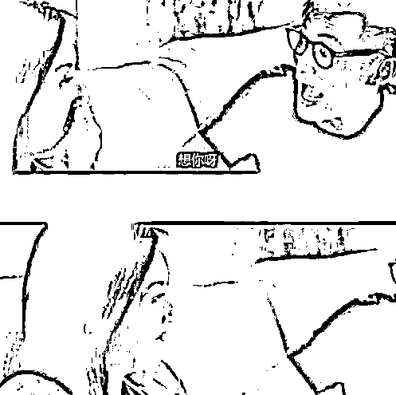
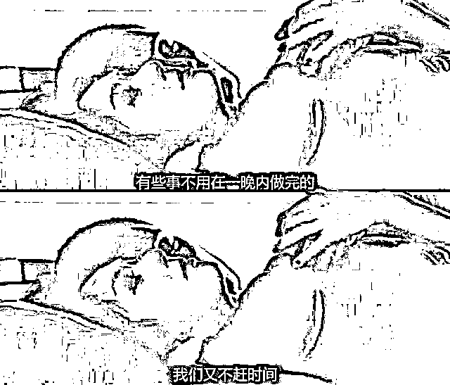
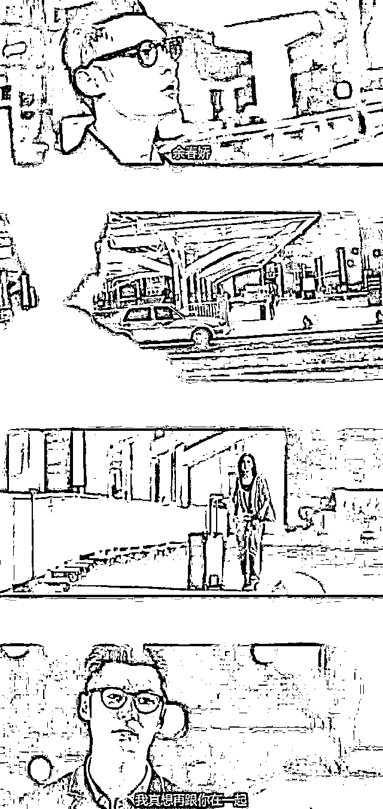

# 志明与春娇：明年你还爱我吗？

> 原文：[`mp.weixin.qq.com/s?__biz=MzAxNTc0Mjg0Mg==&mid=2653285200&idx=1&sn=7ecc19dd58ec07a088fc4dd86011ad4e&chksm=802e2945b759a0537cc1923892ccca512a502ec3f237b3aa4faa8f3275b27b0cbb01431f9eed&scene=27#wechat_redirect`](http://mp.weixin.qq.com/s?__biz=MzAxNTc0Mjg0Mg==&mid=2653285200&idx=1&sn=7ecc19dd58ec07a088fc4dd86011ad4e&chksm=802e2945b759a0537cc1923892ccca512a502ec3f237b3aa4faa8f3275b27b0cbb01431f9eed&scene=27#wechat_redirect)


**编辑部**

微信公众号

**关键字**全网搜索最新排名

**『量化投资』：排名第一**

**『量       化』：排名第一**

**『机器学习』：排名第四**

我们会再接再厉

成为全网**优质的**金融、技术类公众号

**公众号今天
没有推文
分享一篇文章
祝大家周末快乐
五一开心**

文/北方有佳人

**01**

1999 年的时候，陈升做了一件很煽情的事。

他提前一年预售了自己演唱会的门票，仅限情侣购买，一人的价格可以获得两个席位。

但是一份情侣券分为男生券和女生券。

**恋人双方各自保留属于自己的那张券，一年后，两张券合在一起才能入场。**

票当然卖得很快。每对购票的情侣脸上都洋溢着关于幸福的憧憬，和对待未来的喜悦。

**也许这就是恋人双方证明自己爱情的方式吧。**

“我们要在一起一辈子。”

“一年，算的了什么呢！”

然而一年后，陈升专设的情侣席位，果然空了一大半。

他面对那一个个空板凳，脸上带着怪异的歉意，唱了演唱会的最后一首歌——《把悲伤留给自己》。

那场演唱会的名字是——“明年你还爱我吗？”

**- 明年你还爱我吗？**

**- 别着急回答。**


**02**

真正看懂《志明与春娇》的故事，是在爱过几个人的成年后。

以前年纪小，看电影只是囫囵吞枣，

自己还是不懂事的叛逆期，一心索取不断的要，不懂有一种感情叫做春娇和志明。

到后来看过好几遍后，越发爱上了这个系列，可能是因为它真实，没有特别狗血的桥段，没有太过煽情的话语。

也或许，可能我本身的性格就像余春娇。

**总有这么一些姑娘，身上带着一种倔强的男孩子气，不会太多太多浪漫，说不出要亲亲、要抱抱、举高高。**

能做的就是使劲儿的给，能做的就是不断的原谅。

有人说张志明是余春娇的一颗蛀齿，他为她做过什么？

一件都没有。

然而人有 28 颗牙齿，却只有一颗心。

**每个人的这颗心里，都装着一个永远长不大的张志明。**



**03**  

看过志明与春娇系列电影第一部的人，

大概都会记住这句话，“有的事不用一夜之内做完，我们又不赶时间。”

这话曾一度被我奉为真理，

我第一本出的书，《请你晚点喜欢我》也正是这个用意，**最怕突如其来又不负责任的喜欢，我们能不能，让一切慢慢来。**

那天深夜，他们睡在一张大床上，春娇意识到将要发生什么事儿，也没扭扭捏捏的故作矜持，说了一些挑逗暗示的话，可是张志明只是从身后紧紧地抱住了她，轻轻地说了一句，“有的事不用一夜做完，我们又不赶时间。”

不知道春娇是不是在这一刻喜欢上的张志明，反正我是在听到这句话的时候，心里轻轻的一颤，像是一只温热的手，轻轻拂在满是尘埃的心上。

很多女生都像我一样，都因为这句话感动，印象最深刻的也是这一幕。

**有多少人能忍住自己的欲望，在骚动暧昧的晚上，只是单纯的从背后抱着对方睡觉，什么都不想。**

像是岁月漫漫，我们还有好长的路要一起走，不着急在一时间把所有激情耗尽，把所有喜欢揉到身体里。

只想和你慢慢的走，像是用文火熬一锅暖胃的粥，我们有的是时间，我们不赶时间。

**我向往这种真实却不做作的感情，喜欢这种在马桶里放干冰的低级爱好，喜欢这种细水长流的爱。**

或者没有那么多惊喜和感动，可在细碎悠长的日子里，成为你的手，你的脚，你的眼睛，你的西北和东南。

*   天地是你，未来是你，我的四海八荒都是你。



**04**

网上搜索的时候看到了新片即将上映的消息，

心有触动，这个跨度 8 年的姐弟故事，终于要迎来一个完整的结局。

综艺里说，“男人永远不会长大，男人只会变老。”

**我知道有很多人确实成熟的很慢，慢到我们等不到他们成熟就要离开，可这次，我期待你我还能最后一次勇敢。**

不知道有没有人为春娇和志明的故事守候 8 年，有没有那么一刻它曾打动过你的内心，有没有那么一时你也很天真的相信爱情，有没有那么一次，你也爱到无路可退。

**陈升用一年时间，证明了感情的脆弱。彭浩翔用八年，诠释了爱情的过程。可能就像是张志明说的，“两个人要维持一段关系真的好难啊。”**

有人说七年之痒，那这八年，足够物是人非。

这八年，你身边换了多少人，和多少人发了短信，对多少人说了晚安，相信过多少次爱情，而爱情又无情的把你抛开。

如果有那么一个人，

8 年前陪你看《志明与春娇》，6 年前陪你看《春娇与志明》，而今还在你身边抱着你说慢慢爱。

**那请你千万别徘徊，狠狠爱，使劲儿爱。**



> ```py
> 白朵朵，一个长得好看的写字人，最怕突如其来又不负责任的喜欢。新书《请你晚点再喜欢我》热销中。微博：执拗却不别扭的白朵朵；微信公众号：北方有佳人（tonightsaybey）。
> ```

- END -

**关注者**

**从****1 到 10000+**

**我们每天都在进步**

