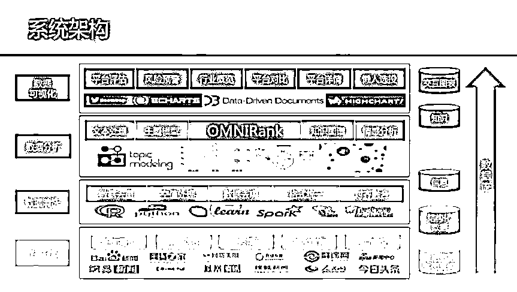

# 经验分享|互联网金融数据产品开发

> 原文：[`mp.weixin.qq.com/s?__biz=MzAxNTc0Mjg0Mg==&mid=2653285190&idx=1&sn=bb7c66fc614eb013a8eb06d144817acd&chksm=802e2953b759a04524d531e3f50a72512afc16e240ca3054cdc02c2c0de02829b1eee555950d&scene=27#wechat_redirect`](http://mp.weixin.qq.com/s?__biz=MzAxNTc0Mjg0Mg==&mid=2653285190&idx=1&sn=bb7c66fc614eb013a8eb06d144817acd&chksm=802e2953b759a04524d531e3f50a72512afc16e240ca3054cdc02c2c0de02829b1eee555950d&scene=27#wechat_redirect)

**编辑部**

微信公众号

**关键字**全网搜索最新排名

**『量化投资』：排名第一**

**『量       化』：排名第一**

**『机器学习』：排名第四**

我们会再接再厉

成为全网**优质的**金融、技术类公众号

激烈竞争，翻倍增长，互金深浅不试怎知？ 

真实数据，真实环境，真实投资人如何打动？

10 万美金，创新应用，谁是未来的互金引导者？

把握未来十年的价值风口，让技术的力量不再沉默，拍拍贷魔镜杯再度启动：10 万美金奖金池，500 万美金创投基金，邀你与全国优秀选手同台竞技。不论你是专业的数据分析师、精湛的应用开发者、还是超强的产品设计师，抑或是技能全通的实力全才，魔镜杯数据应用大赛都可为你提供挑战的舞台。

拍拍贷为本次赛事提供丰富的业务场景、真实脱敏的数据及多种功能的可调用接口，参赛选手将直面投资者需求，打造数据应用，优秀作品团队可直接获得天使投资。本次赛事由科赛网优秀选手，拍拍贷技术专家组成技术分享团，每周一期分享会，欢迎你的加入。

**互联网金融数据产品开发 **

**分享嘉宾**

王海洋，上海交通大学信息工程系在读博士生。研究方向为时空数据挖掘与智能交通。热爱数据分析挖掘与可视化，曾获得上海市首届数据创意应用大赛冠军，中国计算机学会第二届大数据应用创新大赛冠军，拍拍贷魔镜杯第一届互联网金融开发大赛冠军。

**◆**** ◆ ◆**

**为什么会参赛**

当时参加比赛最主要的原因还是出于兴趣。之前参加了一些相关的数据创意、数据产品的比赛，使我们有了一种好奇心，如果从数据的视角看一件事，会有哪些新的 insight，会发现哪些容易被我们忽视却至关重要的细节？而互联网金融这一新兴行业，高风险与高收益并存，既有新平台的不断加入也有旧平台的跑路，有的人投资获得了高额利润，也有人失掉了多年积蓄。我们希望运用我们的数据分析技术，从数据的视角看互联网金融行业，希望从中得到一些有趣且有意义的发现，并开发出一款数据产品，使别人也能通过我们的产品更加了解互联网金融这一行业。

**◆**** ◆ ◆**

**数据产品的设计**

我们之前做过较多数据分析，涵盖了很多领域，包括了多种应用。结合之前的经验，我们在技术上其实遇到的困难并不大。然而互联网金融是我们第一次接触的领域，这使我们在产品设计上遇到了较大的挑战。我认为，解决这一问题最有效的方法是跨界头脑风暴。各行各业的人在一起讨论，以多个视角看待同一问题，所产生的集体智慧会对我们产品设计提供极大的帮助。我们当时是用跨界合作解决这一问题的。在导师的帮助下，我们咨询了很多具有多年经验的投资者、互联网金融领域的专家、资深的产品经理以及设计方面的共创者，进行头脑风暴，了解投资者的痛点、互联网金融产品的设计模式以及更加友好的交互体验。通过不断的改善和迭代，最终实现了我们的产品。

关于产品设计网络上有很多高质量的文章，在此我就不再赘述，我仅分享一些我认为数据产品设计中最重要的几个内容。

**1.精准定位用户群体与需求**

产品是给用户用的，而不是给我们自己用的。设计数据产品的过程中一定要考虑用户，既要定位好产品适合的用户群，也要设计好这些用户的实际需求，而不是我们想象中的需求。另外，设计需求时也要结合实际，包括已有的数据是否支持，已有的技术可否实现。在我们的作品中，我们将投资者分为初级投资者和资深投资者。资深投资者有自己的决策方案，他们往往喜欢选择高风险高回报的投资产品，这一类用户不是我们的主要服务对象。我们最希望帮助的是那些占绝大多数的初级投资者，为他们客观精确的量化平台风险、智能定制的推荐可靠平台。

**2.要有一个灵魂**

灵魂就是产品的核心、亮点，让人能够眼前一亮的东西，也是区分你的产品与其他人产品最重要的部分。这一块值得精心设计以及花精力完善，一个有创意有意义的产品灵魂会使得作品不再平铺直叙。产品灵魂不应多，一般来说有一个就够，但一定要足够“亮”，即具有较强的创新性。我们的作品中，基于深度学习的平台风险量化模型 OMNIRank 就是我们作品的灵魂，既是一个新的研究问题，也是新的技术方法。

 

**3.颜值很重要**

作品的颜值也是不可忽视的一块，即使作品内容再好，没有好的颜值也难以展示出它的价值。包括数据产品网站或者 APP 的设计，以及作品 PPT 的设计。因此好的数据可视化，以及 UI 设计、交互设计至关重要。我们的作品中采用了很丰富的数据可视化，从多个维度展示了各大平台的功能，并有很好的交互性。 PPT 的制作上当时也请设计的朋友做了美化。

**◆**** ◆ ◆**

**相关技术的学习**

我分享一下我们在比赛中用到的技术，以及我对数据产品开发中技术学习的看法。我们主要用到的技术如下：

> 爬虫： python 的 urllib 库，beautifulsoup 库；
> 
> 基本数据处理：MySQL, python 基本语法与数据结构，python 的 pandas 库；
> 
> 海量数据处理： Hadoop 的 HDFS, Spark 的 RDD；
> 
> 数据建模： python 的 keras(建模)，python 的 scikit-learn（对比）;
> 
> 数据可视化：R 语言的 ggplot2，Web 框架 Flask, Js 的 ECharts、D3；

我认为数据产品开发所用到的技术，多数都不那么难，但是需要技术的种类较多。对刚做数据产品开发的同学来说，精通每一样技术很花时间，也没有必要。我认为比较好的学习方式是“Learning by Doing”，边学边做。根据产品的需求，明确要做的工作以后，我觉得可以总结为以下四步实现：明确目标，分解任务，逐一击破，整合完成。比如我们想实现一个文本词频统计的小目标，我们并不需要去学一整部 python 编程书， 因为对这一小目标而言，学一整部 python 编程书没有意义，可能学完很有收获，但对统计文本词频而言耽误了太多时间。我们要做的是把任务分解，为了达成目标，我们要学习分词工具，及 python 的基本语法数据结构。之后，我们再去查有哪些分词工具，我们查到了 jieba，然后怎样用 python 语法数据结构做分词的统计。掌握每项子任务之后，我们再把他们整合起来，就可以完成我们当初的“小目标”了。

总之，对数据产品开发比赛而言，产品设计需要系统，但并不需要系统化学习每一项技术。

**◆**** ◆ ◆**

**参赛后的收获**

通过参加上一届的拍拍贷魔镜杯互联网金融开发大赛，我们有了很多收获。首先满足了最初的好奇心，对互联网金融行业有了一定的了解，并看到了数据视角下的互联网金融是什么样子。而且学习了如何实现对一个陌生领域的数据产品设计，巩固了之前的技术并学习了新技术。总之，比赛的最大收获是让我们在短时间快速学习了多种技能，也很荣幸，结识了很多各行各业的朋友。最后预祝第二届拍拍贷魔镜杯互联网金融大赛取得圆满成功，预祝各位参赛选手取得好成绩！

***下期预告***

**朱杰**

法国雷恩一大博士学位，博士期间研究方向为时间序列分析，拍拍贷高级数据工程师。在机器学习领域有着较深的理论造诣和丰富的实践经验。拍拍贷人工智能项目主要负责人之一。

**钟海**

毕业于复旦大学数学系应用数学专业，理学硕士学位，拍拍贷资深数据工程师，拥有超过 5 年数据分析建模经验，曾任职于国际知名咨询公司担任资深分析师，为投行、保险等金融服务公司提供数据驱动的解决方案，对互联网金融业务模式有深刻的认识。

**分享内容**

> 主办方可为参赛选手提供的资源
> 
> 如何着手搭建简单的投标和分析类小工具
> 
> 创新类工具的方向指引，包括现有开发者案例以及其他创意点

**参与方式**

**QQ 在线直播 ，请加****群****610095869**

**赛事详情请扫码或****点击阅读原文****了解**

**投稿、商业合作**

**请发邮件到：lhtzjqxx@163.com**

**关注者**

**从****1 到 10000+**

**我们每天都在进步**