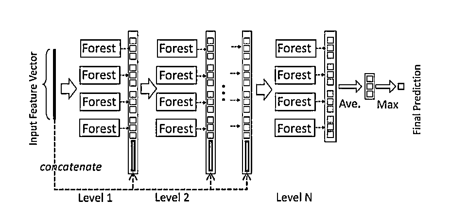
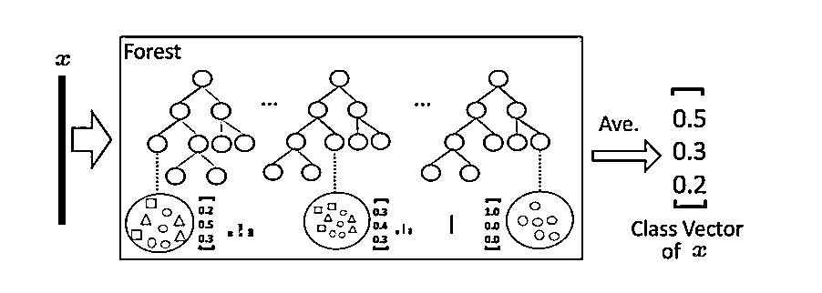
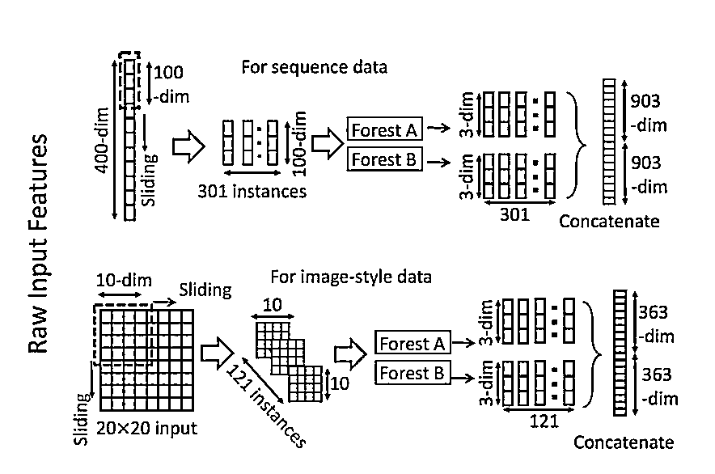
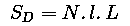
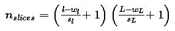
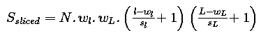
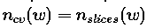
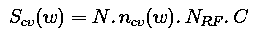
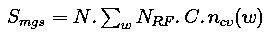
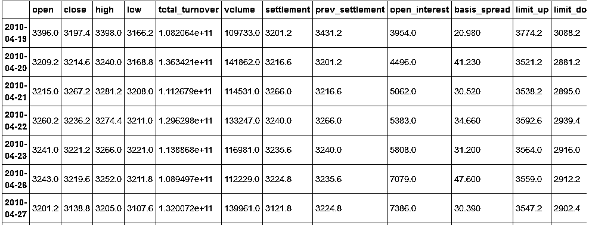

# 【独家】周志华教授 gcForest（多粒度级联森林）算法预测股指期货涨跌

> 原文：[`mp.weixin.qq.com/s?__biz=MzAxNTc0Mjg0Mg==&mid=2653285179&idx=1&sn=f3d07a411aff07a7c49125ce1a057db4&chksm=802e292eb759a0381ddf6f91534585aba72ec972fd022e673bc88d20ec33adb279da4d5bcb31&scene=27#wechat_redirect`](http://mp.weixin.qq.com/s?__biz=MzAxNTc0Mjg0Mg==&mid=2653285179&idx=1&sn=f3d07a411aff07a7c49125ce1a057db4&chksm=802e292eb759a0381ddf6f91534585aba72ec972fd022e673bc88d20ec33adb279da4d5bcb31&scene=27#wechat_redirect)


**编辑部**

微信公众号

**关键字**全网搜索最新排名

**『量化投资』：排名第一**

**『量       化』：排名第一**

**『机器学习』：排名第四**

我们会再接再厉

成为全网**优质的**金融、技术类公众号

公众号特约编辑 / 一心想错 / 独家

**gcForest Algorithm**

对于周志华教授的文章，网上已经有人做出很详细的解释啦。我们对论文进行简单描述之后，然后直接从策略开始讲起。

gcForest(multi-Grained Cascade forest 多粒度级联森林)是周志华教授最新提出的新的决策树集成方法。这种方法生成一个深度树集成方法(deep forest ensemble method)，使用级联结构让 gcForest 学习。gcForest 模型把训练分成两个阶段：Multi-Grained Scanning 和 Cascade Forest。Multi-Grained Scanning 生成特征，Cascade Forest 经过多个森林多层级联得出预测结果。

它的表征学习能力可以通过对高维输入数据的多粒度扫描而进行加强。串联的层数也可以通过自适应的决定从而使得模型复杂度不需要成为一个自定义的超参数，而是一个根据数据情况而自动设定的参数。值得注意的是，gcForest 会比 DNN 有更少的超参数，更好的一点在于 gcForest 对参数是有非常好的鲁棒性，哪怕用默认参数也可以获得很棒的结果。

## **级联森林（Cascade Forest）**



因为决策树其实是在特征空间中不断划分子空间，并且给每个子空间打上标签（分类问题就是一个类别，回归问题就是一个目标值），所以给予一条测试样本，每棵树会根据样本所在的子空间中训练样本的类别占比生成一个类别的概率分布，然后对森林内所有树的各类比例取平均，输出整个森林对各类的比例。例如下图所示，这是根据图 1 的三分类问题的一个简化森林，每个样本在每棵树中都会找到一条路径去找到自己对应的叶节点，而同样在这个叶节点中的训练数据很可能是有不同类别的，我们可以对不同类别进行统计获取各类的比例，然后通过对所有树的比例进行求均值生成整个森林的概率分布。



**多粒度扫描**



多粒度扫描其实是引用了类似 CNN 的一个滑动窗口，例如说我们现在有一个 400 维的样本输入，现在设定采样窗口是 100 维的，那我们可以通过逐步的采样，最终获得 301 个子样本（因此这里默认的采样步长是 1，所以得到的子样本个数 = (400-100)/1 + 1）。如果输入的是一个 20*20 的图片，利用一个 10*10 的采样窗口，就可以获得 121 个子样本（对每行和每列都是 (20-10)/1 + 1 = 11，11*11 = 121）。所以，整个多粒度扫描过程就是：先输入一个完整的 P 维样本，然后通过一个长度为 k 的采样窗口进行滑动采样，得到 S = (P - K)/1+1 个 k 维特征子样本向量，接着每个子样本都用于完全随机森林和普通随机森林的训练并在每个森林都获得一个长度为 C 的概率向量，这样每个森林会产生长度为 S*C 的表征向量（就是经过随机森林转换并拼接的概率向量），最后把每层的 F 个森林的结果拼接在一起得到本层输出。

**算法实现**

鉴于此，在 Github 上，已经有人实现了算法代码。在这里我们提供一个基于 python3 的代码实现方法。选择采用 scikit 学习语法以方便使用，下面将介绍如何使用它。

GCForest.py 源码如下，首先需要将此模块导入到根目录并命名为 GCForest.py，当然最好是从 github 克隆下来。

# **gcForest in Python**

Status : under development

**gcForest** is an algorithm suggested in Zhou and Feng 2017\. It uses a multi-grain scanning approach for data slicing and a cascade structure of multiple random forests layers (see paper for details).

**gcForest** has been first developed as a Classifier and designed such that the multi-grain scanning module and the cascade structure can be used separately. During development I've paid special attention to write the code in the way that future parallelization should be pretty straightforward to implement.

**Prerequisites**

The present code has been developed under python3.x. You will need to have the following installed on your computer to make it work :

*   Python 3.x

*   Numpy >= 1.12.0

*   Scikit-learn >= 0.18.1

*   jupyter >= 1.0.0 (only useful to run the tuto notebook)

You can install all of them using pip install :

```py
$ pip3 install requirements.txt

```

## **Using gcForest**

The syntax uses the scikit learn style with a .fit() function to train the algorithm and a .predict() function to predict new values class. You can find two examples in the jupyter notebook included in the repository.

```py
from GCForest import *
gcf = gcForest( **kwargs )
gcf.fit(X_train, y_train)
gcf.predict(X_test)
```

## **Notes**

I wrote the code from scratch in two days and even though I have tested it on several cases I cannot certify that it is a 100% bug free obviously. **Feel free to test it and send me your feedback about any improvement and/or modification!**

**Known Issues**

**Memory comsuption when slicing data** There is now a short naive calculation illustrating the issue in the notebook. So far the input data slicing is done all in a single step to train the Random Forest for the Multi-Grain Scanning. The problem is that it might requires a lot of memory depending on the size of the data set and the number of slices asked resulting in memory crashes (at least on my Intel Core 2 Duo).
I have recently improved the memory usage (from version 0.1.4) when slicing the data but will keep looking at ways to optimize the code.

**OOB score error **During the Random Forests training the Out-Of-Bag (OOB) technique is used for the prediction probabilities. It was found that this technique can sometimes raises an error when one or several samples is/are used for all trees training.

A potential solution consists in using cross validation instead of OOB score although it slows down the training. Anyway, simply increasing the number of trees and re-running the training (and crossing fingers) is often enough.

**Built With**

*   PyCharm community edition

*   memory_profiler libra

**License**

This project is licensed under the MIT License (see LICENSE for details)

**Early Results**

(will be updated as new results come out)

*   Scikit-learn handwritten digits classification :
    training time ~ 5min 
    accuracy ~ 98%

部分代码：

```py
import itertools
import numpy as np
from sklearn.ensemble import RandomForestClassifier
from sklearn.model_selection import train_test_split
from sklearn.metrics import accuracy_score

__author__ = "Pierre-Yves Lablanche" __email__ = "plablanche@aims.ac.za" __license__ = "MIT" __version__ = "0.1.3" __status__ = "Development" # noinspection PyUnboundLocalVariable class gcForest(object):
    def __init__(self, shape_1X=None, n_mgsRFtree=30, window=None, stride=1,
                 cascade_test_size=0.2, n_cascadeRF=2, n_cascadeRFtree=101, cascade_layer=np.inf,
                 min_samples_mgs=0.1, min_samples_cascade=0.05, tolerance=0.0, n_jobs=1):
        """ gcForest Classifier.
```

**关于规模**

目前 gcForest 实现中的主要技术问题是在输入数据时的内存使用情况。真实的计算实际上可以让您了解算法将处理的对象的数量和规模。

计算 C 类[l，L]大小 N 维的问题，初始规模为：



****Slicing Step** If my window is of size [wl,wL] and the chosen stride are [sl,sL]   then the number of slices per sample is :**

****

**Obviously the size of slice is [wl,wL]hence the total size of the sliced data set is :**

****

**This is when the memory consumption is its peak maximum.**

****Class Vector after Multi-Grain Scanning** Now all slices are fed to the random forest to generate class vectors. The number of class vector per random forest per window per sample is simply equal to the number of slices given to the random forest**

****

**Hence, if we have Nrfrandom forest per window the size of a class vector is (recall we have N samples and C classes):**

****

**And finally the total size of the Multi-Grain Scanning output will be:** 

****

**This short calculation is just meant to give you an idea of the data processing during the Multi-Grain Scanning phase. The actual memory consumption depends on the format given (aka float, int, double, etc.) and it might be worth looking at it carefully when dealing with large datasets.**

****预测每根 K 线涨跌****

**获取每根 k 线的交易数据后，把 open,close,high,low,volume,ema, macd, linreg, momentum, rsi, var, cycle, atr 作为特征指标，下根 K 线涨跌作为预测指标**

```py
`#获取当前时间 from datetime import datetime
now = datetime.now()` 
```

```py
`startDate = '2010-4-16' endDate = now
#获取沪深 300 股指期货数据，频率为 1 分钟 df=get_price('IF88', start_date=startDate, end_date=endDate,\
             frequency='1d', fields=None, country='cn')

open = df['open'].values
close = df['close'].values
volume = df['volume'].values
high = df['high'].values
low = df['low'].values`
```

****

```py
`import talib as ta
import pandas as pd
import numpy as np
from sklearn import preprocessing
ema = ta.EMA(close, timeperiod=30).tolist()
macd = ta.MACD(close, fastperiod=12, slowperiod=26, signalperiod = 9)[0].tolist()
momentum = ta.MOM(close, timeperiod=10).tolist()
rsi = ta.RSI(close, timeperiod=14).tolist()
linreg = ta.LINEARREG(close, timeperiod=14).tolist()
var = ta.VAR(close, timeperiod=5, nbdev=1).tolist()#获取当前的收盘价的希尔伯特变换 cycle = ta.HT_DCPERIOD(close).tolist()#获取平均真实波动范围指标 ATR,时间段为 14 atr = ta.ATR(high, low, close, timeperiod=14).tolist()#把每根 k 线的指标放入数组 X 中，并转置 X = np.array([open,close,high,low,volume,ema, macd, linreg, momentum, rsi, var, cycle, atr]).T#输出可知数组 X 包含了 ema, macd, linreg 等 13 个指标数值 X[2]`
```

```py
array([   3215\. ,    3267.2,    3281.2,    3208\. ,  114531\. ,       nan,
             nan,       nan,       nan,       nan,       nan,       nan,
             nan])
```

```py
`y=[]
c=close[0]
#用 i 遍历整个数据集 for i in range(1, len(X)):    
#如果高点突破参考线的 1.0015 倍，即上涨
    if (close[i]>close[i-1]):        
        #把参考点加到列表 basicLine 里，并且新参考点变为原来的 1.0015 倍，
        y.append(1)        
    elif (close[i]<close[i-1]): 
        y.append(0)         
    elif (close[i]==close[i-1]): 
        y.append(2)         #添加最后一个数据的标签为 1 y.append(1)

#把 y 转化为 ndarray 数组 y=np.array(y)
#输出验证标签集是否准确 print(len(y))
for i in range(1, 10):
    print(close[i],y[i],i)`
```

```py
1663
3214.6 1 1
3267.2 0 2
3236.2 0 3
3221.2 0 4
3219.6 0 5
3138.8 0 6
3129.0 0 7
3083.8 1 8
3107.0 0 9
```

```py
`#把数据集分解成随机的训练和测试子集， 参数 test_size 表示测试集所占比例 X_tr, X_te, y_tr, y_te = train_test_split(X, y, test_size=0.33)
#输出可知测试特征集为维度是 50*4 的数组 ndarray X_te.shape` 
```

```py
(549, 13)
```

**首先调用和训练算法. 参数 shape_1X 在这里是指某一样本的维度。
我把维度也作为图像特征输入到机器里. 显然，它与 iris 数据集并不是很相关，但仍然需要定义 .**

**0.1.3 版本可输入整数作为 shape_1X 参数。**

****gcForest 参数说明****

****shape_1X:** 单个样本元素的形状[n_lines，n_cols]。 调用 mg_scanning 时需要！对于序列数据，可以给出单个 int。**

****n_mgsRFtree:** 多粒度扫描期间随机森林中的树木数量。**

****window：int（default = None）** 多粒度扫描期间使用的窗口大小列表。如果“无”，则不进行切片。**

****stride：int（default = 1）** 切片数据时使用的步骤。**

****cascade_test_size：float 或 int（default = 0.2）** 级联训练集分裂的分数或绝对数。**

****n_cascadeRF：int（default = 2）** 级联层中随机森林的数量,对于每个伪随机森林，创建完整的随机森林，因此一层中随机森林的总数将为 2 * n_cascadeRF。**

****n_cascadeRFtree：int（default = 101）** 级联层中单个随机森林中的树数。**

****min_samples_mgs：float 或 int（default = 0.1）** 节点中执行拆分的最小样本数 在多粒度扫描随机森林训练期间。 如果 int number_of_samples = int。 如果 float，min_samples 表示要考虑的初始 n_samples 的分数。**

****min_samples_cascade：float 或 int（default = 0.1）** 节点中执行拆分的最小样本数 在级联随机森林训练期间。 如果 int number_of_samples = int。 如果 float，min_samples 表示要考虑的初始 n_samples 的分数。**

****cascade_layer：int（default = np.inf）** 允许的最大级联级数。 有用的限制级联的结构。**

****tolerance：float（default= 0.0）** 联生长的精度差,整个级联的性能将在验证集上进行估计， 如果没有显着的性能增益，训练过程将终止**

****n_jobs：int（default = 1）** 任意随机森林适合并预测的并行运行的工作数量。 如果为-1，则将作业数设置为核心数。**

```py
`#shape_1X 样本维度，window 为多粒度扫描（Multi-Grained Scanning）算法中滑动窗口大小，\
#用于扫描原始数据，tolerance 为级联生长的精度差,整个级联的性能将在验证集上进行估计，\
#如果没有显着的性能增益，训练过程将终止#gcf = gcForest(shape_1X=4, window=2, tolerance=0.0)
#gcf = gcForest(shape_1X=[13,13], window=2, tolerance=0.0) gcf = gcForest(shape_1X=13, n_mgsRFtree=100, window=6, stride=2,
                 cascade_test_size=0.2, n_cascadeRF=4, n_cascadeRFtree=101, cascade_layer=np.inf,
                 min_samples_mgs=0.1, min_samples_cascade=0.1, tolerance=0.0, n_jobs=1)
gcf.fit(X_tr, y_tr)`
```

```py
Slicing Sequence...
Training MGS Random Forests...
Adding/Training Layer, n_layer=1
Layer validation accuracy = 0.5577889447236181
Adding/Training Layer, n_layer=2
Layer validation accuracy = 0.521608040201005
```

```py
`#shape_1X 样本维度，window 为多粒度扫描（Multi-Grained Scanning）算法中滑动窗口大小，\
#用于扫描原始数据，tolerance 为级联生长的精度差,整个级联的性能将在验证集上进行估计，\
#如果没有显着的性能增益，训练过程将终止#gcf = gcForest(shape_1X=4, window=2, tolerance=0.0)
#gcf = gcForest(shape_1X=[13,13], window=2, tolerance=0.0) gcf = gcForest(shape_1X=[1,13], window=[1,6],)
gcf.fit(X_tr, y_tr)`
```

```py
Slicing Sequence...
Training MGS Random Forests...
Slicing Sequence...
Training MGS Random Forests...
Adding/Training Layer, n_layer=1
Layer validation accuracy = 0.5964125560538116
Adding/Training Layer, n_layer=2
Layer validation accuracy = 0.5695067264573991
```

**参数改为 shape_1X=[1,13], window=[1,6]后训练集达到 0.59，不理想，这里只是抛砖引玉，调参需要大神指导。**

**Now checking the prediction for the test set:**

**现在看看测试集的预测值：**

```py
`pred_X = gcf.predict(X_te)
print(len(pred_X))
print(len(y_te))
print(pred_X)`
```

```py
Slicing Sequence...
Slicing Sequence...
549
549
[1 1 0 0 0 0 0 0 0 0 1 0 0 0 1 0 1 1 0 1 0 1 0 1 0 0 0 0 0 0 1 1 1 0 0 1 0 等
```

```py
`#最近预测 for i in range(1,len(pred_X)):
    print(y_te[-i],pred_X[-i],-i)`
```

```py
0 1 -1
0 0 -2
1 0 -3
1 0 -4
0 1 -5 等
```

```py
`# 保存每一天预测的结果，如果某天预测对了，保存 1，如果某天预测错了，保存-1 result_list = []
# 检查预测是否成功 def checkPredict(i):
    if pred_X[i] == y_te[i]:
        result_list.append(1)    
    else:
        result_list.append(0)
#画出最近第 k+1 个长度为 j 的时间段准确率 k=0j
=len(y_te)
#j=100 for i in range(len(y_te)-j*(k+1), len(y_te)-j*k):
    checkPredict(i)    
    #print(y_pred[i])
    #return result_list print(len(y_te) ) 
print(len(result_list) )
 import matplotlib.pyplot as plt
#将准确率曲线画出来 x = range(0, len(result_list))
y = []
#z=[] for i in range(0, len(result_list)):    
    #y.append((1 + float(sum(result_list[:i])) / (i+1)) / 2)
    y.append( float(sum(result_list[:i])) / (i+1))
print('最近',j,'次准确率',y[-1])
print(x, y)
line, = plt.plot(x, y)
plt.show`
```

```py
549
549
最近 549 次准确率 0.5300546448087432
range(0, 549) 0.0, 0.0, 0.3333333333333333, 0.25 等
```

**![**

```py
`#评估准确率
# evaluating accuracy accuracy = accuracy_score(y_true=y_te, y_pred=pred_X)
print('gcForest accuracy : {}'.format(accuracy))`
```

```py
gcForest accuracy : **0.5300546448087432**
```

**预测结果很一般，不过还是有效的。**

**预测涨跌看起不是那么靠谱，但识别手写数字还是相当牛逼的。**

**下面只贴出结果：**

```py
`# loading the data digits = load_digits()
X = digits.data
y = digits.target
X_tr, X_te, y_tr, y_te = train_test_split(X, y, test_size=0.4)
gcf = gcForest(shape_1X=[7,8], window=[4,6], tolerance=0.0, min_samples_mgs=10, min_samples_cascade=7)
#gcf = gcForest(shape_1X=13, window=13, tolerance=0.0, min_samples_mgs=10, min_samples_cascade=7) gcf.fit(X_tr, y_tr)`
```

```py
Slicing Images...
Training MGS Random Forests...
Slicing Images...
Training MGS Random Forests...
Adding/Training Layer, n_layer=1
Layer validation accuracy = 0.9814814814814815
Adding/Training Layer, n_layer=2
Layer validation accuracy = 0.9814814814814815
```

```py
`# evaluating accuracy accuracy = accuracy_score(y_true=y_te, y_pred=pred_X)
print('gcForest accuracy : {}'.format(accuracy))`
```

```py
gcForest accuracy : 0.980528511821975
```

**厉害了，简单的参数都能使手写数字识别的准确率高达 98%**

****单独利用多粒度扫描和级联森林****

**由于多粒度扫描和级联森林模块是相当独立的，因此可以单独使用它们。
如果给定目标“y”，代码将自动使用它进行训练，否则它会调用最后训练的随机森林来分割数据。**

```py
`gcf = gcForest(shape_1X=[8,8], window=5, min_samples_mgs=10, min_samples_cascade=7)
X_tr_mgs = gcf.mg_scanning(X_tr, y_tr)`
```

```py
Slicing Images...
Training MGS Random Forests...
```

**It is now possible to use the mg_scanning output as input for cascade forests using different parameters. Note that the cascade forest module does not directly return predictions but probability predictions from each Random Forest in the last layer of the cascade. Hence the need to first take the mean of the output and then find the max.**

```py
`gcf = gcForest(tolerance=0.0, min_samples_mgs=10, min_samples_cascade=7)
_ = gcf.cascade_forest(X_tr_mgs, y_tr)`
```

```py
Adding/Training Layer, n_layer=1
Layer validation accuracy = 0.9722222222222222
Adding/Training Layer, n_layer=2
Layer validation accuracy = 0.9907407407407407
Adding/Training Layer, n_layer=3
Layer validation accuracy = 0.9814814814814815
```

```py
`import numpy as np
pred_proba = gcf.cascade_forest(X_te_mgs)
tmp = np.mean(pred_proba, axis=0)
preds = np.argmax(tmp, axis=1)
accuracy_score(y_true=y_te, y_pred=preds)
gcf = gcForest(tolerance=0.0, min_samples_mgs=20, min_samples_cascade=10)
_ = gcf.cascade_forest(X_tr_mgs, y_tr)
pred_proba = gcf.cascade_forest(X_te_mgs)
tmp = np.mean(pred_proba, axis=0)
preds = np.argmax(tmp, axis=1)
accuracy_score(y_true=y_te, y_pred=preds)`
```

```py
0.97774687065368571
```

```py
Adding/Training Layer, n_layer=1
Layer validation accuracy = 0.9629629629629629
Adding/Training Layer, n_layer=2
Layer validation accuracy = 0.9675925925925926
Adding/Training Layer, n_layer=3
Layer validation accuracy = 0.9722222222222222
Adding/Training Layer, n_layer=4
Layer validation accuracy = 0.9722222222222222
```

```py
0.97218358831710705
```

### ****Skipping mg_scanning****

**It is also possible to directly use the cascade forest and skip the multi grain scanning step.**

```py
`gcf = gcForest(tolerance=0.0, min_samples_cascade=20)
_ = gcf.cascade_forest(X_tr, y_tr)
pred_proba = gcf.cascade_forest(X_te)
tmp = np.mean(pred_proba, axis=0)
preds = np.argmax(tmp, axis=1)
accuracy_score(y_true=y_te, y_pred=preds)`
```

```py
Adding/Training Layer, n_layer=1
Layer validation accuracy = 0.9583333333333334
Adding/Training Layer, n_layer=2
Layer validation accuracy = 0.9675925925925926
Adding/Training Layer, n_layer=3
Layer validation accuracy = 0.9583333333333334
```

```py
0.94297635605006958
```

****投稿、商业合作****

****请发邮件到：lhtzjqxx@163.com****

****关注者****

****从****1 到 10000+****

****我们每天都在进步****

********