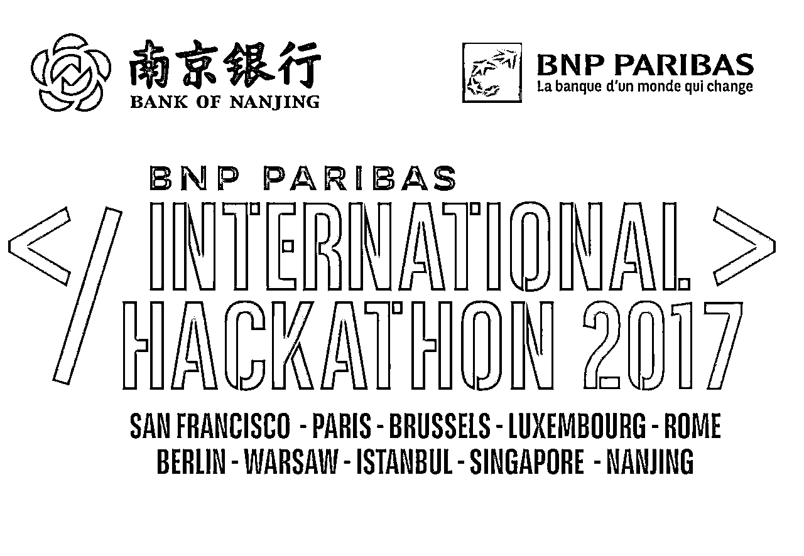
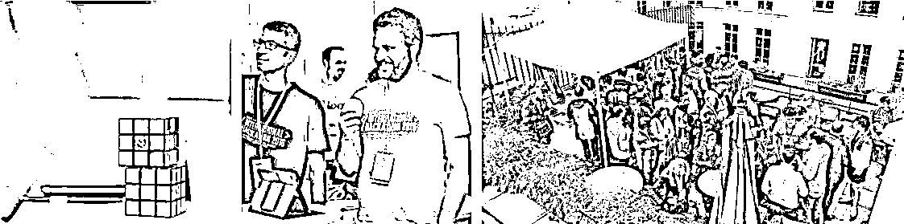
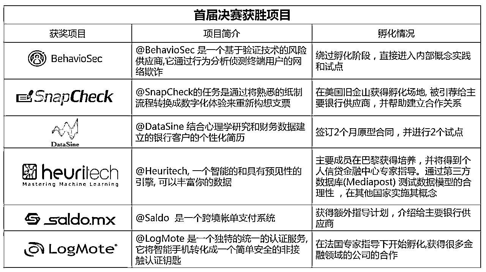
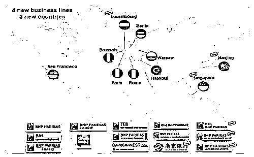
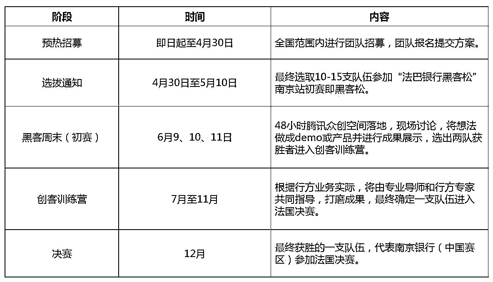
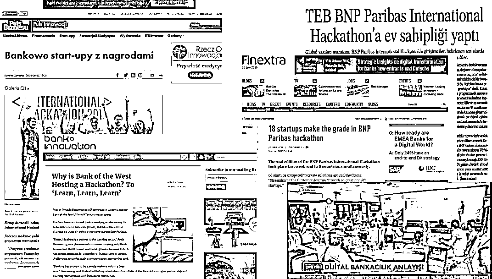
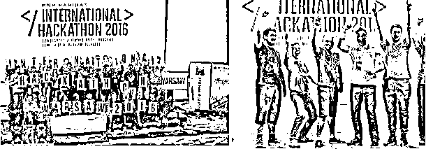
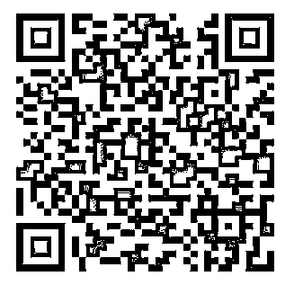

# 法国巴黎银行 x 腾讯众创空间国际黑客松首次落地中国 | 参赛选手火热招募中

> 原文：[`mp.weixin.qq.com/s?__biz=MzAxNTc0Mjg0Mg==&mid=2653285163&idx=1&sn=c546e3b620c2c0e0e6dc124bde77d4a0&chksm=802e293eb759a028ab4d75865a311c6b741bbd35d414bf6d6704ce225bbb700c180252f1662e&scene=27#wechat_redirect`](http://mp.weixin.qq.com/s?__biz=MzAxNTc0Mjg0Mg==&mid=2653285163&idx=1&sn=c546e3b620c2c0e0e6dc124bde77d4a0&chksm=802e293eb759a028ab4d75865a311c6b741bbd35d414bf6d6704ce225bbb700c180252f1662e&scene=27#wechat_redirect)

**编辑部**

微信公众号

**关键字**全网搜索最新排名

**『量化投资』：排名第一**

**『量       化』：排名第一**

**『机器学习』：排名第四**

我们会再接再厉

成为全网**优质的**金融、技术类公众号

一年 52 个周末，你都在做什么？

宅在家追人民的名义？

这不是你该有的价值！

想一年不如干两天

48 个小时开启你的创业梦想之旅！

**2017 法国巴黎银行携手南京银行邀请你**

**来腾讯众创空间（南京）**

**用一个周末的时间，参与一场“黑客松”**

**实现从 0 到 1 的突破**

在 48 小时里，被新鲜火辣的 idea 包围

一对一导师、投资机构辅导 

思维碰撞，发现问题，然后通通解决

你准备好了么？

**法国巴黎银行黑客松是？**

**法国巴黎银行国际黑客松**是法国巴黎银行邀请初创公司参与解决银行内部痛点的一项活动。通常各种不同技术背景的人通过两到三天的现场协作，完成一个应用程序或模型满足行方特定的商业需求，解决业务问题。

法国巴黎银行作为南京银行战略合作伙伴之一，在全球范围内举办黑客松活动已有两年。2015 年第一界 Hackathon，共有**57 家初创公司参加**，在 48 小时内开发了**超过 50 个模型**,17 个具体可行的项目,5 个潜在的由法国巴黎银行在 2016 年年底推出的用于未来商业化的计划,以及 2 个在这 48 小时内从零设计出的项目。

2015 首届决赛项目

这是一场实干家的盛宴，每年会在全球多个地区同时展开，2017 年南京成为继布鲁赛尔、洛杉矶、华沙等第 10 个黑客松参赛城市，也是亚洲第二个“黑客松”城市。今**年新加坡和中国（南京）首次代表亚洲参加**，分赛区获胜队伍将有机会参与在法国巴黎组织的决赛。优秀的参赛公司均有机会得到奖金以及银行的投资和其他商业合作。

**2017 赛题公布**

**➤   大赛题目**

移动互联网时代已经到来，传统商业银行如何有效利用大数据、新科技、新设备在移动端提供消费信贷类服务,实现效率提升的同时合理控制风险，优化客户体验！

**➤   赛题说明**

创新金融产品方向：包括但不限于线上贷款的精准营销、资格审核（人工智能、生物识别）、贷款发放流程优化、贷后管理等各个方面的金融产品、工具、平台的互联网创新。

提升移动端客户体验方向：可分为金融服务体验和增值服务体验。金融服务方面包括但不限于智能投顾、智能记账、智能客服等。增值服务体验包括所有能够集成于移动端提升客户体验的项目，如智能停车、智能手环等。

**➤ 关键词**

客户体验提升、大数据应用、互联网贷款管理：风险模型、计分卡、线上贷款审批、贷后监控、催收、人工智能、生物识别、客户画像及精准营销、合同管理、反欺诈、信息安全等

**➤ 开放数据**

参赛项目可在提交方案中说明数据需求，行方会对参赛项目提供数据。

国外数据：现已有 6 个不同国家和地区不同的开放接口，囊括线上线下从开户、交易到安全等各类模拟数据，

国内数据：南京银行提供行内大零售脱敏及模拟数据，囊括线上线下的客户基本信息、资产信息等。

**参赛对象**

我们希望参赛者以**团队形式**参加黑客松，你可以是成熟公司，也可以是自己组队。

**公司组队**需 5 人及以上具有各种技能的参赛者组成。

**个人组队**需自行组队，3 人及以上具有各种技能的参赛者组成。

不管你程序员、产品经理、还是工程师；不管你是科技迷、技术迷、代码迷；我们鼓励参与者和志趣相投的朋友一起交流和实现有趣的想法，不限于网站、APP、软件、程序、硬件...做出了什么并不重要，重要的是快速实现想法的过程和遇见的朋友。

**参赛方式**

点击**阅读原文**即可进入科赛大数据竞赛平台进行报名

4 月 30 日前，在科赛（kesci.com）平台提交相关信息，并提供赛题解决方案或想法

5 月 10 日前， 评委审核线上打分，主办方与团队沟通相关信息

5 月 10 日后通知入围团队

**大赛规划**

（点击查看大图）

**一场黑客松你能获得什么？**

**➤ 奖金**

初赛将评比出两支获胜队伍，每支获胜队伍 5 万元奖金，进入决赛 TOP3 还会获得法国巴黎银行总部的额外 1 万欧元奖金。同时法巴银行将为入选决赛的公司提供定额参赛费用。

**➤ 投资及商业合作**

本次大赛，南京银行及法国巴黎银行邀请行内投资专家，以及知名投资机构全程参与，腾讯众创空间将邀请大数据领域专家共同交流，优秀的参赛公司有机会获得投资，南京银行会有购买行为等进一步合作。有潜力的初创公司将有机会获得优惠贷款或其他扶持。

如果项目/团队足够优秀，行方会颁发额外的特别奖项给杰出的项目。

**➤ 巨大曝光**

此次大赛将在众多垂直细分平台、社群、媒体宣传。决赛期间，Facebook、Twitter 实时宣传推送，往届有超过*10,000+*的内网浏览和**12,00+youtube**视频浏览，法国更有 100+ 媒体文章, 电视, 广播和博客的传播，使大赛迅速成为关注焦点。

两天三晚沉浸式的体验，让你可以结交到志同道合的伙伴；还可以与专业的大咖切磋技艺，学习到新技术，在现场能够参与或者发起互动讨论一个你觉得不错的项目或创意，一起实现它，并得到充分的展示。

**2017 法国巴黎银行国际 Hackathon**

让梦想照进现实的机会！

48 小时，全真模拟创业初期场景，

在实践中分享经验。

**报名请点击阅读原文**

**提交方案即可** 

活动详情咨询可加官方 qq 群：**586724124**

或直接扫描下方微信二维码

**投稿、商业合作**

**请发邮件到：lhtzjqxx@163.com**