# 股票成交量的预测基于 Keras&sklearn

> 原文：[`mp.weixin.qq.com/s?__biz=MzAxNTc0Mjg0Mg==&mid=2653285152&idx=1&sn=dffda5618726811aa7ea22d10fe7dda8&chksm=802e2935b759a023469de332c9ea0c1b5a9da48082000544eb9ca49023ee57ccae5a685300e3&scene=27#wechat_redirect`](http://mp.weixin.qq.com/s?__biz=MzAxNTc0Mjg0Mg==&mid=2653285152&idx=1&sn=dffda5618726811aa7ea22d10fe7dda8&chksm=802e2935b759a023469de332c9ea0c1b5a9da48082000544eb9ca49023ee57ccae5a685300e3&scene=27#wechat_redirect)


**编辑部**

微信公众号

**关键字**全网搜索最新排名

**『量化投资』：排名第一**

**『量       化』：排名第一**

**『机器学习』：排名第四**

我们会再接再厉

成为全网**优质的**金融、技术类公众号

美国股市上午 9:30 开盘，下午 4:00 收盘闭，提供上午 9:30 和下午 2:00 之间的交易数据，从下午 2:00 到下午 4:00 预测成交量的变动。

```py
import pandas as pd
import time
import numpy as np
import matplotlib.pyplot as plt
pd.options.mode.chained_assignment = None  
plt.style.use('ggplot')
```

度量错误率：平均绝对百分比误差（MAPE）。

```py
def mean_absolute_percentage_error(y_true, y_pred): 
    return np.mean(np.abs((y_true - y_pred) / y_true)) * 10
```

**数据说明**

训练数据包含 1882 个不同日期的 613220 个例子和 352 个例子。

测试数据包含 614098 个例子，我们的目的是预测目标值。

```py
Training = pd.read_csv('training_input.csv', delimiter=',')
Output = pd.read_csv('training_output.csv', delimiter=';')
Testing = pd.read_csv('testing_input.csv', delimiter=',')
print Training.shape
Training.head()
```

```py
(613220, 57)
```

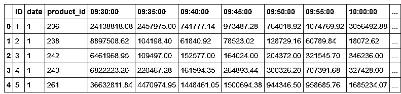

```py
print Output.shape
Output.head()
```

```py
(613220, 2)
```

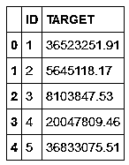

```py
print 'Number of product_id :', len(Training['product_id'].unique())
print 'Number of date :', len(Training['date'].unique())
```

```py
Number of product_id : 352
Number of date : 1882
```

这个数据集的主要困难是在训练和测试集中都有大量的缺失值。因此，有两个关键问题：预测目标值，并处理缺失值。

```py
print 'Number of rows with missing values in the test set :',Traini
```

```py
Number of rows with missing values in the test set : 99273
```

我们逐行研究缺失值的数量（对于具有缺少条目的行）：我们绘制单个行的缺失值的直方图；此数据集中的大多数示例只有 1 或 2 个缺失值。

```py
print 'Distribution of the rows with missing values in the train set' (Training.shape[1] - Training.count(axis=1)).value_counts()[1:].plot(kind='bar',
figsize=(14, 6), 
```

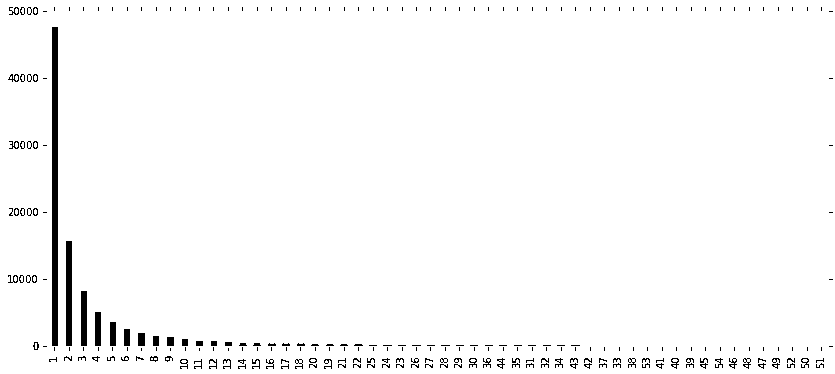

```py
print 'Distribution of the rows with missing values in the test set' (Testing.shape[1] - Testing.count(axis=1)).value_counts()[1:].plot(kind='bar',
figsize=(14, 6), 
```

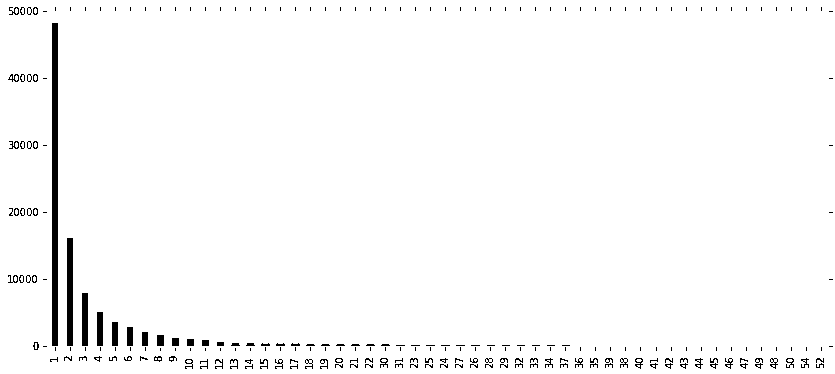

```py
print 'Distribution of the missing values in the train set by features' (Training.shape[0] - Training.count(axis=0)).sort_values(ascending=False)[:-3].plot(kind='bar',
figsize=(14, 6),                                                                                  
```


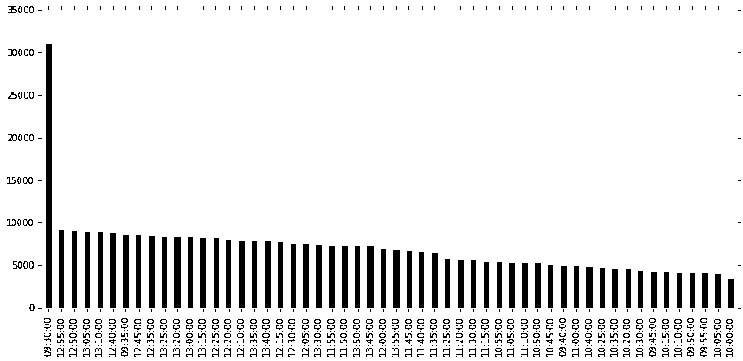

我们清楚地看到，这两个图形非常相似，第一个时间变量'09：30：00'的缺失值表示为 sur-representation。

**开始**

要对我们的预测变量的质量有一个很好的初步了解，在这里删除所有缺少条目的示例，并在完全填充的数据上构建我们的预测模型。

```py
train = pd.merge(Training, Output, on='ID', how='inner')
train_full = train.drop(pd.isnull(train).any(1).nonzero()[0]).reset
```

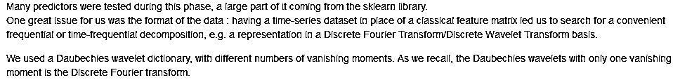

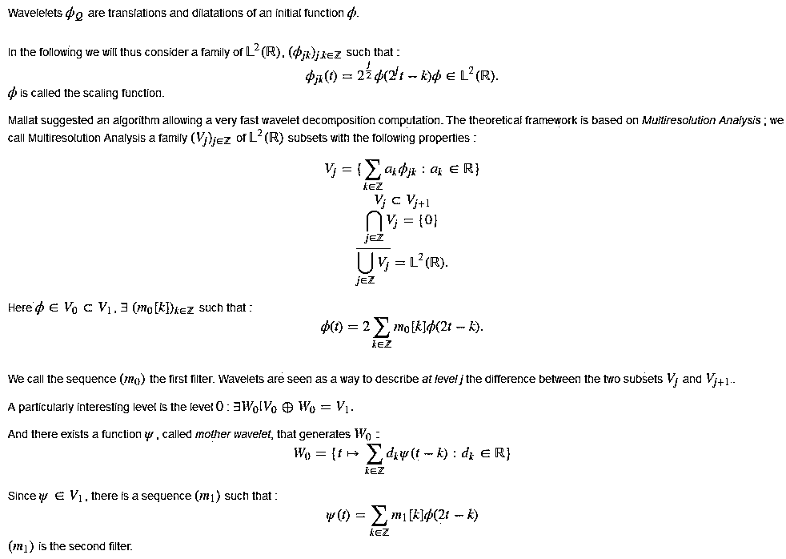

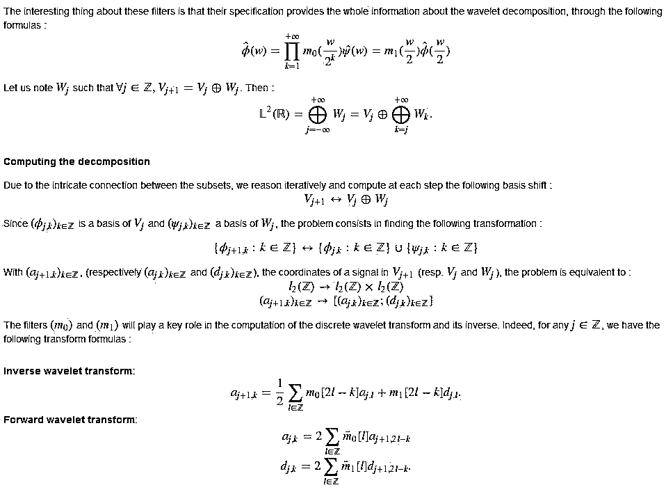

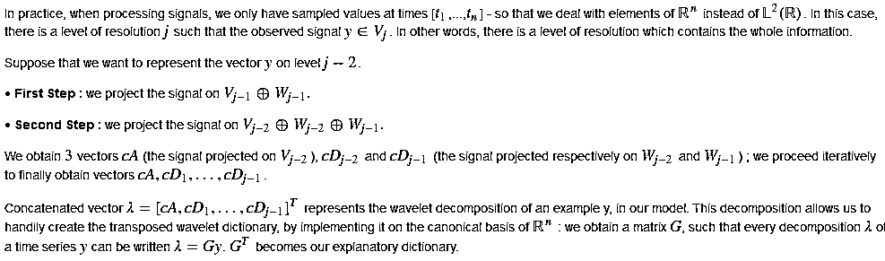

```py
import pywtclass DictT(object):def __init__(self, name, level):
            self.name = name
            self.level = level
            self.sizes = []    
def dot(self, mat):
     m = []        
    if mat.shape[0] != mat.size:            
        for i in xrange(mat.shape[1]):
            c = pywt.wavedec(mat[:, i], self.name, level=self.level)
            self.sizes.append(map(len, c))
            c = np.concatenate(c)
            m.append(c)           
        return np.asarray(m).T        
     else:
         c = pywt.wavedec(mat, self.name, level=self.level)
         self.sizes.append(map(len, c))            
         return np.concatenate(c)
```

现在，为了计算矩阵 X 的变换，我们简单地将其替换为以下：

```py
wave_name = 'db20' wave_level = None wavelet_operator_t = DictT(level=wave_level, name=wave_name)

basis_t = wavelet_operator_t.dot(np.identity(X.shape[1]))
basis_t /= np.sqrt(np.sum(basis_t ** 2, axis=0))
basis = basis_t.T
```

现在，X 变为 X.dot（基准）作为回归模型的输入。 不幸的是，离散小波变换（或傅里叶变换）给出了比最后一个方法更简单的结果，如下所述。 此外，当处理缺失值时，内插数据的 DWT / DFT（参见下面的部分）介绍了所有级别的内插噪声，并使此表示在此方法中成为不方便的选择。

**CNN** 

我们还观察了深度学习模型的回归阶段。 其中，我们在数据集上尝试了 LSTM 和卷积神经网络。我们使用 Keras 轻松组建网络，并且大量地使用参数，包括 Adam Optimizer 的学习步骤，每个卷积层的过滤器数量或过滤器长度。

不幸的是，没有参数配置给我们一个低于 32％的训练分数。 我们仍然相信，这种方法仍然具有很大的潜力，我们可以通过更多的实验获得更多的结果。

```py
from keras.models import Sequential
from keras.layers.core import Dense, Dropout, Activation
from keras.layers.convolutional 
import Convolution1D, MaxPooling1D
from keras.layers.core import Flatten
from keras.optimizers import Adam
# Reshape data. train_shape = (x_train.shape[0], x_train.shape[1], 1)
val_shape = (x_val.shape[0], x_val.shape[1], 1)

x_train_2 = np.reshape(x_train, train_shape).astype(theano.config.floatX)
x_val_2 = np.reshape(x_val, val_shape).astype(theano.config.floatX)
 # CNN Model. model = Sequential()
model.add(Convolution1D(nb_filter=16,
                        filter_length=2,
                        init='glorot_uniform',
                        input_shape=(x_train.shape[1], 1)))
model.add(Activation('relu'))
model.add(MaxPooling1D(3))
model.add(Dropout(0.5))
model.add(Convolution1D(nb_filter=32,
                        filter_length=4,
                        init='glorot_uniform'))
model.add(Activation('relu'))
model.add(MaxPooling1D(2))
model.add(Dropout(0.5))
model.add(Flatten())
model.add(Dense(128, init='glorot_uniform'))
model.add(Activation('relu'))
model.add(Dropout(0.5))
model.add(Dense(1))

learning_rate = 10 batch_size = 100 nb_epoch = 10 adam = Adam(lr=learning_rate)
model.compile(loss='mean_absolute_percentage_error', optimizer=ad

print  'Training | Batch size :', batch_size, ", Number of epochs :", nb_epoch
model.fit(x_train_2, y_train, batch_size=batch_size, nb_epoch=nb_epoch,
          validation_data=(x_val_2, y_val), show_accuracy=True)
score, acc = model.evaluate(x_val_2, y_val, batch_size=batch_size,
                            show_accuracy=True) print  'Test score :', score print  'Test accuracy:', acc
```

**最终回归**

在测试各种预测变量后，我们的主要选择是𝖱𝖺𝗇𝖽𝗈𝗆𝖥𝗈𝗋𝖾𝗌𝗍𝖱𝖾𝗀𝗋𝖾𝗌𝗌𝗈𝗋，在缩短的数据集上使用𝖦𝗋𝗂𝖽𝖲𝖾𝖺𝗋𝖼𝗁𝖢𝖵进行参数选择。 考虑到在这样大的数据上发生的大的训练时间，这是执行网格搜索的唯一合理的方法。

```py
features = train_full.drop(['ID','product_id','TARGET'], axis=1)
X_columns = train_full.columns.drop(['ID','product_id','TARGET'])
X = features.values
y = train_full['TARGET'].values

from sklearn.cross_validation import train_test_split
X_train, X_test, y_train, y_test = train_test_split(
    X, y, test_size=0.2, random_state=0)
```

```py
%%time
from sklearn.ensemble import RandomForestRegressor
from sklearn.cross_validation import cross_val_score

n_estimators = 50 max_depth = 15 max_features = 40 reg = RandomForestRegressor(n_estimators=n_estimators, max_depth=max_depth, max_features=max_features)

reg.fit(X_train, y_train)

y_pred = reg.predict(X_test)print "MAPE :", mean_absolute_percentage_error(y_test, y_pred)
```

```py
CPU times: user 13 µs, sys: 0 ns, total: 13 µs
Wall time: 16 µs
```

使用我们训练好的预测变量，我们现在可以观测每个变量的重要性。

```py
ordering = np.argsort(reg.feature_importances_)[::-1]
importances = reg.feature_importances_[ordering]
feature_names = X_columns[ordering]

pd.DataFrame(importances, index=feature_names).plot(kind='bar', figsize=(14, 6), colo
```

我们试图重新启动模型，没有最低重要性的特征，这可能在我们的回归中带来噪音。 我们尝试几种可能性，但是结果并不是很有说服力地完全消除它们。

然而，我们从进一步的模型中删除“日期”，因为它在整个变量池中的重要性不大。

如前所述，我们尝试了其他几个模型，没有很大的成功。 以下是对相同数据进行评估的𝖠𝖽𝖺𝖡𝗈𝗈𝗌𝗍𝖱𝖾𝗀𝗋𝖾𝗌𝗌𝗈𝗋的示例：

```py
%%time
from sklearn.ensemble import ExtraTreesRegressor
from sklearn.cross_validation import cross_val_scorefrom sklearn.ensemble import AdaBoostRegressor

regto = AdaBoostRegressor(base_estimator=reg, n_estimators=20, learning_rate=0.8)

regto.fit(X_train, y_train)

y_pred = regto.predict(X_test)print "MAPE :", mean_absolute_percentage_error(y_test, y_pred)
```

```py
MAPE : 36.379279734
CPU times: user 6min 59s, sys: 2.79 s, total: 7min 2s
Wall time: 7min 7s
```

**处理缺失值**

** A.删除第一个时间变量**

如前所述，第一个时间变量'09：30：00'占用了大量的缺失数据。

此外，我们看到这个变量在我们的模型中是最不重要的；因此，我们决定将其从未来的预测中删除。

这种删除的效果是增加了训练的大小，因为我们只是在没有丢失值的情况下进行观察，而不改变我们的模型的性能。

```py
Training_new = train.copy()
Training_new.drop(["09:30:00"], axis=1, inplace=True)
print train.shapeprint Training_new.shape
```

```py
(613220, 58)
(613220, 57)
```

```py
print 'Number of rows without missing values with the feature 09:30:00 in train set :', train.\
    drop(pd.isnull(train).any(1).nonzero()[0]).shape[0]
print 'Number of rows without missing values without the feature 09:30:00 in train set :', Training_new.\
    drop(pd.isnull(Training_new).any(1).nonzero()[0]).shape[0]
```

```py
Number of rows without missing values with the feature 09:30:00 
in train set : 513947
Number of rows without missing values without the feature 09:30:00
 in train set : 534215
```

```py
Testing_new = Testing.copy()
Testing_new.drop(["09:30:00"], axis=1, inplace=True)
print Testing.shape
print Testing_new.shape
```

```py
(614098, 57)
(614098, 56)
```

在测试集和训练集中，这种方法允许我们获得大约 20000 次观察而不丢失值。

我们因此获得了训练集的尺寸和我们可以用我们的模型预测的测试集的观察值。

```py
train_full = Training_new.drop(pd.isnull(Training_new).any(1).nonzero()[0])
from sklearn.cross_validation import train_test_split

X_train, X_test, y_train, y_test = train_test_split(
    X, y, test_size=0.2, random_state=0)
%%time
from sklearn.ensemble import RandomForestRegressor
from sklearn.cross_validation import cross_val_score

n_estimators = 50 max_depth = 15 max_features = 40 reg = RandomForestRegressor(n_estimators=n_estimators, max_depth=max_depth, max_features=max_features)

reg.fit(X_train, y_train)

y_pred = reg.predict(X_test)
print "MAPE :", mean_absolute_percentage_error(y_test, y_pred)
```

```py
MAPE : 29.6441237583
CPU times: user 17min 55s, sys: 12.1 s, total: 18min 7s
Wall time: 19min 7s
```

**补充缺失值**

 我们尝试了几种技术来插值缺失值：sklearn 的𝖨𝗆𝗉𝗎𝗍𝖾𝗋计算机（我们尝试的最差），以及从 scipy 继承的 pandas 插值技术的整个范围。

我们将在这里只提供我们最好的结果：从 scipy 的时间插值方法。

我们把训练组分成两个子集：没有缺少值的观测值（train_filled）和缺失值的观测值（train_missing）。

```py
train_filled = Training_new.drop(pd.isnull(Training_new).any(1).nonzero()[0]).reset_index(drop=True)
train_missing = Training_new[~Training_new["ID"].isin(train_filled["ID"].tolist())]
print train_filled.shape
```

```py
row = train_missing.drop(["ID", "date", "product_id", "TARGET"], axis=1).ix[613193] # [62691] row.index = pd.to_datetime(row.index)
print "Missing values :", np.isnan(row).sum()

d = {"time": row.interpolate(method="time"),"none": row}
pd.DataFrame(d).plot(colormap=plt.get_cmap("bwr"), figsize=(14, 6))
```

```py
Missing values : 28
```

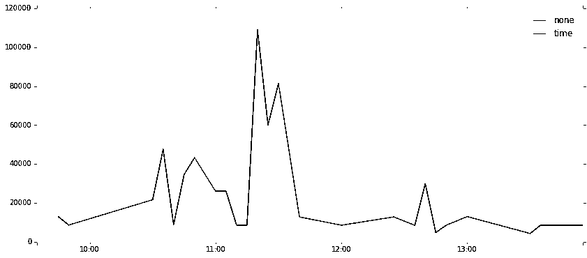

直接帖结果：

```py
Dataset shape after filling :
(613199, 57)
```

```py
MAPE : 29.6429418639
CPU times: user 18min 14s, sys: 13.5 s, total: 18min 28s
Wall time: 19min 53s
```

在这里只测试了缺少值的观察结果，结果相当糟糕。 

**无插值的解决方案**

 一个重要的说法是：我们使用的指标不仅惩罚了真实值与预测值之间的距离，而且还惩罚了这两者之间的相对位置。

例如，我们用 ypredypred 表示我们的预测值，ytrueytrue 为真值：如果 ypred = 10，ytrue = 100，则两者之间的距离为 90，MAPE 为 90％；但是如果 ypred = 100，ytrue = 10，距离仍然为 90，但 MAPE 现在为 900％。 这就是为什么我们决定，如果具有太多缺失值的示例，如果在该产品训练集中设置了 TARGET，则分配最小值。 这样，我们对这些观察结果最多有 100％的误差。 这是一种限制观察值与缺失值的错误的方法。

所以我们用训练集缺失值的观察结果来测试。

```py
train_filled = Training_new.drop(pd.isnull(Training_new).any(1).nonzero()[0]).reset_index(drop=True)
train_missing = Training_new[~Training_new["ID"].isin(train_filled["ID"].tolist())]
print 'train_filled',train_filled.shape
print 'train_missing',train_missing.shape
```

```py
train_filled (534215, 57)
train_missing (79005, 57)
```

```py
MAPE : 83.5862773074
```

所以对于这些观察值我们有 84％的 MAP。 但是我们也观察到，按产品，特征“目标”具有很大的标准偏差（几乎等于平均值）。

```py
mean_per_product_id = train.groupby("product_id").agg({"TARGET": np.mean})
mean_per_product_id.columns = ['TARGET_mean']

std_per_product_id = train.groupby("product_id").agg({"TARGET": np.std})
std_per_product_id.columns = ['TARGET_std']

pd.concat([mean_per_product_id, std_per_product_id], axis=1).head()
```

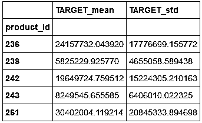

这意味着最低限度与其他价值观相差甚远。 所以我们决定使用不是最小值，而是使用上面的值，而不是重新调整它。MAPE : 83.5862773074

```py
MAPE : 69.9682064614
MAPE : 62.706405248
MAPE : 61.7711984429
MAPE : 65.5130846126
```

我们确定了以下最小调整价值：

```py
MAPE : 61.480089348
``` 

**预测测试集**

 如前所述，我们将测试集分为两个子集：一个没有任何缺少的条目，其余的。

在第一种情况下，我们将使用我们训练好的回归器进行预测；在第二种情况下，我们将通过输出每个产品的重新调整的最小值来控制错误。

```py
test_filled = Testing_new.drop(pd.isnull(Testing_new).any(1).nonzero()[0]).reset_index(drop=True)
test_missing = Testing_new[~Testing_new["ID"].isin(test_filled["ID"].tolist())]

train_full = Training_new.drop(pd.isnull(Training_new).any(1).nonzero()[0])
features = train_full.drop(['ID','product_id','date','TARGET'], axis=1)
X_columns = train_full.columns.drop(['ID','product_id','date','TARGET'])
X = features.values
y = train_full['TARGET'].values

%%time
from sklearn.ensemble import RandomForestRegressor
from sklearn.cross_validation import cross_val_score

n_estimators = 50 max_depth = 15 max_features = 40 reg = RandomForestRegressor(n_estimators=n_estimators, max_depth=max_depth, max_features=max_features)

reg.fit(X, y)

y_pred_filled = reg.predict(test_filled[numeric_cols].values)

submission_filled = test_filled[["ID", "product_id"]].copy()
submission_filled["TARGET"] = y_pred_filled
submission_filled.head()

min_per_product_id = train.groupby("product_id").agg({"TARGET": np.min})
min_per_product_id.head()

submission_missing = test_missing.copy().join(min_per_product_id, on="product_id")
submission_missing.head()

submission_missing["TARGET"] = 3.65 * submission_missing["TARGET"]
```

我们最终连接结果，按 ID 排序，按照所需的格式输出。

```py
submission = pd.concat([submission_filled, submission_missing], axis=0).sort_values(by="ID")
submission = submission[['ID','TARGET']]
print submission.shape
submission.head()
```

我们终于获得了 37,25％的 MAP。 

**投稿、商业合作**

**请发邮件到：lhtzjqxx@163.com**

**关注者**

**从****1 到 10000+**

**我们每天都在进步**

****