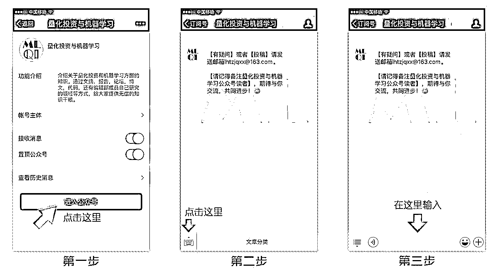

# 读书日丨畅游 ML 和量化界（干货哦）

> 原文：[`mp.weixin.qq.com/s?__biz=MzAxNTc0Mjg0Mg==&mid=2653285137&idx=1&sn=d5c92766a78f302f85a07428b805c555&chksm=802e2904b759a012b0d0e7e59f996f063c0b12b5ef1b4d16d60c9d620f6922a889a50842e537&scene=27#wechat_redirect`](http://mp.weixin.qq.com/s?__biz=MzAxNTc0Mjg0Mg==&mid=2653285137&idx=1&sn=d5c92766a78f302f85a07428b805c555&chksm=802e2904b759a012b0d0e7e59f996f063c0b12b5ef1b4d16d60c9d620f6922a889a50842e537&scene=27#wechat_redirect)

**编辑部**

微信公众号

**关键字**全网搜索最新排名

**『量化投资』：排名第一**

**『量       化』：排名第一**

**『机器学习』：排名第四**

我们会再接再厉

成为全网**优质的**金融、技术类公众号

今天是“世界读书日”。为推动更多的人去阅读和写作，为社会多作贡献，1995 年，联合国教科文组织宣布 4 月 23 日为——

**世界读书日**

**“读书不仅要有明确的目标、有不移的恒心，还要提高读书效率和质量，讲求读书方法和技巧，在爱读书、勤读书、读好书、善读书中提高思想水平、解决实际问题、实现自我超越”**。——2009 年 5 月 13 日，习近平在中央党校春季学期第二批进修班暨专题研讨班开学典礼上的讲话

在此量化投资与机器学习公众号在今日又新增了 3 本书籍，希望大家用知识武装自己！

我们始终坚持

**不让大家像别的公众号一样**

通过朋友圈和微信群转发来获取干货

**分享就是分享**

**就应该做到无偿**

因为知识是属于共享的

我们只不过做了

搬运工

01

本书涵盖了使用这些领域中的 Python 模块来描述链接概率，统计和机器学习的关键思想。整个文本，包括所有数字和数字结果，都可以使用 Python 代码及其相关的 Jupyter / IPython 笔记本进行重现，这些笔记本作为补充下载提供。作者通过使用多种分析方法和 Python 代码进行有意义的实例，开发机器学习中的关键直觉，从而将理论概念与具体实现相结合。现代 Python 模块如熊猫，Sympy 和 Scikit 学习应用于模拟和可视化重要的机器学习概念，如偏差/方差折衷，交叉验证和正则化。许多抽象的数学思想，如概率论中的收敛，用数值实例进行了阐述和说明。本书适合任何具有大学本科学历的概率，统计学或机器学习能力以及基本的 Python 编程知识。

02

本书介绍了机器学习领域中复杂网络提供的特性和优点。在第一部分，介绍了复杂网络和基于网络的机器学习的概述，提供必要的背景材料。在第二部分中，我们详细描述了一些基于复杂网络的监督，非监督和半监督学习的具体技术。特别地，详细描述了使用随机非线性动力系统的非监督和半监督学习的随机粒子竞争技术。此外，提供了一种分析分析，可以预测所提出的技术的行为。此外，在半监督学习中探索数据可靠性问题。这样的事情具有现实意义，在文献中并不常见。为了验证这些技术来解决实际问题，进行了广泛接受的数据库的仿真。仍然在这本书中，我们提出混合监督分类技术，结合低和高的学习顺序。低级术语可以通过任何分类技术实现，而高级术语通过从输入数据构建的底层网络的特征提取来实现。因此，前者通过其实体特征对测试实例进行分类，而后者测量测试实例与数据模式的形成。我们表明，高级技术可以根据数据的语义意义实现分类。本书旨在结合两个研究领域广泛的研究领域，机器学习和复杂网络，从而对科学界产生广泛的兴趣，主要涉及计算机科学与工程领域。

03

本书解释了编写能够高效处理大量数据的程序所需的概念和技术。本书以项目为导向，经过课堂测试，提出了一些重要的算法支持的例子，为计算机程序员面临的问题带来意义。还介绍了计算复杂度的思想，展示了什么可以而且不能有效地计算，以便程序员可以对他们使用的算法做出明智的判断。特点：包括介绍性和高级数据结构和算法主题，以及序言中提供的各个课程的建议章节顺序;提供学习目标，审查每章中的问题和编程练习，以及许多说明性的例子;在相关网站上提供可下载的程序和补充文件，并提供作者的指导材料;为来自不同语言背景的人们提供 Python 的介绍。

**往期书籍汇总**

每本都是良药

 **01.** [最新国外机器学习书籍推荐](http://mp.weixin.qq.com/s?__biz=MzAxNTc0Mjg0Mg==&mid=2653284979&idx=1&sn=ab5c74f1ab19496297398b4c1ff42a15&chksm=802e2866b759a170cbfa4039aa2aa9ca17a9757efee4c2202eccede256ed7ca2f7004eaafee3&scene=21#wechat_redirect)

**02.** [这么好的干货你们都没发现，可惜啊！](http://mp.weixin.qq.com/s?__biz=MzAxNTc0Mjg0Mg==&mid=2653284248&idx=1&sn=64a9a7f0211eabcfcf1b794ee1e3b6b3&chksm=802e258db759ac9b3fc58e6dfedaddaa6fc829f141f4453e0d8fe4de85cee77f17da18bb0b63&scene=21#wechat_redirect)

**03. **[很棒的经典书籍推荐](http://mp.weixin.qq.com/s?__biz=MzAxNTc0Mjg0Mg==&mid=2653283840&idx=1&sn=8c54136226549c78ac40a21c56dcb4c9&chksm=802e2415b759ad03b710af655fd45d2c16ae76028bb7c00b62a71a04a2618e2775eec8a395c9&scene=21#wechat_redirect)

**04.** [最新机器学习书籍](http://mp.weixin.qq.com/s?__biz=MzAxNTc0Mjg0Mg==&mid=2653283760&idx=1&sn=f4ce3621e3f49425e2fe2acc042e8316&scene=21#wechat_redirect)

**05.** [各大券商研报免费分享](http://mp.weixin.qq.com/s?__biz=MzAxNTc0Mjg0Mg==&mid=2653283257&idx=2&sn=49c78925e7f3535b9cad95bf91574519&scene=21#wechat_redirect)

**06.** [2016 年最新机器学习书籍电子版](http://mp.weixin.qq.com/s?__biz=MzAxNTc0Mjg0Mg==&mid=2653283159&idx=1&sn=2b5ff2017cabafc48fd3497ae5efa58c&scene=21#wechat_redirect)

**07.** [国外深度学习与机器学习书籍电子版](http://mp.weixin.qq.com/s?__biz=MzAxNTc0Mjg0Mg==&mid=2653283143&idx=1&sn=2316c1a067239aa007196cc8cb2e6c5b&scene=21#wechat_redirect) 

**投稿、商业合作**

**请发邮件到：lhtzjqxx@163.com**

**关注者**

**从****1 到 10000+**

**我们每天都在进步**

****

**在后台回复** 

****读书日****

**即可获取源代码**

**有些人不知道**后台回复**如何操作**

**为大家介绍一下：**

****

****周末快乐****