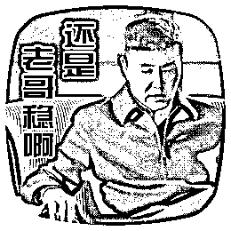

# CNN 预测股票走势基于 Tensorflow（思路+程序）

> 原文：[`mp.weixin.qq.com/s?__biz=MzAxNTc0Mjg0Mg==&mid=2653285128&idx=1&sn=fd4868634ce59b68809e7e4a3de80a21&chksm=802e291db759a00b734f2343936cb8339ddf6fbb5fcbd48c851e778cfcea04769ddc1aca894e&scene=27#wechat_redirect`](http://mp.weixin.qq.com/s?__biz=MzAxNTc0Mjg0Mg==&mid=2653285128&idx=1&sn=fd4868634ce59b68809e7e4a3de80a21&chksm=802e291db759a00b734f2343936cb8339ddf6fbb5fcbd48c851e778cfcea04769ddc1aca894e&scene=27#wechat_redirect)


**编辑部**

微信公众号

**关键字**全网搜索最新排名

**『量化投资』：排名第一**

**『量       化』：排名第一**

**『机器学习』：排名第四**

我们会再接再厉

成为全网**优质的**金融、技术类公众号

**源代码**

**请在文末查询**

**前言**

我们希望找出跟随价格上涨的模式。通过每日收盘价，MA，KD，RSI，yearAvgPrice 本次推文研究只是展示深入学习的一个例子。 结果估计不是很好。希望抛砖引玉，给大家带来更多的思考。策略使用的数据从雅虎财务获取。

*   什么时候要买或者卖


*   股票走势预测


**CNN**

 

交通标志的图像由 4 5×5 卷积内核过滤，创建 4 个特征图，这些特征图通过最大池合并采样。 下一层对这些子采样图像应用 10 5×5 卷积核，并再次汇集特征图。 最终层是完全连接的层，其中所有生成的特征被组合并在分类器中使用（基本上是逻辑回归）

**股票市场应用**

根据历史数据做出正确的决策

 

**TensorFlow**


**DQN_CNN_image**

这是这个策略的核心思路。我们将数据（年线，月线，收盘价）作为图像，并使用 CNN 来识别其模式。


*   将图像转换为数组：


*   交易策略：达到+10%或者-5%时卖出。

下面来介绍一下 DQN

（参考：知乎 - 智能单元 - Flood Sung）

**编写基本 DQN 类的结构**

```py
class DQN(): #初始化
  def __init__(self, env): 
#创建 Q 网络
  def create_Q_network(self): 
#创建训练方法
  def create_training_method(self): 
#感知存储信息
  def perceive(self,state,action,reward,next_state,done): #训练网络
  def train_Q_network(self): #输出带随机的动作
  def egreedy_action(self,state): #输出动作
  def action(self,state):
```

我们知道，我们的 DQN 一个很重要的功能就是要能存储数据，然后在训练的时候 minibatch 出来。所以，我们需要构造一个存储机制。这里使用 deque 来实现。

```py
self.replay_buffer = deque()
```

**初始化**

```py
def __init__(self, env):
    # init experience replay
    self.replay_buffer = deque()    
    # init some parameters
    self.time_step = 0
    self.epsilon = INITIAL_EPSILON
    self.state_dim = env.observation_space.shape[0]
    self.action_dim = env.action_space.n

    self.create_Q_network()
    self.create_training_method()    # Init session
    self.session = tf.InteractiveSession()
    self.session.run(tf.initialize_all_variables())
```

这里要注意一点就是 egreedy 的 epsilon 是不断变小的，也就是随机性不断变小。怎么理解呢？就是一开始需要更多的探索，所以动作偏随机，慢慢的我们需要动作能够有效，因此减少随机。

**创建 Q 网络**

我们这里创建最基本的 MLP，中间层设置为 20：

```py
def create_Q_network(self):
    # network weights
    W1 = self.weight_variable([self.state_dim,20])
    b1 = self.bias_variable([20])
    W2 = self.weight_variable([20,self.action_dim])
    b2 = self.bias_variable([self.action_dim])    
    # input layer
    self.state_input = tf.placeholder("float",[None,self.state_dim])    
    # hidden layers
    h_layer = tf.nn.relu(tf.matmul(self.state_input,W1) + b1)    
    # Q Value layer
    self.Q_value = tf.matmul(h_layer,W2) + b2  
def weight_variable(self,shape):
    initial = tf.truncated_normal(shape)    
    return tf.Variable(initial)  
def bias_variable(self,shape):
    initial = tf.constant(0.01, shape = shape)    
    return tf.Variable(initial)
```

只有一个隐层，然后使用 relu 非线性单元。相信对 MLP 有了解的知友看上面的代码很 easy！要注意的是我们 state 输入的格式，因为使用 minibatch，所以格式是[None,state_dim]

**编写 perceive 函数**

```py
def perceive(self,state,action,reward,next_state,done):
    one_hot_action = np.zeros(self.action_dim)
    one_hot_action[action] = 1
     self.replay_buffer.append((state,one_hot_action,reward,next_state,done))    
    if len(self.replay_buffer) > REPLAY_SIZE:
      self.replay_buffer.popleft()    
    if len(self.replay_buffer) > BATCH_SIZE:
      self.train_Q_network()
```

这里需要注意的一点就是动作格式的转换。我们在神经网络中使用的是 one hot key 的形式，而在 OpenAI Gym 中则使用单值。什么意思呢？比如我们输出动作是 1，那么对应的 one hot 形式就是[0,1]，如果输出动作是 0，那么 one hot 形式就是[1,0]。这样做的目的是为了之后更好的进行计算。

在 perceive 中一个最主要的事情就是存储。然后根据情况进行 train。这里我们要求只要存储的数据大于 Batch 的大小就开始训练。

**编写 action 输出函数**

```py
def egreedy_action(self,state):
    Q_value = self.Q_value.eval(feed_dict = {
      self.state_input:[state]
      })[0]    
 if random.random() <= self.epsilon:      
 return random.randint(0,self.action_dim - 1)    
 else:      
 return np.argmax(Q_value)
    self.epsilon -= (INITIAL_EPSILON - FINAL_EPSILON)/10000 def action(self,state):
    return np.argmax(self.Q_value.eval(feed_dict = {
      self.state_input:[state]
      })[0])
```

区别之前已经说过，一个是根据情况输出随机动作，一个是根据神经网络输出。由于神经网络输出的是每一个动作的 Q 值，因此我们选择最大的那个 Q 值对应的动作输出。

**编写 training method 函数**

```py
 def create_training_method(self):
    self.action_input = tf.placeholder("float",[None,self.action_dim]) # one hot presentation
    self.y_input = tf.placeholder("float",[None])
    Q_action = tf.reduce_sum(tf.mul(self.Q_value,self.action_input),reduction_indices = 1)
    self.cost = tf.reduce_mean(tf.square(self.y_input - Q_action))
    self.optimizer = tf.train.AdamOptimizer(0.0001).minimize(self.cost)
```

这里的 y_input 就是 target Q 值。我们这里采用 Adam 优化器，其实随便选择一个必然 SGD，RMSProp 都是可以的。可能比较不好理解的就是 Q 值的计算。这里大家记住动作输入是 one hot key 的形式，因此将 Q_value 和 action_input 向量相乘得到的就是这个动作对应的 Q_value。然后用 reduce_sum 将数据维度压成一维。

**编写 training 函数**

```py
def train_Q_network(self):
    self.time_step += 1
    # Step 1: obtain random minibatch from replay memory
    minibatch = random.sample(self.replay_buffer,BATCH_SIZE)
    state_batch = [data[0] for data in minibatch]
    action_batch = [data[1] for data in minibatch]
    reward_batch = [data[2] for data in minibatch]
    next_state_batch = [data[3] for data in minibatch]    # Step 2: calculate y
    y_batch = []
    Q_value_batch = self.Q_value.eval(feed_dict={self.state_input:next_state_batch})    for i in range(0,BATCH_SIZE):
      done = minibatch[i][4]      if done:
        y_batch.append(reward_batch[i])      else :
        y_batch.append(reward_batch[i] + GAMMA * np.max(Q_value_batch[i]))

    self.optimizer.run(feed_dict={
      self.y_input:y_batch,
      self.action_input:action_batch,
      self.state_input:state_batch
      })
```

首先就是进行 minibatch 的工作，然后根据 batch 计算 y_batch。最后就是用 optimizer 进行优化。

**程序文件**

 **DQN_draw_yearline.py**：用于 yearline img 和 closeprice img，然后构建模型。

部分代码

```py
class TWStock():
    def __init__(self, stock_data,label):
        self.stock_data = stock_data
        self.stock_index = 0
        self.label=label    def render(self):
        return 

    def reset(self):
        self.stock_index = 0
        return self.stock_data[self.stock_index]    
    # 0: 观望, 1: 持有多单, 2: 持有空单
    def step(self, action): 
        self.stock_index += 1
        #action_reward = self.stock_data[self.stock_index][day_len-1] - self.stock_data[self.stock_index+10][day_len-1] 
        action_reward=self.label[self.stock_index]        
        if (action == 0):
            action_reward = 0

        if (action == 2):
            action_reward = -1 * action_reward

        stock_done = False
        if self.stock_index+10 >= len(self.stock_data)-1:
            stock_done = True
        else:
            stock_done = False
        return self.stock_data[self.stock_index], action_reward, stock_done, 0 def conv2d(x, W,s):
  return tf.nn.conv2d(x, W, strides=[1, s,s,1], padding='SAME')
 def max_pool_2x2(x):
  return tf.nn.max_pool(x, ksize=[1, 2, 2, 1],
                        strides=[1, 2, 2, 1], padding='SAME')
```

**DQN_yearline_reward.py**：建立应该训练大约 24 小时的模型。 //首先运行 DQN_draw_yearline.py

部分代码

```py
def main():
 env = TWStock(my_img,label_train) 
 agent = DQN(env)

 train_output=""
 rate_string=""
 for episode in xrange(EPISODE):   # initialize task
   state = env.reset()   # Train
   out="train\n"

   train_reward=0
   for step in xrange(STEP):
     action = agent.egreedy_action(state) # e-greedy action for trai

     next_state,reward,done,_ = env.step(action)
     out+=str(reward)+" "
     train_reward+=reward     # Define reward for agent
     reward_agent = -1 if done else 0.1
     agent.perceive(state,action,reward,next_state,done)
     state = next_state     if done:       break
   anal=out.split()
   p=0.0
   n=0.0
   for x in range(1,len(anal)-1):     if(float(anal[x])>0):
      p+=float(anal[x])     elif(float(anal[x])<0):
      n+=float(anal[x])

   rate=round(p/(n*(-1)+p),2)
   rate_string+=str(rate)+" "  
   fo.write(out+"\n")
   train_output+=str(train_reward)+" "
   # Test every 100 episodes
   if episode % 10 == 0:
     out="test\n"     
     env1=TWStock(my_test,label_test)
     total_reward = 0
```

**Test model by yearline.ipynb**：有一个模型 exsit 在 saved_year_r。 代码创建一些 img 来测试。

部分代码

```py
for x in xrange(0,len(label_test)):
     sum_+=label_test[x]     if(x % 20==0 and x!=0):
         label_line=np.append(label_line,sum_)
         sum_=0
 label_line=np.delete(label_line,0)
 month_arr=np.delete(month_arr,0)
 buy_rate=np.delete(buy_rate,0) for x in xrange(0,len(month_arr)):        #month_arr[x]=month_arr[x]*buy_rate[x]
        label_line[x]=label_line[x]*buy_rate[x] print (buy_rate)
 plt.figure()
 plt.plot(label_line, 'ro',label='baseline',linewidth=1,color=[1,0,0])
 plt.title("monthly profit with baseline") #plt.plot(month_arr,label='predict',linewidth=5,color=[0,1,0])
 width = 0.6
 plt.bar([0,0.7,1.7,2.7,3.7,4.7,5.7,6.7,7.7,8.7,9.3],month_arr,width=width,label='predict') #plt.axis([0, 14, min_y, max_y])
 plt.legend(bbox_to_anchor=(1.05, 1), loc=2, borderaxespad=0.)

 plt.show()if __name__ == '__main__':
 main()
```

```py
dimension: 1024
Successfully loaded: saved_year_r/network-dqn-652000
Evaluation Total Reward: 182.0
[0.55 0.35 0.6 0.55 0.4 0.6 0.7 0.45 0.3 0.15 0.0]
```


**DQN_img_closePrice.py**：通过 closeprice img 构建模型并进行评估。

部分代码

```py
 def create_training_method(self):
    self.action_input = tf.placeholder("float",[None,self.action_dim])    # one hot presentation
    self.y_input = tf.placeholder("float",[None])
    Q_action = tf.reduce_sum(tf.mul(self.Q_value,self.action_input),reduction_indices = 1)
    self.cost = tf.reduce_mean(tf.square(self.y_input - Q_action))
    self.optimizer =  tf.train.RMSPropOptimizer(0.00025,0.99,0.0,1e-6).minimize(self.cost)    #tf.scalar_summary("cost", values=self.cost)
    #tf.histogram_summary("cost", values=self.cost)

  def perceive(self,state,action,reward,next_state,done):
    one_hot_action = np.zeros(self.action_dim)
    one_hot_action[action] = 1
    self.replay_buffer.append((state,one_hot_action,reward,next_state,done))    if len(self.replay_buffer) > REPLAY_SIZE:
      self.replay_buffer.popleft()    if len(self.replay_buffer) > BATCH_SIZE:
      self.train_Q_network()
``` 

**策略过程**

**分布式训练**


*   需要考虑传输时间

*   比如


*   实验 5 层 CNN 模型


**分布式训练在 TensorFlow**

****

*   ****定义一个工作集群{“ps”，“worker”}****

*   ****设置任务（这里我们做数据并行，所以每个任务是一样的）****

*   ****连接时将任务分配给服务器****

****对于 MNIST 分布式培训样本，参照以下代码（给出部分）：****

```py
**`from __future__ import absolute_import
from __future__ import division
from __future__ import print_function
import math
import sys
import re
import tempfile
import timeimport tensorflow as tf
from tensorflow.examples.tutorials.mnist import input_data
from tensorflow.contrib import layers
import tensorflow.contrib.learn as skflow

flags = tf.app.flags
flags.DEFINE_string("data_dir", "./MNIST_data",                    "Directory for storing mnist data")
flags.DEFINE_boolean("download_only", False,                     "Only perform downloading of data; Do not proceed to "
                     "session preparation, model definition or training")#airflags.DEFINE_string("job_name", "","One of 'ps' or 'worker'")'''flags.DEFINE_string("ps_hosts", "10.81.103.124:7777","List of hostname:port for ps jobs."
            "This string should be the same on every host!!")
flags.DEFINE_string("worker_hosts", "10.81.103.124:2224,10.81.103.122:2222,10.81.103.118:2218,10.81.103.119:2219,10.81.103.120:2220,10.81.103.121:2221","List of hostname:port for worker jobs."
            "This string should be the same on every host!!")'''flags.DEFINE_string("ps_hosts", "10.81.103.122:7777","List of hostname:port for ps jobs."
            "This string should be the same on every host!!")
flags.DEFINE_string("worker_hosts", "10.81.103.122:2222,  10.81.103.122:2226","List of hostname:port for worker jobs."
            "This string should be the same on every host!!")`**
```

******表现******

******例子 1：******

*   ****训练：2011〜2014 15-day 图像只有每日收盘价。****

*   ****测试：2016/01〜2016/08****

*   ****交易策略：回报 =（明天的收盘价） - （今天收盘价）如果预测买入。 反之。****

*   ****表现不佳****

********

******例子 2：******

****交易策略：达到+10%或者-5%时卖出。****

********

******表现******

 ******1.Indicators Feature MA can drop the loss compare with RSI and ClosePrice at training step**


预测 2016 年 5 日后涨跌准确率为：58%~60%

Loss：预测和实际的差，应随着训练次数增加而下降。

**2.When To Buy With 10 days MA5 as an instance.**

训练数据（2330_train_15）：2001〜2014 2330.tw。

实际在 90 天内大幅上升至 15％时，标记为 1。 并和 4 次标记为 0 的在一起。

测试数据（2330_test）：2015/07〜2016/08 MA5。

运行 CNN_Classifier.ipynb 后，Result 将被可视化。

部分代码


**DQN_MLP_closePrice**

和价格接近。 这可能会改变为其他功能，如 RSI，KD，MA ....或者，使用它们。 

部分代码


不用 closePrice。 用其他特征。

 **DQN_KD_value 使用 KD 值图片进行预测。**

```py
python DQN_kd_pic.py //this call KD_draw.py and build model.
```


**** 

******投稿、商业合作******

******请发邮件到：lhtzjqxx@163.com******

******关注者******

******从****1 到 10000+******

******我们每天都在进步******

************

******在后台回复****** 

********CNN 预测（大写）********

******即可获取源代码******

******有些人不知道**后台回复**如何操作******

******为大家介绍一下：******

************

********周末快乐********