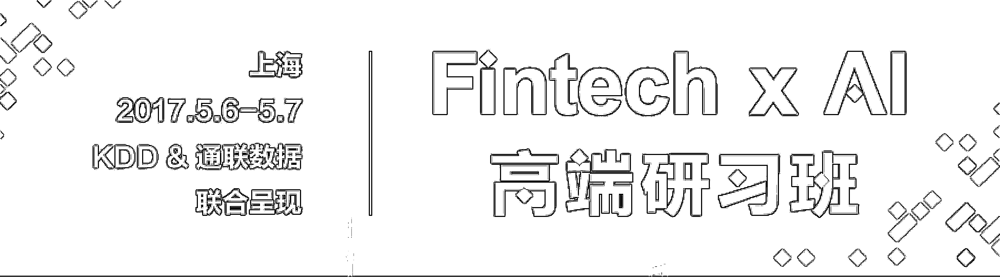

# 二千零一十七、与最前沿的思想同行！全球首个 Fintech x AI 高端研习班落地上海

> 原文：[`mp.weixin.qq.com/s?__biz=MzAxNTc0Mjg0Mg==&mid=2653285087&idx=1&sn=916b715b1bfa305224a41f61bc7fea22&chksm=802e28cab759a1dcdf20bdcb82f149f768b7d5f8fff4ef6be6593e89413509af143173faf9ac&scene=27#wechat_redirect`](http://mp.weixin.qq.com/s?__biz=MzAxNTc0Mjg0Mg==&mid=2653285087&idx=1&sn=916b715b1bfa305224a41f61bc7fea22&chksm=802e28cab759a1dcdf20bdcb82f149f768b7d5f8fff4ef6be6593e89413509af143173faf9ac&scene=27#wechat_redirect)

小编现在的心情就好像

股票：**002582**

你懂得

**编辑部**

微信公众号

**关键字**全网搜索最新排名

**『量化投资』：排名第一**

**『量       化』：排名第一**

**『机器学习』：排名第四**

我们会再接再厉

成为全网**优质的**金融、技术类公众号

KDD 是全球数据挖掘研究领域顶级峰会，自 1995 年以来，KDD 已经以大会的形式连续举办了二十余届全球峰会，由 KDD 所颁发的“创新奖”是“数据挖掘及知识发现领域”最高级别奖项，被誉为该领域的诺贝尔奖。

KDD China 是 KDD 在中国的唯一官方分支机构，此次 KDD China 携手通联数据，一同为金融及 AI 领域精英带来全球首个金融与人工智能跨界知识盛会。

这是**创新****和**变革******的黄金时代，**

**大数据、人工智能技术日新月异不断冲击着各行业；**

**基金经理正逐步被机器人替代，**

**金融行业的变革，与其回避，不如直面；** 

**作为金融机构的**领军者**，**

**如果你想探寻行业和市场的变革趋势，**

**寻找 AI 在金融领域的应用方向；**

**作为在市场中搏击的**投资者**，**

**如果你想利用 AI 挖掘超额收益的 Alpha，**

**想精准解读风险收益，构建投资组合；**

**请来这里，与业内最优秀的人**

**共论 AI 在金融领域的**已知成就**和**无限可能****。****

******嘉宾阵容 ******

******_____**__****

****金融风云人物 x 人工智能顶尖专家****

****48 小时智慧共享****

********

******肖风  博士******

****中国万向控股有限公司副董事长****

****通联数据创始人兼董事长**** 

****其创建的博时基金是中国最大的基金公司之一****

****** 金融科技如何重构金融体系？  ******

****金融科技正在解构金融业 ，未来金融呈现出智能化的趋势。机构投资者该如何武装自己的知识与研究体系，才能把握金融行业的整体趋势，我将在会上作深入分享。 ****

********

******杨强  博士****** 

****香港科技大学计算机系主任****

****曾任华为诺亚方舟实验室创始主任****

****国际人工智能学会首位华人 Fellow****

******深度迁移学习如何应用于金融场景？******

****深度学习在大数据场景中取得了令人瞩目的成就，而迁移学习可以增强学习模型的可靠性，并建立其在小数据场景下的有效性。“深度迁移学习”结合了这两种学习算法的优势，我将结合金融领域中几个关键场景，详解深度迁移学习在其中的应用。****

********

******郑宇**  博士********

**KDD China 秘书长**

**微软亚洲研究院城市计算领域负责人**

**人工智能国际顶级期刊 ACM TIST 主编**

**2016 年被评为美国计算机学会杰出科学家**

****大数据及 AI 如何应用于****

****地产、物流和电影票房预测等商业领域？****

**我将着重分享如何利用车流、人流、房价、地理信息等大数据，结合机器学习模型对各种商业和金融产品进行更深入分析。**

****

****沈抖  博士****

**KDD China 副主席**

**百度金融服务事业群组执行总监、研发负责人**

**曾任国际数据挖掘大会、国际信息和知识管理大会工业程序委员会联合主席**

****如何实现传统金融向普惠金融的过渡？ ****

**我将分享如何利用大数据及人工智能技术，解决普惠金融所面临的获客成本增加、产品差异化程度低等问题，实现智能获客、大数据风控、智能投顾和量化投资的显著发展。 **

****

****戴文渊  博士**** 

**第四范式创始人、CEO，前百度凤巢策略技术负责人**

**最年轻的百度科学家、曾任华为诺亚方舟实验室主任科学家**

****高维度机器学习如何应用于****

****营销、风险等金融场景？ ****

**将深入探讨高维度机器学习解决方案与传统金融解决方案的差异及显著优势；针对高维度机器学习不可解释等局限性，还将引导各位一同探讨针对性的解决方案。 **

****

****向伟**  博士******

**通联数据智能投研总监**

**致力于人工智能及金融投资的深度结合研究**

**曾创立华大基因弹性计算实验室、百度深圳机器学习分部**

****大数据及人工智能时代，如何做基本面研究？ ****

**不少基本面研究员仍停留在“刀耕火种”的时代，大量基础性工作高度依赖人工，移动互联带来的海量数据也大大超过人脑承载的极限。我将分享如何利用人工智能提升基本面研究效率及研究能力。 **

****时间 ****

****_____**__**

**2017.5.6 - 5.7** 

****形式****

****_____**__**

**高规格、高门槛、小规模的**闭门会议****

**（名额有限，先到才能先得：）**

**高质量的**精英对谈**环节；**

**我们将解锁更多活动环节、精彩议程、嘉宾观点…**

**敬请关注**

**那句话怎么说来着？**

****WISH WE COULD SAY MORE****

****报名通道****

****_____**__**

****双日培训费****

**¥ 10800（含食宿）**

****现在****报名，享早鸟价****

**¥ 8800（含食宿）**

****

****识别上方二维码，提交报名意向****

****将第一时间收到活动更新，并有专人与您联系****

****关于主办方****

****_____**__**

****KDD****

**KDD 是由 ACM 数据挖掘及知识发现专委会主办的全球数据挖掘研究领域顶级峰会，自 1995 年以来，KDD 已经以大会的形式连续举办了二十余届全球峰会。由 KDD 所颁发的“创新奖”是“数据挖掘及知识发现”领域最高级别奖项，被誉为该领域的诺贝尔奖。KDD China 是 KDD 在中国的唯一官方分支机构。**

****通联数据****

**通联数据股份公司（DataYes）是由金融和高科技资深专家发起，万向集团投资成立的金融科技公司。致力于将大数据、云计算、人工智能等信息技术和专业的投资理念相结合，打造国际领先的、具有革命意义的金融服务平台。**

**公司总部位于中国金融中心上海，并在中国北京、南京、深圳以及美国硅谷等地设有分公司。**

****投稿、商业合作****

****请发邮件到：lhtzjqxx@163.com****

****关注者****

****从****1 到 10000+****

****我们每天都在进步****

******提交活动报名意向，请戳“阅读原文！******