# 选股因子数据异常值处理和正态转换

> 原文：[`mp.weixin.qq.com/s?__biz=MzAxNTc0Mjg0Mg==&mid=2653285084&idx=1&sn=686d3c830b292a769b38e3ec8f830b14&chksm=802e28c9b759a1df5dfbc87d30226344bb0c4cc9e1a3117f809f13c4386fbc60b6962bc74d07&scene=27#wechat_redirect`](http://mp.weixin.qq.com/s?__biz=MzAxNTc0Mjg0Mg==&mid=2653285084&idx=1&sn=686d3c830b292a769b38e3ec8f830b14&chksm=802e28c9b759a1df5dfbc87d30226344bb0c4cc9e1a3117f809f13c4386fbc60b6962bc74d07&scene=27#wechat_redirect)


**编辑部**

微信公众号

**关键字**全网搜索最新排名

**『量化投资』：排名第一**

**『量       化』：排名第一**

**『机器学习』：排名第四**

我们会再接再厉

成为全网**优质的**金融、技术类公众号


**异常数据的影响与识别**

 ## **异常数据的影响**

以 2016 年 5 月底全市场股票的 ROE 数据为例，这里总共有 2824 个数据：

```py
between = roe[(roe.ROE <= 0.5) & (roe.ROE >= -0.5)]
float(len(between))/len(roe)
```

0.9851274787535411

可以看到有 98%的数据都在[-0.5, 0.5]之间 

去掉上下各 1%的数据

```py
remove = roe[(roe.ROE <= roe.quantile(0.99).iloc[0]) &
 (roe.ROE >=roe.quantile(0.01).iloc[0])]
```

## **异常值的识别**

### **1.2.1 固定比例法**

上下 2%的值进行拉回，这些数据不可信。

### **1.2.2 均值标准差法**

这种想法的思路来自于正态分布，假设

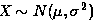

那么：

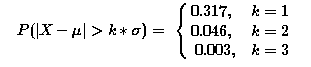

通常把三倍标准差之外的值都视为异常值，不过要注意的是样本均值和样本标准差都不是稳健统计量，其计算本身受极值的影响就非常大，所以可能会出现一种情况，那就是我们从数据分布图上能非常明显的看到异常点，但按照上面的计算方法，这个异常点可能仍在均值三倍标准差的范围内。因此按照这种方法剔除掉异常值后，需要重新观察数据的分布情况，看是否仍然存在显著异常点，若存在则继续重复上述步骤寻找异常点。

理解：因为剔除掉极值后，样本的方差可能发生变化了（正如文中所说，它不是一个稳健的估计量），每次剔除通常都会变化——就是因为这个，所以需要重复的去做。

如果数据不服从正态分布，可以通过切比雪夫不等式依然可以对均值的若干倍标准差之外的样本数据量的占比进行估计：

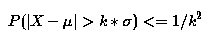

坏处对于这样的方法，上面不等式右边的上界数值会偏大，在数据分布的偏度和峰度影响下，这种方法可能会把过量的数据认定为异常点。 

如果通过 Box-Cox 变换将不服从正态分布的数据转化为服从正态分布的数据，那么是否可行呢？熟悉 Box-Cox 变换方法的都知道，经过这样的一个变换，例如就取对数，它会缩小数据之间的距离，这样可能会使得原来是异常值的点变为不是异常值。 

### **1.2.3 MAD 法**

MAD 法是针对均值标准差方法的改进，把均值和标准差替换成稳健统计量，样本均值用样本中位数代替，样本标准差用样本 MAD（Median Absolute Deviation）代替：

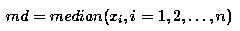

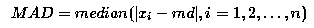

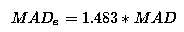

通常把偏离中位数三倍以上的数据作为异常值。和均值标准差方法比，中位数和 MAD 的计算不受极端异常值的影响，结果更加稳健。

### **1.2.4 boxplot 法**

我们知道箱线图上其实也会注明异常值，假设 Q1 和 Q3 分别为数据从小到大排列的 25%和 75%分位数，记 IQR=Q1-Q3，把

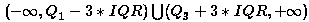

区间里的数据标识为异常点。分位数也是稳健统计量，因此 Boxplot 方法对极值不敏感，但如果样本数据正偏严重，且右尾分布明显偏厚时，Boxplot 方法会把过多的数据划分为异常数据，因此 Hubert& Vandervieren （2007）对原有 Boxplot 方法进行了偏度调整。首先样本偏度定义采用了 Brys(2004)提出的 MedCouple 方法：

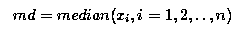

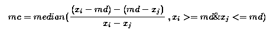

然后给出了经偏度调整 boxplot 方法上下限： 

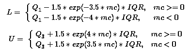

区间上的点视为异常点。和原始 Boxplot 方法相比，当样本数据分布右偏时，此法会提升正常数据区间上限的数值；样本数据左偏时，则会降低正常数据区间下限的数值。

这个 mc 可以使用 statsmodels 包中的函数直接进行计算

```py
def _medcouple_1d(y):
    """
    Calculates the medcouple robust measure of skew.
    Parameters
    ----------
    y : array-like, 1-d
    Returns
    -------
    mc : float
        The medcouple statistic
    Notes
    -----
    The current algorithm requires a O(N**2) memory allocations, and so may
    not work for very large arrays (N>10000).
    .. [1] M. Huberta and E. Vandervierenb, "An adjusted boxplot for skewed
    distributions" Computational Statistics & Data Analysis, vol. 52,
    pp. 5186-5201, August 2008.
    """

    y = np.squeeze(np.asarray(y))    
    if y.ndim != 1:        
        raise ValueError("y must be squeezable to a 1-d array")
    y = np.sort(y)
    n = y.shape[0]    if n % 2 == 0:
        mf = (y[n // 2 - 1] + y[n // 2]) / 2
    else:
        mf = y[(n - 1) // 2]
    z = y - mf
    lower = z[z <= 0.0]
    upper = z[z >= 0.0]
    upper = upper[:, None]
    standardization = upper - lower
    is_zero = np.logical_and(lower == 0.0, upper == 0.0)
    standardization[is_zero] = np.inf
    spread = upper + lower    return np.median(spread / standardization)
sm.stats.stattools.medcouple(roe.ROE)
```

array(0.04458953766624774)

### **1.2.5 偏度调整 Boxplot 和 MAD 方法对比**

首先使用计算机模拟来进行比较这两种方法。

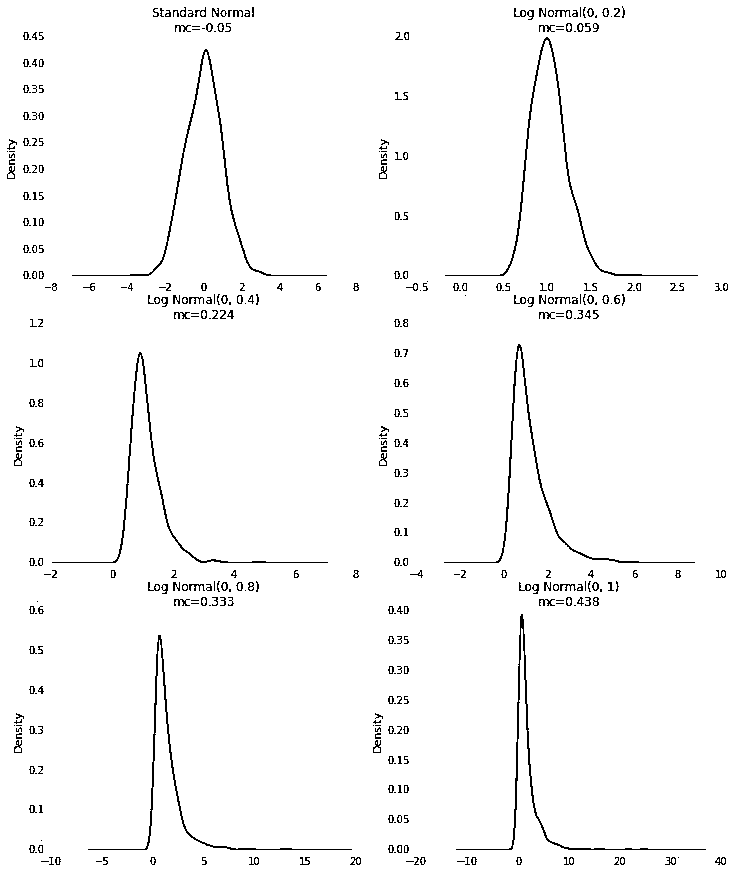

```py
# 计算异常值占比 def mad(x):
    if len(x) == 0:        
        return np.NaN    
    else:
        md = np.median(x)
        mad_ = np.median([np.abs(i-md) for i in x])
        mad_e = 1.483*mad_
        left_percent = len(x[(x<=(md-3*mad_e))])/float(len(x))
        right_percent = len(x[(x>=(md+3*mad_e))])/float(len(x))
        total = len(x[(x<=(md-3*mad_e))|(x>=(md+3*mad_e))])/float(len(x))        
    return [left_percent, right_percent, total]
 def adj_boxplot(x):
    if len(x) == 0:        
        return np.NaN    
    else:
        mc = sm.stats.stattools.medcouple(x)
        x.sort()
        q1 = x[int(0.25*len(x))]
        q3 = x[int(0.75*len(x))]
        iqr = q3-q1        
    if mc >= 0:
            l = q1-1.5*np.exp(-3.5*mc)*iqr
            u = q3+1.5*np.exp(4*mc)*iqr        
    else:
            l = q1-1.5*np.exp(-4*mc)*iqr
            u = q3+1.5*np.exp(3.5*mc)*iqr
        left_percent = len(x[x<=l])/float(len(x))
        right_percent = len(x[x>=u])/float(len(x))
        total = len(x[(x<=l)|(x>=u)])/float(len(x))        
    return [left_percent, right_percent, total]
```

```py
fig = plt.figure(figsize=(7, 4))
ax = fig.add_subplot(111)
ax.plot(adj_boxplot_left, '-o', label='adj_boxplot')
ax.plot(mad_method_left, '-^', label='mad')
l = ax.legend(loc=1)
l = ax.set_ylabel(u"left percentage")
l = ax.set_xticklabels(['SN', 'LN(0, 0.2)', 'LN(0, 0.4)', 'LN(0, 0.6)', 'LN(0, 0.8)', 'LN(0, 1)'])
l = ax.set_xlabel(u"different distribution")
```

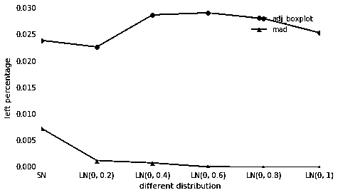

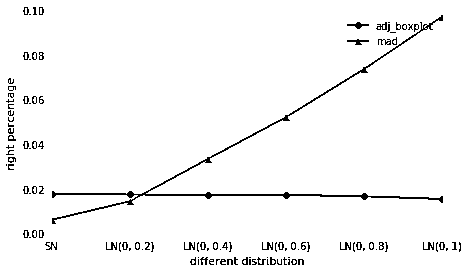


还可以对单个分布，不同样本量进行测试，不写了。

再拿个几因子实际来比较这两种方法。

```py
def compare_factor(factor_name, month_list):
    factor_data = pd.DataFrame(index=month_list, columns=universe)    
for date in factor_data.index:
        current_data = DataAPI.MktStockFactorsOneDayProGet(tradeDate=date, secID=universe, 
                                                           field=[u"secID", u"tradeDate",factor_name], pandas="1")
        current_data = current_data.pivot(index='tradeDate', columns='secID', values=factor_name)
        factor_data = factor_data.append(current_data)
    percent_mad = []
    precent_boxplot = []    
    for date in factor_data.index:
        sample = np.array(factor_data.ix[date, :].dropna())        if isinstance(mad(sample), list):
            percent_mad.append(mad(sample)[2])
            precent_boxplot.append(adj_boxplot(sample)[2])

    a = np.array(percent_mad).mean()
    b = np.array(precent_boxplot).mean()    
return [a, b, factor_data]
PEG3Y = compare_factor('PEG3Y', month_list)
print u'市盈率/归属于母公司所有者净利润 3 年复合增长率:', u'MAD', PEG3Y[0], ';
```

市盈率/归属于母公司所有者净利润 3 年复合增长率:

MAD 0.140822936272 

 Adj boxplot 0.158164542833

对数市值:

MAD 0.0291881850994 ;

Adj boxplot 0.00655765983319

对数流通市值:

MAD 0.0221524346318 ;

Adj boxplot 0.0229505798271

和 Seo(2002)做的仿真测试结果一致，对于市值这样样本偏度较大的数据，MAD 方法识别出的异常数值比例明显高于偏度调整后的 Boxplot 方法。从研报的结果来看，MAD 方法认定的异常数据数量明显高于 Boxplot 方法，剔除或修改太多数据不利于后续的统计分析。可以尝试人为提高 MAD 方法中的一些阈值设置来降低异常数据占比，但这样有可能使得一些本该剔除的数据未被侦测出来，如果每个因子都设置一个阈值的话，调试的工作量会比较大。相对来说，偏度调整过的 Boxplot 方法对不同因子的适应性更强，建议在实证研究中采用。 

**数据正太转换**

 ## **2.1 非正态数据的影响**

因子选股过程中至少有两个地方涉及因子数据的正态分布假设：

1.  Alpha 因子的 zscore 计算。只有当两个因子的分布都为近似正态分布时，基于均值-标准差标准化得到的 zscore 才有可比性，否则样本偏度和峰度的影响会使得个股在某一个因子上的得分明显偏大或偏小，其在多因子中的效用被显著放大或缩小，也就是 Scinto(2009)提到的 Percential Ranking Problem。

2.  风险因子的因子收益率显著性检验。因子收益率由横截面回归得到，其显著性检验有赖于残差项的正态分布假设，虽然线性回归对解释变量与被解释变量的分布没有要求，但当解释变量和被解释变量满足正态分布时，更容易得到符合正态分布的残差。

每个因子数据都去看下偏度，峰度有点多。主要是电脑还在跑其他的耗内存的代码，所以就不做了。

```py
def my_winsorize(data):
    if isinstance(data, pd.Series):
        mc = sm.stats.stattools.medcouple(data)
        data.sort()
        q1 = data[int(0.25*len(data))]
        q3 = data[int(0.75*len(data))]
        iqr = q3-q1        if mc >= 0:
            l = q1-1.5*np.exp(-3.5*mc)*iqr
            u = q3+1.5*np.exp(4*mc)*iqr        else:
            l = q1-1.5*np.exp(-4*mc)*iqr
            u = q3+1.5*np.exp(3.5*mc)*iqr
        data[data<l]=l
        data[data>u]=u    
return data
```

```py
peg_3y = PEG3Y[2]
factor_skew = []
factor_kurt = []
for date in peg_3y.index:
    data = peg_3y.ix[date,:].dropna()    
    if len(data) > 0:
        data = my_winsorize(data)
        data = np.array(data)
        factor_skew.append(st.skew(data))
        factor_kurt.append(st.kurtosis(data))
print u'极值调整后 PEG3Y 因子的平均偏度与峰度：' print u'偏度：', np.mean(factor_skew)
print u'峰度：', np.mean(factor_kurt)
```

极值调整后 PEG3Y 因子的平均偏度与峰度：

偏度： -3.00481152198 峰度： 10.2882451426

极值调整后 LCAP 因子的平均偏度与峰度：

偏度： 1.22322935534 峰度： 2.08015032857

## **2.2 Box-Cox 变换**

在多元回归分析，时间序列分析中经常都见到 Box-Cox 变换变换。把非正态数据转换为正态数据通常有取对数、开根号、求倒数等方法，这些都可以归为 Box-Cox 变换，形式上可以写作：

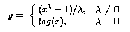

参数<nobr>λ可以通过极大似然法做估计（Box&Cox，1964）。不过 Box-Cox 变换并非万能，变换后的数据仍然可能不满足正态分布，被统计检验拒绝，但是这种变换得到的数据分布往往都有明显的对称性，与正态分布的相似性更高。 只有取正值的数据才能使用 Box-Cox 变换，对于一些数据是负数或者为零，在 Box-Cox 变换之前，需要在所有值上加一个正数，使得所有数据为正。但这种移动是主观确定的。另一种方法是适用于任何数据的变换，无论正负，这种方法的一个缺点是，对他的解释不如对 Box-Cox 变换的解释来得直观，参见 Yeo 和 Johnson(2000)。</nobr> 

## <nobr>**2.3 正态变换的选择**</nobr>

<nobr>我们知道一个因子通常包括两个维度，由于通常的 alpha 因子 zscore 打分和风险因子中性化处理都在横截面方向进行，因此我们主要对同一个时间点横截面上的因子数据做正态转换处理。但是如果把数据正态转换当成一个纯粹的数学问题，每个横截面上都用极大似然方法估算一个最优的λ，会发现有的选股因子的λ数值变化非常之大。以 EP 因子的月度数据为例。</nobr> 

```py
`PE = compare_factor('PE', month_list)
EP= 1/PE[2]
lambda_ = pd.Series(index=EP.index)
for date in EP.index:
    data = np.array(EP.ix[date,:].dropna()+3, dtype=float)    
    if len(data) > 0:
        lambda_.ix[date]=st.boxcox(data)[1]    
    else:
        lambda_.ix[date]=np.NaN
lambda_.dropna(inplace=True)
ax = lambda_.plot()
t = ax.set_title(u'EP 因子 Box-Cox 变换的最优 lambda', fontpropert=font, fontsize=16)`
```

<nobr>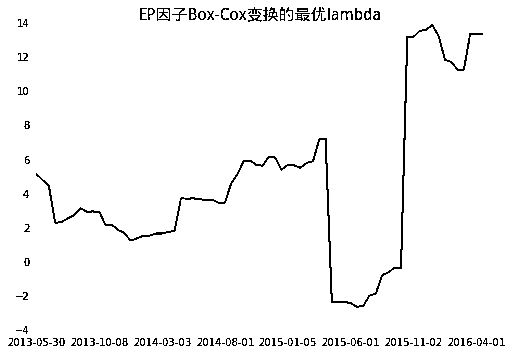</nobr>

<nobr>可以看到 Lambda 中间有一段的变化是非常剧烈的，也就是说每个月我们需要对原始的数据都做不同的数据变化。Box-Cox 是一个单调变换，保持了原有数据的相对秩序，因此变换后的因子和原始因子的 IC（秩相关系数）相等；但这种变换会改变 alpha 因子的 zscore，频繁剧烈变换的参数可能会对结果产生负面影响，变换后因子的经济含义也更加难以解释，所以把因子数据正态变换当成一个单纯数学问题的方法不可取。</nobr> 

<nobr>**投稿、商业合作**</nobr>

<nobr>**请发邮件到：lhtzjqxx@163.com**</nobr>

<nobr>**关注者**</nobr>

<nobr>**从****1 到 10000+**</nobr>

<nobr>**我们每天都在进步**</nobr>

<nobr>****</nobr>