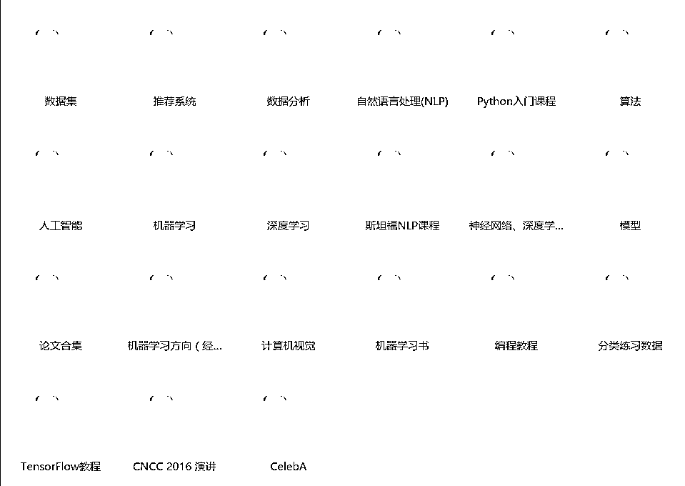
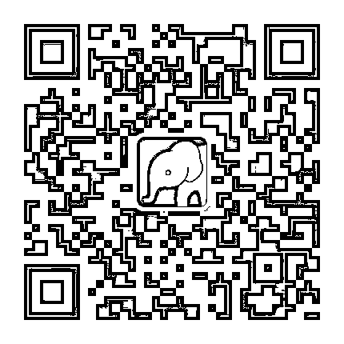
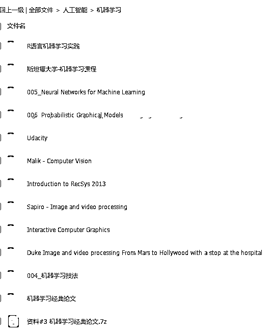
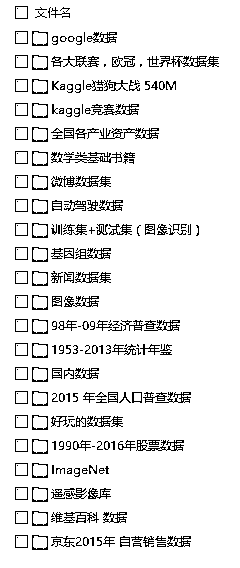
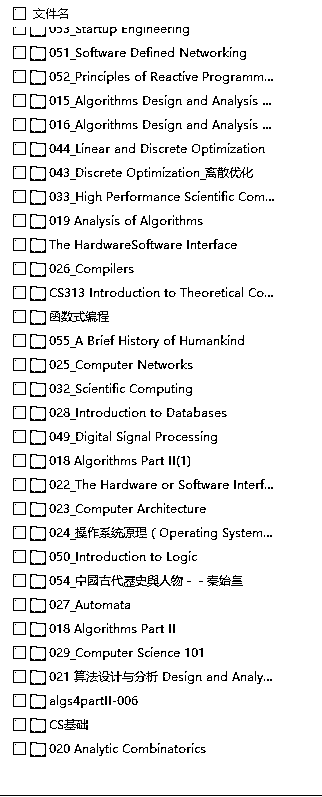
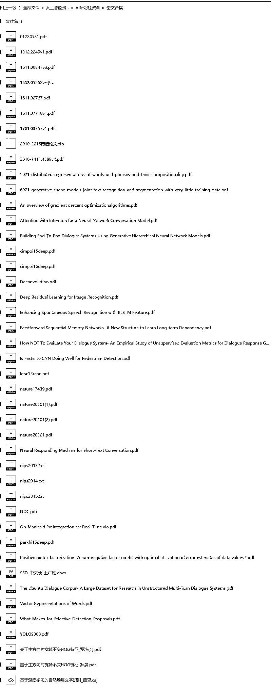

# 这是我见过最全的人工智能资料库，没有之一！

> 原文：[`mp.weixin.qq.com/s?__biz=MzAxNTc0Mjg0Mg==&mid=2653285067&idx=1&sn=1b8513c46eb9938a473e24c985eb86f7&chksm=802e28deb759a1c8598dbdf9f2d1071f54d33a5923bdb0104ed835e4471347b89f56d873242c&scene=27#wechat_redirect`](http://mp.weixin.qq.com/s?__biz=MzAxNTc0Mjg0Mg==&mid=2653285067&idx=1&sn=1b8513c46eb9938a473e24c985eb86f7&chksm=802e28deb759a1c8598dbdf9f2d1071f54d33a5923bdb0104ed835e4471347b89f56d873242c&scene=27#wechat_redirect)

**编辑部**

微信公众号

**关键字**全网搜索最新排名

**『量化投资』：排名第一**

**『量       化』：排名第一**

**『机器学习』：排名第四**

我们会再接再厉

成为全网**优质的**金融、技术类公众号

早在人工智能行业还没被推向风口浪尖的时候开始，小编就开始对这个方向产生了浓厚的兴趣。经过长时间的积累和沉淀，小编收集整理了整整**1024G**的人工智能学习与训练资料，内容涵盖“TensorFlow 教程”、“斯坦福系列教程”、“计算机视觉”、“机器学习论文集”、“Kaggle 竞赛数据”、“自动驾驶数据”、“人脸标注数据集”等。

截止到今天，小编已经分享给超过 20 万的程序员朋友下载，这次我把所有数据集重新梳理精简，免费分享给大家 。

扫描下面二维码，关注公众号 “小象”，点击菜单栏“领取资料”。

下面是小编挑选的几个资料截图

机器学习教程及资料

可上下滑动，点击图片查看全部

训练数据集

可上下滑动，点击图片查看全部

算法学习资料

可上下滑动，点击图片查看全部

论文合集

可上下滑动，点击图片查看全部

小编深知这次免费分享一定会受到很多人的欢迎，请大家一定要帮助小编让更多人拿到资料。

感谢大家的关注与参与！

扫描下面二维码，关注公众号 “小象”，点击菜单栏“领取资料”。

**投稿、商业合作**

**请发邮件到：lhtzjqxx@163.com**

**关注者**

**从****1 到 10000+**

**我们每天都在进步**

****