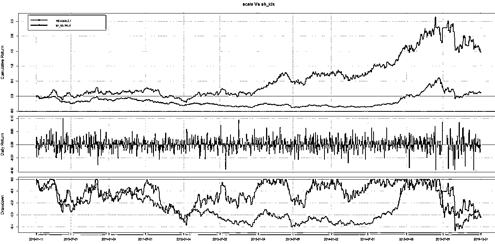

# HMM 模型在量化交易中的应用（R 语言版）

> 原文：[`mp.weixin.qq.com/s?__biz=MzAxNTc0Mjg0Mg==&mid=2653285058&idx=1&sn=933d9e5739c24ff4f275cec5bec535c7&chksm=802e28d7b759a1c10824ffc4c29f5048df7d43ee730e226e97616eab3e4a27db3be6a48255e8&scene=27#wechat_redirect`](http://mp.weixin.qq.com/s?__biz=MzAxNTc0Mjg0Mg==&mid=2653285058&idx=1&sn=933d9e5739c24ff4f275cec5bec535c7&chksm=802e28d7b759a1c10824ffc4c29f5048df7d43ee730e226e97616eab3e4a27db3be6a48255e8&scene=27#wechat_redirect)

路迢迢，十万八千里。

披荆斩棘，一路尘埃荡涤。

回首望，多少往事历历。

凝结下，一片真情依依

看天降祥和，云飘如意。

圆圆满满，此生无憾。

**编辑部**

微信公众号

**关键字**全网搜索最新排名

**『量化投资』：排名第一**

**『量       化』：排名第一**

**『机器学习』：排名第四**

我们会再接再厉

成为全网**优质的**金融、技术类公众号

**编辑部**

**赵 QS**

编辑部原创内容

**马尔科夫性**

*   如果一个过程的“将来”仅依赖“现在”而不依赖“过去”，则此过程具有马尔可夫性,或称此过程为马尔可夫过程。

*   函数形式：X(t+1) = f( X(t) )

**HMM 由来**

*   物理信号是时变的，参数也是时变的，一些物理过程在一段时间内是可以用线性模型来描述的，将这些线性模型在时间上连接，形成了 Markov 链。

*   因为无法确定物理过程的持续时间，模型和信号过程的时长无法同步。因此 Markov 链不是对时变信号最佳、最有效的描述。

*   针对以上问题，在 Markov 链的基础上提出了 HMM。既解决了短时信号的描述，又解决了时变模型间的转变问题。

**RHmm 包介绍**

**应用（训练样本是 2007-2009 年）**

黑的是 HMM 模型的收益，红的是基准。

## **HMM 在波动率市场中的应用**

## 输入是：ATR（平均真实波幅）、log return

## 用的是 depmixS4 包

模型的输出并不让人满意。

**HS300 测试**

去除数据比较少的 9 支，剩 291 支股票。 

–训练数据：上证指数（2007:2009）
–回测数据：沪深 300 成分股（ 2010:2015）

平均下来收益率比银行里的一些理财（一般 5-6%）好一些。但是人家的风险比这个的低啊！而且前面几年的都一直亏损状态，后面回本靠的是 2013 年底开始的一波牛市。

观众：老王你（模型）不行啊！
老王：**heng!!!** 男人不能说‘不行’的 ！

那么问题来了，如何改进 HMM 模型？

更一般来说一个模型如何改进？（一个模型包括：输入、样本筛选/过滤、拟合参数、拟合函数、模型的参数、目标函数等等等等。这么多东西需要测试， oh my god！）

**改进**

这里还是只讲 HMM 模型吧！

HMM 的问题 2：给定观察序列 O=O1,O2,…OT 以及模型λ,如何选择一个对应的状态序列 S = q1,q2,…qT，使得 S 能够最为合理的解释观察序列 O？

看看上证的 Hidden states，和对应的收益率

好像和预期不相符！

应用到沪深 300 成分股试试。

训练数据：上证指数的 2007～2009

测试数据：沪深 300 成份股 2010～2015 

交易规则：longmode 在样本内收益最大对应的隐状态 & shortmode 在样本内收益最大对应的隐状（交集）

测试 50 次（舍弃年化收益率>10 的）

收益率和夏普率还能接受，但是最大回撤还是不能令人满意！！！

（注：横向的数据没有意义！）

同时，如何避免使用某一次比较差的模型？！

这里老王使用的是投票模式。（同时使用 50 个 HMM 模型） 

先看看数据：

红圈内的数字表示 2010-01-12，有 4 个 HMM 投票给 600005。

这样就可以使用了 2 种方案。

第一，每一行的投票结果 0-1 化权重，然后分配资金投资。

结果如下：

（注：红线是上证指数的收益，黑线是测试的收益。下同）

第二，入选投票结果>n 票（n 随意！），然后在每天入选的股票中平均分配资金

（注：0 票就相当于平均分配资金在投票>0 的股票上）

n=5 

n=15 

50 个 HMM 模型里 10-18 个投票，结果都挺理想了！

同样，回撤比较大的问题还是不能避免。看来需要寻找其他的方式来避免大的回撤。

（当然，需要更多的测试，比如在全股票市场或者在商品/期货/外汇/黄金上，或者更长的数据上测试）

（ps：在 291 支股票上测试一次 HMM 大概需要 8-10 分钟，50 次差不多要一个后半夜！！！）

**投稿、商业合作**

**请发邮件到：lhtzjqxx@163.com**

**关注者**

**从****1 到 10000+**

**我们每天都在进步**

听说，置顶关注我们的人都不一般

****