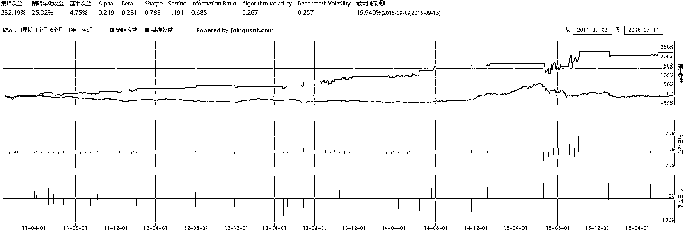

# 均值回归进阶策略，6 的很啊！

> 原文：[`mp.weixin.qq.com/s?__biz=MzAxNTc0Mjg0Mg==&mid=2653285039&idx=1&sn=8c7310425f21349299cf0f7af1c1fbcc&chksm=802e28bab759a1acfbc7d3b348b5e75b3bc523ec6a7ee60db31a5e1459acb2bc90f7748a17cc&scene=27#wechat_redirect`](http://mp.weixin.qq.com/s?__biz=MzAxNTc0Mjg0Mg==&mid=2653285039&idx=1&sn=8c7310425f21349299cf0f7af1c1fbcc&chksm=802e28bab759a1acfbc7d3b348b5e75b3bc523ec6a7ee60db31a5e1459acb2bc90f7748a17cc&scene=27#wechat_redirect)


**编辑部**

微信公众号

**关键字**全网搜索最新排名

**『量化投资』：排名第一**

**『量       化』：排名第一**

**『机器学习』：排名第四**

我们会再接再厉

成为全网**优质的**金融、技术类公众号


我们经常在抓反弹时感觉像在抓一只刺猬，不知道该怎么下手。左侧交易会不会买在半山腰？右侧交易会不会进场太晚？什么时候买入真是让人头疼。切莫苦恼，你完全可以通过历史数据统计判断反弹的时机。今天公众号给大家介绍一种简单的统计方法，它不能保证抓反弹次次成功，但可以让你对多错少，累积起来就是真实的收益！

**先导**

#### **回测策略和查看全部代码，请点击阅读原文**

#### ‍‍‍‍**动机**

股票的价格会以它的均线为中心进行波动。也就是说，当标的价格由于波动而偏离移动均线时，它将调整并重新归于均线。那么如果我们如果能捕捉偏离股价的回归，就可以从此获利。本篇要讲的是，统计历史数据中价格偏离所对应的反弹幅度，选择胜率最高的偏离度作为入场信号。

**波动大小的相对性**

举实例来说。下图是某支股票的 60 分钟线，中间紫色曲线为股价的 5 日均线。可以看出在蓝色线段标明的时间里，股价波动平缓。在两个粉色箭头处，股价比均线分别高 4.1% 和低 5.9%。这些波动较前段时间更为剧烈，可以告诉我们股价发生了偏离。‍‍‍‍


再看下图，这是同一支股票在另一段时间的 60 分钟线。这段时间里价格波动幅度大，在粉色箭头的位置，价格和均线的差距分别为 5.3% 和 5.1%，但我们不将其视为显著的价格偏离。


**标准差**

标准差（standard deviation），通常用小写希腊字母 <nobr aria-hidden="true">σ（sigma，读“西格玛”）表示。通俗地讲，一组数据的标准差就是这组数据离均值的普遍差距。标准差的计算公式为</nobr>

<nobr aria-hidden="true"></nobr>

<nobr aria-hidden="true">如果这组数据的波动较大，那么 </nobr><nobr aria-hidden="true">σ 相应也会较大；相反的，如果这组数据波动小，那么 </nobr><nobr aria-hidden="true">σ 会更接近零。</nobr>

<nobr aria-hidden="true">‍‍举例来说，假设我们有一组数据 </nobr><nobr aria-hidden="true">A=(1,0,0,0,0−1,0,0,0,0)，如下</nobr>

<nobr aria-hidden="true"></nobr>

<nobr aria-hidden="true">‍‍它的平均值是 </nobr><nobr aria-hidden="true">0，标准差是‍‍</nobr>

<nobr aria-hidden="true">‍‍</nobr>

<nobr aria-hidden="true"></nobr>

<nobr aria-hidden="true">‍‍这时如果下一项出现的数据是</nobr><nobr aria-hidden="true">x11=1，可以算出它和均值的差是 2.23 倍标准差，可以被视为是一个较大的波动。</nobr>

<nobr aria-hidden="true">在另一种情况里，假设我们的数据是 </nobr><nobr aria-hidden="true">B=(1,−1,1,−1,1,−1,1,−1,1,−1)如下图</nobr>

<nobr aria-hidden="true"></nobr>

<nobr aria-hidden="true">‍‍可以直观地看出波动较大。这组数据同样是均值等于 0，它的标准差是‍‍</nobr>

<nobr aria-hidden="true"></nobr>

<nobr aria-hidden="true">‍‍‍‍‍明显比数据 ‍‍‍‍</nobr><nobr aria-hidden="true">A 的标准差更大。这时如果出现新的数据 x11，由于它和均值的差距等同于标准，我们不认为它是一个很大的波动。</nobr>

<nobr aria-hidden="true">有了这个概念，我们可以构造一种利用标准差来测量当日股价波动幅度的方法。取过去 N 天收盘价，并取其标准差 </nobr><nobr aria-hidden="true">σ，设今日股价为 P 并且 N 日日均线值为 MAN</nobr>

<nobr aria-hidden="true"></nobr>

<nobr aria-hidden="true">‍‍这个值得含义是，相较过去 N 天的价格，今日股价与均值的偏差为 </nobr><nobr aria-hidden="true">ρ倍的标准差。如果绝对值ρ比较大，我们判定今日价格波动比历史波动更为突出；反之绝对值ρ比较小，我们判定今日的波动很普通，就叫它“</nobr><nobr aria-hidden="true">N 日偏离倍数”。</nobr>

<nobr aria-hidden="true">**偏离倍数和赢输的统计**</nobr>

<nobr aria-hidden="true">我们没法凭空预测偏离倍数在多大的情况下价格会反弹，也不能盲目地认为偏离倍数越高越好。我们干脆穷举，对历史上所有的偏离倍数（范围），统计其后后股价的走势，然后将胜率最高的偏离倍数视为入场信号，在其出现时买入。</nobr>

#### <nobr aria-hidden="true">‍‍</nobr>

#### <nobr aria-hidden="true">**统计的对象**</nobr>

<nobr aria-hidden="true">现代金融理论认为，证券价格的时间序列在大部分时间服从随机游走，但是在一些特定的时刻（比如基本面发生变化，或者供需关系发生变化），价格序列会偏离随机游走，并且选择向上或者向下的方向。当价格在脱离随机游走时，通常都会产生一些现象或征兆，就是我们常说的“信号”，如果我们捕捉到这些信号，就可以赚取收益。</nobr>

<nobr aria-hidden="true">我们使用利用股票的历史数据计算各种各样的指标（比如 MACD，RSI），就是为了通过指标的数值来判断是否出现信号。但很多时候指标的使用是粗糙并且模糊的，比如“当 RSI 低于 20 时买入”是一个发出信号的标准，但为什么是 20 呢？18 或者 22 会不会效果更好？我们想通过历史统计来分析这个问题，那么进行统计的对象就有两个：指标出现的数值，以及出现该数值之后的涨跌结果。</nobr>  <nobr aria-hidden="true">**指标**</nobr>

<nobr aria-hidden="true">一般而言，一支股票的指标是一个函数 Ind(T)，它输入的是时间 T（确切地说还有时间 T 之前的所有股票数据），返回的是在那个时间点的指标数值。比如说，我们要考量的指标是过去 5 天的收益率，那么指标的输出就是今日收盘价除以五天前收盘价的商再减 1。</nobr>  <nobr aria-hidden="true" style="box-sizing: border-box; transition: none; border: 0px; max-width: none; max-height: none; min-width: 0px; min-height: 0px; vertical-align: 0px;">**结果**</nobr>

<nobr aria-hidden="true" style="box-sizing: border-box; transition: none; border: 0px; max-width: none; max-height: none; min-width: 0px; min-height: 0px; vertical-align: 0px;">结果指的就是，我们认为指标所预测的事件到底有没有发生，由此把结果分为“赢”、“平”和“输”。举例来说，假设我们认为过去 5 天的收益率越高，未来两天的收益率就越大；那我们要观测的结果就是未来两天交易量的情况，如果未来两天的平均交易量大于今天的 110%，就记作“赢”，小于今天的 100%就记作“输”，其余情况记作“平”。这里“赢平输”的计算标准有一定拍脑袋的成分，这么做的缺点就是统计的数据不全面，优点是结果更直观更方便应用，并且如果统计结果不理想，我们可以更改输赢的决定方法再重新来过。</nobr>

<nobr aria-hidden="true" style="box-sizing: border-box; transition: none; border: 0px; max-width: none; max-height: none; min-width: 0px; min-height: 0px; vertical-align: 0px;">**指标和结果的统计**</nobr>

<nobr aria-hidden="true" style="box-sizing: border-box; transition: none; border: 0px; max-width: none; max-height: none; min-width: 0px; min-height: 0px; vertical-align: 0px;">数据统计</nobr>

<nobr aria-hidden="true" style="box-sizing: border-box; transition: none; border: 0px; max-width: none; max-height: none; min-width: 0px; min-height: 0px; vertical-align: 0px;">一、提取历史所有交易日的股票数据，并去掉停牌日的信息；
二、记录每一天的指标和输赢结果。对于每一个不停牌的交易日 T，做：</nobr> <nobr aria-hidden="true"><mspace width="2em">a. 计算当日的指标 Ind(T)，方便统计需要，四舍五入到合适的小数点位；</mspace></nobr> <nobr aria-hidden="true" style="box-sizing: border-box; transition: none; border: 0px; max-width: none; max-height: none; min-width: 0px; min-height: 0px; vertical-align: 0px;"><mspace width="2em"></mspace> b. 计算从 T 日起观测的输赢结果；</nobr> <nobr aria-hidden="true" style="box-sizing: border-box; transition: none; border: 0px; max-width: none; max-height: none; min-width: 0px; min-height: 0px; vertical-align: 0px;"><mspace width="2em"></mspace> c. 记录事件组(Ind(T),赢或平或输)。
三、统计指标的某个值出现后赢和平和输分别发生过多少次。</nobr>

<nobr aria-hidden="true" style="box-sizing: border-box; transition: none; border: 0px; max-width: none; max-height: none; min-width: 0px; min-height: 0px; vertical-align: 0px;">举例个简单的例子。假设我们认为过去 5 天涨得越多则未来五天越可能跌。那么把五日收益率设为指标；未来第五天收盘价小于今日收盘价则记为赢，大于记输，等于则记平。</nobr>

<nobr aria-hidden="true" style="box-sizing: border-box; transition: none; border: 0px; max-width: none; max-height: none; min-width: 0px; min-height: 0px; vertical-align: 0px;">首先收集数据，注意要把停牌时的数据去掉，这里是从 06 年 2 月 2 日到 16 年 2 月 2 日。</nobr>

```py
`prices = get_price('002200.XSHE', start_date="2006-02-02", 
end_date="2016-02-02", frequency='daily', fields=['close'], 
skip_paused=True)['close']  import pandas as pddef get_stats(prices):
    # 设置一个计数器
    i = 5
    # 设置一个空 list
    data = []    # 从第一个到倒数第二个价格
    while i < len(prices)-4:        # 计算五日收益率，留小数点后 2 位
        ratio = 0.01 * ((prices[i]/prices[i-5]) //0.01)        # 如果第五天收盘价更低
        if prices[i+4] < prices[i]:            # 那结果记赢
            result = 'win'
        # 如果第五天收盘价更高
        if prices[i+4] > prices[i]:            # 结果记输
            result = 'lose'
        # 收盘价不变的话
        if prices[i] == prices[i+4]:            # 记平
            result = 'even'
        # 看看该比例有无记载过
        ratio_recorded = False
        # 翻看 data
        for data_dict in data:            # 如果比例被记载过
            if data_dict['value'] == ratio:                # 那就好，更新输赢
                data_dict[result] += 1
                # 记载过为是
                ratio_recorded = True
        # 如果翻完了发现没记载过，
        if ratio_recorded == False:            # 那么就记载下来
            data_dict = {'value':ratio, 'win':0, 'lose':0, 'even':0}
            data_dict[result] += 1
            data.append(data_dict)        # 别忘更新 i
        i += 1
    # 转换成 DataFrame
    df = pd.DataFrame(data,  columns=['value', 'win','even', 'lose'])    # 按照 value 列从小到大排序
    df = df.sort(['value'], ascending = True)return(df)`
```

<nobr aria-hidden="true" style="box-sizing: border-box; transition: none; border: 0px; max-width: none; max-height: none; min-width: 0px; min-height: 0px; vertical-align: 0px;"></nobr>

<nobr aria-hidden="true" style="box-sizing: border-box; transition: none; border: 0px; max-width: none; max-height: none; min-width: 0px; min-height: 0px; vertical-align: 0px;">**制图**</nobr> 

<nobr aria-hidden="true" style="box-sizing: border-box; transition: none; border: 0px; max-width: none; max-height: none; min-width: 0px; min-height: 0px; vertical-align: 0px;">把统计好的数据画出来就可以看出效果了。基于以上数据的特性，我们要画一个叠加条状图。该图的 x 坐标轴是指标的值，y 轴则是该指标值出现的次数，并按颜色划分成“赢平输”叠加的条状图。代码如下：</nobr>

```py
`Import matplotlib.pyplot as plt# 设置图的大小 fig_size = plt.rcParams["figure.figsize"]
fig_size[0] = 15 fig_size[1] = 10# 把统计的 DataFrame 中竖列抽出来 values = stats['value']
wins = stats['win']
evens = stats['even']
loses = stats['lose']# 画输的数目，颜色为红 p1 = plt.bar(values, loses, width = 0.008, color='r')# 画平的数目，颜色为黄，底部在输之上 p2 = plt.bar(values, evens, width= 0.008,  bottom = loses, color='y')# 画赢的数目，颜色为绿，底部在输+平之上 p3 = plt.bar(values, wins, width=0.008, bottom = evens+loses, color='g')# 标注坐标轴和注释 plt.ylabel('输赢结果',size = 15)
plt.xlabel('收盘价除以 22',size = 15)
plt.legend((p1[0], p2[0],p3[0]), ('输', '平','赢'))`
```

<nobr aria-hidden="true" style="box-sizing: border-box; transition: none; border: 0px; max-width: none; max-height: none; min-width: 0px; min-height: 0px; vertical-align: 0px;"></nobr>

<nobr aria-hidden="true" style="box-sizing: border-box; transition: none; border: 0px; max-width: none; max-height: none; min-width: 0px; min-height: 0px; vertical-align: 0px;">为了方便看出赢和输的差距，可以把赢减输画出来。</nobr> 

<nobr aria-hidden="true" style="box-sizing: border-box; transition: none; border: 0px; max-width: none; max-height: none; min-width: 0px; min-height: 0px; vertical-align: 0px;"></nobr>

<nobr aria-hidden="true" style="box-sizing: border-box; transition: none; border: 0px; max-width: none; max-height: none; min-width: 0px; min-height: 0px; vertical-align: 0px;">‍‍‍‍‍‍这样就可以清晰地看到一些规律。</nobr> 

#### <nobr aria-hidden="true">**合理地使用统计结果**</nobr>

<nobr aria-hidden="true">我们单单把图画了出来，那是不是就可以在策略中用了？当然不是。拿之前的统计举例，可以看见两个比较明显的问题‍‍‍‍</nobr>

<nobr aria-hidden="true"></nobr>

<nobr aria-hidden="true">‍‍‍‍先看紫色标注的位置，那里统计的胜率很高。如果们选择在 5 日收益率 1.17 时买入，会怎么样？首先 5 日收益率正好为 1.17 的概率很小，可能若干年都不出现信号。其次，可以看见它右边的 1.18 的胜率并不高，那么实际上当指标计算出为 1.175 时就无法合理判断。</nobr>

<nobr aria-hidden="true">‍</nobr>

<nobr aria-hidden="true">再看棕色框起的区域，这里只有赢没有输，但是这个区域中样本量太小了，完全无法保证统计结果的准确性。</nobr> <nobr aria-hidden="true">‍
**选择胜率最高的区间**</nobr>

<nobr aria-hidden="true">‍

一个可行的解决办法，是设定一个指标区间的宽度 w，并且设定最低数据比θ。如果一个宽度为 w 的 x 轴区间里的数据量占总数据量的θ以上，我们就计算并记录该区间里的输赢比；如果区间内数据比例少于θ，我们则抛弃该区间。最后选出输赢比最高的区间作为产生信号的指标值。

比如我们设 w=4，那么在 1.08 到 1.11 的区间里，赢输比为 66:58。‍‍


我们要选的是依照该计算方法得到的赢输比最高的区间。

下面函数的 4 个输入分别为：
statistics – 之前算出的 DataFrame 统计数据
tick_width – 指标值的最小间隔（跳动值，比如上面的示例里就是 0.01）
least_percentage – 要求区间数据量至少有总数据量的多少
band_width – 区间的宽度，整数，可理解为进行多少次 tick_width 的跳动。

代码如下

```py
# 返回一 Series，内容 low=区间低点，high=区间高点，ratio=区间赢输比 def find_best_region(statistics, tick_width, least_percentage, band_width):
    # 取出统计 df 的列
    values = statistics['value']
    loses = statistics['lose']
    wins = statistics['win']
    evens = statistics['even']    # 算总数据量
    num_data = sum(wins) + sum(loses) + sum(evens)    # 起始一 list
    mydata = []    # 计算指标统计出的最低值除以间距，取整数，方便后面移动计算。
    low_bound = int(statistics['value'].iloc[0]/tick_width)    # 计算指标统计出的最高值除以间距，减去区间宽度
    high_bound = int(statistics['value'].iloc[-1]/tick_width - band_width + 1)    # 对于上限和下限之间的所有整数
    for n in range(low_bound, high_bound ):        # 选取统计中所对应的区间
        statistics1 = statistics[values >= float(n)*tick_width]
        stat_in_range  = statistics1[values <= float(n + band_width - 1) * tick_width]        # 计算区间中的赢输比。输数加一，避免除以零。
        ratio = float(sum(stat_in_range['win'])) / float(sum(stat_in_range['lose'])+1)        # 计算区间中数据量
        range_data = float(sum(stat_in_range['win']) + sum(stat_in_range['lose']) + sum(stat_in_range['even']))        # 如果区间数据量除以总数据量大于最低数据比
        if range_data / num_data >= least_percentage:            # 记录区间的最低值，最高值，和区间内的赢输比
            mydata.append({'low': float(n) * tick_width, 'high': float(n+band_width) * tick_width, 'ratio': ratio})    # 制作 DataFrame
    data_table = pd.DataFrame(mydata)    # 按照赢输比排序
    sorted_table = data_table.sort('ratio', ascending = False)    # 返回第一行 return(sorted_table.iloc[0])
```

‍‍

对于上面的例子，tick_width = 0.01，再设 least_percentage = 0.03，以及 band_width = 4，计算

```py
find_best_region(stats,0.01, 0.03, 4)
```

得到区间[1.12,1.16]，区间内输赢比 1.43。

‍‍

把所有的宽度都计算一遍。做法就是，先固定一个最短的宽度 w_0，对于所有宽度为 w_0 的区间进行上面的计算，然后将宽度换为 w_0+1 再重复一遍，然后是 w_0+2，以此类推，直到达到了设定的最大宽度。最后取这个过程中算出的最大的输赢比，并取相应的区间。

具体的计算已经由上面的函数完成，现在只要再包装一个函数来迭代地以不同的宽度呼出上面的函数，得到每个长度的最佳区间，再从这里面选出胜率最好的。
这里输入的 statistics，tick_width，least_percentage 和之前相同，另外的两个输入是
least_width – 最短的区间宽度
most_width – 最大的区间宽度

 代码

```py
# 返回一 Series，内容 low=区间低点，high=区间高点，ratio=区间赢输比 def find_absolute_best_region(statistics, tick_width, least_percentage, least_width, most_width):
    # 创建标注列的空 DF
    columns = ['low', 'high', 'ratio']
    df = pd.DataFrame(columns = columns)    # 对于所有在最短和最长标准之间的宽度
    for band_width in range(least_width, most_width + 1):        # 运行上面函数，得到该宽度的最佳区间
        best_width_region = find_best_region(statistics, tick_width, least_percentage, band_width)        # 将结果加入 DF
        df = df.append(best_width_region, ignore_index = True)    # 将赢输比从大到小排列
    sorted_table = df.sort('ratio', ascending = False)    # 返回第一行 return(sorted_table.iloc[0])
```

还是同样的例子，这次 least_percentage 选 0.05，最小宽度 least_width=2，最大宽度 most_width=30。然后

```py
find_absolute_best_region(stats, 0.01, 0.05, 2, 30)
```

得到宽度为 19 的区间[1.12,1.31]，这之间的赢输比为 1.72，这也是使用该指标时保证 5%数据量的情况下的最大赢输比！</nobr> 

<nobr aria-hidden="true">**偏离倍数和赢输的统计**</nobr>

<nobr aria-hidden="true">按照文中的思路，我们要计量的指标是上一节中介绍的 </nobr><nobr aria-hidden="true">N 日偏离倍数 </nobr><nobr aria-hidden="true">ρ。另外，我们只记录 </nobr><nobr aria-hidden="true">ρ小于-1 和大于等于-</nobr><nobr aria-hidden="true">1</nobr><nobr aria-hidden="true">，那说明价格偏离不大，则不构成回归信号。</nobr>

<nobr aria-hidden="true">以某股票从 2006 年到 2016 年的数据为例，统计结果如下：  </nobr>

<nobr aria-hidden="true">我们设置参数：区间宽度最小数据比 w=5，C 塔=0.05，通过计算，得到区间为[-2.6,3.1]，区间数据如下：</nobr>

<nobr aria-hidden="true"></nobr>

<nobr aria-hidden="true"></nobr>

<nobr aria-hidden="true">也就是说，根据历史统计，如果当偏离倍数在-3.1 和-2.6 之间时买入该股票，输赢的预期是 27:12，还有 2 次平局。</nobr>

<nobr aria-hidden="true" style="box-sizing: border-box; transition: none; border: 0px; max-width: none; max-height: none; min-width: 0px; min-height: 0px; vertical-align: 0px;">‍</nobr><nobr aria-hidden="true" style="box-sizing: border-box; transition: none; border: 0px; max-width: none; max-height: none; min-width: 0px; min-height: 0px; vertical-align: 0px;">‍‍‍</nobr>

<nobr aria-hidden="true" style="box-sizing: border-box; transition: none; border: 0px; max-width: none; max-height: none; min-width: 0px; min-height: 0px; vertical-align: 0px;">**回测**</nobr>

<nobr aria-hidden="true" style="box-sizing: border-box; transition: none; border: 0px; max-width: none; max-height: none; min-width: 0px; min-height: 0px; vertical-align: 0px;">其实策略的主要部分已经完成，只要加上对资金和仓位的管理，就可以构成一个可运行的策略。这里我们就构建一个很简单的方案。</nobr>

<nobr aria-hidden="true" style="box-sizing: border-box; transition: none; border: 0px; max-width: none; max-height: none; min-width: 0px; min-height: 0px; vertical-align: 0px;">设定如上一节所述每的参数：均线天数 N，统计输赢天数 T，止盈倍数 u，止损倍数 d，区间宽度 w，和最小数据比 Cta。每交易日执行以下操作：</nobr>

<nobr aria-hidden="true" style="box-sizing: border-box; transition: none; border: 0px; max-width: none; max-height: none; min-width: 0px; min-height: 0px; vertical-align: 0px;">一、全仓卖出应当止盈或止损的股票，或持有超过 T 天的股票；</nobr>

<nobr aria-hidden="true" style="box-sizing: border-box; transition: none; border: 0px; max-width: none; max-height: none; min-width: 0px; min-height: 0px; vertical-align: 0px;">二、执行上一节的统计方法来更新每一支股票的最佳偏离倍数区间；</nobr>

<nobr aria-hidden="true" style="box-sizing: border-box; transition: none; border: 0px; max-width: none; max-height: none; min-width: 0px; min-height: 0px; vertical-align: 0px;">三、如果空仓，选定任意一支偏离倍数在最佳区间内的股票并全仓买入，如果所有股票都不符合则空仓。买入时记录止盈线 u 倍和止损 d 倍，并且设如果 T 日内未触碰止盈或止损线，也全部卖出。</nobr>

<nobr aria-hidden="true" style="box-sizing: border-box; transition: none; border: 0px; max-width: none; max-height: none; min-width: 0px; min-height: 0px; vertical-align: 0px;">来看一看回测结果。以下回测使用的股票池只包含 1 或 2 支标的股，这样便于看出策略对于个股发出的信号。文章最后的策略代码只适用于小规模的股票池；对于更大的股票池，信号会更加密集，因此需要调整每支股票的持仓量并且分别止盈止损，读者可以自行进行修改，或等待量化课堂未来的文章。另外，我们的回测从 2011 年开始，这样保证回测开始时就有一定的历史数据储备。</nobr>

<nobr aria-hidden="true" style="box-sizing: border-box; transition: none; border: 0px; max-width: none; max-height: none; min-width: 0px; min-height: 0px; vertical-align: 0px;">首先是股票 002013 的回测</nobr>

<nobr aria-hidden="true" style="box-sizing: border-box; transition: none; border: 0px; max-width: none; max-height: none; min-width: 0px; min-height: 0px; vertical-align: 0px;"></nobr>

<nobr aria-hidden="true" style="box-sizing: border-box; transition: none; border: 0px; max-width: none; max-height: none; min-width: 0px; min-height: 0px; vertical-align: 0px;">策略在震荡市中产生比较稳定的收益，并保持比较小的回撤。在牛市中完全不产生信号，因此没有半点反应，倒是在股灾之后稳稳地抓好了反弹，在短期内获取大量收益。</nobr>

<nobr aria-hidden="true" style="box-sizing: border-box; transition: none; border: 0px; max-width: none; max-height: none; min-width: 0px; min-height: 0px; vertical-align: 0px;">还使用同样的参数，我们看 002230 的回测。</nobr>

<nobr aria-hidden="true" style="box-sizing: border-box; transition: none; border: 0px; max-width: none; max-height: none; min-width: 0px; min-height: 0px; vertical-align: 0px;"></nobr>

<nobr aria-hidden="true" style="box-sizing: border-box; transition: none; border: 0px; max-width: none; max-height: none; min-width: 0px; min-height: 0px; vertical-align: 0px;">同样是在震荡市中表现良好，但在股灾中抓反弹一度失利，不过后期在弥补损失之余获得了更高的收益。</nobr>

<nobr aria-hidden="true" style="box-sizing: border-box; transition: none; border: 0px; max-width: none; max-height: none; min-width: 0px; min-height: 0px; vertical-align: 0px;">观看回测最下方的“每日买卖”图可看出这个策略产生的信号和交易实则不多，在股票池里放入多支股票的话可以轮回抓取反弹，产生叠加的收益。比如，下图是将上面两支股票的作为标的回测，对比的指数是沪深 300。</nobr>

<nobr aria-hidden="true" style="box-sizing: border-box; transition: none; border: 0px; max-width: none; max-height: none; min-width: 0px; min-height: 0px; vertical-align: 0px;"></nobr>

<nobr aria-hidden="true" style="box-sizing: border-box; transition: none; border: 0px; max-width: none; max-height: none; min-width: 0px; min-height: 0px; vertical-align: 0px;">策略结果</nobr>

<nobr aria-hidden="true" style="box-sizing: border-box; transition: none; border: 0px; max-width: none; max-height: none; min-width: 0px; min-height: 0px; vertical-align: 0px;"></nobr>

<nobr aria-hidden="true" style="box-sizing: border-box; transition: none; border: 0px; max-width: none; max-height: none; min-width: 0px; min-height: 0px; vertical-align: 0px;">**结语**</nobr>

<nobr aria-hidden="true" style="box-sizing: border-box; transition: none; border: 0px; max-width: none; max-height: none; min-width: 0px; min-height: 0px; vertical-align: 0px;">‍‍‍‍首先是均值回归核心思路：</nobr> 

<nobr aria-hidden="true" style="box-sizing: border-box; transition: none; border: 0px; max-width: none; max-height: none; min-width: 0px; min-height: 0px; vertical-align: 0px;">**价格偏离均线太多就会弹回来**</nobr> 

<nobr aria-hidden="true" style="box-sizing: border-box; transition: none; border: 0px; max-width: none; max-height: none; min-width: 0px; min-height: 0px; vertical-align: 0px;">然后是，我们怎么判断偏离多少呢？</nobr>

<nobr aria-hidden="true" style="box-sizing: border-box; transition: none; border: 0px; max-width: none; max-height: none; min-width: 0px; min-height: 0px; vertical-align: 0px;">**价格减去均线除以历史波动的标准差可以丈量偏离的程度**</nobr> 

<nobr aria-hidden="true" style="box-sizing: border-box; transition: none; border: 0px; max-width: none; max-height: none; min-width: 0px; min-height: 0px; vertical-align: 0px;">判断入场的话…</nobr>

<nobr aria-hidden="true" style="box-sizing: border-box; transition: none; border: 0px; max-width: none; max-height: none; min-width: 0px; min-height: 0px; vertical-align: 0px;">**利用历史统计的偏离倍数对应的输赢率判断入场时机**</nobr> 

<nobr aria-hidden="true" style="box-sizing: border-box; transition: none; border: 0px; max-width: none; max-height: none; min-width: 0px; min-height: 0px; vertical-align: 0px;">最后还要指出，本篇文章旨为抛砖引玉，展示一种思路。文中的统计方法比较粗糙，策略也比较简单。想要在实战中应用的话，还需要进一步拓展、打磨并结合其他的方法，才能构造出一套成熟的交易策略。</nobr>

<nobr aria-hidden="true" style="box-sizing: border-box; transition: none; border: 0px; max-width: none; max-height: none; min-width: 0px; min-height: 0px; vertical-align: 0px;">‍‍</nobr>

<nobr aria-hidden="true" style="box-sizing: border-box; transition: none; border: 0px; max-width: none; max-height: none; min-width: 0px; min-height: 0px; vertical-align: 0px;">**部分代码**</nobr>

```py
 `mydata = []        # 在所有位置不会溢出的位置
        for n in range(min(values), max(values) - (g.band_width-1)):            # 取在 n 和（n+宽度）之间的 DF 行
            stat_in_range = statistics[(values >= n) & (values <= n+g.band_width-1)]            # 赢除输（这里输+1，因为可能输=0）
            ratio = float(sum(stat_in_range['win'])) / float((sum(stat_in_range['lose']) + 1))            # 这区间数据总量
            range_data = float(sum(stat_in_range['win']) + sum(stat_in_range['lose']) + sum(stat_in_range['even']))            # 如果数据量超过预设的临界值
            if range_data / num_data >= g.least_percentage:                # 记录区间的输赢比
                mydata.append({'low': n, 'high': n+g.band_width, 'ratio': ratio})        # 区间统计转换成 DF
        data_table = pd.DataFrame(mydata)        # 按输赢比排序
        sorted_table = data_table.sort('ratio', ascending = False)        # 取第一行
        stock_best_range = sorted_table.iloc[0]
        stock_best_ranges[security] = stock_best_range    # 输出结果
    return(stock_best_ranges)# --代码块 11.# 获取买入信号# 输出一 list 该买入的股票 def buy_signals(stock_best_ranges, context):
    to_buy = [] 
    for security in g.security:
        stock_best_range = stock_best_ranges[security]        # 看现价
        current_price = attribute_history(security,1, '1d', 'close').iloc[0,0]        # 取倍数区间低点
        low = float(stock_best_range['low'])        # 取倍数区间高点
        high = float(stock_best_range['high'])        # 取赢率
        ratio = float(stock_best_range['ratio'])        # 获取历史收盘价
        h = attribute_history(security, g.ma_length, '1d', ['close'], skip_paused=True)['close']        # 计算均线
        ma = mean(h)        # 计算标准差
        sigma  = std(h)        # 算现价的偏离倍数
        times_sigma = (current_price - ma) / sigma        # 如果在该买的区间里
        if low <= 10 * times_sigma and 10 *times_sigma <= high:            # 加入买入列表
            to_buy.append(security)    return(to_buy)# --代码块 12.# 获取卖出信号# 输出一 list 该卖出的股票 def sell_signals(context): 
    to_sell = []    # 对于仓内所有股票
    for security in context.portfolio.positions:        # 取现价
        current_price = history(1, '1m', 'close', security).iloc[0,0]        # 查卖出条件
        conditions = g.sell_conditions[security]        # 看看是不是该卖了
        if current_price >= conditions['high'] or current_price <= conditions['low'] or conditions['days'] <= 0:            # 加入卖出信号，确保没有重复
            to_sell.append(security)        # 如果不需要卖
        else:            # 日数减 1
            g.sell_conditions[security]['days'] -= 1
    return(to_sell)# ---代码块 13.# 卖出函数 def sell_stocks(to_sell, to_buy, context):
    for security in to_sell:        # 如果也在买入名单里
        if security in to_buy:            # 从卖出信号中删掉
            pass
        # 不该买的话
        else:            # 全卖掉
            order_target(security, 0)            # 如果没有卖干净呢
            if security in context.portfolio.positions:                # 把天数清零
                g.sell_conditions[security]['days'] = 0# ---代码块 14.# 买入函数 def buy_stocks(to_buy, context):
    # 有多少钱
    cash_per_stock = context.portfolio.portfolio_value    if len(context.portfolio.positions) == 0:        # 对于所有买单里的股票
        for security in to_buy:
            order_value(security, cash_per_stock)            if security in context.portfolio.positions:                # 看现价
                current_price = attribute_history(security,1, '1d', 'close').iloc[0,0]                # 获取历史收盘价
                h = attribute_history(security, g.ma_length, '1d', ['close'], skip_paused=True)['close']                # 计算均线
                ma = mean(h)                # 计算标准差
                sigma  = std(h)                # 止损线
                low = current_price - g.loss_times_sigma * sigma                # 止盈线
                high = current_price + g.profit_times_sigma * sigma                # 在全局变量中记录卖出条件
                g.sell_conditions[security] = {'high': high, 'lo`
```

<nobr aria-hidden="true" style="box-sizing: border-box; transition: none; border: 0px; max-width: none; max-height: none; min-width: 0px; min-height: 0px; vertical-align: 0px;">**投稿、商业合作**</nobr>

<nobr aria-hidden="true" style="box-sizing: border-box; transition: none; border: 0px; max-width: none; max-height: none; min-width: 0px; min-height: 0px; vertical-align: 0px;">**请发邮件到：lhtzjqxx@163.com**</nobr>

<nobr aria-hidden="true" style="box-sizing: border-box; transition: none; border: 0px; max-width: none; max-height: none; min-width: 0px; min-height: 0px; vertical-align: 0px;">**关注者**</nobr>

<nobr aria-hidden="true" style="box-sizing: border-box; transition: none; border: 0px; max-width: none; max-height: none; min-width: 0px; min-height: 0px; vertical-align: 0px;">**从****1 到 10000+**</nobr>

<nobr aria-hidden="true" style="box-sizing: border-box; transition: none; border: 0px; max-width: none; max-height: none; min-width: 0px; min-height: 0px; vertical-align: 0px;">**我们每天都在进步**</nobr>

<nobr aria-hidden="true" style="box-sizing: border-box; transition: none; border: 0px; max-width: none; max-height: none; min-width: 0px; min-height: 0px; vertical-align: 0px;">听说，置顶关注我们的人都不一般</nobr>

<nobr aria-hidden="true" style="box-sizing: border-box; transition: none; border: 0px; max-width: none; max-height: none; min-width: 0px; min-height: 0px; vertical-align: 0px;"></nobr>

<nobr aria-hidden="true" style="box-sizing: border-box; transition: none; border: 0px; max-width: none; max-height: none; min-width: 0px; min-height: 0px; vertical-align: 0px;">****</nobr>