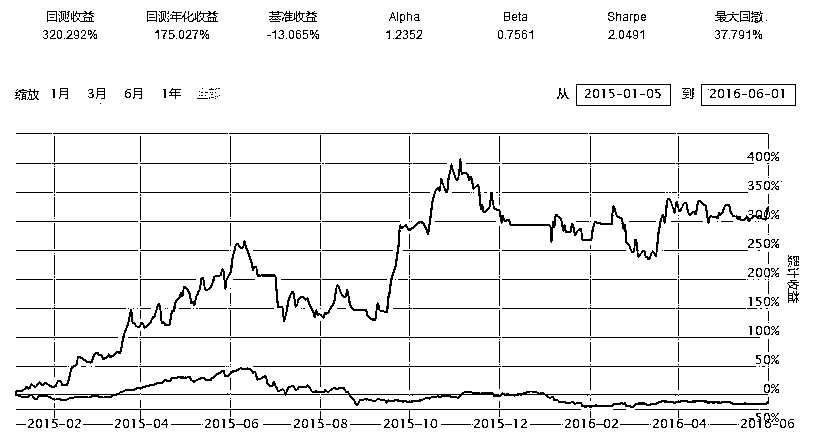

# 多种止损方案策略详细介绍（止损思路+程序代码）

> 原文：[`mp.weixin.qq.com/s?__biz=MzAxNTc0Mjg0Mg==&mid=2653285002&idx=1&sn=5e6fffaf25a794845fec16ecde7d8b41&chksm=802e289fb759a1895821faeb342c25a607f5a89dff72da1f07ae3392bec4815d35b8c2ed5fbd&scene=27#wechat_redirect`](http://mp.weixin.qq.com/s?__biz=MzAxNTc0Mjg0Mg==&mid=2653285002&idx=1&sn=5e6fffaf25a794845fec16ecde7d8b41&chksm=802e289fb759a1895821faeb342c25a607f5a89dff72da1f07ae3392bec4815d35b8c2ed5fbd&scene=27#wechat_redirect)


**编辑部**

微信公众号

**关键字**全网搜索最新排名

**『量化投资』：排名第一**

**『量       化』：排名第一**

**『机器学习』：排名第四**

我们会再接再厉

成为全网**优质的**金融、技术类公众号


我们为大家提供了几个简单的止损方案的模板， 在写这些代码的时候考虑了小白用户的体验，用户只需将相应的代码复制粘贴到自己的策略中，并设置相关参数就能顺利使用。 详细调用方法请看源代码 开头部分。为了获得更好的止损效果， 建议将调仓频率设置为月调仓。

**时间止损**

时间止损认为时间是有价值的，若在一定的时间内某股票的回报收益低于一个预设值就认为该交易低于预期，选择卖出。 这是一个非常简单的止损策略， 由于止损线是固定的， 所以不能很好的减少回撤。若不是专门研究时间止损， 不建议使用。


```py
if 持仓时间> X 天 and 区间涨幅 小于 Y% ： 
卖出止损 else：
继续持有
```

```py
import pandas as pd 
import numpy as np 
import time 
import datetime 
import mathimport itertools
  def init(context):
    context.to_buy = ('300033.XSHE','000025.XSHE')
    context.period=10 # 持股天数 X 
    context.total_return=0.05 # 持股天数内的回报率 
    # 实时打印日志
    #scheduler.run_daily(stoploss)
    logger.info("Interested at stock: " + str(context.to_buy))
    context.time=pd.DataFrame()
    scheduler.run_monthly(rebalance,1)
    scheduler.run_daily(stoploss)
  def handle_bar(context, bar_dict):
    pass 

def stoploss( context,bar_dict):
    # 根据时间 清仓
    print(context.time)    
    for stock in  context.portfolio.positions: 
        if stock in context.time.columns:
            buytime=context.time[stock][0] # 获取买入时间
            currenttime=context.now.replace(tzinfo=None) # 获取当前时间
            print ('buytime='+str(buytime))
            print('currenttime='+str(currenttime))

            total_return=context.portfolio.positions[stock].market_value/context.portfolio.positions[stock].bought_value # 计算回报
            escape=(currenttime-buytime).days # 计算持有天数
            if escape>context.period and total_return<1+context.total_return:
                print(str(stock)+ '大于' + str (context.period)+'天 且回报过小， 卖出')
                order_target_percent(stock, 0)                
                del context.time[stock]            
            elif total_return>1+context.total_return: 
                print(str(stock)+'回报为: ' +str(total_return)+'大于预设值'+str(1+context.total_return))            
            else:
                print(str(stock)+ '持仓未到' +str(context.period)+'天,继续持有')
 def record(context,bar_dict,stock):
    if stock not in context.time.columns:
        temp=pd.DataFrame({str(stock):[context.now.replace(tzinfo=None)]})
        logger.info (temp)
        context.time = pd.concat([context.time, temp], axis=1, join='inner')
 def rebalance(context,bar_dict):
    if len(context.to_buy)!=0:        
        for stock in context.to_buy:
            record(context,bar_dict,stock)
            order_target_percent(stock,1/len(context.to_buy))            
    else: 
        order_target_percent(stock,0)
```

**时间+ 阶梯 止损**

时间+阶梯 止损是将“时间有价值” 和 “动态止损” 这两个思路结合在一起的策略。 止损价会随着 持股周期的变化而变化， 一旦跌破止损价，则卖出。 良好的止损策略。


```py
止损价 =fx ( 持股周期， 期望回报率)if 现价< 止损价：
卖出止损
```

```py
阶梯次数= floor(log(1+最大涨幅%)/log(1+阶梯长度%))
止损价位=初始止损价*(1+Y%)^周期次数 if 现价<止损价位:
卖出止损
```

```py
阶梯次数= floor (持股时间(天)/周期 X(天))
止损价= 买入价*(1+阶梯次数* Y%)if 持股时间>周期 X  and 现价< 止损价：
卖出止损 else if  持股时间<周期 X and 现价<买入价*预设止损比例：
在第一个周期内亏损过多， 卖出止损 else：
继续持有  
```

```py
import numpy as np 
import time 
import datetime 
import mathimport itertools
 def init(context):
    context.to_buy = ('300033.XSHE','000025.XSHE')
    context.period=10 # 持股天数 X 
    context.increment=0.15
    # 实时打印日志
    context.time=pd.DataFrame()
    scheduler.run_monthly(rebalance,1)
    scheduler.run_daily(stoploss)  def handle_bar(context, bar_dict):
    pass 
 def stoploss( context,bar_dict):
    # 根据时间 清仓
    print(context.time)    f
    or stock in  context.portfolio.positions: 
        if stock in context.time.columns:
            buytime=context.time[stock][0] # 获取买入时间
            currenttime=context.now.replace(tzinfo=None) # 获取当前时间
            print ('buytime='+str(buytime))
            print('currenttime='+str(currenttime))

            total_return=context.portfolio.positions[stock].market_value/context.portfolio.positions[stock].bought_value # 计算回报

            escape=(currenttime-buytime).days # 计算持有天数
            threshold=math.floor(escape/context.period)*context.increment+1 # 计算期望。
            if escape>context.period and total_return<threshold:
                print(str(stock)+ '大于' + str (context.period)+'天 且回报小于'+ str(threshold)+' 卖出')
                order_target_percent(stock, 0)                
                del context.time[stock]            
            elif total_return>threshold: 
                print(str(stock)+'回报为: ' +str(total_return)+'大于预设值'+str(threshold)+', 继续持有')            
            elif total_return<0.95:
                print(str(stock)+'周期内跌幅超过 5% 直接止损')           
             else:
                print(str(stock)+ '持仓未到' +str(context.period)+'天,继续持有')
 def record(context,bar_dict,stock):
    if stock not in context.time.columns:
        temp=pd.DataFrame({str(stock):[context.now.replace(tzinfo=None)]})
        logger.info (temp)
        context.time = pd.concat([context.time, temp], axis=1, join='inner')
 def rebalance(context,bar_dict):
    if len(context.to_buy)!=0:        
        for stock in context.to_buy:
            record(context,bar_dict,stock)
            order_target_percent(stock,1/len(context.to_buy))    else: 
    order_target_percent(stock,0)
```

**限价止损**

限价止损 将买入价设置为基准价， 一旦股价上涨大于 X% 或下跌大于 Y% 就卖出该股。这是也是一个固定止损/止盈价位的止损方案， 和时间止损存在相同问题：不能有效减少回撤。


```py
if 现价>(1+X%)*买入价：
卖出 止盈 else if 现价<(1-Y%)*买入价：
卖出止损 else：
继续持有
```

```py
import numpy as np 
import time 
import datetime 
  def init(context):
    context.to_buy = ('300033.XSHE','000025.XSHE','601766.XSHG')
    context.stoplossmultipler= 0.95 #止损 乘数 
    context.stoppofitmultipler= 1.5 #止盈 乘数
    # 实时打印日志
    #scheduler.run_daily(stoploss)
    logger.info("Interested at stock: " + str(context.to_buy))
    scheduler.run_monthly(position,1)
    scheduler.run_daily(stoploss)def stoploss(context,bar_dict):
    for stock in context.portfolio.positions:        
        if bar_dict[stock].last<context.portfolio.positions[stock].average_cost*context.stoplossmultipler:# 现价低于 原价一定比例
            order_target_percent(stock,0)
            print(str(stock)+'跌幅超过'+str((1-context.stoplossmultipler)*100) +'%  触发止损')        
 elif bar_dict[stock].last>context.portfolio.positions[stock].average_cost*context.stoppofitmultipler:# 现价高于原价一定比例
            order_target_percent(stock,0)
            print(str(stock)+'涨幅幅超过'+str((context.stoppofitmultipler-1)*100) +'%  触发止盈')    
 pass  def handle_bar(context, bar_dict):
    pass def position(context,bar_dict):
    if len(context.to_buy)!=0:        
 for stock in context.to_buy:
            order_target_percent(stock,1/len(context.to_buy))    
 else: 
        order_target_percent(stock,0)
```

**跟踪止损**

跟踪止损 考虑的是该股的回撤， 若回撤大于某预设值 X% 就将其卖出。 此方案的止损价会随着最高价的变化而变化， 在股灾和熔断中有很好的表现。


```py
X=允许最大回撤 if 现价<持股周期内最高价*(1-X %):
卖出止损 else：
继续持有
```

```py
import pandas as pd 
import numpy as np 
import time 
import mathimport datetime 
def init(context):
    context.to_buy = ('300033.XSHE','000025.XSHE','601390.XSHG')
    context.drawdown= 0.1 # 回撤限度 10% 
    context.maxvalue=pd.DataFrame()
    logger.info("Interested at stock: " + str(context.to_buy))
    scheduler.run_monthly(position,1)
    scheduler.run_daily(stoploss)

def stoploss(context,bar_dict):
    for stock in context.portfolio.positions:
        market_value=context.portfolio.positions[stock].market_value# 该股市场价值 单位（RMB）
        bought_value=context.portfolio.positions[stock].bought_value#该股初始价值 单位（RMB）
        stockdic=context.maxvalue[stock]
        maxvalue=stockdic[0]        

del context.maxvalue[stock]
        temp=pd.DataFrame({str(stock):[max(maxvalue,market_value)]})
        context.maxvalue=pd.concat([context.maxvalue,temp], axis=1, join='inner') # 更新其盘中最高价值和先阶段比例。 
        drawdown=1-market_value/max(maxvalue,market_value)

        print(str(stock)+'的成本为：' +str( bought_value) +', 最高价值为：'+str(maxvalue)+'现价值为：'+ str(market_value))
        print(str(stock) +'的现 回撤为: ' +str(drawdown*100)+ '%')        
 if drawdown>context.drawdown:# 现价低于 原价一定比例
            order_target_percent(stock,0)
            print(str(stock)+'回撤大于'+ str(context.drawdown*100)+ '%'+'  触发止损')            
 del context.maxvalue[stock]    
pass 
 def handle_bar(context, bar_dict):
    pass def createdic(context,bar_dict,stock):
    if stock not in context.maxvalue.columns:
        temp=pd.DataFrame({str(stock):[context.portfolio.positions[stock].bought_value]})    
        context.maxvalue = pd.concat([context.maxvalue, temp], axis=1, join='inner')
    print(context.maxvalue)

def position(context,bar_dict):
    if len(context.to_buy)!=0:        
 for stock in context.to_buy:
            order_target_percent(stock,1/len(context.to_buy))
            createdic(context,bar_dict,stock)    
 else: 
        order_target_percent(stock,0)
```

**阶梯止损**

阶梯止损是一种 动态止损策略。 止损价会根据持股周期内最高价的变化而变化。 和跟踪止损的思路类似， 但是止损价的计算方式略有不同， 股灾期间表现良好。 但不及阶梯止损。


```py
M= 初始止损比例
X= 阶梯长度  
Y= 阶梯变化率 （阶梯每改变一次， 止损线上涨的幅度）

止损线改变次数=floor[log(周期内最高股价/买入价)/log(1+ X%)]
止损价= M * [1+Y%] ^ 止损线改变次数 if 现价< 止损价： 
直接跌破止损价， 卖出止损。else：
继续持有
```

```py
import pandas as pd 
import numpy as np 
import time 
import mathimport datetime 

def init(context):
    context.to_buy = ('300033.XSHE','000025.XSHE')
    context.initSLM=0.9 # 初始止损比例 M 
    context.step=0.10    # 间隔 X
    context.increment=0.09 # 止损增量  Y
    context.maxvalue=pd.DataFrame()
    logger.info("Interested at stock: " + str(context.to_buy))
    scheduler.run_monthly(position,1)
    scheduler.run_daily(stoploss)

def stoploss(context,bar_dict):
    for stock in context.portfolio.positions:
        market_value=context.portfolio.positions[stock].market_value# 该股市场价值 单位（RMB）
        bought_value=context.portfolio.positions[stock].bought_value#该股初始价值 单位（RMB）
        stockdic=context.maxvalue[stock]
        maxvalue=stockdic[0]        
 del context.maxvalue[stock]
        currSL=context.initSLM*(1+context.increment)**math.floor((math.log(maxvalue/bought_value)/math.log(1+context.step)))#阶梯止损算法 

        temp=pd.DataFrame({str(stock):[max(maxvalue,market_value),currSL]})
        context.maxvalue=pd.concat([context.maxvalue,temp], axis=1, join='inner') # 更新 dataframe。 

        print(str(stock)+'的成本为：' +str( bought_value) +', 最高价值为：'+str(maxvalue)+'现价值为：'+ str(market_value))
        print(str(stock) +'的现 止损价位为: ' +str(currSL))        if market_value<bought_value*currSL:# 现价初始止损价
            order_target_percent(stock,0)
            print(str(stock)+ ('触发止损'))    
 pass 
 def handle_bar(context, bar_dict):
    pass            

def createdic(context,bar_dict,stock):
    if stock not in context.maxvalue.columns:
        temp=pd.DataFrame({str(stock):[context.portfolio.positions[stock].bought_value,context.initSLM]})    
        context.maxvalue = pd.concat([context.maxvalue, temp], axis=1, join='inner')
    print(context.maxvalue)

def position(context,bar_dict):
    if len(context.to_buy)!=0:        
        for stock in context.to_buy:
            order_target_percent(stock,1/len(context.to_buy))
            createdic(context,bar_dict,stock)    
        else: 
        order_target_percent(stock,0)
```

**ATR 止损**

ATR 止损 会先计算 一个叫做平均真实波幅 (Average True Range )的指标，ATR 止损是根据这一指标发散出来编写的策略。



```py
Raw_ATR=max(|今日振幅|， |昨天收盘-今日最高价|，|昨天收盘-今日最低价|)# 未处理 ATR = 这三个指标的最大值 ATR=moving_average (ATR ,N)  #真实 ATR 为 Raw_ATR 的 N 日简单移动平均,默认 N=22
```

```py
import pandas as pd 
import numpy as np 
import time 
import mathimport talibimport datetime 

def init(context):
    context.to_buy = ('300033.XSHE','000025.XSHE')
    context.ATRperiod=22# ATR 中 moving average 的 N 值,可自己调, 默认为 22
    update_universe(context.to_buy)
    context.trigger=0
    context.initSL=0.9
    context.profit=0.2 # 当盈利大于 20% 就将阶梯设为此价位。
    context.maxvalue=pd.DataFrame()
    logger.info("Interested at stock: " + str(context.to_buy))
    scheduler.run_monthly(position,1)
    scheduler.run_daily(stoploss)def findATR(context,bar_dict,stock): # 玄学指标
        close=history(context.ATRperiod+2,'1d','close')[stock][0:context.ATRperiod]
        high=history(context.ATRperiod+2,'1d','high')[stock][1:context.ATRperiod+1]
        low=history(context.ATRperiod+2,'1d','low')[stock][1:context.ATRperiod+1]
        art1=high.values-low.values
        art2=abs(close.values-high.values)
        art3=abs(close.values-low.values)
        art123=np.matrix([art1, art2,art3])
        rawatr=np.array(art123.max(0)).flatten()
        ATR=rawatr.sum()/len(rawatr)
        print(str(rawatr)+'ATR='+str(rawatr))
        print(str(stock)+'ATR='+str(ATR))        
 return ATR

def stoploss(context,bar_dict):
    for stock in context.portfolio.positions:
        high=bar_dict[stock].high
        current=bar_dict[stock].last
        bought_value=context.portfolio.positions[stock].bought_value#该股初始价值 单位（RMB）

        stockdic=context.maxvalue[stock]
        highest=stockdic[0]        

del context.maxvalue[stock]
        ATR=findATR(context,bar_dict,stock)
        temp=pd.DataFrame({str(stock):[max(highest,high)]})
        context.maxvalue=pd.concat([context.maxvalue,temp], axis=1, join='inner') # 更新其盘中最高价值和先阶段比例。 
        print(str(stock)+'的成本为：' +str( context.portfolio.positions[stock].average_cost) +', 最高价为：'+str(highest)+'ATR 为：'+ str(ATR))        
 if bar_dict[stock].last<highest-3*ATR:
            print('吊灯止损')
            order_target_percent(stock,0)            
del context.maxvalue[stock]    
 pass 

def handle_bar(context, bar_dict):
    pass       

def createdic(context,bar_dict,stock):
    if stock not in context.maxvalue.columns:
        temp=pd.DataFrame({str(stock):[0]})    
        context.maxvalue = pd.concat([context.maxvalue, temp], axis=1, join='inner')
    print(context.maxvalue)def position(context,bar_dict):
    if len(context.to_buy)!=0:        
        for stock in context.to_buy:
            createdic(context,bar_dict,stock)
            order_target_percent(stock,1/len(context.to_buy))    else: 
        order_target_percent(stock,0)
```

**投稿、商业合作**

**请发邮件到：lhtzjqxx@163.com**

**关注者**

**从****1 到 10000+**

**我们每天都在进步**

听说，置顶关注我们的人都不一般


****