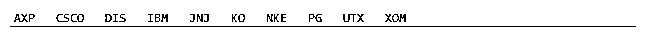
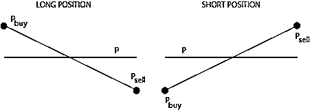
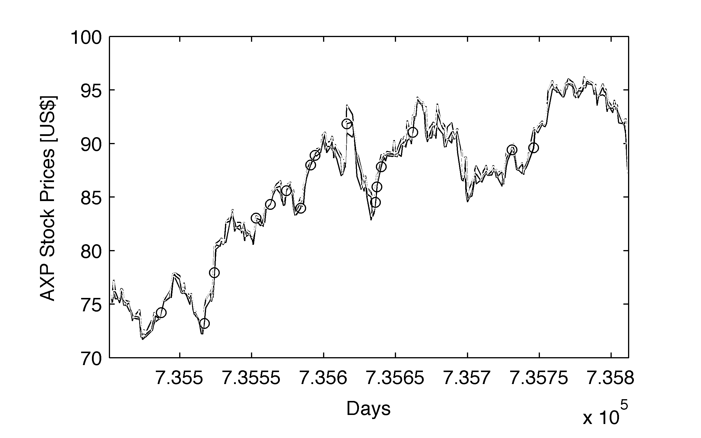
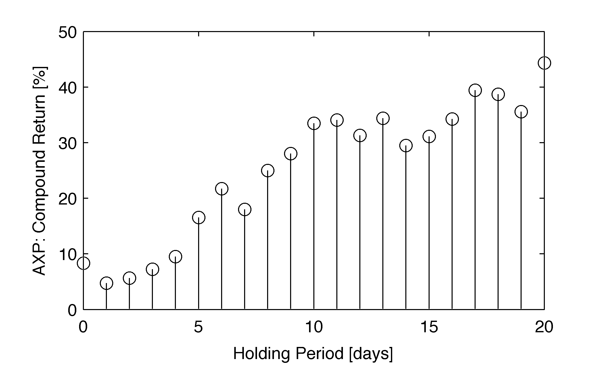
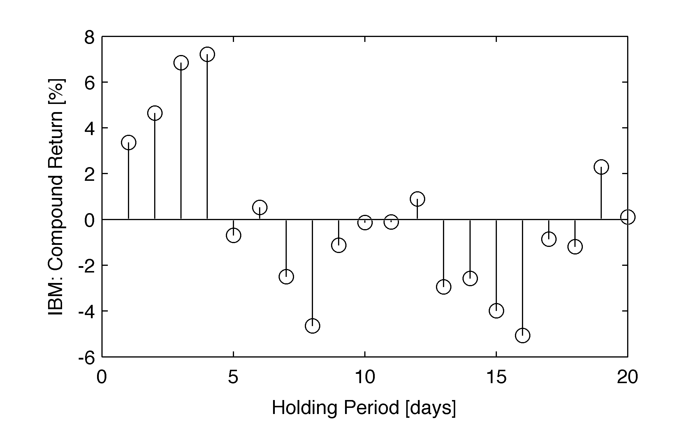
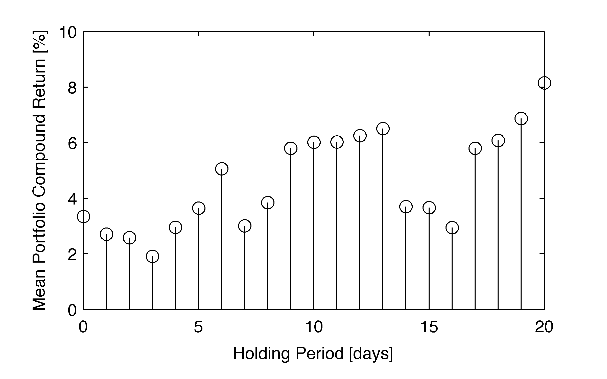

# 寻找最优持仓期的开盘缺口盈利交易策略基于 Matlab

> 原文：[`mp.weixin.qq.com/s?__biz=MzAxNTc0Mjg0Mg==&mid=2653284991&idx=1&sn=d1a2ef1f6ba242b36771735b9581bba6&chksm=802e286ab759a17c568bcfd6a34149c308842c19f7c83d705a9ea6f3dbc5684c8d18a55d3db3&scene=27#wechat_redirect`](http://mp.weixin.qq.com/s?__biz=MzAxNTc0Mjg0Mg==&mid=2653284991&idx=1&sn=d1a2ef1f6ba242b36771735b9581bba6&chksm=802e286ab759a17c568bcfd6a34149c308842c19f7c83d705a9ea6f3dbc5684c8d18a55d3db3&scene=27#wechat_redirect)


**编辑部**

微信公众号

**关键字**全网搜索最新排名

**『量化投资』：排名第一**

**『量       化』：排名第一**

**『机器学习』：排名第四**

我们会再接再厉

成为全网**优质的**金融、技术类公众号

翻译整理

Watermelon

**前言**

很多投资者经常讨论股价的预测，基本面的消息等等。当我们在说这些的时候，其实，这些（我把它们归结为算法）算法的核心就是触发识别并采取适当的措施：短线或者长线。但是我们想在这两种情况下都赚钱。

今天编辑部为大家带来一个交易策略，将触发因素作为开仓交易策略的初始条件，在下一个交易日开盘的股票投入资金。目标是找到最有利的持仓期。

**投资组合**

该策略可以使用任何 NN 资产组合进行回溯测试。 为了简单起见，我们使用 10 个股票的随机子集作为当前道琼斯指数的一部分：



我们从 Google 财经数据提供商获取股票价格

```py
clear all; close all; clc;
fname=['portfolio.lst'];  parm1=1;  
ndays=parm1*365;
lday=datenum('2014-08-05');  [Top,Thp,Tlp,Tcp,N,ntdays]=FetchQuandl(fname,ndays,lday);
```

我们使用 FetchQuandl 的预先设计的功能来导入每个股票的开（Top），高（Thp），低（Tlp）和收（Tcp）：

```py
function [Top,Thp,Tlp,Tcp,N,ntdays]=FetchQuandl(fname,ndays,lday)
    fileID = fopen(fname);
    tmp = textscan(fileID,'%s');
    fclose(fileID);
    components=tmp{1}; 

    [~,text,~] = xlsread('QuandlStockCodeListUS.xlsx');
    quandlc=text(:,1);    
    quandlcode=text(:,3); 

    date2=datestr(lday,'yyyy-mm-dd');       
    date1=datestr(lday-ndays,'yyyy-mm-dd'); 

    Rop={}; Tcp={};    
    for i=1:length(components)        
        for j=1:length(quandlc)            
            if(strcmp(components{i},quandlc{j}))
                fprintf('%4.0f %s\n',i,quandlc{j});
                fts=0;                
                [fts,headers]=Quandl.get(quandlcode{j},'type','fints', ...                              
                'authcode','PutHereYourQuandlCode',...                              
                'start_date',date1,'end_date',date2);
                cp=fts2mat(fts.Close,1); Tcp{i}=cp; % close
                op=fts2mat(fts.Open,1);  Top{i}=op; % open 
                hp=fts2mat(fts.High,1);  Thp{i}=hp; % high 
                lp=fts2mat(fts.Low,1);   Tlp{i}=lp; % low 
            end
        end
    end
    N=length(components);
    ntdays=length(Tcp{1});
end
```

反向测试应该在时间上向后延伸多少天。

**交易模型**

即如果第 t 日的股票开盘价高于第 t-1 日的收盘价，而第 t 日的最低价格高于第 t-1 日的最高价时，进行买入操作。在第二天以其市场价格（收盘价）买入该股票。 这种方法应该有效地消除了滑点偏差。



现在，对每个股票和每个交易进行反向测试。 我们选择第二个参数（parm2）为天数，即我们持有股票多久。 在以下代码中，让我们允许在 1 到 21 个日历日之后（±周末或公众假期时间段）卖出股票：

```py
results=[];
for parm2=0:20
    cR=[];    
    for i=1:N        
        if(i==1)            
            % open (blue color)
            plot(Top{i}(:,1),Top{i}(:,2),'')
            hold on           
            % close (red color)
            plot(Tcp{i}(:,1),Tcp{i}(:,2),'r')
            hold on            
            % high (green color)
            plot(Thp{i}(:,1),Thp{i}(:,2),'g')            
            xlabel('Days');
            ylabel('AXP Stock Prices [US$]');        
         end

        Tbuy=[];        
        for t=2:ntdays            
            ind1=Tcp{i}(t-1,2);  % cp on (t-1)day
            ind2=Thp{i}(t-1,2);  % hp on (t-1)day
            ind3=Top{i}(t,2);    % op on (t)day
            ind4=Tlp{i}(t,2);    % lp on (t)day
            if(ind1<ind3)&&(ind2<ind4)                
                if(i==1)
                    hold on;
                    plot(Top{i}(t,1),Top{i}(t,2),'o');                
                end
                tday=Top{i}(t,1);
                nextbusdate=busdate(tday,1); 
                Tbuy=[Tbuy; nextbusdate];            
            end
        end
        Tsell=busdate(Tbuy+parm2,1);
```

**Tbuy、Tsell**储存时间信息，现在我们将用它来检查交易的开盘价格，并为每个股票赚取利润和损失： 

```py
 R=[];
        for k=1:length(Tbuy)            
            j=find(Tbuy(k)==Tcp{i}(:,1));
            pbuy=Tcp{i}(j,2);            
            j=find(Tsell(k)==Tcp{i}(:,1));
            psell=Tcp{i}(j,2);
            ret=(psell/pbuy-1); 
            R=[R; ret];       
        end

         compR=prod(R+1)-1;  
         cR=[cR; compR];   
     end
     results=[results cR];
 end
```

例如，对于我们的投资组合中的股票 i = 1（AXP），代码显示 1 年期价格系列：



满足我们触发条件的日期已经用露点标记表示。

```py
figure(2)
stem((0:20),100*results)
xlabel('Holding Period [days]');
ylabel('AXP: Compound Return [%]');
```



该图表显示，对于 AXP，在过去 251 天（自 2014 年 8 月/ 4 日以后），我们有 16 个触发因素，因此有 16 次交易，令人惊讶的是，不管持有期间，所有封闭交易的复合回报是有利可图的。

如果我们考虑例如 i = 4，IBM 股票：



这个结果表明，对于不同的持有期（不同的股票），应该采用某些额外的交易指标来限制损失（如利润目标）。

如果我们使用 gap-on-open 模型交易了整个投资组合，我们将得到非常令人鼓舞的结果：



在每个持有期间，显示平均超过 10 个股票复合回报。 考虑到 2013 年 8 月至 2014 年 8 月期间美国股票市场的全球上涨趋势，该策略值得考虑，随时进行任何进一步修改（例如考虑短期或短期或短期触发，FX 时间序列等）都是可以值得一试。

**投稿、商业合作**

**请发邮件到：lhtzjqxx@163.com**

**关注者**

**从****1 到 10000+**

**我们每天都在进步**

听说，置顶关注我们的人都不一般


****