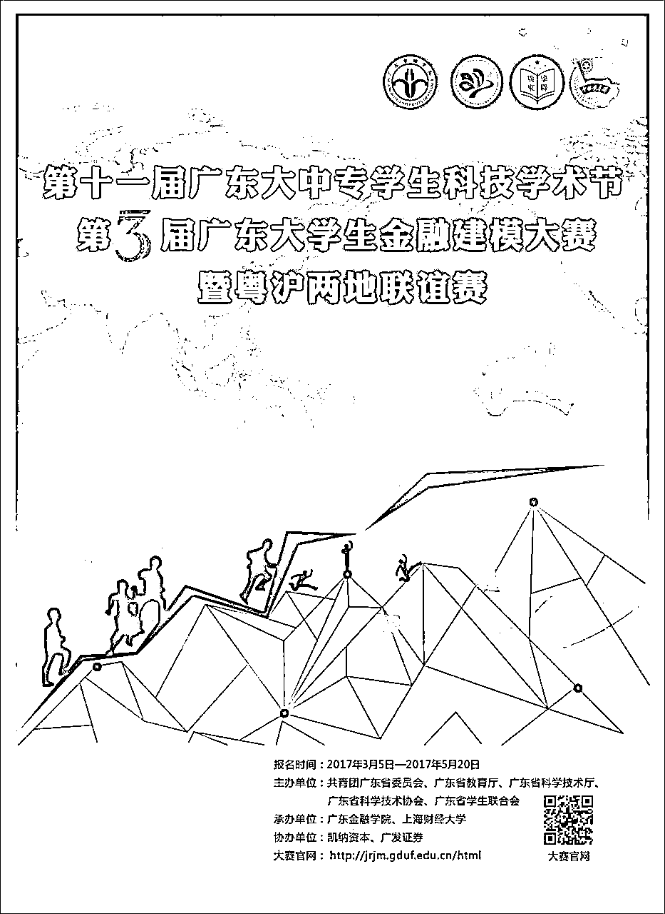

# 十、万奖金等你拿！为母校争光！这个必须广而告之！

> 原文：[`mp.weixin.qq.com/s?__biz=MzAxNTc0Mjg0Mg==&mid=2653284982&idx=1&sn=808f9c7df8b25ebc2d14e7da9765ffd4&chksm=802e2863b759a17521515baa494def6d2d52cda0bbbb2a1ad3f0480f0f766648859bf5f2d924&scene=27#wechat_redirect`](http://mp.weixin.qq.com/s?__biz=MzAxNTc0Mjg0Mg==&mid=2653284982&idx=1&sn=808f9c7df8b25ebc2d14e7da9765ffd4&chksm=802e2863b759a17521515baa494def6d2d52cda0bbbb2a1ad3f0480f0f766648859bf5f2d924&scene=27#wechat_redirect)

**编辑部**

微信公众号

**关键字**全网搜索最新排名

**『量化投资』：排名第一**

**『量       化』：排名第一**

**『机器学习』：排名第四**

我们会再接再厉

成为全网**优质的**金融、技术技类公众号

编辑部负责人作为

这次比赛承办学校的校友

责无旁贷

没得商量

要推这条新闻啊

（传送门：阅读原文）

你是否想过

成为笑傲江湖的侠客

千里仗剑，驰骋金融沙场

你是否愿意

头脑风暴

博得市场的高额回报

**金融建模，似乎高深莫测**

**却充满无尽诱惑和魅力**

十一届科技学术节

第三届金融建模大赛

就要拉开帷幕

百花争春，群芳斗艳

期待你

枝头独绽

赛事背景

随着金融全球化的快速发展，亟待高层次、应用型、国际化金融人才，以适应市场经济要求和国际竞争需要。3 月 25 日，由广东省团委主办，广东金融学院、上海财经大学联合举办，凯纳资本、广发证券协办的第十一届广东大中专科技学术节——第三届高校金融建模大赛在穗沪两地正式拉开序幕，两省市首度携手，本着以赛促学，践行“笃学致用、崇尚科学、服务社会”的宗旨，通过高校间的金融教育交流合作，共同促进两地大学生科技文化交流与融合。本次金融建模大赛，以金融研究领域热点问题、金融行业现实问题命题，聚焦社会需求，采用理论结合实际的竞赛形式，充分延展教育功效，为学生提供一个展现自己才华和能力的平台，也为全方位、高素质金融创新人才培养发挥积极的作用。

♥

**心动了不如行动！**

**快快带上小伙伴们报名加入吧！**

**大奖等你来战哦！**  

比赛内容

利用 2007—2013 的股票市场数据，做出能在股票市场盈利的量化对冲策略。要求参赛模型侧重量化方法的多样性与创新性，兼顾年化收益率、最大回撤、夏普比率、胜率、品种通用性等指标。参赛者最终提交论文、模型测试报告、量化模型的源码（Python 编写）和收益率曲线变化图。详情请关注官网（http://jrjm.gduf.edu.cn/html）。

比赛流程

01

**报名阶段：**2017 年 3 月 5 日—5 月 20 日

学生可以通过大赛官网 http://jrjm.gduf.edu.cn/html 对大赛规则详细了解，在线填写报名表及诚信承诺书；

02

**初赛阶段：**2017 年 3 月 5 日—6 月 18 日

与报名同期举行，本阶段将公布赛题及指定建模数据及提交作品的具体要求，参赛者须在规定截止时间内上传作品文档及策略模型，以压缩文件在线上传参赛作品；

03

**决赛答辩及颁奖：**2017 年 6 月 25 日

参加决赛的团队将汇聚广东金融学院、上海财经大学现场答辩，决出大赛的最终结果及现场颁发奖金。

奖项设置

获奖证书由**共青团广东省委员会、广东省教育厅、广东省科学技术厅、广东省科学技术协会、广东省学生联合会**共同颁发。

奖金总额 10 万元，  一等奖、二等奖获得者均可得到知名企业的面试机会，面试通过，可获得相应的实习及工作机会。

报名须知

**01/报名时间**

2017 年 3 月 5 日—5 月 20 日

**02/报名条件**

面向本科院校在校学生，不限专业、不限年级、不限学历。自愿报名参赛，无需缴纳参赛费。学生可以个人或团队组队参加竞赛，每队人数不超过 3 人（须属于同一所学校，跨校组队证书以队长为准）。组织方对参赛选手的年级和专业不做具体限制，大专、本科、硕士、博士均可报名参加。

**03/比赛时间**

2017 年 3 月 5 日—6 月 18 日

参赛注意事项

1.学生可以个人和团队组队参加竞赛，每队人数不超过 3 人（必须属于同一所学校）。组织方对参赛选手的年级和专业不做具体限制。

2.本次竞赛采取网上报名的方式，请通过大赛唯一官方网站填写报名表。

3.赛题在大赛期间在网站上公布，不邮寄书面题目。

4.参赛选手应阅读《广东省高校金融建模大赛章程》，严格按大赛章程参赛。

5.大赛所有信息均以大赛官网（http://jrjm.gduf.edu.cn/html）发布为准。

**投稿、商业合作**

**请发邮件到：lhtzjqxx@163.com**

**关注者**

**从****1 到 10000+**

**我们每天都在进步**

听说，置顶关注我们的人都不一般

****