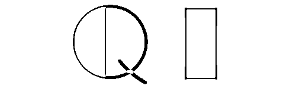
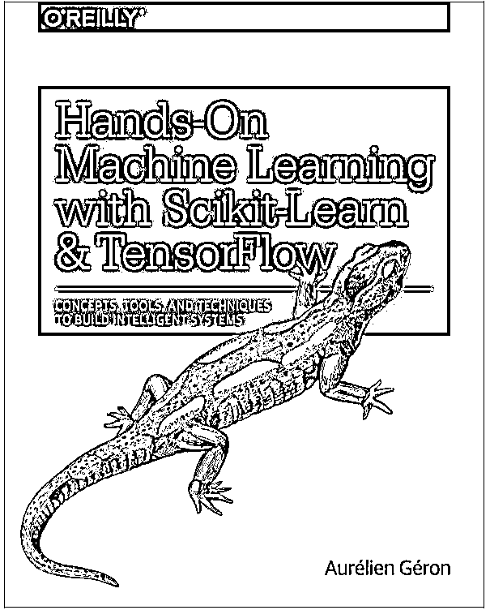
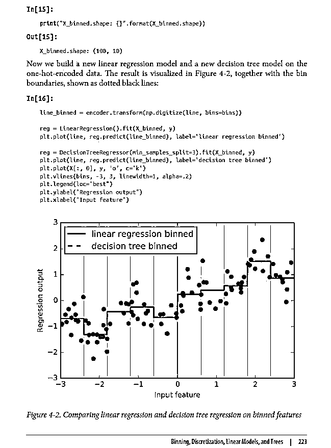
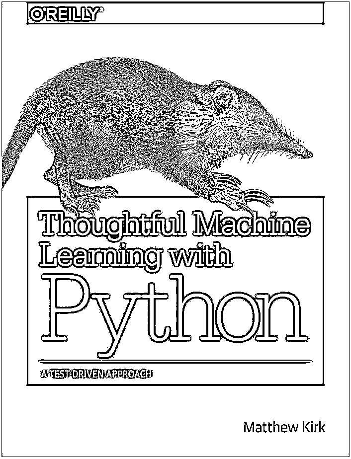
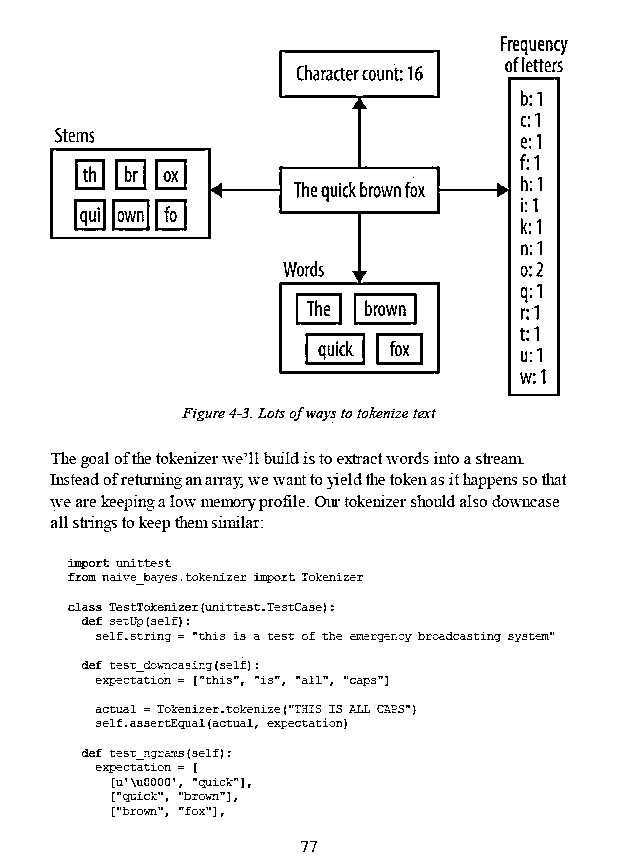
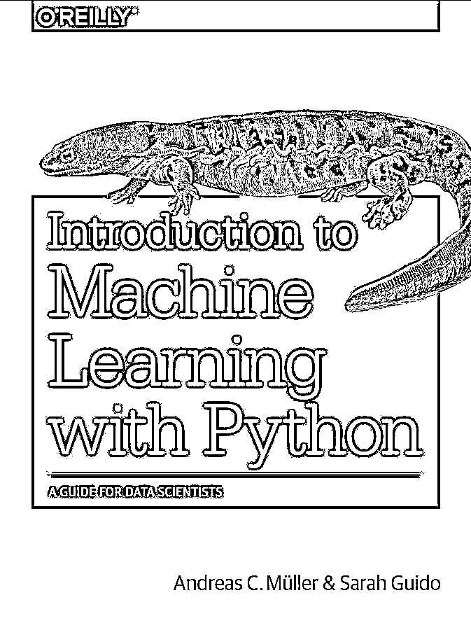
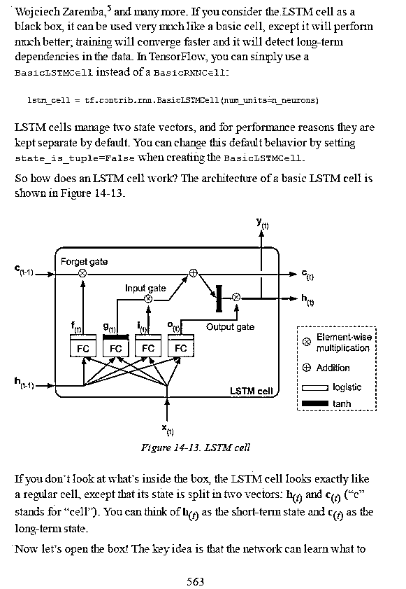
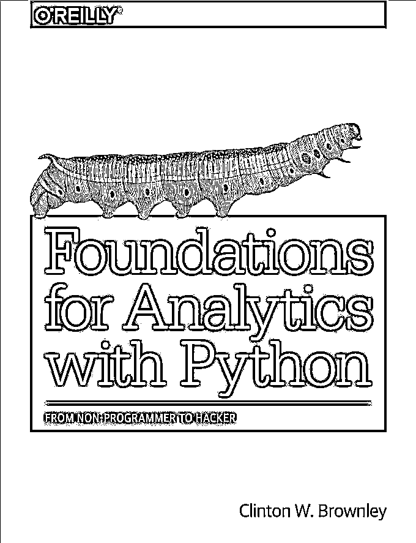
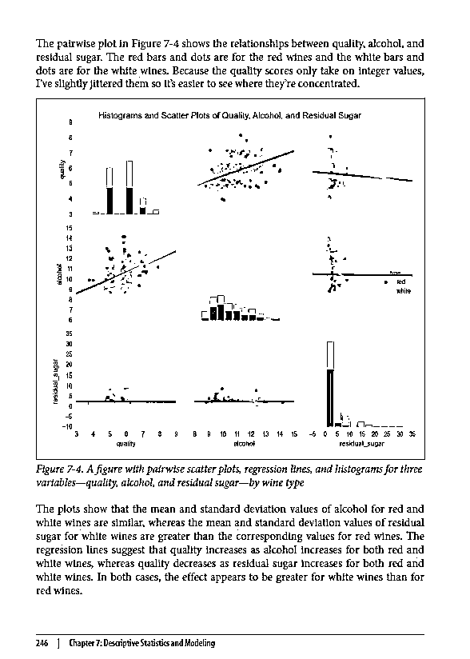
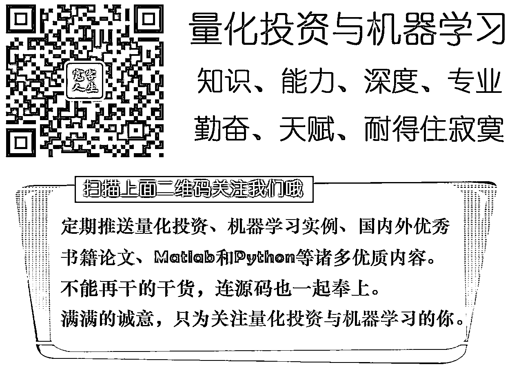

# 最新国外机器学习书籍推荐，可直接以获取电子版哦！

> 原文：[`mp.weixin.qq.com/s?__biz=MzAxNTc0Mjg0Mg==&mid=2653284979&idx=1&sn=ab5c74f1ab19496297398b4c1ff42a15&chksm=802e2866b759a170cbfa4039aa2aa9ca17a9757efee4c2202eccede256ed7ca2f7004eaafee3&scene=27#wechat_redirect`](http://mp.weixin.qq.com/s?__biz=MzAxNTc0Mjg0Mg==&mid=2653284979&idx=1&sn=ab5c74f1ab19496297398b4c1ff42a15&chksm=802e2866b759a170cbfa4039aa2aa9ca17a9757efee4c2202eccede256ed7ca2f7004eaafee3&scene=27#wechat_redirect)

**编辑部**

微信公众号

**关键字**全网搜索最新排名

**『量化投资』：排名第一**

**『量       化』：排名第一**

**『机器学习』：排名第四**

我们会再接再厉

成为全网**优质的**金融、技术技类公众号

有些人不知道**后台回复**如何操作

为大家介绍一下：

我们始终坚持

**不让大家像别的公众号一样**

通过朋友圈和微信群转发来获取干货

**分享就是分享**

**就应该做到无偿**

因为知识是属于共享的

我们只不过做了

搬运工

**获取文章链接在文末**

**01**book**第一本** 

Through a series of recent breakthroughs, deep learning has boosted the entire field of machine learning. Now, even programmers who know close to nothing about this technology can use simple, efficient tools to implement programs capable of learning from data. This practical book shows you how.

By using concrete examples, minimal theory, and two production-ready Python frameworks—scikit-learn and TensorFlow—author Aurélien Géron helps you gain an intuitive understanding of the concepts and tools for building intelligent systems. You’ll learn a range of techniques, starting with simple linear regression and progressing to deep neural networks. With exercises in each chapter to help you apply what you’ve learned, all you need is programming experience to get started.

*   Explore the machine learning landscape, particularly neural nets

*   Use scikit-learn to track an example machine-learning project end-to-end

*   Explore several training models, including support vector machines, decision trees, random forests, and ensemble methods

*   Use the TensorFlow library to build and train neural nets

*   Dive into neural net architectures, including convolutional nets, recurrent nets, and deep reinforcement learning

*   Learn techniques for training and scaling deep neural nets

*   Apply practical code examples without acquiring excessive machine learning theory or algorithm details

**样章**

 **02**book**第二本** 

Gain the confidence you need to apply machine learning in your daily work. With this practical guide, author Matthew Kirk shows you how to integrate and test machine learning algorithms in your code, without the academic subtext.

Featuring graphs and highlighted code examples throughout, the book features tests with Python’s Numpy, Pandas, Scikit-Learn, and SciPy data science libraries. If you’re a software engineer or business analyst interested in data science, this book will help you:

*   Reference real-world examples to test each algorithm through engaging, hands-on exercises

*   Apply test-driven development (TDD) to write and run tests before you start coding

*   Explore techniques for improving your machine-learning models with data extraction and feature development

*   Watch out for the risks of machine learning, such as underfitting or overfitting data

*   Work with K-Nearest Neighbors, neural networks, clustering, and other algorithms

**样章**

 **03**book**第三本** 

Machine learning has become an integral part of many commercial applications and research projects, but this field is not exclusive to large companies with extensive research teams. If you use Python, even as a beginner, this book will teach you practical ways to build your own machine learning solutions. With all the data available today, machine learning applications are limited only by your imagination.

You’ll learn the steps necessary to create a successful machine-learning application with Python and the scikit-learn library. Authors Andreas Müller and Sarah Guido focus on the practical aspects of using machine learning algorithms, rather than the math behind them. Familiarity with the NumPy and matplotlib libraries will help you get even more from this book.

With this book, you’ll learn:

*   Fundamental concepts and applications of machine learning

*   Advantages and shortcomings of widely used machine learning algorithms

*   How to represent data processed by machine learning, including which data aspects to focus on

*   Advanced methods for model evaluation and parameter tuning

*   The concept of pipelines for chaining models and encapsulating your workflow

*   Methods for working with text data, including text-specific processing techniques

*   Suggestions for improving your machine learning and data science skills

**样章**

 **04**book**第四本** 

if you’re like many of Excel’s 750 million users, you want to do more with your data—like repeating similar analyses over hundreds of files, or combining data in many files for analysis at one time. This practical guide shows ambitious non-programmers how to automate and scale the processing and analysis of data in different formats—by using Python.

After author Clinton Brownley takes you through Python basics, you’ll be able to write simple scripts for processing data in spreadsheets as well as databases. You’ll also learn how to use several Python modules for parsing files, grouping data, and producing statistics. No programming experience is necessary.

*   Create and run your own Python scripts by learning basic syntax

*   Use Python’s csv module to read and parse CSV files

*   Read multiple Excel worksheets and workbooks with the xlrd module

*   Perform database operations in MySQL or with the mysqlclient module

*   Create Python applications to find specific records, group data, and parse text files

*   Build statistical graphs and plots with matplotlib, pandas, ggplot, and seaborn

*   Produce summary statistics, and estimate regression and classification models

*   Schedule your scripts to run automatically in both Windows and Mac environments

**样章**

 

**投稿、商业合作**

**请发邮件到：lhtzjqxx@163.com**

**关注者**

**从****1 到 10000+**

**我们每天都在进步**

听说，置顶关注我们的人都不一般

**** 

后台回复

**3 月书籍（是 3 不是三哦）**

即可获取