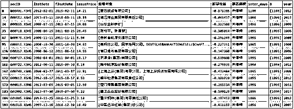

# 从定增对象角度看解禁收益 | Python

> 原文：[`mp.weixin.qq.com/s?__biz=MzAxNTc0Mjg0Mg==&mid=2653284968&idx=1&sn=8acd0523beaf14fc154212a472c0ddd1&chksm=802e287db759a16bc101deb1cf9ed38f7125901aee42f7a1c23ed74b46ca14bbeb22d2978368&scene=27#wechat_redirect`](http://mp.weixin.qq.com/s?__biz=MzAxNTc0Mjg0Mg==&mid=2653284968&idx=1&sn=8acd0523beaf14fc154212a472c0ddd1&chksm=802e287db759a16bc101deb1cf9ed38f7125901aee42f7a1c23ed74b46ca14bbeb22d2978368&scene=27#wechat_redirect)

**编辑部**

微信公众号

**关键字**全网搜索最新排名

**『量化投资』：排名第一**

**『量       化』：排名第一**

**『机器学习』：排名第四**

我们会再接再厉

成为全网**优质的**金融、技术技类公众号

## **摘要**

本文从不同定增对象的角度，来看最后的解禁收益，得出了一些有用的结论。发行股份收购资产的发行价是股价的强支撑，并购优质资产通常可以使得股价大幅上升；单独定增给大股东的发行价也是股价的强支撑，但要特别**注意周期性行业，若行业处于衰退期，一定要规避。**

本文不纠结于定增预案、股东大会通过、证监会审核等等时间点开始是否有超额收益，因为现实定增方案是有概率通不过的，定增方案也会存在反复修改等等情况。以今天的角度分析很容易用到未来数据并且这些时间点是可预期的，很难说明收益就是这些时间点的影响。此文我们着重于看定增方在解禁时的收益情况，以及不同定增对象的收益是否有所不同，以此来把握是否值得提前埋伏有增发预期的股票、以及股票在限售期内的投资机会。

## 定增的几种情况

*   1.定增给资管机构等战略投资者，至少 12 个月的限售期。

*   2.定增给大股东，36 个月的限售期。

*   3.定增股份收购资产与定增获取配套资金。被收购公司的原股东至少要有 12 个月的限售期，并且通常会签订与经营业绩挂钩的分批解禁等协议。这里还可以分为，定增给控股子公司少数股东，而达到全资控股；外延定增，主营业务变更，构成借壳上市；外延定增，主营业务变更，但公司实际控制人未变更，不构成借壳上市，构成重大资产重组；外延定增，主营业务未变，未构成重大资产重组。定增股份收购资产的发行价通常低于定增获取配套资金的价格。

*   4.创业板原规则：若发行价格不低于发行期首日前一个交易日公司股票均价的，发行股份自发行结束之日起可上市交易，既无限售期。

因为数据本身没有对这个进行一些分类,下文我依据定增的限售期做一个大致的分类。

这里首先我们对所有定增的解禁日的收益率做一个计算（调用了 data_infer 和 normalize_event）。

不同定增对象占用了一行，使得数据看起来比较冗余，依据同一只股票、同一上市日期、同一解禁日期、同一发行价格进行分组，将数据转化，如下所示。

如上我们便得到了每一次的定增的不同解禁日或不同定增价格的定增对象列表，并计算出上市日与解禁日相隔的天数，依据上述列表进行进一步分析会比较方便。

## **看存在分批解禁的情况**

这种情况通常是增发股份购买资产,被购买的公司做出与股份解禁挂钩的业绩承诺。

从上述结果可以看出，发行股份收购资产成功之后，股价相对定增价基本都是上涨的，被收购方的原股东和上市公司股东都能享受到股价上涨来的收益。当然统计数据大部分定增都发生在 13,14 牛市前期，经历了一个牛市。但 15 年 9 月份后解禁的样本点是大部分，此时指数的点位也就和现在差不多。而发行股份收购资产的收益却可以很大大，更进一步去交易所查阅一些这些资产收购的案例，可以很明显的发现，收购越优质、越有想象力的公司，股价上涨的往往更多。

这里展示的结果亏损的案例，其中 002225(濮耐股份)、002392(北京利尔)是做耐火材料的，收购的资产也是相关的产业。由于近几年行业的不景气，导致了破发。而 300169(天晟新材)是做新材料的收购的资产是做环保材料的，也是最近经营业绩一般，但需要注意的是在定增解禁当天，股票其实是停牌的，其复牌之后有多天的涨停，所以其实解禁还是赚了的。

## **仅有 36 个月解禁期的定增**

这种情况，通常是定增给大股东以及其关联方。

可以看出定增给大股东的成功率还是很高的，基本都能赚钱，这也比较容易理解，毕竟大股东对公司是知根知底的。粗略看一眼，亏损的案例，基本上都是钢铁、能源、港口等周期性行业，除 000718(苏宁环球)之外基本都是大国企。周期难逆，大股东也会有看错行业的前景而盲目扩大再生产的时候。

## **所有定增解禁的情况**

可以看出相比与之前描述的两个情况，总体来说定增的收益情况要差一些，但解禁赚钱的概率还是非常高的。可以看出存在 17 年的数据，这是因为创业板之前的规定市价发行无限售期，现在已经堵住了这个制度漏洞，具体为什么算是制度漏洞，可以自行去搜索案例。

虽然定增赚钱的概率非常高，但通常情况是，我们在知道了定增之后，大概率是没法以定增的价格买到这只股票的。所以怎么办呢，对行业和公司的研究就很重要了，什么样的公司更有动机去发行股份收购资产、非公开发行股票融资投资项目，这个是值得进一步去研究的。

**投稿、商业合作**

**请发邮件到：lhtzjqxx@163.com**

**关注者**

**从****1 到 10000+**

**我们每天都在进步**

听说，置顶关注我们的人都不一般

****