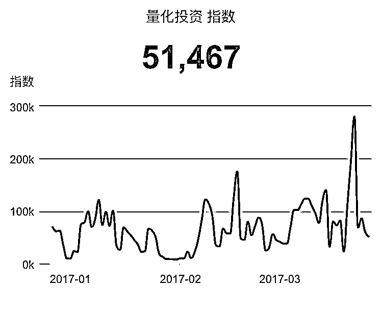
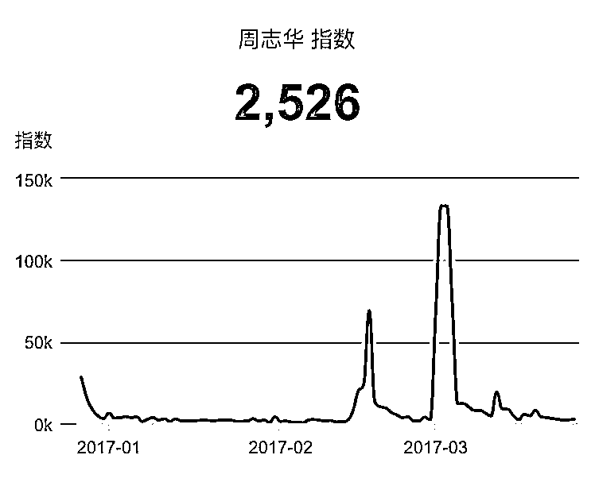

# 全方位分析 | 量化投资界的微信指数

> 原文：[`mp.weixin.qq.com/s?__biz=MzAxNTc0Mjg0Mg==&mid=2653284965&idx=1&sn=9de612f31f4505dbaa53e33c6be6e626&chksm=802e2870b759a166d81ebb33e1e27bf5b357fd0b9255d4ef5931864255c9cd24178dae600d28&scene=27#wechat_redirect`](http://mp.weixin.qq.com/s?__biz=MzAxNTc0Mjg0Mg==&mid=2653284965&idx=1&sn=9de612f31f4505dbaa53e33c6be6e626&chksm=802e2870b759a166d81ebb33e1e27bf5b357fd0b9255d4ef5931864255c9cd24178dae600d28&scene=27#wechat_redirect)

**编辑部**

微信公众号

**关键字**全网搜索最新排名

**『量化投资』：排名第一**

**『量       化』：排名第一**

**『机器学习』：排名第四**

我们会再接再厉

成为全网**优质的**金融、技术类公众号

**微信**WeChat**微信指数**

2017 年 3 月 23 日晚，微信官方推出了“微信指数”功能，微信指数是微信官方基于微信大数据分析的移动端指数。微信指数整合了微信上的搜索和浏览行为数据，基于对海量数据的分析。因此，编辑部今日推出此期推文，来直观分析，量化投资界的微信指数！

**所有数据以 90 日为准**

**量化相关关键词**

> 可能量化比较宽泛，我们进一步搜索。

> 我们可以看到，量化投资在每日的搜索量还是比较活跃，尤其最近一段时间有上升态势，是不是因为机器学习出来以后对量化有一些影响呢？我们进一步查看。

> 我们看到，机器学习从指数的起点上比量化高一些，在近日也是有猛增的态势，说明机器学习现在很火，量化投资在机器学习上的应用有崭露头角的态势。

> 我们分析完机器学习，再看看深度学习，虽然走势基本呈现震荡态势，但是指数起点高，在 2 月下旬达到峰值，再看看机器学习也是如此，说明两者有紧密联系。话又说回来，虽然深度学习在量化投资中的应用目前较少，但是随着深度学习越来越成熟，相信在这个方面一定会有大的进展！

金**融产品关键词**

> 股票是众望所归啊，搜索量惊人，这个想必不用解释，大家都懂得！

> 相比股票来说，债券就显得很没面子。不过，这个大家也懂啦！

> 基金的搜索量超过了股票，直接从 5M 起步，看来大家对理财、投资还是很热衷啊，当然基金的衍生词汇很多，这里只是一个关键字的综合统计，但是不管怎么说，民众对于基金的搜索查过股票，这是事实，哈哈哈！

> 期货比债券好一点

> 再来看看商品期货，走势很均衡，但是商品期货也是一股很强的力量。必须重视啊！

> 在中国，期权由于很多原因。没有成为主流，所以你懂得。

> 最近由于商品期权的发布，有点起色，但是任重而道远啊。

**金融词汇关键词**

> 金融工程的搜索量还是可以的，说明大家对这块的兴趣比较高。

> 其次是程序化交易，这个专业性比较强，但是可以了可以了，能去搜索的人说明还是想学，想了解的。

> 算法交易也是不错的投资策略，所以我们也进行了搜索，发现走势一阵一阵的。说明大家对这方面可能不是有很多热情去通过微信了解。

> 这本来是一个很好很稳的策略，但是也是寥寥无几，所以，小编就忍了。哈哈哈。

**量化平台关键词**

> 这个就贴出来给大家看看，小编不做评论，免得伤了大家的和气哈！（小编为了全面，每家公司的中英文都搜索了。）

**券商关键词**

> 小编把在金融工程领域表现比较突出的几家券商，进行了搜索。大家去评判就好，这个锅就不背了。

**人物关键词**

> 不管怎么说，丁博是中国量化投资界的启蒙导师，他出的书不管内容好与坏，我们不去评论，但是这种引导力，这种精神，应该值得称赞。也希望，丁博在以后会有更好的书籍。

> 搞机器学习的！必须知道李航啊！这个必须啊！从搜索数字上就能说明问题，不必多说。好好把那本书看完就是对的起李教授。

> 西瓜书，自从一出版，火得一塌糊涂，设计美观，印刷没得说，内容详实丰富，把机器学习讲的很是全面。良心啊！！！

> 从数据上来看，可能因为吴恩达离开百度的事情让整个曲线看起来很突兀，但是这说明，吴恩达的影响力和地位啊。杠杠的！

**编程语言关键词**

> 这个统计结果没毛病！稳妥！主流！

> 这个也没毛病，看大家喜好。

> 这个也没毛病，看大家喜好

**投稿、商业合作**

**请发邮件到：lhtzjqxx@163.com**

**关注者**

**从****1 到 10000+**

**我们每天都在进步**

听说，置顶关注我们的人都不一般

****