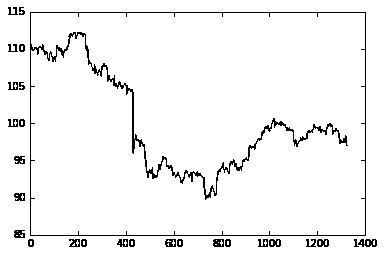
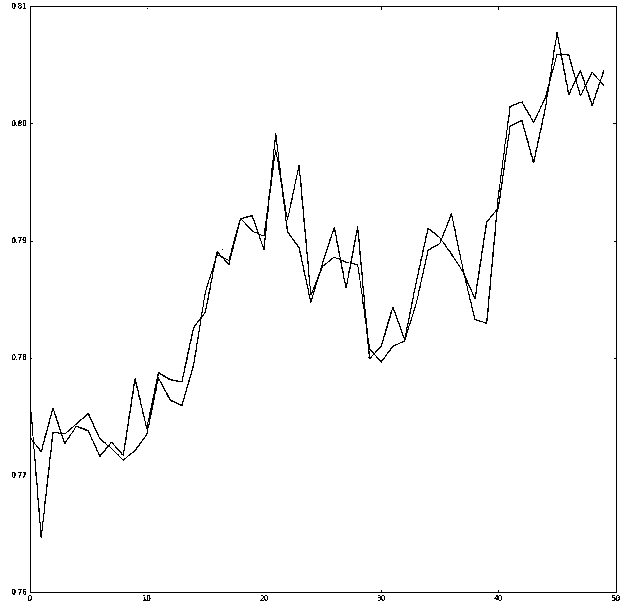
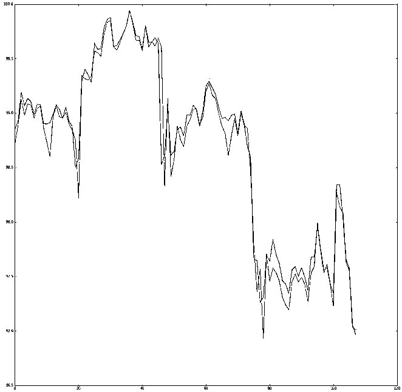
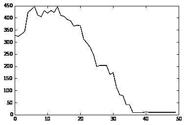
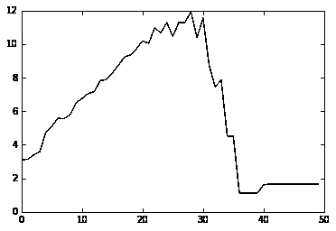
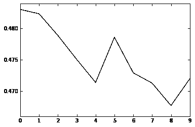
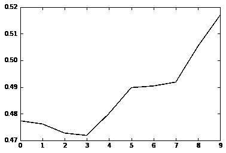
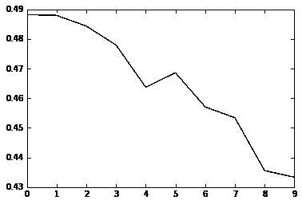

# 【深度学习量化投资】RNNs 在股票价格预测的应用基于 Keras

> 原文：[`mp.weixin.qq.com/s?__biz=MzAxNTc0Mjg0Mg==&mid=2653284925&idx=1&sn=97822360217b50ee3d2f74353753f62c&chksm=802e2828b759a13ee3090c9b14954fccbc008ea81938b14445ebbcd6ac71737c6ce94da643f4&scene=27#wechat_redirect`](http://mp.weixin.qq.com/s?__biz=MzAxNTc0Mjg0Mg==&mid=2653284925&idx=1&sn=97822360217b50ee3d2f74353753f62c&chksm=802e2828b759a13ee3090c9b14954fccbc008ea81938b14445ebbcd6ac71737c6ce94da643f4&scene=27#wechat_redirect)


**编辑部**

微信公众号

**关键字**全网搜索最新排名

**『量化投资』：排名第一**

**『量       化』：排名第一**

**『机器学习』：排名第四**

我们会再接再厉

成为全网**优质的**金融、技术类公众号

**VN.PY 量化实战网课**还有最后两天截止报名啦!

还没有报名的童鞋抓紧啦！

[**让我们一起打造自己专属的量化交易系统基于——VN.PY**](http://mp.weixin.qq.com/s?__biz=MzAxNTc0Mjg0Mg==&mid=2653284849&idx=2&sn=f3ccc0d752525c5d4dc511250db6ecfe&chksm=802e2be4b759a2f2fa56fc3c94e1d6e661480536f3eccb4ef1f6b0936993f003e84f77d42079&scene=21#wechat_redirect)

(点击红色字体即可报名)

**前言**

RNN 和 LSTMs 在时态数据上表现特别好，这就是为什么他们在语音识别上是有效的。我们通过前 25 天的开高收低价格，去预测下一时刻的前收盘价。每个时间序列通过一个高斯分布和 2 层 LSTM 模型训练数据。文章分为两个版块，外汇价格预测和每日盘中价格预测(30 分钟、15 分钟、5 分钟,等等)。**源代码请在文末获取！**

**外汇预测（用英语描述）**

**a.** Daily Data is pulled from Yahoo’s Data Reader

**b.** Only the training set is preprocessed because we create a separate test set later on

**c.** “model_forex” is the model for to build and train.

**d.** Create separate daily test set by specifying dates which start after your training set ends.

**e.** You can see “model_forex” is plugged in here for running the prediction

predicted_st = predict_standard(X_test_stock,y_test_stock, model_forex)

**盘中预测**（用英语描述）****

**a.** Intraday Data is pulled from Google’s API. The second argument is the time in seconds (900 secs = 15 mins) and the third argument it the number of days, the max backtrack day for Googles API is 15 days I believe.

df = get_google_data(INTRA_DAY_TICKER, 900, 150)

**b.** Preprocess the full set of data and train test split it with “train_test_split_intra”

**c.** “model_intra” is the model for to build and train.

**d.** You can see “model_intra” is plugged in here for running the prediction

predicted_intra = predict_intra(X_test_intra,y_test_intra, model_intra)

**代码展示**

```py
SITE = "http://en.wikipedia.org/wiki/List_of_S%26P_500_companies" def scrape_list(site):
    hdr = {'User-Agent': 'Mozilla/5.0'}
    req = urllib2.Request(site, headers=hdr)
    page = urllib2.urlopen(req)
    soup = BeautifulSoup(page)

    table = soup.find('table', {'class': 'wikitable sortable'})
    sector_tickers = dict()    for row in table.findAll('tr'):
        col = row.findAll('td')        if len(col) > 0:
            sector = str(col[3].string.strip()).lower().replace(' ', '_')
            ticker = str(col[0].string.strip())            if sector not in sector_tickers:
                sector_tickers[sector] = list()
            sector_tickers[sector].append(ticker)    return sector_tickers
sector_tickers = scrape_list(SITE)
##Help functions to normalize and denormalize values （省略）
```

```py
# Sequence Length, or # of days of tradingSEQ_LENGTH = 25 # Number of units in the two hidden (LSTM) layersN_HIDDEN = 256 #Number of attributes used for each trading daynum_attr = 4 #Out of those attribute how many are indicatorsnum_indicators = 0 #Variable to help define how far you want your y to reachREWARD_LAG = 1 #How many dats ahead do you want to predictLOOK_AHEAD = 5 #Window StrideSTRIDE = 1
```

```py
def _load_data(data, n_prev = SEQ_LENGTH):  
    docX, docY = [], []    for i in range(len(data)-n_prev):
        x,y = norm(data.iloc[i:i+n_prev,:num_attr].as_matrix(),data.iloc[i+n_prev-1,num_attr:].as_matrix())
        docX.append(x)
        docY.append(y)
    alsX = np.array(docX)
    alsY = np.array(docY)    return alsX, alsYdef _load_data_test(data, n_prev = SEQ_LENGTH):  
    docX, docY = [], []
    num_sequences = (len(data)-n_prev+1)/STRIDE    for i in range(num_sequences):
        i = i*STRIDE
        x = (data.iloc[i:i+n_prev,:num_attr].as_matrix())
        y = (data.iloc[i+n_prev-1,num_attr:].as_matrix())        #x,y = norm(data.iloc[i:i+n_prev,:num_attr].as_matrix(),data.iloc[i+n_prev-1,num_attr:].as_matrix())
        docX.append(x)
        docY.append(y)
    alsX = np.array(docX)
    alsY = np.array(docY)    return alsX, alsYdef _load_data_norm(data, n_prev = SEQ_LENGTH):  
    docX, docY = [], []    for i in range(len(data)-n_prev):
        x = np.array((data.iloc[i:i+n_prev,:num_attr].as_matrix()))
        y = np.array((data.iloc[i+n_prev-1,num_attr:].as_matrix()))
（省略）
```

**外汇数据**

```py
##Dataset on just single ticker to test performancesdf = data.DataReader('EUR=X', 'yahoo', datetime(2010,8,1), datetime(2014,8,1))
# df['RSI'] = ta.RSI(df.Close.values,timeperiod=14)# _,_, macdhist = ta.MACD(df.Close.values, fastperiod=12, slowperiod=26, signalperiod=9)# df['MACDHist'] = macdhist
##Add the predicted coloumn Y, as the last coloumn can be defined however you think is a good representation of a good decision 
##Clean the rest of the Data Frame y = []for i in range(0,len(df)):    if i >= (len(df)- STRIDE):
        y.append(None)    else:        if (REWARD_LAG > 1):
            val = 0
            for n in range(REWARD_LAG):
                val = val + df['Close'][i+n+1]
            val = val / float(REWARD_LAG)
            y.append(val)        else:
            y.append(df['Close'][i+REWARD_LAG])

df['Y_Values'] =np.asarray(y)
df = df.dropna()#print (df)sliced_df = df.drop(['Adj Close','Volume'] ,axis=1)#print (sliced_df)#(X_train, y_train), (X_test, y_test) = train_test_split(sliced_df)(X_train, y_train) = train_test_split(sliced_df)
print(X_train[0],y_train[0])print (X_train.shape,y_train.shape)
```

```py
(array([[-0.76244909, -0.75153814, -1.36800657, -1.28695383],
       [-1.28305706, -1.17005084, -1.66649887, -1.50673145],
```

（省略）

**盘中数据**

```py
def get_google_data(symbol, period, window):
    url_root = 'http://www.google.com/finance/getprices?i='
    url_root += str(period) + '&p=' + str(window)
    url_root += 'd&f=d,o,h,l,c,v&df=cpct&q=' + symbol
    print(url_root)
    response = urllib2.urlopen(url_root)
    data = response.read().split('\n')    #actual data starts at index = 7
    #first line contains full timestamp,
    #every other line is offset of period from timestamp
    parsed_data = []
    anchor_stamp = ''
    end = len(data)    for i in range(7, end):
        cdata = data[i].split(',')        if 'a' in cdata[0]:            #first one record anchor timestamp
            anchor_stamp = cdata[0].replace('a', '')
            cts = int(anchor_stamp)        else:            try:
                coffset = int(cdata[0])
                cts = int(anchor_stamp) + (coffset * period)
                parsed_data.append((dt.datetime.fromtimestamp(float(cts)), float(cdata[1]), float(cdata[2]), float(cdata[3]), float(cdata[4]), float(cdata[5])))            except:                pass # for time zone offsets thrown into data
    df = pd.DataFrame(parsed_data)
    df.columns = ['ts', 'Open', 'High', 'Low', 'Close', 'Volume']
    df.index = df.ts    del df['ts']    return df
```

**盘中创建单独的数据集**

```py
df = get_google_data('AAPL', 900, 150)#print(df)plt.plot(df['Close'].values[:])
y = []for i in range(0,len(df)):    if i >= (len(df)- REWARD_LAG):
        y.append(None)    else:        if (REWARD_LAG > 1):
            val = 0
            for n in range(REWARD_LAG):
                val = val + df['Close'][i+n+1]
            val = val / float(REWARD_LAG)
            y.append(val)
            print('here')        else:
            y.append(df['Close'][i+REWARD_LAG])

df['Y_Values'] =np.asarray(y)
df = df.dropna()
sliced_df = df.drop(['Volume'] ,axis=1)#print(sliced_df)(X_train, y_train), (X_test, y_test) = train_test_split_intra(sliced_df)#print(X_train[0],y_train[0])print(len(X_train),len(X_test))#print(X_test[0],y_test[0])
```

```py
(1168, 108)
```



**构建网络结构**

```py
model_intra = Sequential() 

model_intra.add(LSTM(N_HIDDEN, return_sequences=True, activation='tanh', input_shape=(SEQ_LENGTH, num_attr)))#model_intra.add(LSTM(N_HIDDEN, return_sequences=True, activation='tanh'))model_intra.add(LSTM(N_HIDDEN, return_sequences=False, activation='tanh'))

model_intra.add(Dense(1,activation='linear'))
model_intra.compile(loss="mean_squared_error", optimizer='adam')
model_intra_full = Sequential() 

model_intra_full.add(LSTM(N_HIDDEN, return_sequences=True, activation='tanh', input_shape=(SEQ_LENGTH, num_attr)))#model_intra_full.add(LSTM(N_HIDDEN, return_sequences=True, activation='tanh'))model_intra_full.add(LSTM(N_HIDDEN, return_sequences=False, activation='tanh'))

model_intra_full.add(Dense(1,activation='linear'))
model_intra_full.compile(loss="mean_squared_error", optimizer='adam')

model_forex = Sequential() 

model_forex.add(LSTM(N_HIDDEN, return_sequences=True, activation='tanh', input_shape=(SEQ_LENGTH, num_attr)))#model_forex.add(LSTM(N_HIDDEN, return_sequences=True, activation='tanh'))model_forex.add(LSTM(N_HIDDEN, return_sequences=False, activation='tanh'))

model_forex.add(Dense(1,activation='linear'))
model_forex.compile(loss="mean_squared_error", optimizer
```

**符合模型的模型和参数**

```py
print(X_train.shape)
print(y_train.shape)
```

```py
(1018, 25, 4)
(1018, 1)
```

```py
model_intra.fit(X_train, y_train, batch_size=50, nb_epoch=
```

```py
Train on 1156 samples, validate on 12 samples
Epoch 1/150
1156/1156 [==============================] - 1s - loss: 1.9575 - val_loss: 0.5494
Epoch 2/150
1156/1156 [==============================] - 1s - loss: 1.4731 - val_loss: 0.4006
```

（省略）

**辅助绩效评估功能**

```py
#Function to normalize the test input then denormalize the result. Calculate the rmse of the predicted values on the test setdef predict(X_test,y_test, myModel):
    predicted = []    for example in X_test:
        x = copy.copy(example)        #print (x)
        x_norm, mn, mx = normalize(x)
        toPred = []
        toPred.append(x_norm)
        add = np.array(toPred)        #Predict for the standard model
        predict_standard = myModel.predict(add)
        pred_st = copy.copy(predict_standard)
        y_real_st = deNormalizeY(pred_st,mn,mx)
        predicted.append(y_real_st[0])        #Predict for the bidirectional model#         predict_bidirectional = myModel.predict([add,add])#         pred_bi = copy.copy(predict_bidirectional)#         y_real_bi = deNormalizeY(pred_bi,mn,mx)#         predicted.append(y_real_bi[0])（省略）df_test = data.DataReader('EUR=X', 'yahoo', datetime(2014,8,1), datetime(2015,8,1))# df_test['RSI'] = ta.RSI(df_test.Close.values,timeperiod=14)# _,_, macdhist = ta.MACD(df_test.Close.values, fastperiod=12, slowperiod=26, signalperiod=9)# df_test['MACDHist'] = macdhisty = []for i in range(0,len(df_test)):    if i >= (len(df_test)- STRIDE):
```

```py
 y.append(None)    else:        if (REWARD_LAG > 1):
            val = 0
            for n in range(REWARD_LAG):
                val = val + df_test['Close'][i+n+1]
            val = val / float(REWARD_LAG)
            y.append(val)        else:
            y.append(df_test['Close'][i+REWARD_LAG])

（省略）
```



```py
MAE for LSTM is: [0.0035823152701196983]
MAE for doing nothing is: [0.0045693478326778786]
RMSE for LSTM is: [0.0050684837061917686]
RMSE for doing nothing is: [0.0061416562709802761]
Net profit for 0.0 threshhold is 245.261025777 making 234 trades
Net profit for 0.001 threshhold is 242.673572498 making 201 trades
（省略）
```

**盘中交易评价和结果**

```py
def predict_intra(X_test, y_test, myModel):
    print(len(X_test))
    predicted = []    for example in X_test:        #Transform the training example into gaussing distribution
        x_norm, mean, std = normDist(np.array(example))        #Add examples to array to predict
        toPred = []
        toPred.append(x_norm)
        add = np.array(toPred)        #Predict these examples
        predict_standard = myModel.predict(add)
        pred = copy.copy(predict_standard)
        y_real = deNormDist(pred,mean,std)
        predicted.append(y_real[0])    return predicted

predicted_intra = predict_intra(X_test,y_test, model_intra)
plt.figure(figsize=(20,20))
plt.plot(y_test) 
plt.plot(predicted_intra)
plt.show()
```



**MAE and RMSE 评估**

```py
sum_error = 0sum_error_donothing = 0for i in range(len(predicted_intra)):    if i>0:
        sum_error = sum_error + abs(predicted_intra[i] - y_test[i])
        sum_error_donothing = sum_error_donothing + abs(predicted_intra[i] - y_test[i-1])
MAE_lstm = sum_error/len(predicted_intra)
MAE_donothing = sum_error_donothing/len(predicted_intra)
print("MAE for LSTM is: " + str(MAE_lstm))
print("MAE for doing nothing is: " + str(MAE_donothing))
```

```py
MAE for LSTM is: [0.091961468484759237]
MAE for doing nothing is: [0.16699238882416201]
```

```py
sum_error = 0sum_error_donothing = 0for i in range(len(predicted_intra)):    if i>0:
        sum_error = sum_error + (predicted_intra[i] - y_test[i])**2
        sum_error_donothing = sum_error_donothing + (predicted_intra[i] - y_test[i-1])**2RMSE_lstm = (sum_error/len(predicted_intra))**(1.0/2.0)
RMSE_donothing = (sum_error_donothing/len(predicted_intra))**(1.0/2.0)
print("RMSE for LSTM is: " + str(RMSE_lstm))
print("RMSE for doing nothing is: " + str(RMSE_dono
```

```py
RMSE for LSTM is: [0.15719269057322682]
RMSE for doing nothing is: [0.23207816758496383]
```

**Policy 的功能评价**

```py
net_profits = []
protits_per_trade = []for i in range(50):
    THRESH = i/10000.0
    LOT_SIZE = 100
    net_profit = 0
    num_trades = 0
    for i in range(len(predicted_intra)):        if i>1:
            predicted_change = ((predicted_intra[i] / y_test[i-1]) - 1)            #print(predicted_change)
            actual_change = (predicted_intra[i] -  y_test[i])*LOT_SIZE            if predicted_change >= THRESH:                #print("Buy")
                net_profit = net_profit + actual_change 
                num_trades = num_trades + 1
（省略） 
```

```py
(array([327.67074597699519], dtype=object), 106)
(array([322.81673063817777], dtype=object), 103)
```

```py
plt.plot(net_profits)
plt.show()
```



```py
plt.plot(protits_per_trade)
plt.show()
```



**其他**

```py
buyTotal = 0sellTotal = 0correct = 0sellCorrect = 0buyCorrect = 0for i in range(len(predicted_st)):
    realAnswer = y_test_stock[i][0][0]    if predicted_st[i][1] > predicted_st[i][0]:
        predicted = 0 #Buy
    else:
        predicted = 1 #Sell

    if realAnswer == 0:        ##This is where the actual answer is Buy:Up:[0,1]:0
        buyTotal = buyTotal + 1
        if predicted == realAnswer:
            buyCorrect = buyCorrect + 1
            correct = correct + 1（省略）
```

```py
(349, 730, 0.4780821917808219)
(210, 382, 0.5497382198952879)
(139, 348, 0.3994252873563218)
0.523287671233
0.476712328767
```

```py
MMM
AYI
ALK
ALLE(省略)
```

**创造基线 RMSE**

```py
totalCorrect = 0total = 0for stock in testing_dataframes[:50]:

    X_test_stock, y_test_stock = _load_data_test(stock[1])
    predicted_st = predict_standard(X_test_stock,y_test_stock, model)

    buyTotal = 0
    sellTotal = 0
    correct = 0
    sellCorrect = 0
    buyCorrect = 0（省略）
```

```py
#Count the number of positive and the number of negative calls you got righttotalCorrect = 0total = 0buyTotal = 0sellTotal = 0correct = 0sellCorrect = 0buyCorrect = 0for i in range(len(predicted_st)):
    realAnswer = y_test_stock[i][0][0]    if predicted_st[i][1] > predicted_st[i][0]:
        predicted = 0 #Buy （省略） 
```

```py
(104, 235, 0.4425531914893617)
(104, 104, 1.0)
(0, 131, 0.0)
0.442553191489
0.557446808511
```

```py
from sklearn.metrics import f1_score##Calculate F1 scoreactual = []
result = []for y in y_test_merged:    if y[0] == 0:
        actual.append(0)    else:
        actual.append(1)for y in predicted_st:    if y[1] > y[0]:
        result.append(0)    else:
        result.append(1)
score = f1_score(actual,result,average='weighted',pos_label=1)
print(score)
```

```py
0.498192044998
```

```py
#Same percentage calculations but with a thresholdTHRESH = 0.1totalCorrect = 0total = 0noDecision = 0buyTotal = 0sellTotal = 0correct = 0sellCorrect = 0buyCorrect = 0for i in range(len(predicted_st)):
    realAnswer = y_test_merged[i][0]    if predicted_st[i][1] - THRESH > .5:
        predicted = 0 #Buy
    elif predicted_st[i][0] - THRESH > .5:
        predicted = 1 #Sell
    else:
        predicted = 2 #Pass, do not count towards percentages because you make no decision if .6>x>.4（省略）
```

```py
(347, 750, 0.46266666666666667)
(190, 351, 0.5413105413105413)
(157, 399, 0.39348370927318294)
If you just predicted all Up 0.468
If you just predicted all Down 0.532
```

```py
thresholds = []
totalAcc = []
positiveAcc = []
negativeAcc = []##Graph this graph of the threshold vs accuracyfor i in range(10):
    thresh = i/100.0
    totalCorrect = 0
    total = 0
    noDecision = 0
    buyTotal = 0
    sellTotal = 0
    correct = 0
    sellCorrect = 0
    buyCorrect = 0
    for i in range(len(predicted_st)):
        realAnswer = y_test_merged[i][0]        if predicted_st[i][1] - thresh > .5:
            predicted = 0 #Buy
        elif predicted_st[i][0] - thresh > .5:
            predicted = 1 #Sell （省略） 
```

```py
plt.plot(totalAcc)
plt.show() plt.plot(positiveAcc)
plt.show() plt.plot(negativeAcc)
plt.show() 
```

通过测试表明，每日价格预测，外汇有更好的表现，比传统股票。因为他有更少的噪音。

**投稿、商业合作**

**请发邮件到：lhtzjqxx@163.com**

**关注者**

**从****1 到 10000+**

**我们每天都在进步**

听说，置顶关注我们的人都不一般


****

后台回复

**深度量化**

即可获取